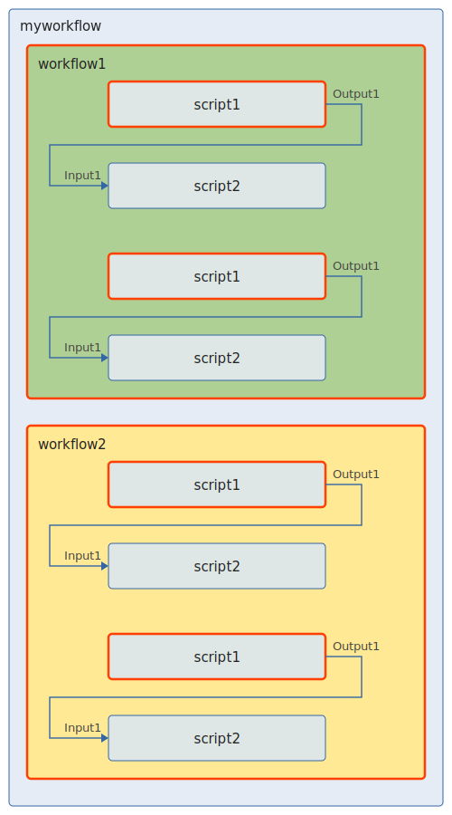
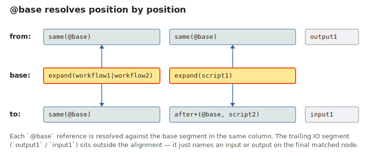
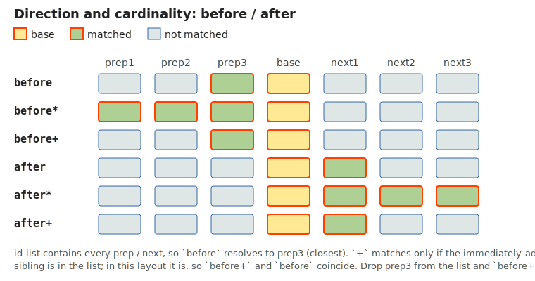
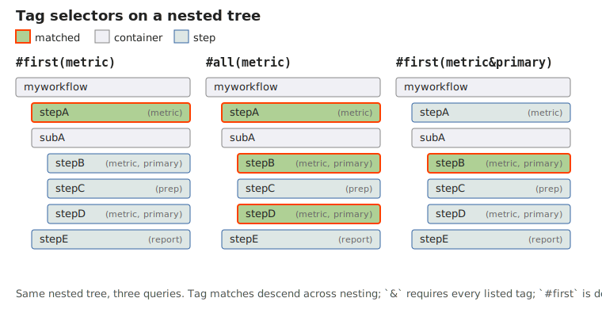
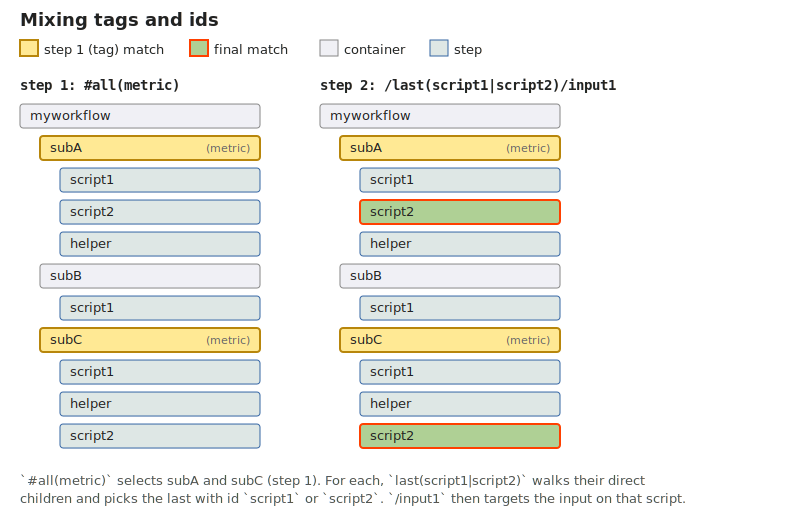

A [link](./link-types) is a one-directional connection that propagates data
from one workflow node to another. The Link Query Language (LQL) is used in
the `base`, `from`, `to`, and `not` fields of a link or action to point at the
workflow nodes and their inputs and outputs. This page is a guided
introduction; for the full selector catalog, grammar, and gotchas see the
[LQL reference](./link-query-language-reference).

### Query structure

Every LQL query has the form:

```
NAME(FLAGS)?:PATH
```

`NAME` is the query name used by the link engine and controllers to retrieve
results. `FLAGS` is an optional comma-separated list inside parentheses; the
three recognized flags are `optional`, `call`, and `template` (see
[reference](./link-query-language-reference#flags)). `PATH` is a `/`-separated
list of segments resolved relative to the workflow where the link is defined.
Absolute paths (with a leading `/`) are forbidden.

A minimal example targeting a script input:

```
value(optional):myworkflow/subworkflow/script/input1
```

A bare identifier in a segment is shorthand for the `first` selector, so the
query above is equivalent to:

```
value(optional):first(myworkflow)/first(subworkflow)/first(script)/input1
```

To target the workflow that hosts the link itself — used by
[`pipelineValidator`](./link-types#pipeline-validators) — use a name with no
path. The forms `NAME`, `NAME:`, `NAME:.`, and `NAME:./` are all equivalent.
`NAME:./path` is also accepted; mid-path `.` is not.

### Base path and `expand`

Many useful links fan out across repeated parts of a workflow — every step of
a given type, every workflow inside a parent, every matching tag. LQL expresses
this with a **base path** and **reference selectors**.

The `base` field of a link is itself an LQL query, conventionally named `base`.
Inside `base`, the special `expand` selector matches like `all` but with one
crucial difference: every match produces a separate **link instance**. Each
instance is then resolved on its own — `from` and `to` paths use reference
selectors (`same`, `before`, `after`) that take the base query name (prefixed
with `@`, e.g. `@base`) and anchor relative to that instance's match.

Here is a link definition that uses `expand` plus reference selectors:

```
{
  id: "mylink1",
  base: "base:expand(workflow1|workflow2)/expand(script1)",
  from: "in:same(@base)/same(@base)/output1",
  to:   "out:same(@base)/after+(@base,script2)/input1"
}
```



Assuming `mylink1` is defined inside `myworkflow`:

- `expand(workflow1|workflow2)` matches both workflows; `expand(script1)`
  matches the two `script1` nodes inside each. Four base matches in total
  (red borders in the diagram).
- For every base match, `from` resolves `same(@base)` (twice) back to the
  same nodes the base picked at each segment, then takes `output1` on that
  script.
- `to` resolves the same workflow, then `after+(@base, script2)` — the
  immediately adjacent `script2` after the base's `script1` — then `input1`.

Four base matches → four `mylink1` instances. If the trailing `script2` in
either workflow were removed, that last `script1` would have no `after+` match
and the count would drop to three.

Every `@base` reference in `from`/`to` is positionally aligned with the
corresponding segment of `base`:



`before`, `after`, and their `*` / `+` variants still take their own id-list
— that's where directional filtering happens. `same(@base)` accepts an
optional id-list as a narrowing filter (see
[reference](./link-query-language-reference#patterns)).

The full list of reference selectors and their modifiers (`*` for "match all
in the direction", `+` for "immediately adjacent only") lives in the
[reference](./link-query-language-reference#selectors).

### Direction and cardinality

`before` and `after` differ along two axes: which direction they scan, and
how many matches they keep. The bare form keeps the first match in the
direction; `*` keeps every match; `+` only matches if the **immediately
adjacent** sibling is in the id-list.



Stop ids — an optional third argument like
`before(@base, target, boundary)` — confine the scan to the region before
a known boundary step. See the
[reference](./link-query-language-reference#modifiers-and-stop-ids).

### Tags

Any selector can match by [tag](./configuration#tags) instead of id by
prefixing it with `#`. Tag arguments combine with **AND** (`&`), unlike id
arguments which combine with **OR** (`|`), because the same node can carry
multiple tags. Tag matching also crosses nesting boundaries — a `#all(metric)`
query finds every descendant tagged `metric`, no matter how deep — but never
travels upward past the link's host pipeline.



Pure tag query:

```
#first(tag1&tag2)
```

Matches the first descendant (depth-first) that carries both `tag1` and
`tag2`.

Tags and ids mix freely; each segment resolves against the result set of the
previous one:

```
#all(metric)/last(script1|script2)/input1
```

Matches every descendant tagged `metric`, then picks the *last* direct child
of each whose id is `script1` or `script2`, then targets its `input1`.



Note: tag selectors do not support the `+` modifier (only `*`). See the
[reference](./link-query-language-reference#modifiers-and-stop-ids).

### Template queries

When a link needs to fan out across several inputs and outputs of the same
script, the `template` flag avoids repeating the same path. Instead of:

```
{
  from: [
    "in_output1:myworkflow/subworkflow/script1/output1",
    "in_output2:myworkflow/subworkflow/script1/output2",
    "in_output3:myworkflow/subworkflow/script1/output3"
  ],
  to: [
    "out_input1:myworkflow/subworkflow/script2/input1",
    "out_input2:myworkflow/subworkflow/script2/input2",
    "out_input3:myworkflow/subworkflow/script2/input3"
  ]
}
```

write:

```
{
  from: "in_(template):myworkflow/subworkflow/script1/output1|output2|output3",
  to:   "out_(template):myworkflow/subworkflow/script2/input1|input2|input3"
}
```

Template expansion is permitted only in the **last** segment — the script IO
name — never in the path leading to the script. The expanded query name is
the template name concatenated with the IO name (`in_output1`, `in_output2`,
…); use `_(template)` if you want no prefix.

---

Next: see the [LQL reference](./link-query-language-reference) for the full
selector table, formal grammar, common patterns, and gotchas.
