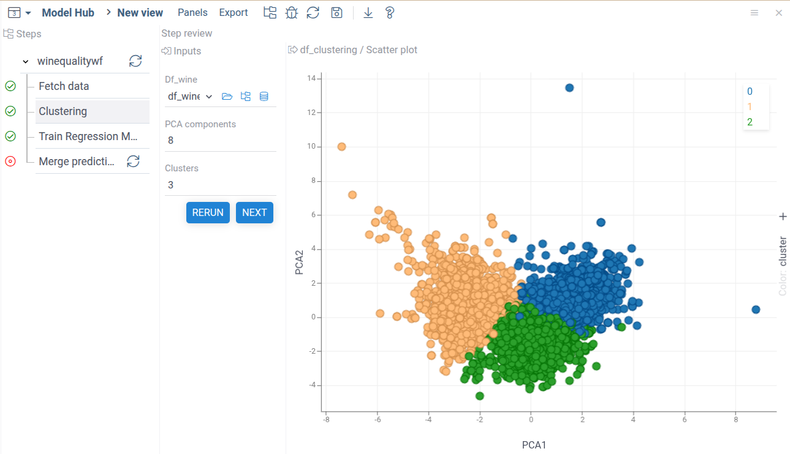

This section provides a description of different link types. Links
should be defined in the workflows' `links` field, and actions should be defined in
workflows/scripts' `actions` field. The main difference between them is
that action handlers need to be triggered separately
(for example, when a user clicks a button), while link handlers are triggered automatically
whenever any of their inputs change.

Links and actions are created at runtime based on matching rules defined in
[Link Query Language](./links-spec.mdx) (LQL).
A link will not be created until the workflow state
satisfies these matching rules.
If changes in the current workflow break the link matching rules, the link will be destroyed.

### Common options

These options are available for all links and actions types.

#### `id`

Should be unique on the same level.

#### `type`

There are several types of links/actions:

- `data`
- `validator`
- `meta`
- `nodemeta`
- `funccall`
- `pipeline`

#### `from`

Describes link inputs via a [Link Query Language](./links-spec.mdx).
Can be either a LQL string or an array of zero or more LQL strings.
All LQL queries should have at least one match, otherwise the link will not be created.

#### `to`

Describes link outputs via a [Link Query Language](./links-spec.mdx).
Can be either a LQL string or an array of zero or more LQL strings.
All LQL queries should have at least one match, otherwise the link will not be created.

#### `handler`

A function that receives an object with a `controller` instance, which
type is base on link `type` field. Handler function might be async via
returning either a `Promise<void>` or an `Observable<void>`. No any
side effects that are made via controller methods are visible until
the handler finished. Controller must be the only way to read or write
state for any handler. Also handlers must not internally mutate
received states. If the same handler is triggered before a previous
invocation is finished, the previous one will be gracefully canceled
and no changes are applied. Handler is mandatory for all links and
actions, except for [data links](#data-links),
where a [default handler](#default-handler) might be used if non is provided.

#### `not`

_Optional_

Can be either a LQL string or an array of zero or more LQL strings.

If all LQL queries match, the link will not be created.
Queries are targeting script nodes or workflows.

#### `base`

_Optional_

Could be either a [LQL](links-spec.mdx) string or an array of exactly 1 LQL string.
Queries are targeting script nodes or
workflows. Used in [reference selectors](./links-spec).

#### `dataFrameMutations`

_Optional_

By default internal script io mutations will not trigger links,
however for DataFrames it is possible to configure such behavior. If
`true` is set all link DataFrame inputs mutations will trigger the
link handler. Also, it is possible to narrow down by matching input LQL
names using an array of names.

#### `nodePriority`

_Optional_

Used to specify link running order if multiple links has the same link
output script node targets, links with a higher priority will run
before those with a lower one.
This is primarily used to order data
links between script own inputs, since they don't have a well-defined order in the workflow.

#### `runOnInit`

_Optional_

Is available only for data link, will force run a link after OnInit
hook.


### Common controller methods

These options are available for all controller types.

#### `getAll`

```
getAll<T = any>(name: string): T[] | undefined;
```

Receives an input query name. Returns an array of one or more matched
items or undefined.

#### `getFirst`

```
getFirst<T = any>(name: string): T | undefined;
```

Receives an input query name. Returns the first matched item or
undefined.

#### `getMatchedInputs`

```
getMatchedInputs(): Readonly<Set<string>>;
```

Returns a set of all matched input queries names. The set is ordered
based on depth first traversal, if a query returns multiple matches,
the first one is used for ordering.

#### `getMatchedOutputs`

```
getMatchedOutputs(): Readonly<Set<string>>;
```

Returns a set of all matched outputs queries names. The set is ordered
based on depth first traversal, if a query returns multiple matches,
the first one is used for ordering.

#### `getAdditionalParam`

```
getAdditionalParam(name: string): any | undefined;
```

Only used in actions, for passing additional parameters from
[validatators](#validators).


### Action options

These options are available for all action types.

#### `position`

Where to show action. Possible values are
- `buttons` action is show in workflow/script ui as a button
- `menu` action is show as menu item in the workflow/script view
- `globalmenu` action is show as menu item in all nested workflow/script views
- `none` action is not show on ui at all

#### `friendlyName`

_Optional_

User-friendly action name to show on UI.

#### `description`

_Optional_

Action description to show as a hover on UI.

#### `menuCategory`

_Optional_

Creates a separate menu with `menuCategory` name, if multiple actions
has the same menuCategory, they will be grouped together. Applicable
only for actions with position `menu`.

#### `confirmationMessage`

_Optional_

A confirmation dialog with this text will be shown before running the
action.


#### `icon`

_Optional_

Font awesome icon to be shown as a part of the UI action button.


### Data links

Workflow `links` items with a type field `data`. Are used to pass data
between scripts io. A script input should be a target of at most 1
data link output at the same time. Also script outputs should not be
data links outputs. The controller has the following additional
methods:

#### `setAll`

```
setAll<T = any>(name: string, state: T, restriction?: RestrictionType): void;
```

Receives an output query name, state, and an optional restriction. Sets
all matched outputs to the specified state with the restriction. For
more details about restriction see [Consistency](#consistency).


### Default handler

For [data links](#data-links) it is possible to omit `hander` and use
a default one. For each [LQL](links-spec.mdx) input query the first matched input is
passed to the corresponding by order LQL output. It is also possible
to configure restrictions, via

#### `defaultRestrictions`

If a string is used, all outputs will use the same restriction. If a
key-value object is used, outputs could have individual restrictions,
the default restriction could be set as `*` key.


### Consistency

For [data links](#data-links) a consistency mechanism is used. There
are several restriction types restricting a user's ability to edit
script inputs that were set by the data link.

- `disabled` user is not allowed to edit input, consistency is tracked
- `restricted` user is allowed to edit an input, however changes will
  make input inconsistent
- `info` user is allowed to edit an input without make input
  inconsistent, however user changes are still tracked
- `none` no consistency is tracked at all, always set values directly
  to script io

Consistency is tracked based on the value, stored separately from a
script io.

Consistency is also applicable to changes propagated via data
links. If a script was never run in the current workflow instance,
data links just set data directly to scripts io. However, if a script
was run, links will not overwrite script io data, but rather only
trigger consistency changes. User has either to manually review, apply
changes and rerun scripts, or do it via **rerun with consistent** on a
scope of workflow, nested workflow, or a script.




### Validators

Validators are used to validate inputs and have `validator`
type. Multiple validators can target the same script io, validation
results will be merged. There are several validation severity levels,
also it is possible to show user executable actions alongside text
messages.

Validators have the following additional configuration options:

#### `actions`

_Optional_

Could be either a [LQL](links-spec.mdx) string or an array of multiple
LQL strings.  Queries are targeting script nodes or workflows. Actions
descriptors could be retrieved using
[`getValidationAction`](#getvalidationaction) controller method and
later shown alongside validation results via
[`setValidation`](#setvalidation) controller method. It must recieve
`ValidationResult` as a data argument.


Validation controller has the following additional methods:

#### `setValidation`

```
setValidation(name: string, validation?: ValidationResult | undefined): void;
```

Sets validation data to an output query with the specified name. There
are several validations result types in `ValidationResult`:

- `errors` blocking running a script
- `warnings` non-blocking warnings
- `notifications` non-blocking suggestions

Each of those fields could have an array of `ValidationItem` items with
the following type:

```
export interface ActionItem {
  actionName: string;
  action: string;
  additionalParams?: Record<string, any>;
}

export interface Advice {
  description: string;
  actions?: ActionItem[];
}

export type ValidationItem = string | Advice;
```

Where `description` is a validation message, `actionName` is a visible
action name, `action` is a result of
[`getValidationAction`](#getvalidationaction). `additionalParams`
could be access inside action controller via
[`getAdditionalParam`](#getadditionalparam).

#### `getValidationAction`

```
getValidationAction(id: string, actionId: string) : string | undefined;
```

Gets an action descriptor to be used in `ValidationResult`.

For validation of the current workflow structure itself use another
method described [here](configuration.mdx#structurecheck).


### Metadata links

Metadata links are used for [viewers hooks](configuration.mdx) and have a type `meta`.
Meta controller has an additional method:

#### `setViewMeta`

```
setViewMeta(name: string, meta: Record<string,any>): void;
```

Sets metadata to an output query with the specified name. Multiple
links can have the same output target, provided they are using
different keys.

It is possible to hide script inputs setting the following meta:
```
{ hidden: true }
```

Also, an input annotation should
include `optional: true`

For choice inputs it is possible to update an
items list:

```
{ items: ['one', 'two', 'three'] }
```

There are also integrations available with
[sensitivity-analysis](../compute.md#sensitivity-analysis) and
[optimization](../compute.md#input-parameter-optimization)
tools. Enabling these tool integrations could be done only for
javascript functions using the following annotation:

```
//meta.features: {"sens-analysis": true, "fitting": true}
```

For sensitivity analysis scalar numerical inputs can have `rangeSA`
meta item with the following properties:

```
default?: number;
min?: number;
max?: number;
step?: number;
```

This will set sensitivity analysis tool default input settings
accordingly.

For optimization tool inputs settings could be set using
`rangeFitting` meta item which has the same properties as the
`rangeSA`. For outputs the `targetFitting` meta item is used, it has
the following properties:

```
default?: any;
argumentCol?: string;
```


### Node meta links

Description links are used to gather workflow metadata and display it
on ui. They have type `nodemeta`. They have script io as inputs, but
instead of targeting scripts in outputs, selectors will have the
following workflow/script nodes targets:

- `title` will change item name in the navigation tree, also used to
  set title when user saves a workflow
- `description` will be used to fill description when user saves a
  workflow
- `tags` will be used to fill tags when user saves a workflow. Note
  that tags here are completely unrelated to `PipelineConfiguration`
  ones. They tag a particular saved instance of a workflow.

Node meta controller has an additional method:

```
setDescriptionItem(name: string, description: any): void;
```

Sets description to an output query with the specified name.


### Data actions

Triggered by a user and place inside `actions`, otherwise the same as
[data links](#data-links).


### FuncCall actions

Used to change underlying script node FuncCall, has a type
`funccall`. FuncCall must be of the same function. Targets script io
as inputs and script nodes as outputs. Controller has additional
methods:

#### `setFuncCall`

```
setFuncCall(name: string, state: DG.FuncCall): void;
```

Sets FuncCall to an output query with the specified name.


### Pipeline actions

Used to replace dynamic workflow content, has a type `pipeline`.
Targets script io as inputs and dynamic workflows as outputs.
Controller has additional methods:

#### `setPipelineState`

```
setPipelineState(name: any, state: PipelineInstanceConfig): void;
```

Sets state to an output query with the specified
name. `PipelineInstanceConfig` is a recursive type that should be
compatible with the current workflow configuration. Each item should
have a matching `id`, nested items are referenced in `steps`
regardless of a workflow type. For script nodes it is possible to
provide `initialValues` and `inputRestrictions`.


### Init hook

It is using `onInit` field instead of links and is triggered only once
when a workflow created. Usually is used to populate static
[states](configuration.mdx#states). Otherwise, the same as [data links](#data-links).


### Return hook

It is using `onReturn` field instead of links and is triggered only
once when a workflow is started [programmatically](code-usage.mdx) and
exited via `Accept` button.
Otherwise, the same as [data links](#data-links).
