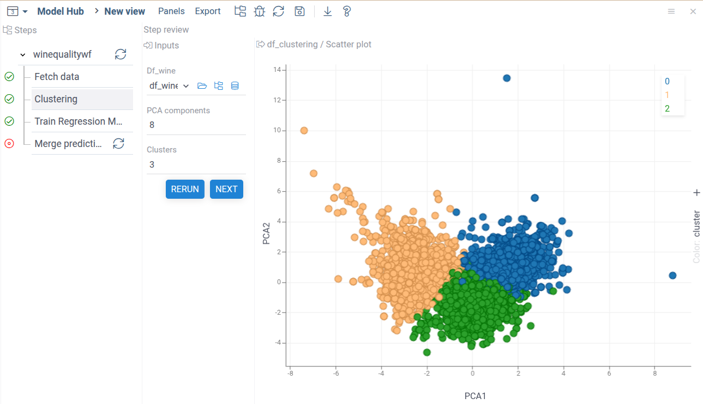

This section provides a description of different link types. Links
should be defined in the workflows' `links` field, and actions should be defined in
workflows/scripts' `actions` field. The main difference between them is
that action handlers need to be triggered separately
(for example, when a user clicks a button), while link handlers are triggered automatically
whenever any of their inputs change.

Links and actions are created at runtime based on matching rules defined in
[Link Query Language](./link-query-language) (LQL).
A link will not be created until the workflow state
satisfies these matching rules.
If changes in the current workflow break the link matching rules, the link will be destroyed.

### Common options

These options are available for all links and actions types.

#### `id`

Should be unique on the same level.

#### `type`

There are several types of links/actions:

- `data`
- `validator`
- `pipelineValidator`
- `meta`
- `nodemeta`
- `funccall`
- `pipeline`

#### `from`

Describes link inputs via a [Link Query Language](./link-query-language).
Can be either a LQL string or an array of zero or more LQL strings.
All LQL queries should have at least one match, otherwise the link will not be created.

#### `to`

Describes link outputs via a [Link Query Language](./link-query-language).
Can be either a LQL string or an array of zero or more LQL strings.
All LQL queries should have at least one match, otherwise the link will not be created.

#### `handler`

A function that receives an object with a `controller` instance, whose
type is based on the link `type` field. The handler function can be async,
returning either a `Promise<void>` or an `Observable<void>`. No
side effects made via controller methods are visible until
the handler finishes. Controller must be the only way to read or write
state for any handler. Also handlers must not internally mutate
received states. If the same handler is triggered before a previous
invocation is finished, the previous one will be gracefully canceled
and no changes are applied. Handler is mandatory for all links and
actions, except for [data links](#data-links),
where a [default handler](#default-handler) can be used if none is provided.

#### `not`

_Optional_

Can be either a LQL string or an array of zero or more LQL strings.

If all LQL queries match, the link will not be created.
Queries are targeting script nodes or workflows.

#### `base`

_Optional_

Could be either a [LQL](./link-query-language) string or an array of exactly 1 LQL string.
Queries are targeting script nodes or
workflows. Used in [reference selectors](./link-query-language-reference#selectors).

#### `dataFrameMutations`

_Optional_

By default internal script io mutations will not trigger links,
however for DataFrames it is possible to configure such behavior. If
`true` is set all link DataFrame inputs mutations will trigger the
link handler. Also, it is possible to narrow down by matching input LQL
names using an array of names.

#### `nodePriority`

_Optional_

Used to specify link running order if multiple links have the same link
output script node targets. Links with a higher priority run
before those with a lower one.
This is primarily used to order data
links between script own inputs, since they don't have a well-defined order in the workflow.

#### `runOnInit`

_Optional_

Is available only for data link, will force run a link after OnInit
hook.


### Common controller methods

These options are available for all controller types.

#### `getAll`

```
getAll<T = any>(name: string): T[] | undefined;
```

Receives an input query name. Returns an array of one or more matched
items or undefined.

#### `getFirst`

```
getFirst<T = any>(name: string): T | undefined;
```

Receives an input query name. Returns the first matched item or
undefined.

#### `getMatchedInputs`

```
getMatchedInputs(): Readonly<Set<string>>;
```

Returns the set of `from` query names that produced at least one match for the
current link instance. Iteration order follows a depth-first traversal of the
workflow tree at the moment the link fires; when a query matches multiple nodes,
the position of its first match determines its place in the order. Use this to
detect which optional inputs are present before reading them with
[`getFirst`](#getfirst) / [`getAll`](#getall).

#### `getMatchedOutputs`

```
getMatchedOutputs(): Readonly<Set<string>>;
```

Same as [`getMatchedInputs`](#getmatchedinputs), but for the `to` query names.
Use this to find out which optional outputs exist before writing to them.

#### `getAdditionalParam`

```
getAdditionalParam(name: string): any | undefined;
```

Only used in actions, for passing additional parameters from
[validators](#validators).


### Action options

These options are available for all action types.

#### `position`

Where to show action. Possible values are
- `buttons` action is show in workflow/script ui as a button
- `menu` action is show as menu item in the workflow/script view
- `globalmenu` action is show as menu item in all nested workflow/script views
- `none` action is not show on ui at all

#### `friendlyName`

_Optional_

User-friendly action name to show on UI.

#### `description`

_Optional_

Action description to show as a hover on UI.

#### `menuCategory`

_Optional_

Creates a separate menu with `menuCategory` name, if multiple actions
has the same menuCategory, they will be grouped together. Applicable
only for actions with position `menu`.

#### `confirmationMessage`

_Optional_

A confirmation dialog with this text will be shown before running the
action.


#### `icon`

_Optional_

Font awesome icon to be shown as a part of the UI action button.

#### `visibleOn`

_Optional_

Shows the action on a specific child step instead of the node where it is
defined. The value is the `id` of the target step. The action's `from`/`to`
still resolve at the definition scope, so the action can read from and write
to any node the parent workflow can reach. This is useful when an action
logically belongs to a child step's UI but needs access to sibling steps'
data. Works with all action types (data, funccall, pipeline).

Because `from`/`to` resolve independently, a pipeline mutation action can
read from a step _inside_ its own target pipeline. For example, an action
with `to: 'out1:targetPipeline'` can also use
`from: 'in1:targetPipeline/step1/result'` to read a child step's output and
decide which step type to add. This works because the forward-only constraint
only applies to reference selectors (`@ref`), not to independent path specs.

### Data links

Workflow `links` items with a type field `data`. Used to pass data
between script IO. A script input should be a target of at most 1
data link output at the same time. Also script outputs should not be
data links outputs. The controller has the following additional
methods:

#### `setAll`

```
setAll<T = any>(name: string, state: T, restriction?: RestrictionType): void;
```

Receives an output query name, state, and an optional restriction. Sets
all matched outputs to the specified state with the restriction. For
more details about restriction see [Consistency](#consistency).


### Default handler

For [data links](#data-links) it is possible to omit `hander` and use
a default one. For each [LQL](./link-query-language) input query the first matched input is
passed to the corresponding by order LQL output. It is also possible
to configure restrictions, via

#### `defaultRestrictions`

If a string is used, all outputs will use the same restriction. If a
key-value object is used, outputs could have individual restrictions,
the default restriction could be set as `*` key.


### Consistency

For [data links](#data-links) a consistency mechanism is used. There
are several restriction types restricting a user's ability to edit
script inputs that were set by the data link.

- `disabled` user is not allowed to edit input, consistency is tracked
- `restricted` user is allowed to edit an input, however changes will
  make input inconsistent
- `info` user is allowed to edit an input without make input
  inconsistent, however user changes are still tracked
- `none` no consistency is tracked at all, always set values directly
  to script io

Consistency is tracked based on the value, stored separately from a
script io.

Consistency is also applicable to changes propagated via data
links. If a script was never run in the current workflow instance,
data links just set data directly to scripts io. However, if a script
was run, links will not overwrite script io data, but rather only
trigger consistency changes. User has either to manually review, apply
changes and rerun scripts, or do it via **rerun with consistent** on a
scope of workflow, nested workflow, or a script.




### Validators

Validators are used to validate inputs and have `validator`
type. Multiple validators can target the same script io, validation
results will be merged. There are several validation severity levels,
also it is possible to show user executable actions alongside text
messages.

By default, validators run without debounce and are executed in batches
for better performance. To add a debounce delay (for example, for
expensive validation logic that should not fire on every keystroke),
set the `debounce` option.

Validators have the following additional configuration options:

#### `actions`

_Optional_

Could be either a [LQL](./link-query-language) string or an array of multiple
LQL strings.  Queries are targeting script nodes or workflows. Actions
descriptors could be retrieved using
[`getValidationAction`](#getvalidationaction) controller method and
later shown alongside validation results via
[`setValidation`](#setvalidation) controller method. It must receive
`ValidationResult` as a data argument.


#### `debounce`

_Optional_

Debounce time in milliseconds. When set to a positive value, the
validator handler waits for the specified duration after the last input
change before firing. This is useful for expensive validators (such as
server-side checks) where firing on every keystroke is wasteful.

When omitted or set to `0`, the validator runs immediately and is
eligible for batched execution with other validators, which reduces
per-validator scheduling overhead.

Validation controller has the following additional methods:

#### `setValidation`

```
setValidation(name: string, validation?: ValidationResult | undefined): void;
```

Sets validation data to an output query with the specified name. There
are several validations result types in `ValidationResult`:

- `errors` blocking running a script
- `warnings` non-blocking warnings
- `notifications` non-blocking suggestions

Each of those fields could have an array of `ValidationItem` items with
the following type:

```
export interface ActionItem {
  actionName: string;
  action: string;
  additionalParams?: Record<string, any>;
}

export interface Advice {
  description: string;
  actions?: ActionItem[];
}

export type ValidationItem = string | Advice;
```

A `ValidationItem` is either a plain `string` (a message with no follow-up)
or an `Advice` (a message that comes with one or more user-runnable actions).
Use the string form for simple errors/warnings; use `Advice` when the user can
click a button to fix the problem or jump to the offending step. `description`
is the text shown to the user, `actionName` is the label on the action button,
`action` is the opaque action descriptor returned by
[`getValidationAction`](#getvalidationaction), and `additionalParams` is a
free-form bag of values forwarded to the action handler, where it is read with
[`getAdditionalParam`](#getadditionalparam).

#### `getValidationAction`

```
getValidationAction(id: string, actionId: string) : string | undefined;
```

Looks up an action that the validator wants to expose alongside its messages.
`id` is the LQL query name used in the validator's [`actions`](#actions)
field; `actionId` is the `id` of the matched action's configuration on the
target node. Returns an opaque string descriptor that should be placed into
the `action` field of an [`Advice`](#setvalidation) item; returns `undefined`
if no such action is wired up. The descriptor is consumed internally by the
platform — your code only forwards it.

For validation of the workflow structure itself (rather than a single
script io) use [pipeline validators](#pipeline-validators) — a reactive,
multi-validator-per-node mechanism that can be triggered from any
inputs or outputs.


### Pipeline validators

Pipeline validators attach a validation result to one or more workflow
nodes rather than to a script io. They have type `pipelineValidator`.
Unlike regular validators, they target pipeline nodes — the
link-defining workflow, a named descendant, or several at once via an
array `to`. The handler writes a single `ValidationResult`, which is
broadcast to every matched target. Multiple pipeline validators on the
same node combine their results, and the merged outcome is exposed on
the workflow state as `structureCheckResults`.

Pipeline validators are reactive in two ways:

- They subscribe to their `from` ports and re-fire (debounced) on input
  changes, the same way regular validators do.
- They also re-fire after any tree structure update (step added, removed
  or moved), so they can react to topology changes their `from` ports
  might not capture.

Routing is expressed via the standard `to` query — see the
[LQL reference](./link-query-language-reference#grammar) for the full grammar. A
zero-segment path targets the link-defining pipeline node (self); a
segmented path targets a descendant.

The pipeline validator controller has the following methods:

#### `setValidation` (pipeline validator)

```
setValidation(validation?: ValidationResult): void;
```

Sets (or clears) this validator's contribution to the merged
`structureCheckResults` of the target pipeline node. Pass `undefined` to
remove the contribution.

#### `getOutline`

```
getOutline(): PipelineOutline;
```

Returns the current `PipelineOutline` of the pipeline where this link
is defined (the link's prefix node), including all nested pipelines.
This is independent of the `to` target — `to` says where the result
is written; `getOutline()` describes the link's own scope. Use this
when the validator needs to inspect the workflow topology, e.g. the
number of nested steps or their configIds.

`PipelineOutline` is a structure-only snapshot of the workflow subtree: each
node carries its `id`, `configId`, and `type`, and pipeline nodes carry a
recursive `steps` array. Runtime data (FuncCalls, validation state, mutable
runtime metadata) is intentionally omitted so the outline is cheap to walk
and stable across re-fires. The full type lives in
`@datagrok-libraries/compute-api`; LSP will show the recursive shape.

#### `debounce` (pipeline validator)

Same semantics as for regular `validator` links. Default is 250ms.


### Metadata links

Metadata links have type `meta`. They write small chunks of metadata against
script IO targets; the platform interprets the metadata to customize the UI
that surrounds the input/output (which is rendered by
[viewer hooks](./configuration#viewershook-script-node)). Meta controller has an
additional method:

#### `setViewMeta`

```
setViewMeta(name: string, meta: Record<string,any>): void;
```

Sets metadata to an output query with the specified name. Multiple
links can have the same output target, provided they are using
different keys.

#### UI metadata

The platform understands the following well-known keys when set on a script
input or output:

| Key | Effect |
|------|--------|
| `hidden: true` | Hide the input from the script UI. The input annotation must include `optional: true`, otherwise the platform requires a value. |
| `items: string[]` | For choice inputs, replace the dropdown options. Example: `{ items: ['one', 'two', 'three'] }`. |

Any other key/value pair is forwarded to the viewer hook unchanged, so
custom viewer integrations can define their own meta keys.

#### Feature integrations (sensitivity analysis, optimization)

The same `meta` link type wires script IOs into the
[sensitivity-analysis](../compute.md#sensitivity-analysis) and
[optimization](../compute.md#input-parameter-optimization) tools. Enabling
these tool integrations can be done only for JavaScript functions using the
following annotation:

```
//meta.features: {"sens-analysis": true, "fitting": true}
```

For sensitivity analysis scalar numerical inputs can have `rangeSA`
meta item with the following properties:

```
default?: number;
min?: number;
max?: number;
step?: number;
```

This will set sensitivity analysis tool default input settings
accordingly.

For optimization tool inputs settings could be set using
`rangeFitting` meta item which has the same properties as the
`rangeSA`. For outputs the `targetFitting` meta item is used, it has
the following properties:

```
default?: any;
argumentCol?: string;
```


### Node meta links

Description links are used to gather workflow metadata and display it
on ui. They have type `nodemeta`. They have script io as inputs, but
instead of targeting scripts in outputs, selectors will have the
following workflow/script nodes targets:

- `title` will change item name in the navigation tree, also used to
  set title when user saves a workflow
- `description` will be used to fill description when user saves a
  workflow
- `tags` will be used to fill tags when user saves a workflow. Note
  that tags here are completely unrelated to `PipelineConfiguration`
  ones. They tag a particular saved instance of a workflow.
- `body` is rendered as markdown in the Compute2 step row, below the
  title (via the `<dg-markdown>` webcomponent). Use this for inline
  notes, step instructions, or reactive status text. Works on every
  step kind including action steps.

Node meta controller has an additional method:

```
setDescriptionItem(name: string, description: any): void;
```

Sets description to an output query with the specified name.


### Data actions

Triggered by a user and placed inside `actions`, otherwise the same as
[data links](#data-links).


### FuncCall actions

Used to change the underlying script node FuncCall. Has a type
`funccall`. FuncCall must be of the same function. Targets script IO
as inputs and script nodes as outputs. Controller has additional
methods:

#### `setFuncCall`

```
setFuncCall(name: string, state: DG.FuncCall): void;
```

Sets FuncCall to an output query with the specified name.


### Pipeline actions

Used to replace dynamic workflow content. Has a type `pipeline`.
Targets script io as inputs and dynamic workflows as outputs.
To target a child dynamic workflow, use a path in `to` (e.g.,
`to: 'out1:analyses'`). To target the workflow where the action is
defined (self-reference), use just the query name with no path
(e.g., `to: 'out1'`).

Controller has additional methods:

#### `setPipelineState`

```
setPipelineState(name: any, state: PipelineInstanceConfig): void;
```

Sets state to an output query with the specified
name. `PipelineInstanceConfig` is a recursive type that should be
compatible with the current workflow configuration. Each item should
have a matching `id`, nested items are referenced in `steps`
regardless of a workflow type. For script nodes it is possible to
provide `initialValues` and `inputRestrictions`.

#### `getSteps`

```
getSteps(name: string): StepHandle[];
```

Returns current steps of the target dynamic workflow as an array of
`StepHandle` objects. Each handle has `configId`, `position`, and an
internal `_uuid`.

#### `addStep`

```
addStep(name: string, configId: string, position?: number): void;
```

Adds a step to the target dynamic workflow by `configId` (must match
one of the `stepTypes` ids). Optional `position` inserts at the given
index; omit to append.

#### `removeStep`

```
removeStep(name: string, step: StepHandle): void;
```

Removes a step from the target dynamic workflow. Pass a handle
obtained from `getSteps`.

#### `moveStep`

```
moveStep(name: string, step: StepHandle, position: number): void;
```

Moves a step to a new position within the target dynamic workflow.


### Init hook

Uses the `onInit` field instead of links and is triggered only once
when a workflow is created. Usually is used to populate static
[states](configuration.mdx#states). Otherwise, the same as [data links](#data-links).


### Return hook

Uses the `onReturn` field instead of links and is triggered only
once when a workflow is started [programmatically](code-usage.mdx) and
exited via the **Accept** button.
Otherwise, the same as [data links](#data-links).

The return hook handler receives an `IRuntimeReturnController` with the
following method in addition to the [common controller methods](#common-controller-methods):

* `controller.returnResult(data)` — sends `data` back to the caller that
  started the workflow programmatically. The value is emitted through the
  `result$` observable on the Driver.
