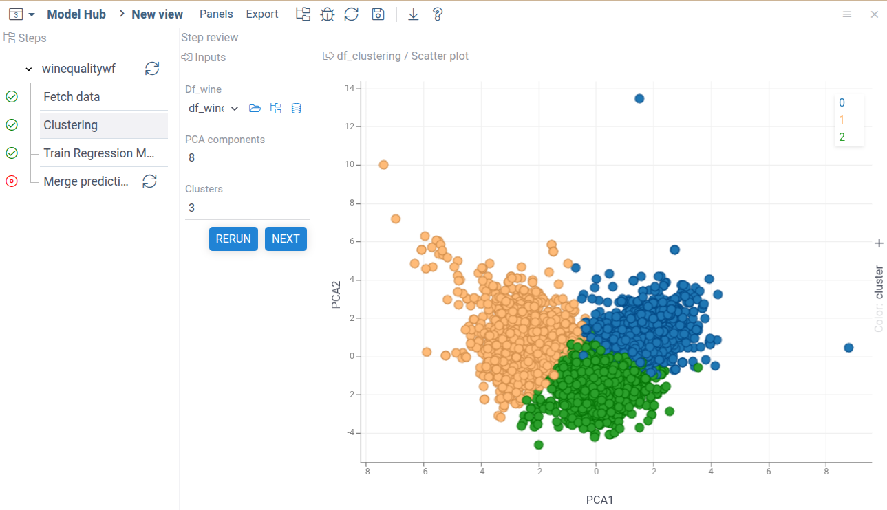

This section provides a description of different link types. Links
should be defined in the workflows' `links` field, and actions should be defined in
workflows/scripts' `actions` field. The main difference between them is
that action handlers need to be triggered separately
(for example, when a user clicks a button), while link handlers are triggered automatically
whenever any of their inputs change.

Links and actions are created at runtime based on matching rules defined in
[Link Query Language](./link-query-language) (LQL).
A link will not be created until the workflow state
satisfies these matching rules.
If changes in the current workflow break the link matching rules, the link will be destroyed.

## Common

### Common options

These options are available for all links and actions types.

#### `id`

Should be unique on the same level.

#### `type`

There are several types of links/actions:

- `data`
- `validator`
- `pipelineValidator`
- `meta`
- `nodemeta`
- `funccall`
- `pipeline`

#### `from`

Describes link inputs via a [Link Query Language](./link-query-language).
Can be either a LQL string or an array of zero or more LQL strings.
All LQL queries should have at least one match, otherwise the link will not be created.

#### `to`

Describes link outputs via a [Link Query Language](./link-query-language).
Can be either a LQL string or an array of zero or more LQL strings.
All LQL queries should have at least one match, otherwise the link will not be created.

#### `handler`

A function that receives an object with a `controller` instance, whose
type is based on the link `type` field. The handler function can be async,
returning either a `Promise<void>` or an `Observable<void>`. No
side effects made via controller methods are visible until
the handler finishes. Controller must be the only way to read or write
state for any handler. Also handlers must not internally mutate
received states. If the same handler is triggered before a previous
invocation is finished, the previous one will be gracefully canceled
and no changes are applied. Handler is mandatory for all links and
actions, except for [data links](#data-links),
where a [default handler](#default-handler) can be used if none is provided.

#### `not`

_Optional_

Can be either a LQL string or an array of zero or more LQL strings.

If any LQL query matches, the link will not be created.
Queries are targeting script nodes or workflows. The `(call)` flag is
accepted here as a clarity marker but has no effect — `not` queries are
already node-level.

#### `base`

_Optional_

Could be either a [LQL](./link-query-language) string or an array of exactly 1 LQL string.
Queries are targeting script nodes or
workflows. Used in [reference selectors](./link-query-language-reference#selectors).

#### `dataFrameMutations`

_Optional_

By default internal script io mutations will not trigger links,
however for DataFrames it is possible to configure such behavior. If
`true` is set all link DataFrame inputs mutations will trigger the
link handler. Also, it is possible to narrow down by matching input LQL
names using an array of names.

#### `nodePriority`

_Optional_

Used to specify link running order if multiple links have the same link
output script node targets. Links with a higher priority run
before those with a lower one.
This is primarily used to order data
links between script own inputs, since they don't have a well-defined order in the workflow.

#### `runOnInit`

_Optional_

For data links and rules: runs the link once at init, after the
[init hook](#init-hook), even when nothing it reads has changed. See
[Init hook](#init-hook) for when init happens and how its writes are
handled.

#### `params`

_Optional_

A static object attached to the link and readable from the handler with
[`getParam`](#getparam). Lets one handler serve several links with
different configuration.


### Common controller methods

These options are available for all controller types.

#### `getAll`

```
getAll<T = any>(name: string): T[] | undefined;
```

Receives an input query name. Returns an array of one or more matched
items or undefined.

#### `getFirst`

```
getFirst<T = any>(name: string): T | undefined;
```

Receives an input query name. Returns the first matched item or
undefined.

#### `getMatchedInputs`

```
getMatchedInputs(): Readonly<Set<string>>;
```

Returns the set of `from` query names that produced at least one match for the
current link instance. Iteration order follows a depth-first traversal of the
workflow tree at the moment the link fires; when a query matches multiple nodes,
the position of its first match determines its place in the order. Use this to
detect which optional inputs are present before reading them with
[`getFirst`](#getfirst) / [`getAll`](#getall).

#### `getMatchedOutputs`

```
getMatchedOutputs(): Readonly<Set<string>>;
```

Same as [`getMatchedInputs`](#getmatchedinputs), but for the `to` query names.
Use this to find out which optional outputs exist before writing to them.

#### `getMatchedPositions`

```
type MatchedNodeInfo = {
  path: Readonly<NodePath>;
  position: number;
  ioName?: string;
};

getMatchedPositions(name: string): MatchedNodeInfo[];
```

Receives a `from` or `to` query name. Returns the positions of the
nodes it matched, in the same order as [`getAll`](#getall) values.
`path` is the node path relative to the node the link is defined on.
`position` is the index of the matched node among its parent's
children, or `-1` when the query matched the link's own node (for
example, a [node meta](#node-meta-links) output targeting the
pipeline itself). Throws for query names without matches, so check
[`getMatchedInputs`](#getmatchedinputs) /
[`getMatchedOutputs`](#getmatchedoutputs) first for optional queries.

Use this in [node meta](#node-meta-links) handlers to produce
position-aware titles or descriptions, for example
`` `Step ${controller.getMatchedPositions('in')[0].position + 1}` ``.

#### `getBasePosition`

```
getBasePosition(): MatchedNodeInfo | undefined;
```

Returns the position of the matched `base` node for
base-instantiated links, or `undefined` when the link has no `base`
query. Each link instance created from a `base` match reports the
position of its own base node.

#### `getAdditionalParam`

```
getAdditionalParam(name: string): any | undefined;
```

Only used in actions, for passing additional parameters from
[validators](#validators).

#### `getParam`

```
getParam(name: string): any | undefined;
```

Returns a value from the link [`params`](#params) object.

#### `hasCall`

```
hasCall(name: string): boolean;
```

Returns `true` iff `name` was declared in `from` with the `(call)` flag
and matched at runtime. Outside [FuncCall actions](#funccall-actions),
`(call)` inputs must also be marked `(optional)` — the actual
`DG.FuncCall` is not exposed; `hasCall` is the only way handlers see the
result. Throws if `name` is not a declared `(call)` input.


## Data flow

### Data links

Workflow `links` items with a type field `data`. Used to pass data
between script IO. A script input should be a target of at most 1
data link output at the same time. Also script outputs should not be
data links outputs. The controller has the following additional
methods:

#### `setAll`

```
setAll<T = any>(name: string, state: T, restriction?: RestrictionType): void;
```

Receives an output query name, state, and an optional restriction. Sets
all matched outputs to the specified state with the restriction. For
more details about restriction see [Consistency](#consistency).

#### `getInputTemplates` / `getOutputTemplates`

```
getInputTemplates(): TemplateInfo[];
getOutputTemplates(): TemplateInfo[];

type TemplateInfo = {
  name: string | number;
  ios: {ioName: string, scriptIoId: string}[];
};
```

Enumerate the template slots produced by [`(template)` wildcard
selectors](./link-query-language-advanced#wildcard-selectors) on each side, in
spec order. Each entry pairs the link-io name with the underlying script
IO id. Returns `[]` when no wildcard selectors are used.

#### `propagateTemplatePair`

```
propagateTemplatePair(
  inputTemplate: string | number,
  outputTemplate: string | number,
  defaultRestrictions?: Record<string, RestrictionType> | RestrictionType,
): void;
```

Name-matches a single (input-template, output-template) pair and runs
`getFirst` → `setAll` for each matched script IO id. Unmatched ids on
either side are silently dropped. Throws if either name is not a known
template. Used by the [default handler](#default-handler) for the
template ↔ template case; available to custom handlers that want the
same primitive.

#### `clearRestriction`

```
clearRestriction(name: string): void;
```

Clears the consistency restriction on all matched outputs of `name`
without changing their current value. After the handler completes the
targeted inputs are no longer marked as "set by a link" and no longer
report inconsistency — until another link writes them again. Calling
`clearRestriction` on an output that has no active restriction is a
no-op. If the handler also calls `setAll(name, ...)` for the same
output, the later of the two calls wins.

See [Consistency](#consistency) for the underlying model.


### Default handler

For [data links](#data-links) it is possible to omit `handler` and use
a default one.

Each top-level entry in `from`/`to` is one *slot*. The default handler
pairs slots by index. For each pair:

- **bare ↔ bare**: the first matched input is passed to the
  corresponding output, in declaration order. This is the original
  behavior.
- **template ↔ template**: when both slots come from
  [`(template)` wildcard selectors](./link-query-language-advanced#wildcard-selectors),
  the handler matches their IOs by script IO name (not position) and
  silently drops anything unique to one side.
- **template ↔ bare**: throws — flip the order or split the link.

#### `defaultRestrictions`

If a string is used, all outputs will use the same restriction. If a
key-value object is used, outputs could have individual restrictions,
the default restriction could be set as `*` key.


### Consistency

For [data links](#data-links) a consistency mechanism is used. There
are several restriction types restricting a user's ability to edit
script inputs that were set by the data link.

- `disabled` user is not allowed to edit input, consistency is tracked
- `restricted` user is allowed to edit an input, however changes will
  make input inconsistent
- `info` user is allowed to edit an input without make input
  inconsistent, however user changes are still tracked
- `none` no consistency is tracked at all, always set values directly
  to script io

Consistency is tracked based on the value, stored separately from a
script io.

Consistency is also applicable to changes propagated via data
links. If a script was never run in the current workflow instance,
data links just set data directly to scripts io. However, if a script
was run, links will not overwrite script io data, but rather only
trigger consistency changes. User has either to manually review, apply
changes and rerun scripts, or do it via **rerun with consistent** on a
scope of workflow, nested workflow, or a script.




## Validators

### IO validators {#io-validators}

Validators are used to validate inputs and have `validator`
type. Multiple validators can target the same script io, validation
results will be merged. There are several validation severity levels,
also it is possible to show user executable actions alongside text
messages.

By default, validators run without debounce and are executed in batches
for better performance. To add a debounce delay (for example, for
expensive validation logic that should not fire on every keystroke),
set the `debounce` option.

Validators have the following additional configuration options:

#### `actions`

_Optional_

Could be either a [LQL](./link-query-language) string or an array of multiple
LQL strings.  Queries are targeting script nodes or workflows. Actions
descriptors could be retrieved using
[`getValidationAction`](#getvalidationaction) controller method and
later shown alongside validation results via
[`setValidation`](#setvalidation) controller method. It must receive
`ValidationResult` as a data argument.


#### `debounce`

_Optional_

Debounce time in milliseconds. When set to a positive value, the
validator handler waits for the specified duration after the last input
change before firing. This is useful for expensive validators (such as
server-side checks) where firing on every keystroke is wasteful.

When omitted or set to `0`, the validator runs immediately and is
eligible for batched execution with other validators, which reduces
per-validator scheduling overhead.

Validation controller has the following additional methods:

#### `setValidation`

```
setValidation(name: string, validation?: ValidationResult | undefined): void;
```

Sets validation data to an output query with the specified name. There
are several validations result types in `ValidationResult`:

- `errors` blocking running a script
- `warnings` non-blocking warnings
- `notifications` non-blocking suggestions

Each of those fields could have an array of `ValidationItem` items with
the following type:

```
export interface ActionItem {
  actionName: string;
  action: string;
  additionalParams?: Record<string, any>;
}

export interface Advice {
  description: string;
  actions?: ActionItem[];
}

export type ValidationItem = string | Advice;
```

A `ValidationItem` is either a plain `string` (a message with no follow-up)
or an `Advice` (a message that comes with one or more user-runnable actions).
Use the string form for simple errors/warnings; use `Advice` when the user can
click a button to fix the problem or jump to the offending step. `description`
is the text shown to the user, `actionName` is the label on the action button,
`action` is the opaque action descriptor returned by
[`getValidationAction`](#getvalidationaction), and `additionalParams` is a
free-form bag of values forwarded to the action handler, where it is read with
[`getAdditionalParam`](#getadditionalparam).

#### `getValidationAction`

```
getValidationAction(id: string, actionId: string) : string | undefined;
```

Looks up an action that the validator wants to expose alongside its messages.
`id` is the LQL query name used in the validator's [`actions`](#actions)
field; `actionId` is the `id` of the matched action's configuration on the
target node. Returns an opaque string descriptor that should be placed into
the `action` field of an [`Advice`](#setvalidation) item; returns `undefined`
if no such action is wired up. The descriptor is consumed internally by the
platform — your code only forwards it.

Not gated by [`showWhen`/`hideWhen`](#visibility): `getValidationAction`
returns a descriptor regardless of whether the UI would currently render the
action. Use [`isActionVisible`](#isactionvisible) if a validator needs to
mirror the UI's decision.

#### `isActionVisible`

```
isActionVisible(name: string, actionId: string): boolean;
```

Returns the same boolean that Compute2 uses to decide whether to render the
action — `true` when the action has no [`showWhen`/`hideWhen`](#visibility) or
when its current evaluation matches; `false` when the action is hidden or
when the `name`/`actionId` pair is not wired up. Pure query; does not affect
execution.

For validation of the workflow structure itself (rather than a single
script io) use [pipeline validators](#pipeline-validators) — a reactive,
multi-validator-per-node mechanism that can be triggered from any
inputs or outputs.


### Pipeline validators

Pipeline validators attach a validation result to one or more workflow
nodes rather than to a script io. They have type `pipelineValidator`.
Unlike regular validators, they target workflow nodes — the
link-defining workflow, a named descendant, or several at once via an
array `to`. Like every other link type, each `to` entry is named, and
the handler writes a result per name with `setValidation(name, result)`,
so it can validate a single matched node or several independently.
Multiple pipeline validators on the same node combine their results, and
the merged outcome is exposed on the workflow state as
`structureCheckResults`.

Pipeline validators are reactive in two ways:

- They subscribe to their `from` ports and re-fire (debounced) on input
  changes, the same way regular validators do.
- They also re-fire after any tree structure update (step added, removed
  or moved), so they can react to topology changes their `from` ports
  might not capture.

Routing is expressed via the standard `to` query — see the
[LQL reference](./link-query-language-reference#grammar) for the full grammar. A
zero-segment path targets the link-defining workflow node (self); a
segmented path targets a descendant.

The pipeline validator controller has the following methods:

#### `setValidation` (pipeline validator)

```
setValidation(name: string, validation?: ValidationResult): void;
```

Sets (or clears) this validator's contribution for the `to` output named
`name`, merged into the `structureCheckResults` of that target workflow
node. `name` is the output's name in the `to` query (for example, `to:
'check:first(inner)'` is named `check`). Omit the validation to remove the
contribution. To write the same result to every matched target, call
`setValidation` once per name.

#### `getOutline`

```
getOutline(): PipelineOutline;
```

Returns the current `PipelineOutline` of the workflow where this link
is defined (the link's prefix node), including all nested workflows.
This is independent of the `to` target — `to` says where the result
is written; `getOutline()` describes the link's own scope. Use this
when the validator needs to inspect the workflow topology, e.g. the
number of nested steps or their configIds.

`PipelineOutline` is a structure-only snapshot of the workflow subtree: each
node carries its `id`, `configId`, and `type`, and workflow nodes carry a
recursive `steps` array. Runtime data (FuncCalls, validation state, mutable
runtime metadata) is intentionally omitted so the outline is cheap to walk
and stable across re-fires. The full type lives in
`@datagrok-libraries/compute-api`; LSP will show the recursive shape.

#### `debounce` (pipeline validator)

Same semantics as for regular `validator` links. Default is 250ms.


## Metadata

### Metadata links

Metadata links have type `meta`. They write small chunks of metadata against
script IO targets; the platform interprets the metadata to customize the UI
that surrounds the input/output (which is rendered by
[viewer hooks](./configuration#viewershook-script-node)). Meta controller has an
additional method:

#### `setViewMeta`

```
setViewMeta(name: string, meta: Record<string,any>): void;
```

Sets metadata to an output query with the specified name. Multiple
links can have the same output target, provided they are using
different keys.

#### UI metadata

The platform understands the following well-known keys when set on a script
input or output:

| Key | Effect |
|------|--------|
| `hidden: true` | Hide the input from the script UI. If the input is a dataframe with one or more `viewer:` panels, those panels are hidden too. A hidden input is treated as optional regardless of its annotation: the default missing-value check and any validator link targeting it no longer block the run or show up in the UI, and the function is called with whatever value the input holds, possibly `null`. |
| `items: string[]` | For choice inputs, replace the dropdown options. Example: `{ items: ['one', 'two', 'three'] }`. |
| `emptyChoice: boolean` | For choice inputs, offer an empty option that clears the value. Without the key the input keeps its own setting. The driver sets it for choices from annotations. |

Any other key/value pair is forwarded to the viewer hook unchanged, so
custom viewer integrations can define their own meta keys.

#### Feature integrations (sensitivity analysis, optimization)

The same `meta` link type wires script IOs into the
[sensitivity-analysis](../compute.md#sensitivity-analysis) and
[optimization](../compute.md#input-parameter-optimization) tools. Enabling
these tool integrations can be done only for JavaScript functions using the
following annotation:

```
//meta.features: {"sens-analysis": true, "fitting": true}
```

For sensitivity analysis scalar numerical inputs can have `rangeSA`
meta item with the following properties:

```
default?: number;
min?: number;
max?: number;
step?: number;
```

This will set sensitivity analysis tool default input settings
accordingly.

For optimization tool inputs settings could be set using
`rangeFitting` meta item which has the same properties as the
`rangeSA`. For outputs the `targetFitting` meta item is used, it has
the following properties:

```
default?: any;
argumentCol?: string;
```


### Node meta links

Description links are used to gather workflow metadata and display it
on ui. They have type `nodemeta`. They have script io as inputs, but
instead of targeting scripts in outputs, selectors will have the
following workflow/script nodes targets:

- `title` will change item name in the navigation tree, also used to
  set title when user saves a workflow
- `description` will be used to fill description when user saves a
  workflow
- `tags` will be used to fill tags when user saves a workflow. Note
  that tags here are completely unrelated to `PipelineConfiguration`
  ones. They tag a particular saved instance of a workflow.
- `body` is rendered as markdown in the Compute2 step row, below the
  title (via the `<dg-markdown>` webcomponent). Use this for inline
  notes, step instructions, or reactive status text. Works on every
  step kind including action steps.

Node meta controller has an additional method:

```
setDescriptionItem(name: string, description: any): void;
```

Sets description to an output query with the specified name.


## Rules

Rules are a declarative shorthand for the most common form logic:
hiding inputs, replacing dropdown items, emitting validation messages,
and setting or clearing values depending on other inputs. A rule has type
`rule`, an optional condition `when` and a list of effects. It works like
a set of [meta](#metadata-links), [validator](#io-validators) and
[data](#data-links) links.

```
{
  id: 'advancedParams',
  type: 'rule',
  from: ['mode:solver/mode', 'df:solver/table', 'amb:solver/ambTemp'],
  to: ['tol:solver/tolerance', 'col:solver/column', 'init:solver/initTemp'],
  when: {'==': [{var: 'mode'}, 'advanced']},
  effects: [
    {effect: 'show', targets: ['tol', 'col']},
    {effect: 'items', targets: 'col', items: {columns: [{var: 'df'}, 'numerical']}},
    {effect: 'clear', targets: 'col'},
    {effect: 'error', targets: 'init', message: {cat: ['Must exceed ambient ', {var: 'amb'}]}},
  ],
}
```

`debounce` delays the rule's messages, and `runOnInit` applies its value
effects at init. In TypeScript, `PipelineRuleConfiguration` and
`RuleEffect` from `@datagrok-libraries/compute-api` type the config.

### Expressions

`when`, an effect's own `when`, and the value fields of effects (`items`,
`meta` values, `message`, `value`, `values`) are
[JSON Logic](https://jsonlogic.com/) expressions. Plain literals evaluate
to themselves. `var` reads `<alias>`, the first matched value of a `from`
query or the value of a [source](#sources), and `all.<alias>`, all matched
values of a `from` query. Paths walk into platform objects, so `col.name`,
`col.type` and `col.semType` are valid references.

Rules add these operations to JSON Logic:

| Operation | Arguments | Result |
|---|---|---|
| `literal` | any value | The value as it is. Wraps an object so it is not read as an operation: `{literal: {var: 'x'}}` is an object, not a lookup. |
| `columns` | dataframe, optional kind | Names of the columns of that kind. |
| `columnsMissing` | dataframe, list of `[name, kind]` pairs or bare names | A description of every entry with no matching column, such as `smiles (Molecule)`. Names match ignoring case. Empty when the table fits, so `{'!!': {columnsMissing: [...]}}` is a schema check, and the same expression in `cat` names the offending columns. |
| `columnIs` | column, kind | `true` when the column has the kind. |
| `nulls` | column | Its number of missing values, `0` for anything else. |
| `column` | dataframe, column name | The column's values as a list, empty when either is absent. |
| `row` | dataframe, key column name, key | The first row whose key cell equals the key, as an object keyed by column name, or `null`. A number column matches a text key. |
| `len` | string, array or dataframe | The length, or the row count. |
| `regex` | string, pattern, optional flags | `true` when the string matches. |
| `script` | GrokScript expression | Its value, with every alias as a variable. `undefined` when it fails. |
| `scriptVerdict` | GrokScript expression | The message when the expression fails the way a `validator:` annotation does, else `null`. |

`script` and `scriptVerdict` need platform 1.28.0 or later. A kind is a
platform column kind (`numerical`, `numerical_no_datetime`,
`categorical`, `datetime`, `categorical_or_datetime`), a column type such
as `int`, or a semantic type such as `Molecule`.

`when` follows JSON Logic truthiness, and a `when` that is omitted or
`null` is always on. An effect with its own `when` is on only while both
conditions hold.

### Effects

Each effect writes to its `targets`, one or more `to` aliases.

| Effect | Fields | On | Off |
|---|---|---|---|
| `hide`, `show` | | Hides or shows the targets. | The opposite. |
| `items` | `items` | Replaces the dropdown items. | Items removed. |
| `meta` | `meta`, meta key to expression | Sets each key, as in [UI metadata](#ui-metadata). | Keys removed. |
| `error`, `warning`, `notification` | `message` | Adds the message with that severity. | No message. |
| `verdicts` | `source`, a `validators` [source](#sources) | Adds each verdict, failures as errors, the rest as warnings. | No message. |
| `set` | `value`, `restriction` | Writes the value. | Keeps the value, no longer marked. |
| `clear` | `restriction` | Writes `null`. | Nothing. |
| `assign` | `values`, `restriction`, `targets` and `ignoreCase` optional | Writes each field of an object to the input of the same name. | Keeps the values, no longer marked. |

`restriction: 'restricted'` marks a written value as set by the rule, so
an edit by hand is flagged, see [Consistency](#consistency). The default
is `none`. A `message` that evaluates to an array adds one message per
element and an empty array adds none, so `map` and `filter` can build the
list. `assign` matches field names ignoring case with `ignoreCase: true`,
skips fields that name no input, and keeps the value of an input with no
field, no longer marked. Without `targets`, every `to` alias is a target,
which pairs with a `(template)` query whose aliases are the io names, as
in the [lookup table](./link-query-language-advanced#lookup-table)
example.

### Sources

`sources` maps aliases to values that need a function call, a table or
plain JavaScript. Each alias becomes an expression variable next to the
`from` aliases.

- `validators`: `{input: <alias>, names: [...]}`. Each function is called
  with the value of `input` as its single argument, following the
  [validator contract](../../datagrok/concepts/functions/func-params-annotation.md#validation):
  `null` or `true` pass, a string is the message, `false` fails with a
  message naming the function, and a thrown error becomes a warning.
  Without `names`, the validators the io's annotation declares run
  (platform 1.28.0 or later).
- `choices`: `{input: <alias>}`. The value is `{items, inList}`: the list
  the io's `choices` annotation evaluates to, and whether the current value
  is in it (platform 1.28.0 or later).
- `js`: `{args: [...], fn: (...values) => any}`. `fn` is called with the
  values of the `args` input aliases, even absent ones, and its result, or
  the value of the promise it returns, becomes the alias.
- `func`: `{name: 'Pkg:Function', args?: {param: <expression>}}`. Calls a
  platform function or package query with each parameter set to its
  expression. The core `OpenFile` function with a literal `fullPath` loads
  a file-share table this way, with no closure in the config.
- `query`: `{connection: 'Pkg:Conn', sql: '...', args?: {name: <expression>}}`.
  Runs the SQL on the connection, and the dataframe becomes the alias.
  `@name` binds the argument of that name, so values never enter the text.
  An argument the SQL does not declare with `--input:` gets its type from
  the value (`int`, `double`, `bool`, `dataframe`, `datetime`, otherwise
  `string`). Declare the ones that need another type.
- `file`: a file-share path such as `'System:AppData/Pkg/presets.csv'`, or
  a URL. Loads the table.
- `table`: a `DG.DataFrame`, CSV text, or `{csv: '...', options: {...}}`
  with `DG.CsvImportOptions` such as `delimiter` or `decimalSeparator`.
  A dataframe is used as it is, not copied, so every rule that reads it
  shares the object.

A source runs whenever an input in `from` changes, even while the rule is
off. Keep `from` to what the sources read, and give a function that loads
data a `meta.cache` annotation. A `file` and a `table` are loaded once,
and so is a `func` or `query` whose `args` are given and read no alias. A
`func` or `query` without `args` runs on every change. A source that fails
is reported, no effect is applied, and the next change tries again.

```
{
  id: 'tolerance',
  type: 'rule',
  from: ['mode:solver/mode', 'tol:solver/tolerance', 'amb:solver/ambTemp'],
  to: ['t:solver/tolerance', 'init:solver/initTemp'],
  sources: {v: {validators: {input: 'tol', names: ['Pkg:checkTolerance']}}},
  when: {'==': [{var: 'mode'}, 'advanced']},
  effects: [
    {effect: 'show', targets: 't'},
    {effect: 'verdicts', targets: 't', source: 'v'},
    {effect: 'warning', targets: 't', message: 'Custom tolerance is slower'},
    {effect: 'error', targets: 'init', message: {cat: ['Must exceed ambient ', {var: 'amb'}]}},
    {effect: 'set', targets: 'init', value: {var: 'amb'}, restriction: 'restricted'},
  ],
}
```

Sources are read like any input, so `{'!': {var: 'v'}}` holds while the
validators pass.

### Rule errors

Config processing rejects a rule when, for example:

- the rule has a `handler`: rules always use their built-in behaviour
- a query uses a flag other than `optional` and `template`
- `effects` is empty, or an effect is unknown, targets an unknown `to`
  alias, or has no `targets` and is not `assign`
- a `to` alias is targeted by no effect, or by `hide`/`show` twice
- an expression reads an unknown alias through `var`, `missing` or
  `missing_some`, at any nesting depth
- a source alias repeats a `from` alias, a `js` source reads an alias
  that is not in `from`, or `verdicts` names a source that is not
  `validators`
- a source is of an unknown kind, misses what its kind needs (`fn`,
  `name`, a path, a table, or `connection` and `sql`), or names an
  unknown input
- a `from` alias is named `call` while a `validators` source without
  `names` or a `choices` source needs that name

Two rules that write the same effect to the same input conflict. For
value effects (`set`, `clear`, `assign`) the driver logs a duplicate
target warning when the workflow is built; other conflicts are not
detected, and which value wins is unspecified. In the debug log, a rule `r` shows as
`r::meta`, `r::validator` and `r::data`.

## Checks

Checks are the driver's version of the validation a function annotation
declares. The driver applies the annotation options of every step's
inputs, so the checks hold in every run, including runs with no form on
screen. The same options can be written in a workflow config as a `check`
link, for a script that does not declare them or to tighten what it
declares. An annotation and a `check` with the same options behave the
same.

```
//input: int    v    = 5 {min: 0; max: 10}
//input: string code     {validator: /^[0-9]{4}$/i}
//input: string mode     {choices: ["fast", "exact"]}
//input: column col      {type: numerical; table: df; allowNulls: false}
//input: double a        {nullable: true}
```

```
{id: 'v',    type: 'check', io: 'solver/v',    check: {min: 0, max: 10}},
{id: 'code', type: 'check', io: 'solver/code', check: {validator: '/^[0-9]{4}$/i'}},
{id: 'mode', type: 'check', io: 'solver/mode', check: {choices: ['fast', 'exact']}, severity: 'warning'},
{id: 'col',  type: 'check', io: 'solver/col',  check: {type: 'numerical', table: 'solver/df', allowNulls: false}},
```

| Option | Holds when | Message | Notes |
|---|---|---|---|
| `nullable: false` | the value is present | Missing value | The default for every input, and `optional` is a synonym. As an annotation, `nullable: true` or `optional: true` removes it. A `check` cannot relax it. |
| `min`, `max` | the value is within the bound | Must be at least / at most N | Numeric inputs. |
| `validator` (regex literal) | the string matches `/pattern/flags` | Must match /pattern/flags | |
| `validator` (expression) | the GrokScript expression is not `false` and not a string | the expression text, or the string it returned. "Error during validation" when it fails. | Sees `value` and the step's inputs by name. |
| `visible` | the GrokScript expression is not `false` | none | Hides the input. A hidden input is not required. Sees the same variables as the expression validator. |
| `choices` | the value is in the list | Must be one of: ... | A literal list. Choices the platform evaluates get a warning instead, see [Annotation values](#annotation-values). |
| `type`, `semType` | the column has the kind | Column must be ... | Kinds as in [`columnIs`](#expressions). |
| `table` | the column's name is among the table's columns | Column does not belong to the table | An annotation names a parameter, defaulting to the first dataframe input. A `check` names the table io with a query. |
| `allowNulls: false` | the column has no missing values | Column has missing values | |
| `validators` | every named validator function passes | the validators' own messages | Called as a `validators` [source](#sources). |

Expression checks (`validator` expressions and `visible`) and the
`validators` an annotation declares need platform 1.28.0 or later, and are
skipped on older clients.

An absent value satisfies every check except `nullable: false`, so the
required check is the only one that reports a missing input. Checks on an
input hidden via meta are suppressed like every other validator, including
by a `visible` check on the same input.

Annotation-derived expression checks see every input of the step under its
parameter name plus `value`, except inputs named `value`, `table`, `target`
or `call`, names the check uses itself. A `check` link names the inputs its
expression reads in `vars`:

```
{id: 'foo', type: 'check', io: 'solver/foo', check: {validator: 'bar > 3'}, vars: {bar: 'solver/bar'}}
{id: 'cyl', type: 'check', io: 'solver/cyl', check: {visible: 'bar > 3'}, vars: {bar: 'solver/bar'}}
```

A `check` link takes `io` (the checked io, a query without an alias),
`check` (the options above), and `vars` (variable name to io query for
expressions). It optionally takes `message`, `severity` (`error` by
default), `when` (a JSON Logic condition over `value` and `table` that
turns every option of the link on or off), `debounce` (`0` by default),
and the [common options](#common-options) `not`, `base` and
`nodePriority`. `message`, `severity` and `debounce` do not apply to
`visible`.

### Annotation values

A step uses the parameter annotations of its function the way the
function's form does: [defaults](../../datagrok/concepts/functions/func-params-annotation.md#initial-values-and-optional-parameters),
[choices](../../datagrok/concepts/functions/func-params-annotation.md#choices)
and [lookup tables](../../datagrok/concepts/functions/func-params-annotation.md#lookup-tables)
work without any links in the config, also in runs with no form on screen.
Validation options are covered by [Checks](#checks). Computed defaults,
evaluated choices and lookups need platform 1.28.0 or later.

The driver differs from the form in a few cases.

#### Defaults and choices

| Case | Function form | Driver |
|---|---|---|
| When defaults apply | When the form opens | When the step is created. Initial values of the step win, and runs loaded from history keep their values |
| Bare-word default such as `= high` | No value | The word |
| Empty choice input | The first item | Stays empty, and the required check reports it |
| Value not in a list the platform evaluates (a function, a query or a file) | Replaced by the first item | Kept, with a warning |
| Value not in a literal list such as `["slow", "fast"]` | Replaced by the first item | Kept, with an error that blocks the run, see [Checks](#checks) |
| Clearing a choice | Not possible | Every choice input has an empty option |

#### Lookup tables

With `propagateChoice: all`, the value of the key input selects a row of
the lookup table, and the row fills the step's other number, string,
boolean and date inputs whose names match its columns. The filled inputs
are handled differently:

| Case | Function form | Driver |
|---|---|---|
| When the inputs are filled | Only when a key is picked in the dropdown | Whenever the key changes, including a change made by a link, and when the step is created or a run is loaded |
| Editing a filled input by hand | Nothing marks it | Flagged as inconsistent with the lookup, see [Consistency](#consistency) |
| An input that a data link of the workflow writes, from another step or the same one | Not applicable, a form has no links | Keeps the value the link writes: the lookup skips it, even before the link has a value |
| A cell that does not fit its input's type | The input is emptied | The input keeps its value, and the key shows a warning |
| A date input | Not filled | Filled from a date cell, or from text or a timestamp that reads as a date; any other cell is handled as one that does not fit |
| A second key with `propagateChoice: all` | Each key fills the inputs, the last pick wins | Only the first key fills inputs, the option on later keys is ignored with a warning |

## Actions

### Action options

These options are available for all action types.

#### `position`

Where to show action. Possible values are
- `buttons` action is show in workflow/script ui as a button
- `menu` action is show as menu item in the workflow/script view
- `globalmenu` action is show as menu item in all nested workflow/script views
- `none` action is not show on ui at all

#### `friendlyName`

_Optional_

User-friendly action name to show on UI.

#### `description`

_Optional_

Action description to show as a hover on UI.

#### `menuCategory`

_Optional_

Creates a separate menu with `menuCategory` name, if multiple actions
has the same menuCategory, they will be grouped together. Applicable
only for actions with position `menu`.

#### `confirmationMessage`

_Optional_

A confirmation dialog with this text will be shown before running the
action.


#### `icon`

_Optional_

Font awesome icon to be shown as a part of the UI action button.

#### `visibleOn`

_Optional_

Shows the action on a descendant step or pipeline instead of the declaring
node. The value is the bare `config.id` of the target; the first DFS match
wins. Not a link-spec path. If no descendant matches, the action is
hidden. The action's `from`/`to` still resolve at the definition scope, so
it can read from and write to anything the parent workflow can reach.
Works with all action types (data, funccall, pipeline).

Because `from`/`to` resolve independently, a pipeline mutation action can
read from a step _inside_ its own target workflow. For example, an action
with `to: 'out1:targetPipeline'` can also use
`from: 'in1:targetPipeline/step1/result'` to read a child step's output and
decide which step type to add. This works because the forward-only constraint
only applies to reference selectors (`@ref`), not to independent path specs.

### Visibility

`showWhen` and `hideWhen` make an action conditionally visible based on the
current tree state. Both accept an LQL string or an array of them, with the
same shape as the link-level [`from`](#from) and [`not`](#not) fields. They
are re-evaluated on every tree mutation.

#### `showWhen`

_Optional_

Positive gate. The action is visible only when every required entry matches
at least one node. Entries flagged `(optional)` are ignored for the decision.
An empty or absent `showWhen` imposes no positive gate.

#### `hideWhen`

_Optional_

Negative gate. The action is hidden whenever any entry matches. An empty or
absent `hideWhen` imposes no negative gate. `hideWhen` is checked first and
overrides `showWhen`.

The `(call)` flag and the `[id]` selector form are not allowed in `showWhen`
/ `hideWhen` queries — only the same path/tag matchers used in `from`/`not`.

Visibility is a UI hint, not an execution gate. Compute2 honors it when
rendering actions at positions `buttons`, `menu`, and `globalmenu`. RTD
itself still runs hidden actions if invoked, and
[`getValidationAction`](#getvalidationaction) returns a descriptor regardless
of visibility. Validators that need to mirror the UI's decision can call
[`isActionVisible`](#isactionvisible).

### Data actions

Triggered by a user and placed inside `actions`, otherwise the same as
[data links](#data-links).


### FuncCall actions

Used to change the underlying script node FuncCall. Has a type
`funccall`. FuncCall must be of the same function. Targets script IO
as inputs and script nodes as outputs. Controller has additional
methods:

#### `setFuncCall`

```
setFuncCall(name: string, state: DG.FuncCall): void;
```

Sets FuncCall to an output query with the specified name.


### Pipeline actions

Used to replace dynamic workflow content. Has a type `pipeline`.
Targets script io as inputs and dynamic workflows as outputs.
To target a child dynamic workflow, use a path in `to` (e.g.,
`to: 'out1:analyses'`). To target the workflow where the action is
defined (self-reference), use just the query name with no path
(e.g., `to: 'out1'`).

Controller has additional methods:

#### `setPipelineState`

```
setPipelineState(name: any, state: PipelineInstanceConfig): void;
```

Sets state to an output query with the specified
name. `PipelineInstanceConfig` is a recursive type that should be
compatible with the current workflow configuration. Each item should
have a matching `id`, nested items are referenced in `steps`
regardless of a workflow type. For script nodes it is possible to
provide `initialValues` and `inputRestrictions`.

#### `getSteps`

```
getSteps(name: string): StepHandle[];
```

Returns current steps of the target dynamic workflow as an array of
`StepHandle` objects. Each handle has `configId`, `position`, and an
internal `_uuid`.

#### `addStep`

```
addStep(name: string, configId: string, position?: number): void;
```

Adds a step to the target dynamic workflow by `configId` (must match
one of the `stepTypes` ids). Optional `position` inserts at the given
index; omit to append.

#### `removeStep`

```
removeStep(name: string, step: StepHandle): void;
```

Removes a step from the target dynamic workflow. Pass a handle
obtained from `getSteps`.

#### `moveStep`

```
moveStep(name: string, step: StepHandle, position: number): void;
```

Moves a step to a new position within the target dynamic workflow.

:::warning

A pipeline-action handler must not queue mutations on overlapping
subtrees — for example, calling `setPipelineState` or granular ops on an
outer pipeline together with granular ops on one of its descendants
(reached via a separate `to:` port). The driver detects this and aborts
the action. Combine the mutations into a single `setPipelineState` at
the common ancestor, or operate only at the inner level.

:::


## Hooks

### Init hook

Uses the `onInit` field instead of links. It is usually used to
populate [states](configuration.mdx#states), and otherwise works like a
[data link](#data-links). This section is the one place that describes
init, for the hook and for [`runOnInit`](#runoninit) links alike.

**When init runs.** Every workflow, including each nested one, runs its
init when it is:

- created;
- loaded from history;
- added to a running workflow, as a new step of a dynamic workflow or
  as a nested workflow loaded into it.

Each time, the workflow's init hook runs first, then its `runOnInit`
links. The rules are the same for a top-level workflow and a nested one.

**What init writes.** A value written at init is a change like any
other: data links that read it pass it on, and validators and meta links
react to it. So a state filled by the init hook reaches script inputs
through ordinary links, without `runOnInit`. Use `runOnInit` for a link
that must compute its value at init even though nothing it reads
changes, for example a default derived from another step.

**When a workflow is created or loaded**, a plain data link runs only
when something it reads changes. Links that nothing at init touches keep
the values that were loaded.

**When a part is added to a running workflow**, its links and the links
from the rest of the workflow into it also run once, so the new part is
filled from the values already in the workflow.

**What a write does to a loaded value.** Init and `runOnInit` links run
again on every load, so their writes can meet values that were saved:

- an input of a step that has not been run takes the new value;
- an input of a step that has run keeps its value; when the link brings
  a different one, the input is marked inconsistent and can be reset to
  it, see [Consistency](#consistency).

An init hook that writes a value that differs on every load, such as
the current time or the current user, therefore marks the steps that
consume it as inconsistent after each load. Feed such values only into
inputs where that is expected.


### Return hook

Uses the `onReturn` field instead of links and is triggered only
once when a workflow is started [programmatically](code-usage.mdx) and
exited via the **Accept** button.
Otherwise, the same as [data links](#data-links).

The return hook handler receives an `IRuntimeReturnController` with the
following method in addition to the [common controller methods](#common-controller-methods):

* `controller.returnResult(data)` — sends `data` back to the caller that
  started the workflow programmatically. The value is emitted through the
  `result$` observable on the Driver.
