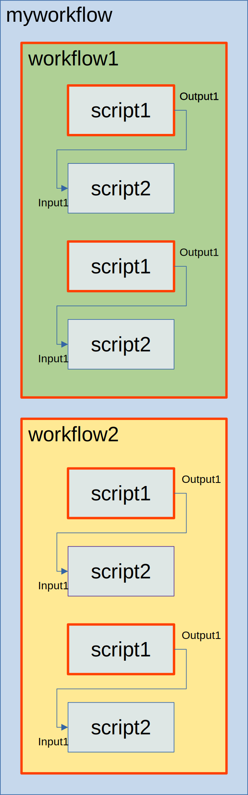

This section describes the Link Query Language (LQL),
which is used to define relationships between workflow components.
Each link is a one-directional connection propagating data from input to output.

### Query structure

Each LQL query has the following high level structure:

`NAME(FLAGS?):PATH`

`NAME` is the mandatory LQL query name used by controllers to retrieve results.

`FLAGS` is an optional comma-separated list of flags:
- The `optional` flag indicates that creating a link matching this query is not required
- The `call` flag, used in [funccall](link-types#funccall-actions) actions, specifies that the FuncCall itself should be matched and returned instead of a script I/O
- The `template` flag is used in [template queries](#template-queries)

`PATH` is a mandatory path, where items are delimited by `/`. For
example, assuming its data link input:

```
value(optional):myworkflow/subworkflow/script/input1
```

This query is named `value` and is optional. `myworkflow` is workflow
id, that is a direct descendant of the workflow where the link is
defined. `subworkflow` is a direct child of `myworkflow`. Since it is
a data link, which targets script io, the last two item must be script
and script io, in this example script id `script` and io name is
`input1`. Links are allowed to match relatively nested items, so
absolute paths with leading `/` are forbidden. The example above is an
abbreviated form for the following:

```
value(optional):first(myworkflow)/first(subworkflow)/first(script)/input1
```

Meaning that the first item with the provided id will be matched. So
by default `first` selector is used.


### Plain selectors

All plain selectors support matching multiple ids via `or`. For
example, `first(script1|script2)` will match the first item with id
either `script1` or `script2`.

The following plain selectors are available:

#### `first`

Matches the first item with provided IDs among direct descendants.

#### `last`

Matches the last item with provided IDs among direct descendants.

#### `all`

Matches all items with provided IDs among direct descendants.

#### `expand`

Functions similarly to `all` for matching, but is exclusively used in base paths. Generates multiple link instances (one per match).


### Reference selectors

These selectors are required for a link to have a
[base](link-types#base) path. A special `expand` selector is available
for base queries. Selector `expand` is working like `all` in terms of
matching, but has a special meaning. For each match a separate link
instance will be created (provided all other queries are matching as
well). Each link instance will be triggered separately and pass data
only from its own matched inputs to own matched outputs. Reference
selectors are using `@` base query name as the first argument, and id
list as the second.

For example, here is a part of link definition with base and reference
selectors:

```
{
  id: "mylink1",
  base: "base:expand(workflow1|workflow2)/expand(script1)",
  from: "in:same(@base,workflow1|workflow2)/same(@base,script1)/output1"
  to: "out:same(@base,workflow1|workflow2)/after+(@base,script2)/input1"
}
```




Is this example (assuming that mylink1 is defined directly in
myworkflow), the first segment `expand(workflow1|workflow2)` matches
both workflow1 and workflow2. The second segment of the base path
`expand(script1)` is matching script1, and there are 2 matches inside
each workflow, so 4 script1 items are matching. All base path matches
are colored via a red border. Note that base queries are targeted
scirpts or workflows, not scirpt io.

The next step is to use this base path matches to create mylink1
instances. The first segment of both from and to paths
`same(@base,workflow1|workflow2)` matches the same workflow1 and
workflow2 as the base path. For from path the second segment
`same(@base,script1)` matches again the same nodes as the
base. However, for to path `after+(@base,script2)/input1`, it matches
next adjacent script2 (relative to base path script1 match). There are
4 matches, so four link mylink1 instances are created. If the last
script2 is removed, there will be 3 links, since there will be no more
matching next adjacent script2 for the last script1.

Here is a list of reference selectors:

#### `same`

Matching same item as in the link instance base path.

#### `before`

Matching the first precising item with any of specified ids before the
link instance base path.

#### `after`

Matching the first following item with any of specified ids before the
link instance base path.

#### `modifiers`

For [before](#before) and [after](#after) special suffixes are
available. `*` forcing to match all items, and `+` forcing to match an
adjacent item, both in the direction of a selector.

Additionally, [before](#before) and [after](#after) selectors accept a third parameter called "stop IDs".
When matching encounters any ID from this list (in the respective selector's direction),
the matching process stops.


### Tag selectors

All selectors could used [tags](configuration#tags) instead of ids to
make matching (including `expand` in base query), by using prefix `#`
selector prefix. Unlike ids, tags lists are matching using `and`,
since it is possible to define multiple tags on the same script node
or workflow. Also tags could be used to match items on different
nested levels.

For example:

```
#first(tag1&tag2)
```

Will match the first item that has both tag1 and tag2, regardless of
how deeply it is nested. The order is defined by depth first
traversal.

It is also possible to combine tag and id selector in the same query:

```
#all(tag1&tag2)/last(script1|scirpt2)/input1
```

Will match all items with both tag1 and tag2 first, regardless of how
deep they are nested, and then match last child item that has id
script1 or script2.

Note that is possible to match only nested items, tags that are higher
in the tree than a link definition will not be matched.

### Template queries

When you need to pass multiple I/O items from one script to another, you can use templates.
For example:

```
{
  from: ["in_output1:myworkflow/subworkflow/script1/output1", "in_output2:myworkflow/subworkflow/script1/output2", "in_output3:myworkflow/subworkflow/script1/output3"]
  to: ["out_input1:myworkflow/subworkflow/script2/input1", "out_input2:myworkflow/subworkflow/script2/input2", "out_input3:myworkflow/subworkflow/script2/input3"]
}
```

Could be written as
```
{
  from: "in_(template):myworkflow/subworkflow/script1/output1|output2|output3"
  to: "out_(template):myworkflow/subworkflow/script2/input1|input2|input3",
}
```

Template option basically creates multiple queries that only differ in
script io part, and in templates it is possible to use `|` for script
io. All other path parts could not use template expasion. The name of
the query will be just a query template name and a script io name.

Also it is possible to use `_(template)` for an empty prefix.
