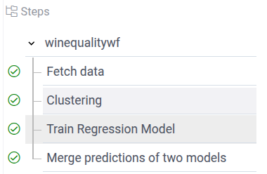

This section provides a brief overview of primary workflow
terms and concepts.

## Main terms

Before starting to work with workflows, we need to define several terms:
* **Node** - any Datagrok script.
  * Node input: data that the step consumes
  * Node output: data that the step produces
* **Link** - connects steps.
  Links can pass data directly from the input of one step
  to the output of another step or apply some transformations.
  * Link source: where to take data from
  * Link target: where to put data
  * Link handler: a TypeScript function performing data transformation.
  Using handlers, the user can apply small non-interactive transformations to data between steps.
* **Configuration**: a tree of JavaScript objects holding workflow definition: nodes and links
* **Workflow provider**: A JavaScript function that returns a Workflow configuration object
* **Controller**: An object that is passed to handler.
  Controller has methods to get inputs and assign outputs.
* **Action**: Similar to links, but triggers only by clicking a UI button.
* **FuncCall**: a result of executing a data query, script, or any other function.
  From the user point of view, funccall is the one invocation of a script, containing the script code,
  input and output.
  The description is available [here](../../datagrok/concepts/functions/function-call.md)

### Scripts nodes

As described in the [scripting](../scripting) section, scripts are just
functions with a set of inputs and outputs (usually abbreviated to IO
in workflow documentation).
Changes of inputs and outputs are tracked
in real time and are used to trigger links.
Also, a user can save the current workflow state and load it later.

### Links

**Links** are connections that are either pass data directly from a source
script IO to target or do some transformations via a TypeScript function
called link handler.
There are multiple types of links;
some of them use source scripts inputs/outputs to pass data to a virtual target,
which is not stored in a script io.
This way it is possible to have a derived state, for example a validation state.

Link handlers make data transformations.
A Link Handler is a TypeScript function
that receives a `controller` object argument.
Each link type has its own controller type with slightly different methods
to get and set inputs/outputs.

Link Handlers are a good way to apply fast non-interactive
transformations to data when creating a separate script step would be overkill.

Note that inputs/outputs of links are different from inputs/outputs of scripts.
A script output is usually connected to a link input,
and a link output connects to the next script input.
More details about different link types are available [here](link-types).

### Configuration

**Configuration** is a special TypeScript object
used to describe a workflow.
You can access TypeScript configuration typing by installing
`@datagrok-libraries/compute-api` package.

`PipelineConfiguration` type describes an n-ary tree
structure where leafs are scripts.
Each nested level might have link
definitions which target its own or nested script IOs.
The main restriction for links is that information can only be propagated forward
(using depth-first graph ordering).
More information about configuration is
available [here](configuration).
The configuration is used to make a UI navigation tree.

### Navigation tree

Each workflow has a navigation tree, automatically created
from the workflow configuration.
Each node in the navigation tree is a script.
The script UI is created automatically based on the input annotations.
To learn more about script UI, check the [Scripting](../scripting/scripting.mdx)
section of the Datagrok documentation.

