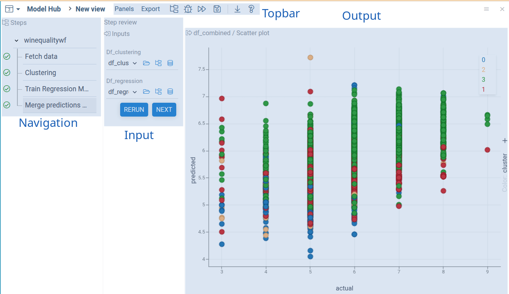

import ConfigDiagram from './pics/configuration-annotated.svg';

This page is a one-page orientation: what a workflow looks like, the
configuration object that defines it, and how its parts connect. Each
section links out to the deeper references.

## What a workflow looks like

Four regions to recognise on every workflow page:

- **Topbar** — workflow-level controls (export, history, run-all, panel toggles).
- **Navigation** — the step tree, with the active step highlighted.
- **Input** — the active step's auto-generated form and its run controls.
- **Output** — the step's viewer or scalar block.

Each region maps onto a part of the configuration object covered next.

## How it's defined

A workflow is a TypeScript function — the **workflow provider** — that
returns a `PipelineConfiguration`. The callouts below link to each
field's canonical reference:

<ConfigDiagram role="img" aria-label="Annotated workflow provider configuration with linked callouts" style={{width: '100%', maxWidth: '920px', height: 'auto'}} />

## Configuration — the central artifact

A workflow is fully described by a single TypeScript object of type
`PipelineConfiguration` — in code the type and its runtime cousins use
the `Pipeline*` prefix; throughout these docs the prose calls it a
*workflow*. The configuration is a tree: workflows contain steps; steps
are either script nodes, nested workflows, or references to other
workflows. Every node has an `id`. The `type` field discriminates
workflows (`static`, `dynamic`, `action`, `ref`); leaves are scripts
(`type: 'step'`, or omitted). See [Configuration](./configuration) for
the full field-by-field reference.

Links live alongside steps inside a workflow and propagate data between
IOs. Data flow is forward-only, in depth-first order through the tree.
Some link roles target virtual outputs rather than script IOs —
`validator` for per-IO validation, `pipelineValidator` for workflow-level
checks, `meta` for UI hints, plus the user-triggered `action`. See
[Link types](./link-types) for the catalogue and
[Link Query Language](./link-query-language) for how `from`/`to` paths
are written.

