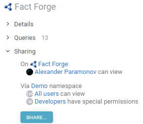
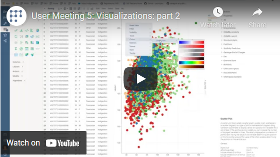

Many types of objects within the Datagrok platform can be shared with other users or [groups](../../govern/access-control/users-and-groups#groups). Such
shareable objects are called [entities](../concepts/objects.md). When an object is shared, you are essentially granting
a [privilege](../../govern/access-control/access-control.md#authorization) (typically, 'view' or 'edit') to a grantee. See
the [Security](../../govern/access-control/access-control.md#credentials-management-system) article for details on how to manage groups and privileges.

To share an object, either right-click on it and choose `Share...`, or expand the `Sharing` section in the object's
context panel and choose `Share...` there.

## Sharing connections and queries

Access rights of a database connection inherit access rights of a query. However, access rights of the query don't
inherit access rights of the database connection. Thus, if one shares a query, the associated database connection shall
automatically be shared. At the same time, when you are sharing a database connection, your queries aren't going to be
shared automatically.

As for web queries, they are automatically shared along with sharing the corresponding connection.

## Videos

See also:

* [Entities](../concepts/objects.md)
* [Privileges](../../govern/access-control/access-control.md#authorization)
* [Security](../../govern/access-control/access-control.md#credentials-management-system)
