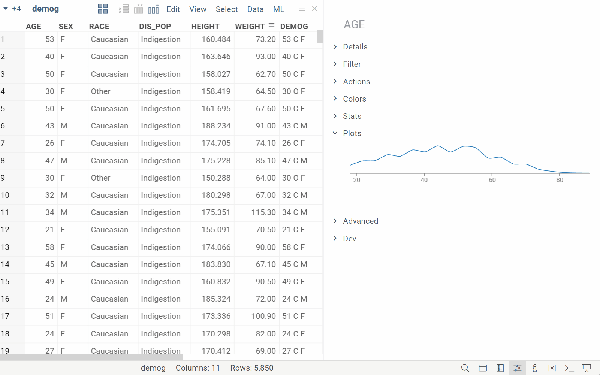

* [Creating](#creating)
* [Docking](#docking)
* [Selection](#selection)
* [Current rows](#current-rows)
* [Filter](#filter)
* [Viewers as filters](#viewers-as-filters)
* [Embedding](#embedding)
* [Interaction](#interaction)
* [Properties](#properties)
* [Common actions](#common-actions)
* [Group tooltips](#group-tooltips)
* [Statistical hypothesis testing](#statistical-hypothesis-testing)
* [Layouts](#layouts)

## Creating

Once a table is open, click on the icons shown on the left pane to open the corresponding viewer.

Viewers are docked within a view. To rearrange it, start dragging viewer's header. Drop zone indicators will appear;
move the mouse cursor to one of them and release the mouse button to dock the viewer at that spot. To resize the viewer,
drag the viewer's border.

 

:::tip

For quick profiling, use the **Plots** info pane. Datagrok automatically generates visualizations when you select one or more columns.

:::

## Docking

Datagrok provides a flexible window management system, where windows
could be either dragged out and positioned manually, or set up automatically.

# Top-level window docking

Use `grok.shell.dockManager` to dock, undock, or reposition windows.
See also `View.dockNode`

### Nested docking

Some of the views contain a nested docking manager, which allows to manage
windows within that particular view (they cannot be undocked and docked on
a top level, or within a different view). See `dockManager` property of the
View class.

## Layouts

View Layout contains relative positions of viewers in
a [table view](../navigation/views/table-view.md), along with the viewers' properties. By separating layouts from the actual
data displayed, it's possible to save current layout (**View | Layout | Save to Gallery**) and later apply it to a
different dataset
(**View | Layout | Open Gallery**). 
Saved layouts that are [applicable](../../visualize/view-layout.md#layout-applicability) to the current table are shown in the 
"Layouts" pane, see picture below.

To clone current view, either do **View | Layout | Clone**, or click on the plus sign on the view header strip, and
choose **Clone**.

To save a layout and then apply it to a different dataset:
1. Open a dataset
2. Add viewers, arrange them, and customize the way you want
3. Click View | Layout | Save to gallery to save the layout on a server (or View | Layout | Download to save locally)
4. Open another dataset with similar columns
5. Click View | Layout | Open Gallery and select a layout saved in step 3. Or, in case you saved it locally at step 3, drag-and-drop the layout file to the view.

## Selection

All viewers share the same row selection and filtered state, which can be manipulated in a consistent way across all
viewers:

|                  |                                    |
|------------------|------------------------------------|
| ESC              | Deselect all rows and reset filter |
| Ctrl+A           | Select all rows                    |
| Ctrl+Shift+A     | Deselect all rows                  |
| Ctrl+Click       | Toggle selected state              |
| Shift+Click      | Select point or group              |
| Ctrl+Shift+Click | Deselect point or group            |

To select rows in the [grid](../../visualize/viewers/grid.md):

|                                 |                                        |
|---------------------------------|----------------------------------------|
| Shift+Mouse Drag                | Select rows                            |
| Ctrl+Shift+Mouse Drag           | Deselect rows                          |
| Mouse Drag row headers          | Select rows                            |
| Shift+drag column headers       | Select columns                         |
| Ctrl+click column headers       | Select columns                         |
| Ctrl+Shift+click column headers | Deselect columns                       |
| (Ctrl+) Shift + ↑↓              | (Un)select rows                        |
| (Ctrl+) Shift + ←→              | (Un)select columns                     |
| (Ctrl+) Shift + mouse-drag      | (Un)select rows                        |
| (Ctrl+) Shift + ENTER           | (Un)Select rows with the current value |

## Current rows

Rows in a grid can not only be selected or filtered, in addition to that, the grid keeps track of a current row and
highlights it in green. This indication is a neat and lightweight way to update information related to the current value
and lets users explore and compare rows with ease.

To make a row current, simply click on it, or navigate up and down the grid using the cursor up and down keys. Info
panels in the context panel get synchronized with the current cell.

It is also integrated into Datagrok's visualizations and cheminformatics functionality, e.g., similarity search, so as
you move from one row to another you immediately see where the row values belong on the chart or which molecules have
the most similar structure to the reference. This also works the other way around: by first clicking on a visual
element, you will see the row it represents in the grid.

## Filter

To open filter group, click on the funnel icon in the toolbox:

Alternatively, click on the column's "hamburger icon" to filter by the individual column.

### Viewers as filters

By default, clicking on a segment that represents multiple rows will select these rows. However, some viewers, such
as [Bar Chart](../../visualize/viewers/bar-chart.md) and [Pie Chart](../../visualize/viewers/pie-chart.md), could be also used for filtering of the
underlying table. Such viewers are a popular choice for interactive dashboards.

To control that behavior, click on the viewer's hamburger icon, open "On click" and choose the desired mode. Internally,
this sets two different [properties](#properties) of a viewer:

* `row source` - specifies which rows should be visualized on the viewer (all | filtered | selected)
* `on click` - specifies what happens when user click on a group of rows (select | filter).

By setting these properties manually, it is possible to achieve different combination of interactivity (for instance, a
viewer that shows only selected rows)

## Common actions

Many viewers support the following:

|                 |                 |
|-----------------|-----------------|
| Double-click    | Reset View      |
| Alt+drag        | Zoom            |
| Mouse drag      | Pan             |

All of the common actions are available from the context menu. To bring it up, either right-click, or click on the "
hamburger" menu in the top left corner. The icons in the viewer header are only visible when the mouse is hovering over
the viewer.

The following commands are the most common:

|            |                                                                                                                                                                                             |
|------------|---------------------------------------------------------------------------------------------------------------------------------------------------------------------------------------------|
| Properties | Show viewer properties in the [context panel](../navigation/panels/panels.md#context-panel)                                                                                        |
| Reset View | Reset zoom level. Applies for: [Scatter plot](../../visualize/viewers/scatter-plot.md), [Line chart](../../visualize/viewers/line-chart.md), [Bar chart](../../visualize/viewers/bar-chart.md), [3D scatter plot](../../visualize/viewers/3d-scatter-plot.md), and [Box plot](../../visualize/viewers/box-plot.md) |

General commands are available under the **General** submenu:

|                 |                                                                        |
|-----------------|------------------------------------------------------------------------|
| Clone           | Create a copy of the viewer                                            |
| Full Screen     | Show in full screen. **Alt+F**                                         |
| Close           | Close the viewer                                                       |
| Use in Trellis  | Add a [Trellis plot](../../visualize/viewers/trellis-plot.md), using this viewer as a renderer |
| Save to Gallery | Saves this viewer to a [gallery](../../visualize/view-layout.md#layout-suggestions) |
| Embed           | Create HTML code that can be embedded in an external site              |

Style-related commands reside under the **Style** submenu:

|                      |                                                                                                                                                                                                                |
|----------------------|----------------------------------------------------------------------------------------------------------------------------------------------------------------------------------------------------------------|
| Pick up              | Remember the style of the current viewer                                                                                                                                                                       |
| Apply                | Apply previously remembered style. This option, as well as the "Apply data settings" and "Apply Style Settings", is only enabled when the settings of the corresponding viewer type were picked up previously. |
| Apply Data Settings  | Apply only "Data" section of the settings. Can be used for viewers belonging to different views as long as the data source remains the same                                                                    |
| Apply Style Settings | Apply all settings, except for the "Data" section. You can use this option for viewers that have different data source                                                                                         |
| Set as Default       | Use style settings for new viewers of that type. The viewer's properties will be changed automatically to match the ones from the remembered style                                                             |
| Reset Default        | Clear default settings                                                                                                                                                                                         |

The commands from the **To Script** submenu produce code that can be used to build a similar visualization using R or
Python:

|           |                                                                   |
|-----------|-------------------------------------------------------------------|
| to R      | Open the visualization preview and get the code snippet in R      |
| to Python | Open the visualization preview and get the code snippet in Python |

## Interaction

All visualizations are tightly coupled. Hover, selection, filtering on one viewer is displayed on the rest:

For example, filtering on a [histogram](histogram.md) affects the [scatter plot](scatter-plot.mdx):

## Properties

Each viewer has a set of properties associated with it that define either the appearance
(such as "Back Color" or "Font"), or data (such as "Value" or "Split"). The most important data properties (usually
columns to visualize) are exposed as combo boxes on top of the viewer. To edit the rest of the properties, either click
on the "gear" icon on top of the viewer, or press F4 when the viewer has focus, or right-click and
select `Viewer | Properties`.

## Tooltips

### Row tooltips

Tooltip-related settings reside under the **Tooltip** submenu:

|                           |                                                                                  |
|---------------------------|----------------------------------------------------------------------------------|
| Hide                      | Hide the tooltip                                                                 |
| Use as Group Tooltip      | Use this viewer in [tooltips that correspond to groups of rows](#group-tooltips) |
| Remove Group Tooltip      | Stop using this viewer as a group tooltip                                        |
| Set Default Tooltip...    | Set row tooltip settings for all viewers associated with the data frame          |
| Set `<Viewer>` Tooltip... | Set a tooltip template for this specific viewer                                  |

See also: [setting tooltips programmatically](https://public.datagrok.ai/js/samples/ui/viewers/viewew-tooltips)

### Group tooltips

One of the unique features of the Datagrok platform is the ability to quickly visualize multiple rows in a tooltip,
using the settings of another viewer.

Once the "Use as Group Tooltip" command is executed, the original viewer is no longer required, and it is safe to close
it if you choose so.

The following picture illustrates the concept:

## Statistical hypothesis testing

To help users analyze their data in depth, our visualizations include a number of statistical features:

* Box plots show [p-value](../../visualize/viewers/box-plot.md#t-test), which allows to determine whether the findings are statistically
  significant
* Scatter plots can display a [regression line](../../visualize/viewers/scatter-plot.md#regression-line) along with its equation;
  moreover, it is possible to plot multiple regression lines by encoding categories with color
* The values of Pearson's correlation coefficient computed for [correlation plots](../../visualize/viewers/correlation-plot.md) are
  highlighted, which makes it easy to trace the strength of relationship between given variables
* Statistics viewer gives a concise summary of commonly used [measures](statistics.md#statistical-measures) for
  selected columns
* The platform's viewers offer two commands, `To Script | To Python` and `To Script | To R`, that can be used
  to [reproduce charts](https://www.youtube.com/watch?v=seAgx5TbrzI&t=258s) with Python or R code respectively

## Embedding

Each viewer created in Datagrok can be embedded into an external site as an iframe. It remains fully interactive and
will be bound to the data for which it was created inside the platform. To generate an iframe for a viewer, open its
context menu, then go to the **Viewer** submenu and select **Embed**:

Now you can copy the generated iframe and use it in your site. The only thing you need to remember is that this feature
works only for data uploaded as a project to the server.

## Resources

