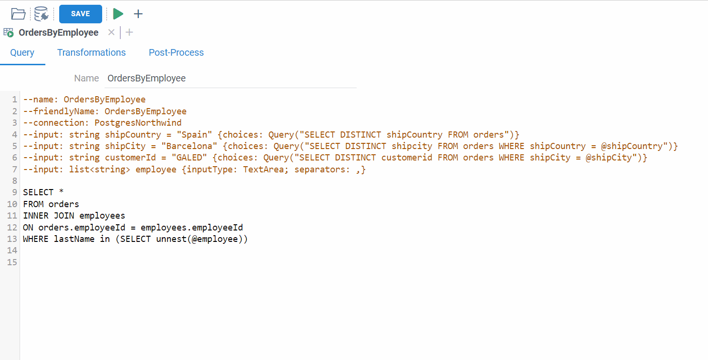
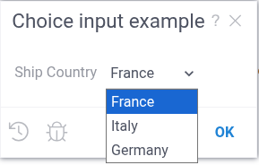
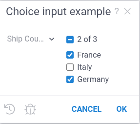
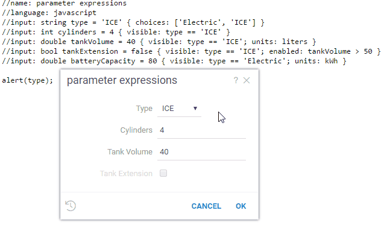
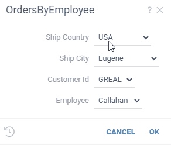
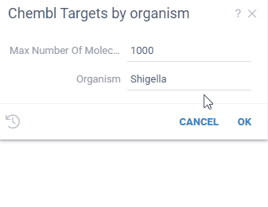
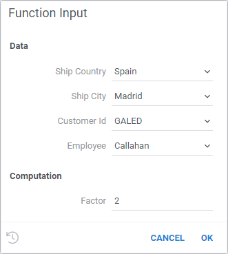
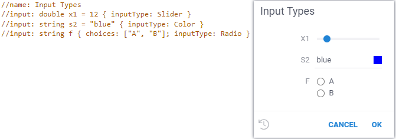
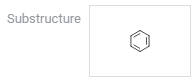
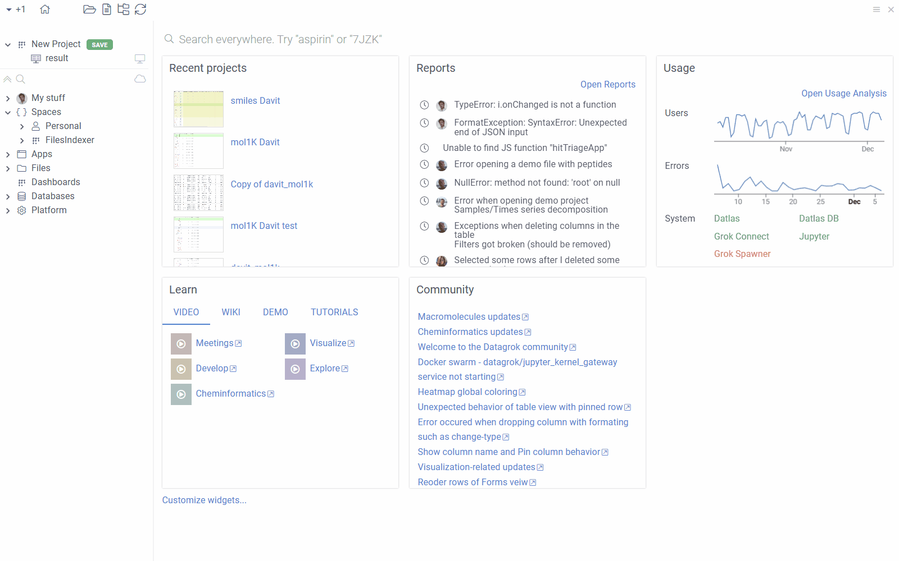

# Function annotations

There are various types of [functions](functions.md), such as [scripts](../../../compute/scripting/scripting.mdx) or
[queries](../../../access/access.md#data-query). All of them are annotated in a similar way, and that 
enables universal support for functions in the platform.

A function annotation, also known as a header, is a multi-line comment that is placed above the function declaration.
It contains information about the function name, role, as well as function inputs and outputs. Inputs and outputs
can have metadata associated with them as well. 

When you run a function, Datagrok generates the UI from the parameter annotations. You can build
interactive experiences that allow [validation](#validation), controlled [vocabularies](#choices),
[autocomplete](#autocomplete), [custom inputs](#inputs-for-semantic-types), 
[dynamic lookups](#lookup-tables), [referencing parameters](#referencing-other-parameters), and 
[function chaining](#function-inputs) - without writing a single line of UI code!

## Function

There are general parameters common to all functions, as well as parameters specific to certain function types. Not all
general parameters are required, the list of parameters depends on the function
[type](#parameter-types-and-options), [role](../../../develop/function-roles.md), and so on.

<details> 
<summary> Simple python script </summary> 
<div>

```python
#language: python
#name: GetCellNumber
#description: Calculates number of cells in the table
#tags: demo
#input: dataframe table [Data table]
#output: int count [Number of cells in table]
count = table.shape[0] * table.shape[1]
```

</div> 
</details>

These are the common parameters for all functions:

* `name`: shows up in the user interface
* `description`: shows up in a function tooltip
* `tags`: comma-separated tags that you can use in search
* `help-url`: help that shows up when you click on the "?" in the function dialog
* `reference`: Reference to a research paper, Wikipedia article, Git repository, etc.
* `top-menu`: Top menu path separated with pipes (`|`), such as `Chem | Gasteiger Charges`

Some parameters are specific to script language and/or technology:

* Script
  * `language`: script language (supported: `r`, `python`, `octave`, `julia`, `grok`, `javascript`)
  * `environment`: [script environment](../../../compute/scripting/scripting-features/specify-env.mdx) (Conda environment for python, etc)
  * `sample`: path to a sample data csv file. When defined, a `*` icon appears on the ribbon panel that loads it. 
* Script-based info panels
  * `condition`: GrokScript condition that gets evaluated to decide whether to show the panel for the object
* Query
  * `connection`: Name of the db connection that the query should use
* Scheduling (server-based functions only)
  * `schedule`: [Cron expression](https://en.wikipedia.org/wiki/Cron) for automatic execution (e.g., `0 8 * * *` for daily at 8am)
  * `schedule.runAs`: Group or role for execution context. You must be a member of the specified group. See [Scheduling](functions.md#scheduling).

To add additional parameters, use the `meta.` prefix. They can be used for dynamically searching for
the functions of interest.


## Inputs and outputs

Each input and output definition takes one line, starting with a comment, followed 
by type, name, optional initial value used to pre-fill the UI, options, and optional description, just like here:

```
#input: string country {choices: ["USA", "Canada"]} [Country to ship from]
#input: double weight
#output: double price
```

:::warning Parameters mapping for functions
There is a crucial difference between annotation of 
[scrips](../../../compute/scripting/scripting.mdx) 
and Javascript functions in 
[packages](../../../develop/develop.md#packages).
When you annotate a script in any supported language, parameters are mapped by the parameter name.
So the parameter name and value always are consistent.

When you annotate a Javascript function from a package, parameters are mapped 
by **parameter order** instead of name.
Let's explore it on the following example:

```javascript 
//name: ParameterTestFunction
//description: Small function to illustrate parameter mapping
//language: javascript
//input: int one=1 {caption: First} [First parameter]
//input: int two=2 {caption: Second} [Second parameter]
export function ParameterTestFunctionPkg(two, one) {
    const result = `First:${one}, second:${two}`;
    console.log(result);
}
```

In the function signature, the parameter names go in the different order: `(two, one)`,
comparing to the annotation.
As a result, the function will produce the unexpected result: `First:2, second:1`

To avoid mistakes, we suggest that you always use 
exactly the same parameter order in the function annotation 
and the function signature. 
:::


### Parameter types and options

Datagrok supports the following types in all scripting languages: 

* Scalars: `int`, `double`, `bool`, `string`, `datetime`
* Table: `dataframe`, `column`, `column_list`
* Collections: `list` (typically of strings)
* `graphics`: typically a function output. See [example](https://github.com/datagrok-ai/public/blob/9f7043dbadd9be35c6f798143642de3c9145b560/packages/Chem/scripts/gasteiger_charges.py#L4)
* `file`: when the script is executed, contains a string with the path to a file
* `blob`: array of bytes

Some of the options apply to all parameters, while other are type-specific. 

<details> 
<summary> Reference: list of options applicable to different parameters </summary> 
<div>

For all parameters:

| Option     | Value  | Description                                                               |
|------------|--------|---------------------------------------------------------------------------|
| validators | string | Comma-separated list of [validators](#validation)                         |
| caption    | string | Custom field caption                                                      |
| postfix    | string | Field postfix                                                             |
| units      | string | Value unit name                                                           |
| nullable   | bool   | Makes it an [optional parameter](#initial-values-and-optional-parameters) |

For `dataframe` type:

| Option      | Value       | Description                             |
|-------------|-------------|-----------------------------------------|
| columns     | numerical   | Only numerical columns will be loaded   |
| columns     | categorical | Only categorical columns will be loaded |

For `column` and `column_list` types

| Option     | Value                           | Description                                                                 |
|------------|---------------------------------|-----------------------------------------------------------------------------|
| type       | numerical,categorical,dateTime  | In a dialog, only numerical columns will be shown                           |
| format     | MM/dd/yyyy                      | Datetime format, for dateTime columns and datetime type only                |
| allowNulls | true/false                      | Adds validation of the missing values presence                              |
| action     | join("table parameter name")    | Joins result to the specified table, for output parameters only             |
| action     | replace("table parameter name") | Replaces result with columns in specified table, for output parameters only |

For `string` type

| Option                       | Value                                                                             | Description                                |
|------------------------------|-----------------------------------------------------------------------------------|--------------------------------------------|
| [choices](#choices)          | Comma-separated list of values, or a function name that returns a list of strings | Makes it a combo box                       |
| [suggestions](#autocomplete) | Name of a function that returns a list of strings to autocomplete user input      | Autocomplete gives you options as you type |

For `numeric` types

| Option   | Description                                                                                                                                |
|----------|--------------------------------------------------------------------------------------------------------------------------------------------|
| min, max | Minimum and maximum to be validated. When both are defined, slider is added for the float input, and +/- clicker is added to the int input |

For `list` type`

| Option      | Value                                                             | 
|-------------|-------------------------------------------------------------------|
| separators  | Characters used to split string to list of values. Default is `,` | 

**Separators** apply only for the TextArea input type. The following example demonstrates how separators work
for the Postgres-based SQL query:

</div> 
</details>


<details>
<summary> Example: Using separators in a query </summary>
<div>

```sql
--name: OrdersByEmployee
--friendlyName: OrdersByEmployee
--connection: PostgresNorthwind
--input: string shipCountry = "Spain" {choices: Query("SELECT DISTINCT shipCountry FROM orders")}
--input: string shipCity = "Barcelona" {choices: Query("SELECT DISTINCT shipcity FROM orders WHERE shipCountry = @shipCountry")}
--input: string customerId = "GALED" {choices: Query("SELECT DISTINCT customerid FROM orders WHERE shipCity = @shipCity")}
--input: list<string> employee {inputType: TextArea; separators: ,}

SELECT *
FROM orders
INNER JOIN employees
ON orders.employeeId = employees.employeeId
WHERE lastName in (SELECT unnest(@employee))
```



</div>
</details>

### Initial values and optional parameters

Proper handling of the empty parameters requires special efforts when building a SQL query,
and passing empty parameters to the function that does not expect it is a major source of errors. 
To deal with it, by default each parameter is required, but you can specify initial values
and make it optional (nullable).

* *Initial value* gets shown in the dialog when you execute the function. If you remove the value, an empty value
  is passed to the function. But before the function is executed, the input is validated, and you will get
  an error if a required parameter is not specified.
* *Optional parameter*: make a parameter optional by specifying the `nullable: true` option.

For example, to create an optional string parameter with the initial value:

```
--input: string shipCountry = "France" { nullable: true }
SELECT * FROM customers where shipCountry = @shipCountry
```

### Nullable vs Optional

It’s important to distinguish between **nullable** and **optional** parameters:

* **Nullable** parameters can explicitly accept `null`, but are still **required positional parameters**. You must pass
them in the function call, even if the value is `null`.

```
Func(1, null, 3)
```

* **Optional** parameters are **named parameters** with default values and can be skipped entirely in function calls.
```
Func(1, 3, optional = 4)
```

**In the UI forms**, both nullable and optional parameters appear similarly (users can leave the field empty), but
their behavior in code differs.

### Filter patterns

**Filter pattern** allows you to use free-text conditions like "this week" for dates, or ">50" for numbers.

To use search patterns, set the input type to `string`, and set the `pattern` option
to the type of the column you are filtering. Then, reference the pattern in the query
as `@patternName(columnName)`, just like we did here for the "freight" column:

```
--input: string freightValue = >= 10.0 {pattern: double}
select * from Orders where @freightValue(freight)
```

Different inputs would produce differently structured SQL (also dependent on the database). 

| Input | SQL                                                                | Description                     |
|-------|--------------------------------------------------------------------|---------------------------------|
|       | select * from orders <br/> where 1 = 1                             | No input => no filter           |
| >3    | select * from orders <br/> where freight > 3                       | Using column name to filter     |
| 10-20 | select * from orders <br/> where (freight >= 10 and freight \<= 20) | Have to do multiple comparisons |


In this example, the `freightValue` input parameter is defined as a string with a default value of `>= 10.0`. 
The `pattern` _option_ specifies that the actual data type is a `double`. In the query, a reference to
`@freightValue(freight)` specifies the _pattern_ that will be evaluated against the "freight" column.

<details> 
<summary> Reference: Supported search patterns </summary>

| Type               | Value         | Description or example       |
|--------------------|---------------|------------------------------|
| `num, int, double` | `=`           | `= 100`                      |
|                    | `>`           | `> 1.02`                     |
|                    | `>=`          | `>= 4.1`                     |
|                    | `<`           | `< 5`                        |
|                    | `<=`          | `<= 2`                       |
|                    | `in`          | `in (1, 3, 10.2)`            |
|                    | `min-max`     | `Range: 1.5-10.0`            |
| `string`           | `contains`    | `contains ea`                |
|                    | `starts with` | `starts with R`              |
|                    | `ends with`   | `ends with w`                |
|                    | `regex`       | `regex 1(\w+)1`              |
|                    | `in`          | `in (ab, "c d", "e\\"f\\"")` |
| `datetime`         | `anytime`     |                              |
|                    | `today`       |                              |
|                    | `this week`   |                              |
|                    | `this month`  |                              |
|                    | `this year`   |                              |
|                    | `yesterday`   |                              |
|                    | `last week`   |                              |
|                    | `last month`  |                              |
|                    | `last year`   |                              |
|                    | `before`      | `before July 1984`           |
|                    | `after`       | `after March 2001`           |
|                    | `min-max`     | `Range: 1941-1945`           |

To learn more, see [search patterns](../../../visualize/table-view-1.md#search-patterns).
</details>

### Choices

Use `choices` to make input a combo box, and restrict the selection to the defined set of values. 
You can define `choices` using a comma-separated list of values, 
a CSV file,
a name of another function (such as query), 
or by writing an actual SQL query.

<details> 
<summary> Example: SQL query: single choice: different ways to specify a list of countries </summary> 
<div>

```sql
--input: string shipCountry = "France" {choices: ['France', 'Italy', 'Germany']}
--input: string shipCountry = "France" {choices: Samples:countries}
--input: string shipCountry = "France" {choices: Query("SELECT DISTINCT shipCountry FROM Orders")}
--input: string shipCountry = "France" {choices: OpenFile("System:AppData/Samples/countries.csv")}
```



When you provide as input a multi-column CSV file, 
Datagrok uses the first column for the list of values. 


</div> 
</details>

<details> 
<summary> Example: SQL query: multiple choice for the "list" input</summary> 
<div>

When `choices` is applied to the `list` parameter, the input becomes a multiple choice, just like in 
this example:

```sql
--input: list<string> company {choices: Query("SELECT DISTINCT company from research_companies")}
```



To specify initial values for a multiple choice, use a JavaScript array:

```sql
--input: list<string> shipCountries = ["France", "Germany"] {choices: ['France', 'Italy', 'Germany']}
```

:::caution Limited support for scripts

Multi-value choices are now supported only in `JavaScript`.
The multi-choice support for `Python` and `R`
is planned for the next releases.

:::


</div> 
</details>

### Validation

In addition to the built-in [checks that the value is not missing](#initial-values-and-optional-parameters), 
and that it satisfies min-max conditions, 
you can specify custom validation functions that get executed before calling the function 
to assure the validity of the parameters. 

The easiest way is to define a `validator` GrokScript expression that gets evaluated when input changes.
Result `true` or `null` means that the input is valid. `false` or a string error message means that the input is invalid, 
it gets highlighted and the validation message is shown in the tooltip. Note that the expression can depend not only on the
value of the parameter the expression applied to, but on other parameters as well.

<details>
<summary> Example: Inline validation dependent on the value of other parameters </summary>
<div>

```js
//input: int foo = 5 { validator: bar > 3 }
//input: double bar = 2 { min: 0; max: 10 }
```



</div>
</details>


The second option involves using a custom validation function and referencing it.
Usually it's a JavaScript function that gets executed right in the browser, but you can use other languages as well.
A validation function accepts one parameter
(a string that user enters), and returns null if the string is valid, or the reason for being invalid,
otherwise.

<details>
<summary> Example: Functions as validators </summary>
<div>

The following example adds a "containsLettersOnly" function to the "col" parameter:

```
#input: string s {validators: ["containslettersonly"]}
#input: column col {validators: ["containsmissingvalues"]}
```

```js
//name: jsVal1
//input: string s
//output: string valid
valid = input < 11 ? null : "Error val1";
```

```python
#name: Numbers
#language: python
#input: int count1 {validators: ["jsval1"]
```


</div>
</details>

### "Visible" and "enabled" expressions 

You can control input's visibility and enabled state by specifying GrokScript expressions on the parameter
level, similarly to [validation](#validation). Note that the expression can depend not only on the 
value of the parameter the expression applied to, but on other parameters as well.

<details>
<summary> Example: input visibility and enabled state dependent on the value of other parameters </summary>
<div>

```js
//input: string type = 'ICE' { choices: ['Electric', 'ICE'] }
//input: int cylinders = 4 { visible: type == 'ICE' }
//input: double tankVolume = 40 { visible: type == 'ICE'; units: liters }
//input: bool tankExtension = false { visible: type == 'ICE'; enabled: tankVolume > 50 }
//input: double batteryCapacity = 80 { visible: type == 'Electric'; units: kWh }
```


</div>
</details>

### Lookup tables

Lookup tables let you initialize inputs with a set of pre-defined values. To use it, set 
the `choices` attribute to a function that returns a dataframe, and set `propagateChoice` to "all". 
The first column is used as a key in the combo box. When you select it, the input fields are initialized with the 
values from the corresponding columns (input names and column names have to match).

<details> 
<summary> Example: Lookup table </summary> 
<div>

The following example lets you initialize multiple car's parameters based on the model that you select.
Note that here we use the `OpenFile` function to read a dataframe from the CSV file on a file share; it would
work the same if we read it from the database using the `Query` function.

```
//input: string model { choices: OpenFile("System:AppData/Compute/cars.csv"); propagateChoice: all }
//input: double mpg
//input: int cyl
//input: int disp
```

```csv
model,mpg,cyl,disp,hp,drat,wt,qsec,vs,am,gear,carb
Mazda RX4,21.0,6,160,110,3.90,2.620,16.46,0,1,4,4
Mazda RX4 Wag,21.0,6,160,110,3.90,2.875,17.02,0,1,4,4
Datsun 710,22.8,4,108,93,3.85,2.320,18.61,1,1,4,1
Hornet 4 Drive,21.4,6,258,110,3.08,3.215,19.44,1,0,3,1
Hornet Sportabout,18.7,8,360,175,3.15,3.440,17.02,0,0,3,2
```


</div> 
</details>

### Referencing other parameters

Parameter's choices, validators, and suggestions can depend on the value of another parameter. 
This is useful when creating queries with hierarchical choices, where each subsequent parameter 
depends on the previous one. To do this, reference the parameter in another parameter's annotation 
using the `@` symbol.

<details> 
<summary> Example: SQL-based hierarchical query </summary> 
<div>

Let's say we want to build a UI, where you first select a state and then choose a city from
the corresponding state. All we need to do is to reference the `@state` parameter in the query
that retrieves a list of cities:

```sql
--input: string state {choices: Query("SELECT DISTINCT state FROM public.starbucks_us")}
--input: string city {choices: Query("SELECT DISTINCT city FROM public.starbucks_us WHERE state = @state")}
SELECT * FROM public.starbucks_us WHERE (city = @city)
```

Datagrok does the rest, and turns it into an interactive experience:



</div>
</details>

### Autocomplete

Use autocomplete to help users enter a correct value. For instance, when entering a product name, it might make
sense to dynamically query a database for values starting with the already entered text, and suggest to auto-complete
the value.

Use the `suggestions` option to enable autocomplete, and specify the name of a function that 
accepts one string parameter, and returns a list of strings (or a dataframe with one string column)
to be used as suggestions as the user types the value. 

<details>
<summary> Example: SQL-based autocomplete function </summary>
<div>

Here are two SQL functions 
(from the [Chembl](https://github.com/datagrok-ai/public/blob/master/packages/Chembl/queries/cartridge.sql#L63) package), 
where the UI for the "Structures by Organism" query uses the "organismsAutocomplete" function
to complete user input:


```sql
--name: organismsAutocomplete
--input: string sub
select distinct organism from target_dictionary
where organism ilike '%' || @sub || '%'
limit 50
```

```sql
--name: StructuresByOrganism
--input: string organism = "Shigella" {suggestions: Chembl:organismsAutocomplete}
SELECT md.chembl_id AS compound_chembl_id,
cs.canonical_smiles,
act.standard_type,
act.standard_value,
act.standard_units,
td.chembl_id AS target_chembl_id,
td.organism,   td.pref_name
FROM target_dictionary td
  JOIN assays a ON td.tid = a.tid
  JOIN activities act ON a.assay_id = act.assay_id
  JOIN molecule_dictionary md ON act.molregno = md.molregno
  JOIN compound_structures cs ON md.molregno   = cs.molregno
  JOIN organism_class oc ON td.tax_id = oc.tax_id
    AND td.organism = @organism
    AND oc.L1 = 'Bacteria'
```



</div></details>

### Function inputs

To reuse other "helper" functions along with their editors for your top-level function, specify 
the helper function using the `editor` option. In the following example, we have a parameter `orders`
that points to the `Samples:OrdersByEmployee` function, so in the autogenerated UI, we see the inputs
of that function instead of the normal dataframe input. When the top-level function is executed,
`orders` parameters gets evaluated to the results of the execution of the `Samples:OrdersByEmployee` 
function with the specified parameters.

To get the internal parameters of the `orders` function, you can specify them in the input using the
`editorParam` option. In the following example, we have a parameter `country` that points to the `shipCountry`
parameter of the `orders` function. When the top-level function is executed, `country` parameter gets evaluated
to the value of the `orders.shipCountry` parameter. That way, you can reference the internal parameters of the
helper function and use them in the top-level function.

This powerful technique allows to reuse functions, and mix multiple technologies and languages 
within one script. You can get your data with a SQL query, run calculations in Python, and then
visualize it interactively in Datagrok - all of that without writing a single line of UI code.
To learn more, see [Compute](../../../compute/compute.md#data-access).

<details>
<summary> Example: JavaScript function that uses SQL query as a function input </summary>


```js
//language: javascript
//input: dataframe orders {category: Data; editor: Samples:OrdersByEmployee}
//input: int factor = 2 {category: Computation}
//input: string country {category: Computation; editorParam: orders.shipCountry}
//output: string result

result = `${country} - ${orders.rowCount * factor}`;
```



</details>

### Complex calculated columns

When you need to compute **several related columns from the same data**, complex calculated columns let you do it
through a **single function**.

This approach improves both **efficiency** and **user experience**: instead of defining multiple separate calculated
columns with nearly identical logic, you define one formula that returns several results at once. Each of these results
becomes its own calculated column in the table.

This is particularly useful when several properties are derived from the same source data, for example:

* Computing multiple **ADME properties** (absorption, distribution, metabolism, excretion).
* Calculating **chemical descriptors** such as logP, TPSA, molecular weight, or others.
* Generating **statistical summaries** (mean, median, standard deviation, etc.) for related data columns.

Since all the derived columns are computed together, Datagrok can **reuse cached computations**, ensuring fast and
consistent recalculation when input data changes.

#### How It Works

To define a complex calculated column function:

1. Add the annotation
    ```ts
    //meta.vectorFunc: true
    ```
2. Make your function return a **dataframe** — each column in the returned dataframe becomes a calculated column in the
source table.
3. Optionally, add a `list<string>` **parameter** to let users select which specific result columns to create (for
instance, particular chemical properties or statistical measures). This parameter should be placed **last** in the
function signature, since it’s optional.

Inputs can include both regular columns and scalar parameters.

<details>
<summary> Example: Computing chemical properties from the Chem package </summary>

```ts
//input: column molecules {semType: Molecule} 
//input: list<string> out {optional: true}
//meta.vectorFunc: true
//output: dataframe result
export async function getProperties(molecules: DG.Column, out?: string[]): Promise<DG.DataFrame> { 
  const propNames = Object.keys(CHEM_PROP_MAP);
  const props = !out || out.length === 0
    ? propNames
    : propNames.filter((p) => out.includes(p));

  const cols = await getPropertiesAsColumns(molecules, props);
  return DG.DataFrame.fromColumns(cols); 
}
```

This function calculates several chemical properties (such as logP, TPSA, or molecular weight) at once. Users can
select which properties to generate, and each one will appear as a calculated column in the table.

</details>

#### Integration with “Add New Column”

You can use complex calculated column functions **directly in the** [Add new column](../../../transform/add-new-column.md)
**dialog** — just type or insert such a function into the formula editor.

If the function has the `meta.vectorFunc: true` annotation, Datagrok automatically:

* Adds all resulting columns from the returned dataframe to your table.
* Keeps them **synchronized and efficiently recalculated** as data changes.

This allows you to create multiple derived columns (for example, several computed chemical descriptors) from one
unified expression — all from the familiar **Add new column** interface.

### Input types

Input fields such as text boxes or combo boxes get generated automatically based on
the property attributes. You can also explicitly set the `inputType` option. Here, we 
set it to `Radio` to make the input appear as a radio button instead of the combo box:

```js
//input: string fruit { choices: ["Apple", "Banana"], inputType: Radio }
```

<details>
<summary> Reference: Supported input types </summary>

Input types have to match the data types (input types in bold are the default ones
that you do not have to specify):

| Input type      | Data types  | Example / description                     |
|-----------------|-------------|-------------------------------------------|
| **Int**         | int         | \{ min: 0; max: 20; step: 4}              |
| **BigInt**      | bigint      |                                           |
| **Float**       | double      | \{ min: 0; max: 1; step: 0.03 }           |
| **Bool**        | bool        |                                           |
| **Text**        | string      |                                           |
| **Date**        | datetime    |                                           |
| **MultiChoice** | list        | \{ choices: \["A", "B"] }                 |
| **List**        | list        | \{ inputType: TextArea; separators: ,}    |
| **Column**      | column      |                                           |
| Slider          | int, double | \{ min: 0; max: 20; step: 4}              |
| Color           | string      |                                           |
| Radio           | string      | \{inputType: Radio; choices: \["A", "B"]} |
| Molecule        | string      |                                           |

</details>


<details>
<summary> Example: Using "Slider", "Color", and "Radio" input types </summary>

</details>


Check out [interactive snippet](https://public.datagrok.ai/js/samples/ui/inputs/advanced/all-input-types)
for more input types.  

For developers: [DG.InputBase](https://datagrok.ai/api/js/dg/classes/InputBase)

### Inputs for semantic types

Datagrok automatically [detects semantic types](../../../develop/function-roles.md#semantic-type-detectors), 
and you can also specify semantic types of input parameters. In this case, a corresponding input will be
used, if it is defined. 

<details>
<summary> Example: Automatically using the molecular sketcher for the "Molecule" semantic type </summary>

This is how an input field for the "Molecule" semantic type looks like. When you click
a molecule, a molecule sketcher pops up.

```sql
--input: string substructure = 'c1ccccc1' {semType: Molecule}
```



</details>

## Search integrated functions

Datagrok allows you to define a special patterns for calling any function or query with a human-readable sentence and visualize the resulting dashboard directly from the platform search.

When you create a function, script, or query that results in a table, you can annotate it with the `meta.searchPattern` tag. This tag will be used to call the function with the specified parameters within the sentence.

The `searchPattern` tag can be any sentence that contains placeholders for the parameters. For example, if the annotation of the query is as follows:

```sql
--input: string target = "CHEMBL1827"
--meta.searchPattern: "compound activity details for target ${target}"
```

Searching for "compound activity details for target CHEMBL1827" in the **Search Everywhere** bar will call the query and pass "CHEMBL1827" as the `target` parameter. The number of parameters is not limited, and they can be used in any order in the sentence.



:::tip

Use the **Search Everywhere** bar to visualize the following queries directly from the search results:
- *Bioactivity for bacterial targets for Shigella*
- *Pharmacokinetic Data for LEVOFLOXACIN*
- *Compound activity details for target CHEMBL1827*

You can also add the resulting dashboard to the workspace by clicking on the **+** icon in the search results.


<details>
<summary>Example query</summary>

```sql
--name: bioactivity data for bacterial targets for @organism
--friendlyName: Browse | Bioactivity for bacterial targets for @organism
--connection: Chembl
--input: string organism {suggestions: Chembl:organisms}
--input: string species
--meta.searchPattern: "Bioactivity for ${species} targets for ${organism}"
SELECT md.chembl_id AS compound_chembl_id,
cs.canonical_smiles,
act.standard_type,
act.standard_value,
act.standard_units,
td.chembl_id AS target_chembl_id,
td.organism,   td.pref_name
FROM target_dictionary td
  JOIN assays a ON td.tid = a.tid
  JOIN activities act ON a.assay_id = act.assay_id
  JOIN molecule_dictionary md ON act.molregno = md.molregno
  JOIN compound_structures cs ON md.molregno   = cs.molregno
  JOIN organism_class oc ON td.tax_id = oc.tax_id
    AND td.organism ILIKE @organism
    AND oc.L1 = @species;
--end

```

Here, the `species` and `organism` parameters are inferred from the search pattern. For example, if you search for "Bioactivity for bacteria targets for Shigella", the `species` parameter will be set to "bacteria" and the `organism` parameter will be set to "shigella".

</details>

:::

## Custom function editors

You can create custom editors for functions to replace the default UI in places such as:

- Function preview
- Property panel
- "Run" dialog

Custom editors enhance the user experience by allowing you to tailor how function inputs are handled. For example, you can:
- Pre-fill values based on context
- Group related parameters together
- Add live validation of input formats
- Customize layout and interactivity
- Replace standard inputs with custom UI

> ⚠️ **Important:** Custom editors let you control how a function's parameters are presented and edited,
> and should be responsible only for editing parameters — not for executing the function or displaying its results.

---

### Defining an editor

A custom editor is a function that:
- Accepts a `DG.FuncCall` object as input
- Returns a `DG.Widget`
- Is marked with `//tags: editor` and an `//output: widget <name>` annotation

> **Note:** While extending `DG.FuncCallEditor` is optional, the returned widget must expose certain properties to support validation and input change tracking.

#### Required interface for the returned widget

| Property        | Type                | Description |
|----------------|---------------------|-------------|
| `root`          | `HTMLElement`        | Root element of the widget |
| `isValid`       | `boolean`            | Indicates whether the inputs are valid |
| `onInputChanged`| `Observable<any>`    | Emits when user modifies inputs |
| `inputFor?`     | `(name: string) => DG.InputBase<any>` | Optional method to retrieve the input for a parameter name |


<details>
<summary> Sample editor </summary>
<div>

```ts
import * as grok from 'datagrok-api/grok';
import * as ui from 'datagrok-api/ui';
import { InputBase } from 'datagrok-api/ui';

// Optional: Extend DG.FuncCallEditor for convenience
class MyDummyEditor extends DG.FuncCallEditor {
  boolCheck: InputBase<boolean>;
  numInput: InputBase<number | null>;

  constructor(call: DG.FuncCall) {
    const root = ui.divV([]);
    super(root);

    this.boolCheck = ui.input.bool('Bool check', call.inputs['bool'] ?? false);
    this.numInput = ui.input.int('Num', call.inputs['num'] ?? 0, {
      onValueChanged: (value) => call.inputs['num'] = value,
    });

    this.boolCheck.onChanged.subscribe(() => call.inputs['bool'] = this.boolCheck.value);

    root.append(this.boolCheck.root, this.numInput.root);
  }

  get onInputChanged(): rx.Observable<any> {
    return rx.merge(this.boolCheck.onChanged, this.numInput.onChanged);
  }

  get isValid(): boolean {
    return this.numInput.validate() && this.boolCheck.validate();
  }
}

//name: dummyEditor
//tags: editor
//input: funccall call
//output: widget dialog
export function dummyEditor(call: DG.FuncCall): DG.Widget {
  return new MyDummyEditor(call);
}

```

</div>
</details>

<details>
<summary> Usage example </summary>
<div>

```ts
//name: dummyScalar
//input: int num
//output: int res
//editor: DevTools:dummyEditor
export function dummyScalar(num: number): number {
  return num * 102;
}
```

<p>
This tells the platform to render dummyEditor from the DevTools package as the editor for this function.
</p>

</div>

</details>

---

### 🚫 What the editor should NOT do

- Do **not** execute the function
- Do **not** show a **Run** button
- Do **not** handle result display or side effects

The purpose of the editor is solely to edit function parameters.

---

## Annotating output dataframes with tags

Datagrok functions can annotate **output dataframes** with tags using the `meta` section of the output parameter annotation. This allows function authors to attach semantic information to the resulting table and its columns, such as database provenance, molecule handling hints, or custom metadata.

> **Note:** This mechanism applies **only** to output parameters of type `dataframe`.

Annotations are defined directly in the function signature using the `meta` section of the output parameter:
```javascript 
//output: dataframe {meta: {...}}
```
The `meta` object can contain both dataframe-level and column-level tags:

- **Dataframe-level tags**  
  Any entry in the `meta` object whose key does **not** match a column name, and whose value is **not** a JSON object, is treated as metadata for the dataframe itself. These key–value pairs are written directly to the dataframe metadata (table tags).

  Example:
```javascript 
//output: dataframe {meta: {".data-connection": "System:Datagrok"}}
```
  This sets a dataframe-level tag:

  - `.data-connection = "System:Datagrok"`

- **Column-level tags**  
  If a key in the `meta` object matches a column name and its value **is** a JSON object, that object is interpreted as metadata for the corresponding column. All nested key–value pairs are applied as column tags.

  Example:
```javascript 
//output: dataframe {meta: {"mol": {"DbTable": "structures", "DbSchema": "public", "DbColumn": "mol"}}}
```
  This applies the following tags to the `mol` column:

  - `DbTable = "structures"`
  - `DbSchema = "public"`
  - `DbColumn = "mol"`

Dataframe-level and column-level metadata can be combined within a single `meta` block:
```javascript 
//output: dataframe {meta: {".data-connection": "System:Datagrok", "mol": {"DbTable": "structures", "DbSchema": "public", "DbColumn": "mol"}}}
```

## Examples

<details>
<summary> TypeScript function </summary>
<div>

```ts
//name: Len
//description: Calculates the length of a string
//input: string s
//output: int n
export function getLength(s: string): number {
  return s.length;
}
```

</div>
</details>

<details>
<summary> Python script </summary>
<div>

```python
#name: Template
#description: Calculates number of cells in the table
#language: python
#tags: template, demo
#sample: cars.csv
#input: dataframe table [Data table]
#output: int count [Number of cells in table]
count = table.shape[0] * table.shape[1]
```

</div>
</details>

<details>
<summary> Query </summary>
<div>

```sql
--name: protein classification
--connection: chembl
select * from protein_classification;
--end
```

</div>
</details>

<details>
<summary> Complex annotation example </summary>
<div>

```python
#input: dataframe t1 {columns:numerical} [first input data table]
#input: dataframe t2 {columns:numerical} [second input data table]
#input: column x {type:numerical; table:t1} [x axis column name]
#input: column y {type:numerical} [y axis column name]
#input: column date {type:datetime; format:mm/dd/yyyy} [date column name]
#input: column_list numdata {type:numerical; table:t1} [numerical columns names]
#input: int numcomp = 2 {range:2-7} [number of components]
#input: bool center = true [number of components]
#input: string type = high {choices: ["high", "low"]} [type of filter]
#output: dataframe result {action:join(t1)} [pca components]
#output: graphics scatter [scatter plot]
```

</div>
</details>

See also:

* [Functions](functions.md)
* [Compute](../../../compute/compute.md)

