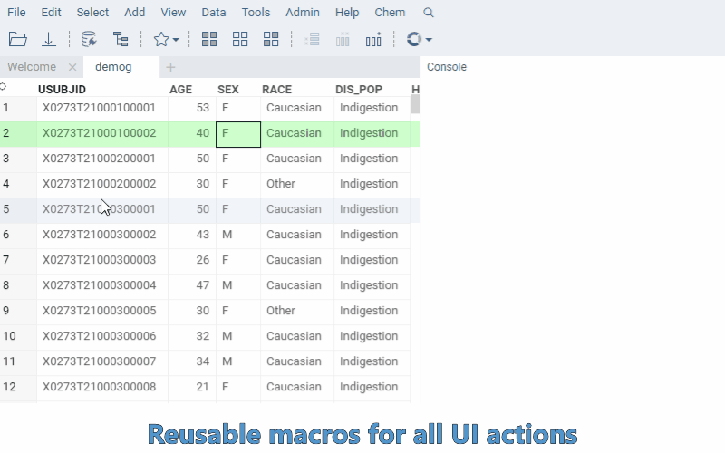

Function Call is a result of executing a <!--data job
, -->[data query](../../../access/access.md#data-query),
[script](../../../compute/scripting/scripting.mdx), or any other [function](functions.md).

## Data

Each function call contains the following data:

* Function
* User that triggered job execution
* Started on
* Completed on
* Status
* Runs produced as a result of executing child actions.

## Access control

Connections are first-class entities in the Datagrok platform, and as such are subjects to the standard checks and
routines performed against them whenever they are used in the specific context. Some of the most popular privileges
are: `view`, `edit`, `delete`, and `share`. Those privileges can be given to individual users, or
to [groups](../../../govern/access-control/users-and-groups#groups). For more information on the access privilege model, check
out [privileges](../../../govern/access-control/access-control.md#permissions).

Those privileges can be given to individuals or to groups (which can be defined via dynamic filters)
. For more information on the access privilege model, refer to the Datagrok - Access Privileges page.

## Filtering

You can use these fields to filter action runs with [smart search](../../../visualize/table-view-1.md#search):

| Field       | Description                                 |
|-------------|---------------------------------------------|
| ID          |                                             |
| name        |                                             |
| action      | [Func](functions.md) object                 |
| childRuns   | list of [FuncCall](function-call.md) object |
| parentRun   | [FuncCall](function-call.md) object         |
| status      |                                             |
| started     |                                             |
| finished    |                                             |
| createdOn   |                                             |
| updatedOn   |                                             |

## Macro recording

Every UI action (filtering, sorting, selecting columns, etc.) corresponds to a function call. The [Console](../../navigation/navigation.md#console) automatically logs these call, allowing you to:

* examine which functions were triggered by UI events
* copy commands into a script or pipelines 
* reproduce, audit, and debug your workflow (especially helpful for custom [package](../../../develop/develop.md#packages) functions).

See also:

* [Data connection](../../../access/access.md#data-connection)
* [Data query](../../../access/access.md#data-query)
