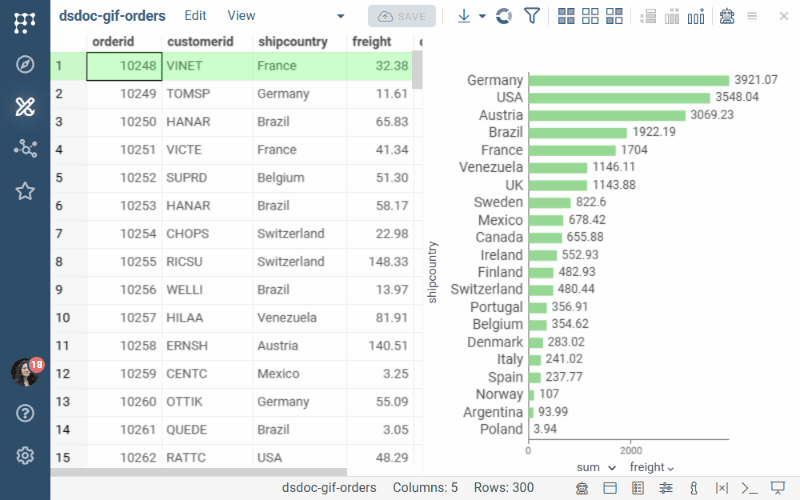

Datagrok stores both dashboards and [spaces](space.md) as projects. A space is
a project that organizes other entities, like a folder. A dashboard is a
project that holds data (one or more [tables](../table.md)) together with
the visualizations applied to it (a [layout](../../../visualize/view-layout.md)).
Data and layout are separate entities, which lets a dashboard refresh its
data without losing its visuals, lets you apply the same layout to a
different dataset, and lets each user keep personal customizations without
changing what others see.

This page covers the whole lifecycle of a dashboard: creating, saving,
refreshing, sharing, changing, versioning, and retiring it. To learn how to
connect to a database and write the queries that feed a dashboard, see
[Databases](../../../access/databases/databases.md).

## Creating a dashboard

To create a dashboard, follow these steps:

1. Open a table to access the [Table View](../../../visualize/table-view-1.md). The
   table can come from a [file](../../../access/files/files.md), a
   [database query](../../../access/databases/databases.md#running-queries),
   a [script](../../../compute/scripting/scripting.mdx), or any other
   [function](../functions/functions.md).
1. In the **Table View**, you can:
   * Add [viewers](../../../visualize/viewers/viewers.md) to visualize your data
   * [Transform data](../../../transform/transform.md) as needed
   * [Add filters](../../../visualize/table-view-1.md#filters-viewer)
   * Customize the grid, such as [color-coding grid columns](../../../visualize/viewers/grid.md#color-code-columns)
   * Optionally, add data from other tables. See [Multiple tables](#multiple-tables).
1. [Save](#saving-a-dashboard) your dashboard.

Until you save, everything you do stays in your browser's memory. If you close
or refresh the browser tab, unsaved work is lost.

:::note developers

You can also create projects programmatically. See the
[Project](https://datagrok.ai/api/js/dg/classes/Project) class in the JS API
and the [upload data](../../../develop/how-to/data/upload-data.md) how-to.

:::

## Multiple tables

A dashboard can hold several tables. Every open table is listed in the
**Tables** panel (<kbd>Alt + T</kbd>) and in the **Dashboards** panel on the
**Sidebar** (see [Unsaved work](../../navigation/views/browse.md#unsaved-work)),
and each table has its own Table View. To bring them together, you can:

* [Link tables](../../../transform/link-tables.md), so that the current row,
  selection, or filter in one table drives the other. This is how
  master-detail and drill-down views work.
* [Join tables](../../../transform/link-tables.md#joining-or-linking) into one
  when you need a single flat table to chart.
* Point a viewer at another table. A Table View belongs to one table, but any
  viewer in it can show a different open table: click the viewer's **Gear**
  icon and, in the **Context Panel** under **Data**, change **Table**. With
  **Row Source** set to **Filtered** or **Selected**, such a viewer shows only
  the rows that a link selects, which is how a chart of the details sits next
  to the master grid. See
  [Viewers as filters](../../../visualize/table-view-1.md#viewers-as-filters).
* Show linked rows [inside the grid](../../../visualize/viewers/grid.md#data-from-linked-tables)
  instead of in a separate view.
* Fetch details on demand with the
  [Database Explorer](../../../access/databases/databases.md#database-explorer)
  or [data enrichment](../../../access/databases/databases.md#data-enrichment)
  instead of loading them.
* Add [several views](../../../visualize/table-view-1.md#multiple-views) of
  one table (right-click the table and select **Add View**), each with its
  own layout. All views of a table share the filter and selection.

For a live example of linked tables, open the **Table Linking** demo under
**Data Access** in the [demo app](https://public.datagrok.ai/apps/Tutorials/Demo/Data-Access/Table-Linking).
For a step-by-step multi-table dashboard on the Northwind database, see the
[worked example](../../../transform/link-tables.md#cascading-links) on the
Link tables page.

When you save, the **Save project** dialog lists all open tables.
Links between tables and viewers that point at other tables are saved with
the project. For a multi-table dashboard, keep these points in mind:

* **Data sync is set per table.** A live query table next to a static
  reference table is a common combination.
* **Dependencies between tables are preserved.** If one table is derived from
  another (for example, a join of two query results), Datagrok records the
  order in which they were produced and replays it. Static tables load first,
  and then the creation scripts run in the order they were recorded.
* **Tables from other projects can be linked or cloned.** A table you opened
  from another dashboard is saved either as a _link_ (a read-only reference
  that follows the original) or as a _clone_ (an independent copy).
  Recipients of your dashboard can read a linked table even if they can't
  see the project it comes from.

## Saving a dashboard

To save, click the **SAVE** button at the top of the screen. This opens the
**Save project** dialog.

For a new dashboard, enter a name and, optionally, a description. New
dashboards are saved to your personal space under **My stuff** in
[Browse](../../navigation/views/browse.md). You can
move them to a shared space later.

For an existing dashboard, the dialog lists all open tables. Remove the ones
you don't want in the project, and then choose how to save:

* **Save original project**: Overwrites the project on the server. Choose it
  when you own the dashboard and want to publish the change to everyone.
* **Save a copy**: Creates a new project. For each table, you choose whether
  to **Move** it, **Link** it if the copy should keep showing the same data as
  the original, or, for a table that is already on the server, **Clone** it to
  make the copy independent. Choose this option when you want a variant, a
  "version", or when you don't have the privilege to edit the original.
* **Save personal view customizations**: Saves your layout changes for you
  only. The layout others see doesn't change. Choose it when you want a
  different arrangement of viewers without affecting the team.

:::note

Without the privilege to edit the dashboard, you can't save the original
project, but you can still save a copy under your own name or keep personal
view customizations that nobody else sees.

:::

When you save the original project or a copy, the dialog offers two more
settings:

* **Data sync**, set per table, decides where the data comes from when the
  dashboard opens. When it is on, the table's creation script runs again.
  When it is off, the dashboard shows the snapshot saved with it. New
  dashboards have Data sync on for every table that has a creation script,
  so turn it off for a table that should keep a snapshot. See [Data sync](#data-sync).
* **Presentation mode** hides the sidebar, menus, ribbons, toolbox, and
  status bar when the dashboard opens. Use it for dashboards meant for data consumers
  rather than analysts. A viewer can switch back by clicking the **Design
  mode** link at the top right.

After a successful save, the **SAVE** button turns grey, indicating that there
are no unsaved changes. You can still click it to open the dialog again, for
example to save a copy or personal customizations.

## Data sync

Tables created from queries, scripts, or files on a file share have a
_creation script_ that records how the table was created and what was done
to it afterwards. You can see it in the **Save project** dialog under
**CREATION SCRIPT**. With the edit privilege, you can view and edit the
script in the **Context Panel** > **Advanced** > **Creation scripts**.

:::note

If a dashboard fails to open, Datagrok offers to edit its creation script so
that the dashboard can be opened.

:::

**Data sync** determines whether the creation script is run when the
dashboard opens. When enabled, the dashboard stores the script and runs it
each time, so the data can be refreshed from the source (a dynamic
dashboard). When disabled, the dashboard stores the current data instead and
does not need access to the source when opened (a static dashboard).

:::note

The only table that can't be saved with Data sync is one opened from a local
file on your computer: Datagrok has no way to open that file again on its
own. To sync such data, put the file on a file share and open it from there.

:::

Static and dynamic dashboards compared

| | Data sync **off** (static) | Data sync **on** (dynamic) |
|---|---|---|
| What is stored | The data itself. The creation script is dropped | The creation script only. No data is uploaded |
| What happens on open | Opens immediately with the data as of the last save | Runs the creation script, then applies the layout to the fresh result |
| How current the data is | As old as the last save | Always current |
| Open time | Fast | Depends on the query and the database |
| Works if the source is unavailable | Yes | No. The dashboard stays on the loading spinner or fails to open |
| Parameters | Fixed at save time | Users can change query parameters under **Toolbox** > **Source** and refresh |
| What recipients need | Access to the dashboard | Access to the dashboard and to the database connection behind the query |

Because the switch is per table, one dashboard can combine both modes, for
example a live query table joined to a static reference table.

Choose dynamic for operational dashboards that must show current data, and
static for reports and for audiences that can't be given access to the
source.

## Sharing a dashboard

Saving a dashboard doesn't share it. A new dashboard is visible only to you
until you share it explicitly.

To share a dashboard, right-click it in Browse
and select **Share...** (you can also do this from the **Context Panel**).
In the dialog, enter users, groups, or email addresses, choose the privilege,
and click **OK**. For the general procedure, see
[Share](../../navigation/basic-tasks/basic-tasks.md#share).

:::tip

Share with [groups](../../../govern/access-control/users-and-groups.md#groups)
rather than with individual users where you can. When the team changes, you
update the group instead of re-sharing every dashboard.

:::

### What recipients get

Sharing a dashboard gives recipients access to everything saved with it:
the tables, the layout, and, for a dashboard saved with Data sync on, the
queries and scripts used to load its tables, as well as the file connections
they depend on. Recipients can re-run a query or script or re-read a file
through the dashboard without separate permissions. These dependencies don't
appear as separately shared entities in Browse.

Database connections work differently. The query is saved with the
dashboard, but the database connection it uses is not. Recipients must have
**View and use** permission on the connection to run the query. Demo and
team connections are usually shared already. A private connection must be
shared separately.

<!-- GIF TODO: img/dashboard-share-sources.gif
Two browser windows side by side. Left: the author shares a dashboard built on a query
over a private connection. Right: the recipient opens it and the page stays on the loading
spinner. Left: the author shares the connection. Right: the recipient reloads and the
dashboard opens with data. 800x500, ~20 s. -->
<!--  -->

The simplest way to align these permissions is to put the dashboard and its
sources in one [space](space.md) and share that instead. Privileges granted
on a space cascade to everything in it, child spaces inherit them from the
root, and new queries saved there are shared automatically. This is easier
to maintain than sharing dashboards and connections one by one.

### Sharing by link

Every dashboard has a URL. Anyone who already has permission to open the
dashboard can use the URL, but the URL itself does not grant access.

For a dynamic dashboard based on a parameterized query, the URL also
includes the current parameter values. Change the values in **Toolbox** >
**Source**, then copy the updated URL to share that configuration. The
recipient opens the same dashboard with those parameter values, so you can
share different configurations without creating copies.

:::note developers

You can [define custom URL parameters](../../../develop/advanced/url-parameters.md#project-parameters)
for a project and map them to the query's parameters.

:::

## Editing a dashboard

You can edit a dashboard in two ways: change its layout or the data behind
it.

### Editing the layout

Open the dashboard, rearrange or reconfigure the viewers, and click **SAVE**.
Then choose:

* **Save original project** to publish the change to everyone
* **Save personal view customizations** to keep it to yourself
* **Save a copy** to leave the original untouched

If the layout is worth reusing on other datasets, also save it to the gallery
(**View** > **Layout** > **Save to Gallery**). Layouts are independent
entities, and a saved layout applies to any table whose columns match by name
or semantic type. To learn more, see [Layout](../../../visualize/view-layout.md).

### When the source changes

Editing the query or script behind a dynamic dashboard changes what the
dashboard shows the next time it opens. Renaming the query is safe, because
Datagrok rewrites the creation script with the new name. Changing the
query's output is where dashboards can break.

What happens when the query output changes

| Change in the source | Effect on the dashboard |
|---|---|
| A new column | Appears in the grid. Existing viewers are unaffected |
| A column renamed or removed | Viewers bound to it show a placeholder with the missing column name. The dashboard opens |
| A column removed that a calculated column uses | The dashboard opens with a warning, and the calculated column is empty |
| A column removed that a recorded step on the result uses, such as a deleted or renamed column | A **Data loading error** dialog lists the failed step. After **Open anyway**, the rest of the data loads |
| The query deleted | The dashboard fails to open with an error. A new query with the same name on the same connection repairs it |
| The column order changed | Cosmetic. The grid restores the saved column order by name |

## Versioning

Datagrok doesn't keep a history of dashboard versions. Every **Save original
project** overwrites the previous state, including changes that others saved
in the meantime, without a warning (see also
[Local copy and server copy](../../navigation/views/browse.md#local-copy-and-server-copy)
on the Browse page). The following
practices serve as version control:

* **Save a copy before a risky change.** Click **SAVE** > **Save a copy**
  before restructuring a dashboard the team depends on, and give the copy a
  name that states its purpose, for example `Assay QC (2026-09 rework)`. Once
  the change is accepted, share the copy and retire the original.
* **Snapshot what must not change.** For a report, a review package, or
  anything that has to be reproducible, save with Data sync **off**. The data
  is frozen together with the layout. A dynamic dashboard can't be reproduced
  later.
* **Keep the layout in the gallery.** **View** > **Layout** > **Save to
  Gallery** stores the layout as a separate entity, so you can reapply it
  after a bad edit or to a new dataset. **View** > **Layout** > **Download**
  stores it locally as a file.
* **Record the state in the description.** The project description is the
  place to note what changed and why. Recipients see it in Browse and in the
  share notification.
* **Prefer copies over edits when you don't own the dashboard.** Recipients
  with the **View and use** privilege can always save a copy and continue
  working without touching the original.

## Retiring

To take a dashboard out of a space without destroying it,
[move it](space.md#moving-entities-between-spaces) to another space, for
example to your **My stuff**. Nothing stays behind in the original space. If
the team should still see the dashboard there, use **Link** instead of
**Move**.

To delete a dashboard, right-click it in Browse and select **Delete Project**.

:::danger

Deleting removes the dashboard for all users and can't be undone. Tables
and views owned by the dashboard are deleted with it. Linked tables and the
queries the dashboard uses are not deleted, because they belong to other
entities.

:::

Before deleting, check whether other dashboards link to its tables. A linked
table is marked with a link icon (<FAIcon icon="fa-solid fa-link" size="1x"/>)
in Browse.

## Resources

YouTube videos:

<iframe src="https://www.youtube.com/embed/TtVjvxMj9Ds?si=8J08Iqbigx2RtR9T" title="YouTube video player" width="512" height="288" frameborder="0" allow="accelerometer; autoplay; clipboard-write; encrypted-media; gyroscope; picture-in-picture; web-share" allowfullscreen></iframe>
  

    <h2 class="card-title">Dynamic Dashboards</h2>
    
Building dynamic dashboards using database queries

  

See also:

* [Spaces](space.md)
* [Link tables](../../../transform/link-tables.md)
* [Layout](../../../visualize/view-layout.md)
* [Databases](../../../access/databases/databases.md)
* [Access control](../../../govern/access-control/access-control.md)
