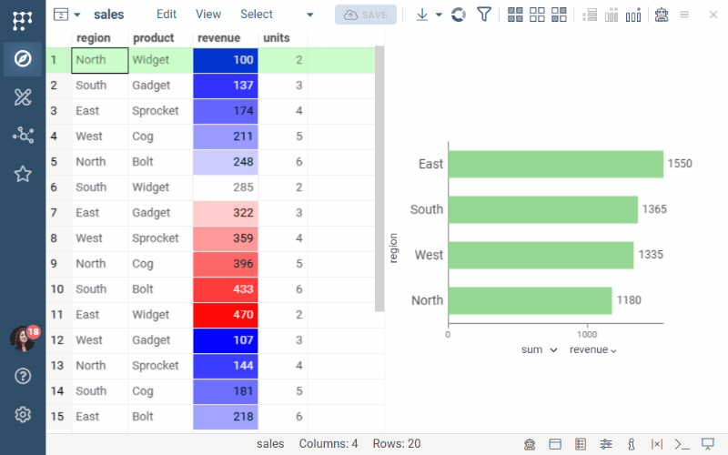
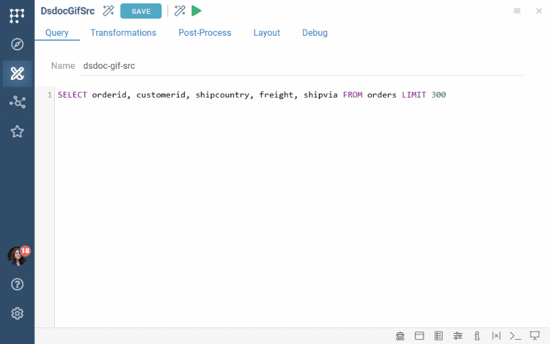

Datagrok stores both dashboards and [spaces](space.md) as projects. A space is
a project that organizes other entities, like a folder. A dashboard is a
project that holds data (one or more [tables](../table.md)) together with the
visualizations applied to it (a [layout](../../../visualize/view-layout.md)).
Data and layout are separate entities, which lets a dashboard refresh its
data without losing its visuals, lets you apply the same layout to a
different dataset, and lets each user keep personal customizations without
changing what others see.

This page covers the whole lifecycle of a dashboard: creating, saving,
refreshing, sharing, changing, versioning, and retiring it. To learn how to
connect to a database and write the queries that feed a dashboard, see
[Databases](../../../access/databases/databases.md).

## Creating a dashboard

To create a dashboard, follow these steps:

1. Open a table to access the [Table View](../../../visualize/table-view-1.md). The
   table can come from a file, a [database query](../../../access/databases/databases.md#running-queries),
   a script, or any other [function](../functions/functions.md).
1. In the **Table View**, you can:
   * Add [viewers](../../../visualize/viewers/viewers.md) to visualize your data
   * [Transform data](../../../transform/transform.md) as needed
   * [Add filters](../../../visualize/table-view-1.md#select-and-filter)
   * Customize the grid, such as [color-coding grid columns](../../../visualize/viewers/grid.md#color-code-columns)
   * Optionally, add data from other tables. See [Multiple tables](#multiple-tables).
1. [Save](#saving-a-dashboard) your dashboard.

Until you save, everything you do stays in your browser's memory. If you close
or refresh the browser tab, unsaved work is lost.

:::note developers

You can also create projects programmatically. See the
[Project](https://datagrok.ai/api/js/dg/classes/Project) class in the JS API
and the [upload data](../../../develop/how-to/data/upload-data.md) how-to.

:::

## Multiple tables

A dashboard can hold several tables. Every open table is listed in the
**Table Manager** (<kbd>Alt + T</kbd>) and under **Scratchpad** in
[Browse](../../navigation/views/browse.md), and each table has its own Table
View. To bring them together, you can:

* Show another table in a viewer (**Gear** icon > **Data** > **Table**). See
  [Viewers as filters](../../../visualize/table-view-1.md#viewers-as-filters).
* [Link tables](../../../transform/link-tables.md), so that the current row,
  selection, or filter in one table drives the other. This is how
  master-detail and drill-down views work.
* [Join tables](../../../transform/link-tables.md#joining-or-linking) into one
  when you need a single flat table to chart.
* Show linked rows [inside the grid](../../../visualize/viewers/grid.md#data-from-linked-tables)
  instead of in a separate view.
* Fetch details on demand with the
  [Database Explorer](../../../access/databases/databases.md#database-explorer)
  or [data enrichment](../../../access/databases/databases.md#data-enrichment)
  instead of loading them.
* Add [several views](../../../visualize/table-view-1.md#multiple-views) of
  one table (**Table** > **Add View**), each with its own layout. All views of
  a table share the filter and selection.

For a live example of linked tables, open the **Table Linking** demo under
**Data Access** in the [demo app](https://public.datagrok.ai/apps/Tutorials/Demo/Data-Access/Table-Linking).
For a step-by-step multi-table dashboard on the Northwind database, see the
[worked example](../../../transform/link-tables.md#worked-example) on the
Link tables page.

When you save, the **Save project** dialog lists all open tables and views.
Links between tables and viewers that point at other tables are saved with
the project. For a multi-table dashboard, keep these points in mind:

* **Data sync is set per table.** A live query table next to a static
  reference table is a common combination. See [Data sync](#data-sync).
* **Dependencies between tables are preserved.** If one table is derived from
  another (for example, a join of two query results), Datagrok records the
  order in which they were produced and replays it. Static tables load first,
  and then the generation scripts run in the order they were recorded.
* **Tables from other projects can be linked or cloned.** A table you opened
  from another dashboard is saved either as a **Link** (a read-only reference
  that follows the original) or as a **Clone** (an independent copy).
  Recipients need the **View and use** privilege on the original project to
  see a linked table.

## Saving a dashboard

To save, click the **SAVE** button at the top of the screen. This opens the
**Save project** dialog.

For a new dashboard, enter a name and, optionally, a description. New
dashboards are saved to your personal space under **My stuff** in
[Browse](../../navigation/views/browse.md). You can
[move them to a shared space](space.md#moving-entities-between-spaces) later.

For an existing dashboard, the dialog lists all open tables. Remove the ones
you don't want in the project, and then choose how to save:

| Option | What it does | When to use it |
|---|---|---|
| **Save original project** | Overwrites the project on the server | You own the dashboard and want to publish the change to everyone |
| **Save a copy** | Creates a new project. For each table, you choose **Clone** (an independent copy) or **Link** (a read-only reference to the original table) | You want a variant, a "version", or you don't have the privilege to edit the original |
| **Save personal view customizations** | Saves your layout changes for you only. The layout others see doesn't change | You want a different arrangement of viewers without affecting the team |

The options available to you depend on your privilege on the dashboard:

| Your privilege | Save original project | Save a copy | Save personal view customizations |
|---|---|---|---|
| **Full access** (or you are the author) | Yes | Yes | Yes |
| **View and use** | No | Yes | Yes |

This means that a recipient with the **View and use** privilege can still keep
working on a shared dashboard, either by saving a copy under their own name or
by keeping personal customizations that nobody else sees. Neither option
changes what the author published.

When you save the original project or a copy, the dialog offers two more
settings:

* **Data sync**, set per table, decides whether the dashboard stores a snapshot
  of the data or re-runs the source each time it opens. For a new dashboard,
  it is on by default for every table that has a generation script, so a
  snapshot is what you get only if you turn it off. See [Data sync](#data-sync).
* **Presentation mode** hides the toolbox, menus, ribbons, and context panels
  when the dashboard opens. Use it for dashboards meant for data consumers
  rather than analysts. A viewer can switch back by clicking the **Design
  mode** link at the top right.

After a successful save, the **SAVE** button turns grey, indicating that there
are no unsaved changes. You can still click it to open the dialog again, for
example to save a copy or personal customizations.

## Data sync

Whenever a table is produced by a function (a database query, a script, or a
file import followed by transformations), Datagrok records how it was produced
as the table's _generation script_. The **Data sync** switch in the **Save
project** dialog determines what the dashboard stores:

| | Data sync **off** (snapshot) | Data sync **on** (dynamic) |
|---|---|---|
| What is stored | The data itself, plus the generation script for lineage | The generation script only. No data is uploaded |
| What happens on open | Opens immediately with the data as of the last save | Re-runs the source, then applies the layout to the fresh result |
| Freshness | The data is as old as the last save | The data is always current |
| Open time | Fast | Depends on the query and the database |
| Works if the source is unavailable | Yes | No. The dashboard stays on the loading spinner or fails to open |
| Parameters | Fixed at save time | Users can change query parameters under **Toolbox** > **Source** and refresh |

A snapshot dashboard needs nothing but the dashboard itself, whereas a
dynamic dashboard also needs its recipients to reach the database connection
behind the query (see [What recipients need](#what-recipients-need)), and it
is sensitive to changes in the source: renamed or removed columns can break
viewers or the project (see [Changing the source](#changing-the-source)).

Choose Data sync **on** for operational dashboards that must show current
data. Choose Data sync **off** for reports, for snapshots you need to keep as
they were, and for dashboards whose audience can't be given access to the
source.

Because the switch is per table, one dashboard can combine both modes. A
common pattern is a live query table joined to a static reference table.
Datagrok loads static tables first and then runs the generation scripts in
the order they were recorded, so a dynamic table can depend on a static one.

:::caution

Two things silently disable Data sync. A query whose name contains a dash
(such as `assay-results`) can't be resolved by the generation script, and the
dashboard fails to load its data on open, so name queries with letters,
digits, and underscores only. And renaming a table after you opened it drops
its generation script, so the **Save project** dialog offers no **Data sync**
switch for it. Rename the query or the file instead, before opening.

:::

### Files as a source

Data sync applies to files as well as to queries. When you open a file from a
[file share](../../../access/files/files.md) (such as S3, Azure, SharePoint, or
a network drive) by double-clicking it in the Browse tree, Datagrok records a
generation script for it, and a dashboard saved with Data sync on re-reads the
file every time it opens. A file opened in another way (for example, from a
script) has no generation script, and the **Save project** dialog shows no
**Data sync** switch for it.

For example, suppose a lab instrument exports `plate-reader/2026-09/results.csv`
to a shared S3 bucket every night. You open the file from **Browse** >
**Files**, build a dashboard on it, and save the dashboard with Data sync on.
When tonight's export replaces the file, anyone who opens the dashboard
tomorrow sees the new rows with the same viewers, filters, and color coding,
without anyone re-uploading anything. To learn more, see
[Creating dynamic dashboards from files](../../../access/files/files.md#creating-dynamic-dashboards-from-files).

Two things determine how quickly a changed file shows up in the dashboard:

* **The file share cache.** If the connection caches file content, the
  dashboard reads the cached copy until the cache is flushed. This happens on
  the cache's cron schedule, manually with the **Clear cache** command on the
  connection, or on every read when **Preflight** is enabled. See
  [Caching](../../../access/files/files.md#caching).
* **The file path.** The generation script references the file by its path.

:::caution

Renaming or moving a file that a dynamic dashboard reads breaks the
dashboard. Replace the file in place, or keep a stable name such as
`results-latest.csv`.

:::

The same rules apply to files stored in a [space's](space.md) file storage.

### Refreshing data

With Data sync on, the data is refreshed every time the dashboard opens. To
refresh it without reopening the dashboard, or to change the query
parameters, use the **Source** pane on the **Toolbox**. With Data sync off,
the same pane lets you re-run the source manually, provided you have access
to it. Refreshing changes only what you see. The saved dashboard is updated
when you click **SAVE**.

## Sharing a dashboard

Saving a dashboard doesn't share it. A new dashboard is visible only to you
until you share it explicitly.

To share a dashboard, right-click it in [Browse](../../navigation/views/browse.md)
and select **Share...** (you can also do this from the **Context Panel**).
In the dialog, enter users, groups, or email addresses, choose the privilege,
and click **OK**. For the general procedure, see
[Share](../../navigation/basic-tasks/basic-tasks.md#share).

| Privilege | What the recipient can do |
|---|---|
| **View and use** | Open the dashboard, interact with it, download data, and save a copy |
| **Full access** | Everything above, plus save the original project, rename, delete, and share it further |

Share with [groups](../../../govern/access-control/users-and-groups.md#groups)
rather than with individual users where you can. When the team changes, you
update the group instead of re-sharing every dashboard.

Recipients get an in-app notification (or an email, if you entered an email
address) with a link, and the dashboard appears under **Browse** >
**Dashboards** for them. A dynamic dashboard opens for them with the query
parameters that were in effect when it was saved, and they can change the
parameters in the **Source** pane on the **Toolbox**.

### What recipients need

Permissions granted on a project cascade to everything the project contains.
When you save a dashboard with Data sync on, the **Save project** dialog
lists the query, script, or file connection each table depends on ("Some
tables require this data query for data sync") and saves it as part of the
dashboard. Sharing the dashboard therefore lets recipients re-run the query
or script and re-read the file, even though no separate permission appears
on those entities and they don't show up in the recipient's Browse tree.
What is not saved with the dashboard is the database connection behind a
query:

| Source of a table | Covered by sharing the dashboard | What to share separately |
|---|---|---|
| Stored snapshot (Data sync off) | Yes | Nothing |
| Database query (Data sync on) | The query, yes. The database connection, no | The connection, with the **View and use** privilege, unless it is already shared with the recipients (demo and team connections usually are) |
| Script (Data sync on) | Yes | Nothing, unless the script itself reads from a connection the recipients can't access |
| File in a file share (Data sync on) | Yes, for reading the file through the dashboard | The folder, if recipients should also browse it under **Files**. See [File sharing](../../../access/files/files.md#file-sharing-and-access-control) |
| Linked table owned by another project | No | That project, with the **View and use** privilege |

:::note

A recipient who can't reach the database connection doesn't get an error.
The dashboard never finishes loading: the page stays on the loading spinner
with no message, and the only trace is a "connection not found" entry in the
browser console. When a colleague reports a dashboard that never opens,
check the connection first.

:::

<!-- GIF TODO: img/dashboard-share-sources.gif
Two browser windows side by side. Left: the author shares a dashboard built on a query
over a private connection. Right: the recipient opens it and the page stays on the loading
spinner. Left: the author shares the connection. Right: the recipient reloads and the
dashboard opens with data. 800x500, ~20 s. -->
<!--  -->

The simplest way to keep these permissions aligned is to keep the dashboard
and its sources in one [space](space.md) and to share the space. Space
permissions cascade to everything in it, child spaces inherit the privileges
of their root space, and new queries saved into the space are shared
automatically. This is easier to maintain than sharing dashboards and
connections one by one.

### Sharing by link

Every dashboard has a URL. Sending the URL is enough for anyone who already
has the privilege to open the dashboard, but the URL itself doesn't grant
anything. See [Share](../../navigation/basic-tasks/basic-tasks.md#share).

A query result also has a URL that re-executes the query, parameters
included, without a saved project. Use it for ad hoc sharing when a layout
is not needed. See
[Sharing query results](../../../access/databases/databases.md#sharing-query-results).

### Embedding

You can embed a saved dashboard, or a single viewer, into an external site as
an iframe. Embedded views remain fully interactive and maintain the
connection with the data from which they were created.

How to embed a view

1. Open your project.
1. In the **Table View**'s **Top Menu**, click the **Hamburger** icon and select
   **Embed...** This opens an **Embed** dialog.
1. From the dialog, copy the generated iframe and use it on your site.

Viewers of the embedded page still need a Datagrok account with access to
the dashboard.

## Changing a dashboard

### Changing the layout

Open the dashboard, rearrange or reconfigure the viewers, and click **SAVE**.
Then choose **Save original project** to publish the change to everyone,
**Save personal view customizations** to keep it to yourself, or **Save a
copy** to leave the original untouched.

If the layout is worth reusing on other datasets, also save it to the gallery
(**View** > **Layout** > **Save to Gallery**). Layouts are independent
entities, and a saved layout applies to any table whose columns match by name
and type. To learn more, see [Layout](../../../visualize/view-layout.md).

### Changing the source

Editing the query or script behind a dynamic dashboard changes what the
dashboard shows the next time it opens. Renaming the query is safe, because
Datagrok rewrites the generation script with the new name. Changing the
query's output is where dashboards break:

| Change in the source | Effect on the dashboard |
|---|---|
| A new column | Appears in the grid. Existing viewers are unaffected |
| A column renamed or removed | Viewers bound to it show a placeholder with the missing column name. The dashboard opens |
| A column removed that a recorded transformation step or a vector formula references | The project can fail to open |
| The query deleted | The dashboard fails to open with an error |
| The column order changed | Cosmetic. The grid restores the saved column order by name |

To keep dynamic dashboards robust:

* Keep column names stable. Layouts bind to columns by name.
* Add derived metrics as [calculated columns](../../../transform/add-new-column.md)
  with a scalar formula such as `${a} / ${b}`. Such a column is recorded in
  the generation script like any other step, but when its input disappears
  it shows a warning and the dashboard opens. A transformation step, or a
  formula that calls a vector function on a whole column, stops the project
  from opening instead. See [Where to put the logic](../../../transform/query-transformations.md#where-to-put-the-logic).
* Test a source change by opening the dashboard yourself before the audience
  does.
* Never delete a query or script that a dashboard uses. Deletion is permanent
  and affects all users.

## Versioning

Datagrok doesn't keep a history of dashboard versions. Every **Save original
project** overwrites the previous state (see also
[Version control](../../navigation/views/browse.md#version-control) on the
Browse page, about how the local copy relates to the server). The following
practices serve as version control:

* **Save a copy before a risky change.** Click **SAVE** > **Save a copy**
  before restructuring a dashboard the team depends on, and give the copy a
  name that states its purpose, for example `Assay QC (2026-09 rework)`. Once
  the change is accepted, share the copy and retire the original.
* **Snapshot what must not change.** For a report, a review package, or
  anything that has to be reproducible, save with Data sync **off**. The data
  is frozen together with the layout. A dynamic dashboard can't be reproduced
  later.
* **Keep the layout in the gallery.** **View** > **Layout** > **Save to
  Gallery** stores the layout as a separate entity, so you can reapply it
  after a bad edit or to a new dataset. **View** > **Layout** > **Download**
  stores it locally as a file.
* **Record the state in the description.** The project description is the
  place to note what changed and why. Recipients see it in Browse and in the
  share notification.
* **Prefer copies over edits when you don't own the dashboard.** Recipients
  with the **View and use** privilege can always save a copy and continue
  working without touching the original.

## Retiring

To take a dashboard out of a space without destroying it,
[move it](space.md#moving-entities-between-spaces) to another space, for
example to your **My stuff**. Note that moving leaves a view-only linked copy
in the original space, so the team still sees the dashboard there. To remove
that trace as well, move the linked copy too, or delete the dashboard.

To delete a dashboard, right-click it in Browse and select **Delete...**

:::danger

Deleting removes the dashboard for all users and can't be undone. Tables
and views owned by the dashboard are deleted with it. Linked tables and the
queries the dashboard uses are not deleted, because they belong to other
entities.

:::

Before deleting, check whether other dashboards link to its tables. A linked
table is marked with a **Link** (<FAIcon icon="fa-solid fa-link" size="1x"/>)
icon in Browse.

## Troubleshooting

A shared dashboard never finishes loading for a colleague

The colleague can't access the database connection behind a query. See
[What recipients need](#what-recipients-need).

The dashboard fails to open after a query change

Either the query was deleted, or a recorded transformation step or a formula
references a column that the query no longer returns. A deleted query can't
be restored, so recreate it under the same name. For a missing column,
restore it in the query, or open the query in the **Query Editor**, go to the
**Transformations** tab, and remove or edit the step. See
[Query transformations](../../../transform/query-transformations.md).

The column order changed after a refresh

The grid restores the saved column order by column name. If the dashboard has
more than 1,000 columns, the order is not saved and follows the query output.
Pivoted results also order new columns by the order in which they first
appear in the data. For a stable order with many columns, sort in the query.

## Resources

YouTube videos:

<iframe src="https://www.youtube.com/embed/TtVjvxMj9Ds?si=8J08Iqbigx2RtR9T" title="YouTube video player" width="512" height="288" frameborder="0" allow="accelerometer; autoplay; clipboard-write; encrypted-media; gyroscope; picture-in-picture; web-share" allowfullscreen></iframe>
  

    <h2 class="card-title">Dynamic Dashboards</h2>
    
Building dynamic dashboards using database queries

  

See also:

* [Dashboard lifecycle](../../solutions/workflows/dashboard-lifecycle.md) (end-to-end workflow)
* [Work with connected datasets](../../solutions/workflows/connected-datasets.md)
* [Spaces](space.md)
* [Link tables](../../../transform/link-tables.md)
* [Layout](../../../visualize/view-layout.md)
* [Databases](../../../access/databases/databases.md)
* [Access control](../../../govern/access-control/access-control.md)
