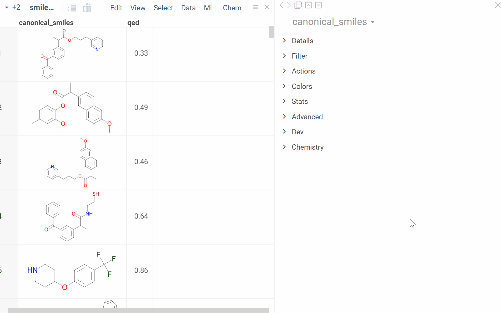
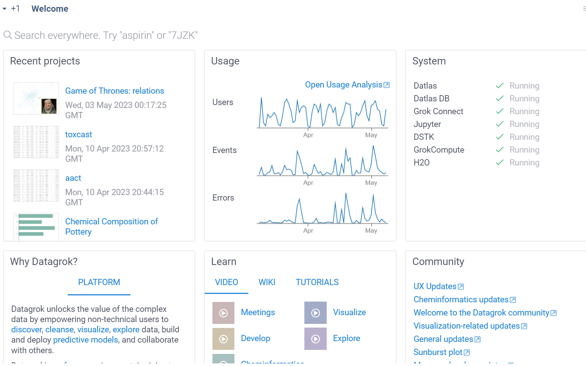
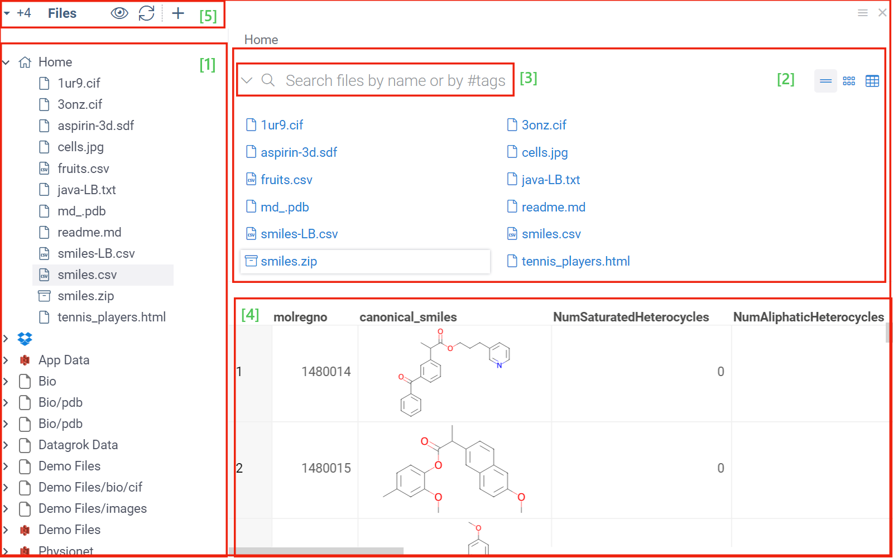
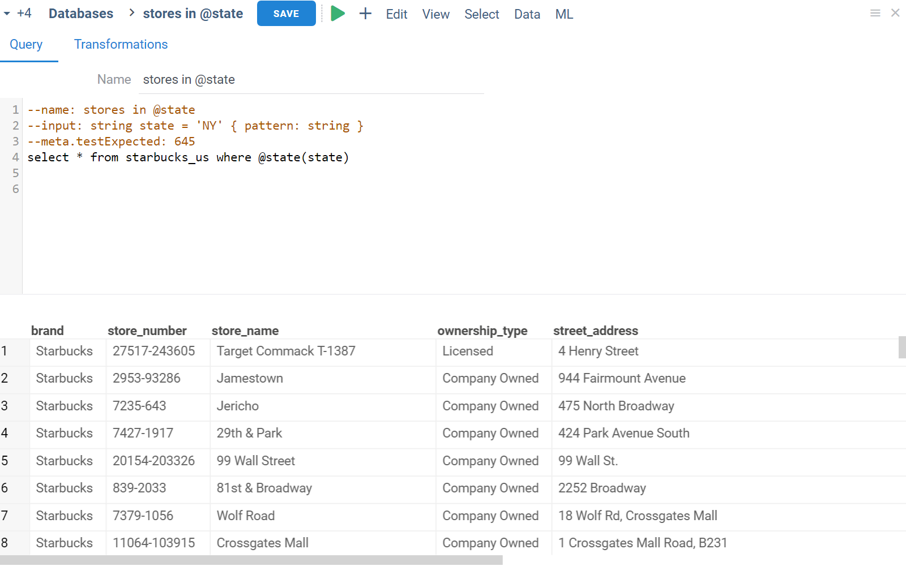
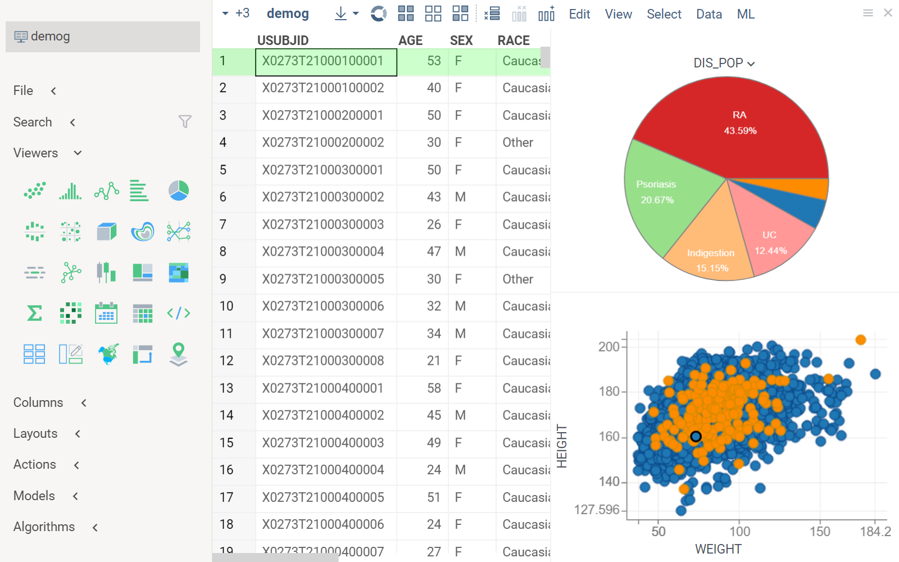
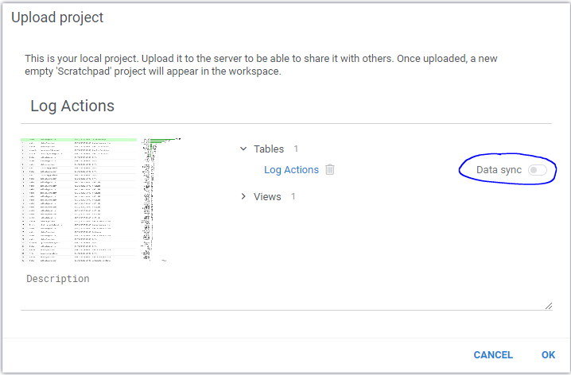
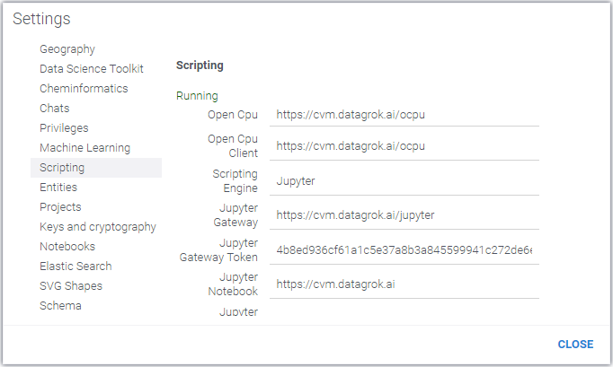

# Getting started

```mdx-code-block
import Tabs from '@theme/Tabs';
import TabItem from '@theme/TabItem';
```

Intro

Signup


## Key concepts

In Datagrok, dataframes (data tables), functions, entities, views, and info panes, are all interconnected and form the foundation of both the Datagrok's UI and the platform's capabilities.

### Dataframe

A _dataframe_ (also a _table_ or a _data table_) is a key component of Datagrok's in-memory data engine. Acting as an in-memory database, the dataframe loads data from the associated [data source](../access/access.md#data-sources) as soon as you open or generate it in Datagrok. Subsequent data operations, including [transformation](../transform/data-wrangling.md), [statistical computations](../explore), and [visualization](../visualize), are performed directly on the dataframe. This direct interaction allows [interactive exploration](../explore/exploratory-data-analysis.md) of big datasets - like the entire 2.7 million molecules from the ChEMBL database - right in the browser.

A dataframe has a structure similar to a table, composed of rows and named columns. These columns support various data types including `string`, `bool`, `int`, `bigint`, `double`, `qnum`, `float`, `datetime`. Unlike Excel, columns in Datagrok are strongly-typed. This means that every cell in a column belongs to the data type specified for that column.

When parsing data, Datagrok automatically annotates dataframes and dataframe columns with basic [metadata](../discover/metadata.md) like its source or import time. It also automatically detects [certain semantic (logical) types](../discover/semantic-types.md#automatic-semantic-type-detection) like a zip code or a stock ticker. [Entities](#entities) like dataframes and dataframe columns can be [tagged](../discover/tags.md) with custom metadata and logical types. This functionality is essential for [data discovery](../discover/data-augmentation.md) and extensibility of the platform.

<details>
<summary>Example: Cheminformatics capability</summary>

An underlying raw data type of a molecule is usually a `string`. Installing the [Chem package](https://github.com/datagrok-ai/public/tree/master/packages/Chem), which introduces the [semantic type](../discover/semantic-types.md) _molecule_, gives Datagrok the ability to recognize and work with molecules. For example, when you open a file with molecules represented in the SMILES format, the following happens with the Chem package installed:

* Data is parsed, and the semantic type _molecule_ is assigned to the corresponding string column.
* Molecules are automatically rendered in the spreadsheet.
* Column tooltip now shows most diverse molecules in the dataset.
* Default column filter is now a sketcher-driven substructure search.
* A top menu item labeled **Chem** appears.
* The **Context Panel** on the right shows molecule-specific [info panes](#info-panes), such as **Toxicity**, **Drug Likeness**, and others.



</details>

Dataframes are visualized in a [Table view](#table-view) using a [grid](../visualize/viewers/grid.md) viewer.

:::note developers

Datagrok's data engine runs entirely in the browser, but the same code can run on Datagrok servers for tasks like serialization. To learn how Datagrok stores and processes data and to optimize performance for large datasets, see [Performance](../develop/advanced/performance.md). For additional technical information, see [JS API: Dataframe](https://datagrok.ai/js-api/classes/dg.DataFrame).

:::

### Entities

_Entities_ are distinct classes of objects linked to _dataframes_, such as molecules, users, data connections, or function calls. All entities within a class share the same data type, data attributes, and a set of operations that can be performed on them.

<details>
<summary>Expand to see a list of entities</summary>


</details>

Entities can be defined by users or obtained programmatically using the `grok.data.getEntities`, which retrieves entities associated with a specific dataframe, and their data can be loaded from or saved to dataframes.


### Functions

Functions are a key feature of the Datagrok platform, providing a powerful mechanism for executing a wide variety of tasks. A function is a piece of code that performs a specific task. Similar to programming languages, Datagrok functions accept inputs and produce outputs. In Datagrok, functions are used to perform a wide range of operations, from querying databases and performing scientific computations to displaying user interface elements and sending emails. Almost anything that can be executed within the platform is a function. 

Typically, each function type has a special tag denoting what the function does. 

<details>
<summary>Examples</summary>

* `#app` for applications
* `#dashboard` for dashboards
* `#panel` for info panels
* `#init` for package initialization
* `#autostart` for automatic execution at platform startup
* `#semTypeDetector` for semantic types detectors
* `#cellRenderer` for custom cell renderers
* `#fileViewer` and `#fileExporter` for file viewers and exporters
* `#packageSettingsEditor` for package settings editors.

</details>

You can use these tags to search for certain functions either from the platform's interface
([https://public.datagrok.ai/functions?q](https://public.datagrok.ai/functions?q)) or programmatically.

:::note developers

<details>
<summary>To search from within code use this code snippet</summary>

```js
const applications = DG.Func.find({tags: [DG.FUNC_TYPES.APP]});
```

</details>

<details>
<summary>To disable all package functions</summary>

To disable all package functions (for debug purposes), use the
`initPackageFunctions=false` flag in the start URL, such as
`https://public.datagrok.ai?initPackageFunctions=false`.

</details>

To learn more about function roles, see [Function roles](../develop/function-roles.md)

:::


Example: Calculating Molecule Properties

To demonstrate the power of functions in Datagrok, let's look at an example. Suppose we have a dataset containing information about chemical compounds, and we want to calculate the molecular weight for each compound. We can write a simple function to perform this calculation using the built-in cheminformatics library:

```csharp

function calculateMolecularWeight(compoundTable) {
  var molWeightColumn = compoundTable.columns.addNew('Molecular Weight', DG.TYPE.FLOAT);
  for (var i = 0; i < compoundTable.rowCount; i++) {
    var compound = compoundTable.rows.get(i).compound;
    var molWeight = chem.getDescriptor(compound, 'Molecular Weight');
    molWeightColumn.set(i, molWeight);
  }
}

```

In this example, we pass in a table containing information about chemical compounds and add a new column to the table containing the calculated molecular weight. The function then loops through each row in the table, retrieves the compound information, and calculates the molecular weight using the cheminformatics library. [ADD INFO PANEL]


You can execute functions on either the client-side (in the browser) or the server-side (using a compute engine), or both.

Functions can be written in any language...

[SCRIPTING FOR NON-DEVELOPERS]

Datagrok makes it easy for non-developers to script functions using a simple syntax that anyone can learn. You can write and execute functions directly in the Datagrok Console, or create more complex scripts that can be saved and shared with others.

[FUNCTION FEATURES]

Funactions are entities, which means...

You can determine who can execute them and under what conditions. For example, you might want to restrict access to a function that deletes data or performs other sensitive operations. Function roles can be managed through the Datagrok Security Manager. See ... for details

In addition, ....

Despite the differences in functionality and execution, functions share the same features and mechanism. They are:

<details>
<summary>Findable</summary>

You can search for functions (on the **Sidebar**, click **Functions** and search by name or tag ).

</details>

<details>
<summary>Auditable</summary>

You can see who executed a function, when it was executed, and what parameters were used. In addition, you can get a table with all parameters used for a specific function.

</details>

<details>
<summary>Introspectable</summary>

You can programmatically find out the function parameters' metadata.

</details>
<details>
<summary>Runnable</summary>

You can run a function from the UI or programmatically. For parameterized functions, Datagrok automatically generates a dialog for entering parameters, which can be exposed to users as a [standalone application](../develop/how-to/create-package.md).


</details>

<details>
<summary>Scriptable</summary>

Each function call can be represented as a string and executed from the [Console](#grok-script) or as part of a bigger script.

In the example below, a [Python script based on RDKit](https://public.datagrok.ai/script/276a5929-6f21-5105-8eec-576845aabae0) is used to calculate Gasteiger partial charges and generate a visual representation of the results. The script is implemented within a UI component known as an [info pane](../discover/info-panels.md), which dynamically updates as you browse the dataset.

<Tabs>
<TabItem value="script" label="Script" default>


</TabItem>
<TabItem value="script-output" label="Script output">


</TabItem>
<TabItem value="script-output-in-info-pane" label="Script output in info pane">


</TabItem>
</Tabs>
</details> 

<details>
<summary>Secure</summary> 

Functions are _entities_ and as such, have access privileges associated with them. For example, a function can be made available only to users in the "Managers" group.

Some of the most popular privileges
are: `view`, `edit`, `delete`, and `share`. Those privileges can be given to individual users, or
to [groups](../govern/group.md). For more information on the access privilege model, check
out [privileges](../govern/security.md#privileges).

</details>

<details>
<summary>Linkable</summary>

You can drag-and-drop a function to a conversation or dashboard and run by right-clicking on the link and choosing "Run..."

</details>

<details>
<summary>Usable</summary>

Functions can be recorded as a macros and used in workflow designers and query result transformations.

</details>


#### Function call

Function Call is a result of executing a data job, [data query](../access/access.md#data-query),
[script](../compute/scripting.md), or any other _function_.

Each function call contains the following data:

* Function
* User that triggered job execution
* Started on
* Completed on
* Status
* Runs produced as a result of executing child actions.

:::tip

<details>
<summary>You can use these fields to filter action runs with [smart search](smart-search.md)</summary>

* ID
* name
* action (a `Func` object)
* childRuns (a list of `FuncCall` object)
* parentRun (a `FuncCall` object)
* status
* started
* finished
* createdOn
* updatedOn

</details>

:::

[FUNCTION PARAMETERS]

Functions in Datagrok can accept parameters, which are values that are passed to the function when it is called. Parameter values can be provided in a variety of formats, including numbers, strings, and tables. When creating a function, you can annotate the parameters to provide additional information about their expected data type and default values.


When you call a function in Datagrok, you pass in the required parameters as arguments. The function then executes and returns a result, which can be stored in a variable or displayed to the user.


[PARAMETER ENHANCEMENTS]

Datagrok provides a number of enhancements to function parameters, including the ability to specify default values and metadata about the parameter. This information can be used to provide additional context for users and improve the readability of your scripts.


## Navigation

[PNG]

[1] Sidebar
[2] Menu Ribbon
[3] Current [view](#view)
[4] Toolbox
[5] Context Panel
[6] Context Help
[7] Workspace

### Views

_Views_ in Datagrok are visual representations of dataframes, which allow you to visualize and explore data. Views can be created from dataframes using Datagrok functions such as `grok.shell.newView`. Once a view is created, it can be customized by adding different UI elements, such as plots, tables, or interactive controls.

_Entities_ are associated with dataframes, and Datagrok provides a set of functions for working with entities, such as `grok.data.getEntities`, which retrieves entities associated with a specific dataframe.


* [Function](functions/functions.md)
* [Function Call](functions/function-call.md)
* [Data Pipeline](../access/access.md)
* [Data Connection](../access/access.md#data-connection)
* [Data Query](../access/access.md#data-query)
* [Data Job](../access/access.md)
* [DB Table Info](../access/databases.mdx#working-with-queries)
* [DB Column Info](../access/databases.mdx#working-with-queries)
* [User](../govern/user.md)
* [Group](../govern/group.md)
* [Model](../learn/predictive-modeling.md)
* [Notebook](../compute/jupyter-notebook.md)
* [Package](../develop/develop.md#packages)
* [Project](project.md)
* [Repository](../access/connectors/git.md)
* [Script](../compute/scripting.md)
* [Table](#table): Also known as a _dataframe_. A two-dimemnsional structure containing named columns with different data types.  
* [View Layout](../visualize/view-layout.md)

The following operations can be applied to any entity:

* Get a URL
* Reference in a [chat](../collaborate/chat.md), in [markup](markup.md), or in a [dashboard](../visualize/dashboard.md)
* Assign [privileges](../govern/authorization.md), such as rights to view, edit, or share, to a particular instance.
* Use as a parameter in the [audit](../govern/audit.md) record.
* Delete.


_Views_ are key building blocks of datagrok UI that are used to visually present and manage the display of data, information, commands, and context actions. In the simplest terms, a view represents a container that typically includes a desired visualization consisting of one or more viewers, a **Toolbox** (on the left) and **Menu Ribbon** (on the top) for quick access to view actions and commands, as well as other optional components like hierarchical tree controls, tabs, and more.  

:::note developers

You can customize any view to tailor it to a specific task or activity, such as data exploration or data modeling. To learn more, see [ADD LINK].

:::

_Views_ are used throughout the platform to provide visual interfaces catering to different needs:

* A _Welcome Page_ is your home screen with information on recent projects, a learn section with access to the platform tutorials, help documentation, and more.
* _Entity views_ provide an interface for browsing, previewing, and managing entities, as well as executing commands applicable to them. For example

The following types of _views_ are available in Datagrok:

<details>
<summary>Welcome page</summary>

A Welcome page that is opened by default when you open Datagrok. It contains information on recent projects, a learn section with access to the platform tutorials, help documentation, and more. The page is customizable[ADD DESCRIPTION]. 
To open a **Welcome Page** view, on the **Sidebar** click the **Hamburger** (ADD ICON) icon > **View** and select from the list.



</details>

<details>
<summary>Entity browsers</summary>

Entity browsers are special views used to manage the display of and commands and context actions applicable to certain _entities_. Each such browser has its own URL link. These views are generally accessible from a **Sidebar**:

* Data views (**Sidebar** > **Data**): Data views are generally related to data access and include the following:
  * [Files](../access/file-shares.mdx#file-manager) ([open in Datagrok](https://public.datagrok.ai/files))
  * [Databases](../access/databases.mdx#database-manager) ([open in Datagrok](https://public.datagrok.ai/connect))
  * [Webservices](../access/open-api.md#webservices-manager) ([open in Datagrok](https://public.datagrok.ai/webservices))
  * [Text](https://public.datagrok.ai/files#importing-text) ([open in Datagrok](https://public.datagrok.ai/text))
  * [Queries](../access/databases.mdx#running-queries)([open in Datagrok](https://public.datagrok.ai/queries))
  * [Projects](#projects) ([open in Datagrok](https://public.datagrok.ai/projects)).[WHAT IS ALATION?]
  
  <details>
  <summary>Example: Files view</summary>

  * **Use**: **Files** view Provides an interface for browsing, managing, and previewing files.
  * **Components and elements**: [1] a tree control for hierarchical browsing, [2] three modes for viewing the directory content, [3] a search bar, [4] a preview that visualizes the content of the selected file using relevant viewers, [5] a **Menu Ribbon** housing the view's controls and context actions.

    

  </details>

* Functions views (**Sidebar** > **Functions**)
  * [Apps](https://public.datagrok.ai/apps)
  * [Functions](https://public.datagrok.ai/functions)
  * [Scripts](https://public.datagrok.ai/scripts) 
  * [Models](https://public.datagrok.ai/models)  
  * [Notesbooks](https://public.datagrok.ai/notebooks)
* Administration views (**Sidebar** > **Manage**)
  * [Users](https://public.datagrok.ai/users):
  * [Groups](https://public.datagrok.ai/groups):
  * [Packages](https://public.datagrok.ai/packages)


<!--add Jobs when ready-->

</details>

<details>
<summary>Query editors</summary>

A query editor view is a special view for working with queries.

* **Query Editor view**: Provides a visual interface for creating and editing SQL queries. 
* **Components and elements**: Tabs for queries and transformations, a dynamic preview section that is implemented using a grid viewer, a **Menu Ribbon** (in the header of the view).

  

</details>

<details>
<summary>Data/Table view</summary>:

The **Table** view uses a built-in grid viewer to present data in a tabular format. A **Toolbox** on the left of the view provides quick access to frequently used actions, such as adding other viewers, dataset filters, searching, and more.



</details>


Datagrok offers a wide range of views. Depending on the view, users can customize them to suit their needs by changing settings, adding columns, or applying filters.

Use this view to reference data, viewers, summary statistics, and other things from disparate tables. This view is a
good way to provide [project](project.md) summary. The content is stored in the [markup](../datagrok/markup.md) format (
directly editable in the
[context panel](../datagrok/navigation.md#context-panel) on the right). That allows to reference pretty much anything in
the platform, including tables, [viewers](../visualize/viewers/viewers.md), columns, statistics, metadata, references to
users,
and invoking [functions](functions/functions.md).

It's always possible to edit the markup directly, but we have made it even easier to reference relevant content.
[Drag-and-drop](../datagrok/drag-and-drop.md) any entity into the view to reference it. The toolbox on the left provides
quick links to add the following:

* Common
  * **Clear** - clears the markup
  * **Summarize** - adds a quick summary for the current project
  * **View links** - adds links to all views currently opened
* Viewers
  * Add viewers for the specified table
* Statistics
  * Add statistics for the specified table
* Table
  * **Table link** - adds a table link
  * **Summarize** - adds table summary with columns in rows, and column tags as columns
* Column

* Add project-related content from the left pane
* Drag-and-drop objects such as tables or columns into this view


They also provide a mechanism to persist the results by creating layouts or uploading projects. A view is a collections of :

Panels provide additional functionality to views. They can display information such as metadata, descriptions, and properties. Panels can be docked, floated, and resized to fit the user's workflow.


### Info panes


### Workspace tree

Workspace Tree is a hierarchical viewer that is used for navigating and managing [projects](project.md),
[tables](table.md), [connections](../access/access.md#data-connection), and other entities.

Use [drag-and-drop](../datagrok/drag-and-drop.md) to move entities between projects. When you open a project, you can
find it added to workspace tree. Close project using context menu to remove it. When you open data or run query, or job,
or script, that produces table - it will be added to scratchpad too. You can remove it using "Remove from project"
context menu. Tables and views must be placed in scratchpad or in another project, so, when you remove table or view
from project - it moves to scratchpad, When you remove table from scratchpad - it closes.

[Scratchpad](scratchpad.md) is a special place to start your own project. You can add data by opening data files, using
drag-and-drop or running queries, then save everything and share with other users. You can exclude entities from project
using context menu, or drag them to another project.

To upload project press _upload_ button in toolbar, or use "Upload" context command.

### Context Panel

This panel describes the properties of a current object. Typically, whenever the user clicks on most objects within the
platform, such as a table, data connection, application, command, or any other
[supported object type](../datagrok/objects.md), this object becomes a current object. So, to focus on one, simply click
on it. After that, you will see the corresponding context panel as well as the
[context help](#context-help).

`F4` toggles the visibility of the context panel. Additionally, you can manage it from the sidebar
(`Windows | Properties`). There are several useful icons in the panel header:

|      Icon        |            Action                                           |
|------------------|-------------------------------------------------------------|
| Back/Forward     | Navigate the history of previously viewed object properties |
| Clone and detach | Detach a copy of the context panel preserving the content  |
| Collapse all     | Collapse all listed property values                         |
| Favorites        | Switch to the properties of favorite objects                |

The context panel saves history of viewed objects, so you can switch to the previous selected object if necessary. This
also means that the content of the context panel is synchronized with the current object. To display properties of
another object along with the currently selected one, click on the `Clone and detach` icon.

The content of a context panel is generated based on the type of a current object, as well as its value. For example,
if you open a table, you can find applicable actions,
[predictive models](../learn/predictive-modeling.md), and algorithms. The panel is designed in such a way that related
objects are easy to reach, e.g., having a query in front of their eyes, users can identify the corresponding data
connection and switch to its properties with one click.

Some visual components, such as viewers, activate the context panel in a special way. To access the properties of a
viewer, you would click on a gear icon `⚙` in the top right corner of the viewer's header.

What is more, the information provided for a current object can be expanded by means of
[info panels](../discover/info-panels.md). They work on a number of different things, e.g., files or cells in a grid.

### Toolbox


### Search

Use the free-text input that lets define complex queries. Smart search supports AND and OR operators and parenthesis, so
you can combine filters. If you type single string - search engine will treat it as filter by name. Tags filtering is
supported: #demo will show entities, tagged by #demo tag, also you can combine tags conditions using AND or OR
operators. Every entity has properties, that could be used for filtering. [See more](#entities).

<details>
<summary>Examples</summary>

* Unstructured query in title or description: E.g., enter `biologics`  
* Search entities by tag: E.g., enter `#demo`
* Search entities either tagged as #demo or #chem: E.g., enter `#demo or #chem`
* Created in the last 7 days: enter `createdOn > -1w`
* Complex conditions: 

  ```
  (#demo and #chem) or author = "john@google.com"
  starredBy = @current or author = @current
  ```

* Created by recently joined users: E.g., enter `author.joined > -5d`

</details>

:::tip

Learn how to use [Find and replace](../transform/find-and-replace.md)

:::

Search for available commands and help pages. Start typing, and suggestions will appear. Start the query with '?' to query data. For example:

* To search any value > 5, enter `? > 5`
* To search 'age' values > 30, enter `age > 30`

<Tabs>
<TabItem value="serach-to-filter" label="Search to filter" default>


</TabItem>
<TabItem value="search-everything" label="Search everything">


</TabItem>
</Tabs>

<details>
<summary>Shortcuts</summary>

* **Alt+Q**: Activate search
* **Esc**: Close search
* **Enter**: Run command (command search mode) / Select rows (data search mode) [CLARIFY]

</details>


## Working with data

* Data access
* Datagrok recognizes data types accross entities
* Browsing: File and Database Managers
* Tabular data - Table Manager
* Drag-and-drop

#### Table View

Wehn you open a _table_, it is automatically represented using a Table View. It is a default _view_ for the interactive exploration of [_tables_](#table) that includes the following key components:

* A grid viewer for tabular presentation
* A Toolbox on the left
* Optional. Multiple other [viewers](../visualize/viewers/viewers.md), all sharing the same row filter and row selection.

In a table view, all viewers share the same row selection and filtered state, which can be manipulated in a consistent way across all
viewers:

|                  |                                    |
|------------------|------------------------------------|
| ESC              | Deselect all rows and reset filter |
| Ctrl+A           | Select all rows                    |
| Ctrl+Shift+A     | Deselect all rows                  |
| Ctrl+Click       | Toggle selected state              |
| Shift+Click      | Select point or group              |
| Ctrl+Shift+Click | Deselect point or group            |


##### Layout

Contains gallery of saved [layouts](../visualize/view-layout.md).


####

If you have several tables open, a **Table Manager** helps you navigate between these tables as follows:


##### Undo
---

At the moment, Datagrok does not offer a full-fledged, bullet-proof undo
functionality, however some actions could be undone by pressing `Ctrl+Z`:

* Changing cell value by manually editing it in a grid
* Clearing the layout (`View | Layout | Clear`)
* Removing selected rows or columns (`Shift+Delete`)
* Closing a viewer by clicking on the `x` icon

Maximum one operation could be undone.


Datagrok lets almost all objects be drag-and-dropped, which makes a lot of interactions more intuitive. As soon as a
user starts dragging an object, all possible drop zones get highlighed.

Here are some of commonly used drag-and drop operations:

* [Variables view](navigation.md#variables)
* Columns
  * Rearrange grid column order (drag by the grid column header)
  * Drag into [Add New Column](../transform/add-new-column.md) dialog
  * Drag into [Add New Column](../transform/add-new-column.md) dialog

Drag-and-dropping columns

Drag-and-dropping columns is an intuitive way to choose columns on viewers, or perform operations on them. A number of
controls can be used as a source of drag-and-drop:
[Grid](../visualize/viewers/grid.md), [Column Manager](../explore/column-manager.md)
, [Table Manager](../datagrok/table-manager.md)
Most of the viewers, and a lot of dialogs accept columns that are being dragged.

Scratchpad is a default [Project](project.md) in the workspace, which is opened when you start the application. When you
drag files into the platform, they end up in the Scratchpad.

To move tables and other entities between different project, use [Workspace Tree](workspace.md)
To exclude entities from project use context menu.

Upload scratchpad as your new project to server using _upload_ button and grant permissions to let other users see it.

### Table Manager

Table Manager, available via **View | Tables** (or press Alt+T), contains a list of currently open tables. Use it to navigate between
tables, select them, or perform batch actions. It also allows to view metadata on multiple tables in a tabular format.

The implementation is based on the [grid](../visualize/viewers/grid.md), so many of the grid's features apply.

Usage:

|                  |                |
|------------------|----------------|
| Click            | Activate or create table view   |
| Shift+drag       | Select multiple tables |
| Ctrl+click       | Toggle table selection |
| Esc              | Clear table selection |
| Right-click      | Show popup menu |
| Popup: Show \| x | Toggle visibility of the property "x" |
| Popup: Save as table | Add tables to workspace (tables in rows) |

If a context menu is open when multiple columns are selected, user will be present with a choice to apply commands to
either current table, or all selected tables.

### Project

A project is a collection of different objects that you want to use together. A project can contain tables, views, queries, connections, data jobs, Jupyter notebooks, predictive models, and resources such as files. When a project is shared, recipients get access to all objects contained within the project. To control the privileges, use sharing settings. Right-click on the project picture to see available options.

Project is a collection of entities along with the applied visualizations. Projects are used to group and share data and
other assets with other users. One of the most common applications of projects are dashboards that consist of tables (
with either static or dynamic data), and visualizations applied to them.

<details>
<summary>Upload a project</summary>

Creating a project is easy. After getting the data of interest in the scratchpad project in [workspace](workspace.md),
click on the `UPLOAD` button. After the project gets uploaded to the server, a separate window pops us asking you whom
to share the project with. By default, it is only accessible by you, you have to share it in order for others to use it.

Or, if you are editing an existing project, click `SAVE` to save your changes.

Use `Share` context action to edit access permissions. Sharing a project will automatically share all entities and data
inside.

</details>

Projects are organized in a tree structure. Rights on particular [entities](objects.md) are inherited based on this
hierarchy. There are two main types of projects: _root_ and _regular_. Root projects can contain one or more non-root
projects, for example, the link `Demo:CoffeeCompany`
indicates that the `CoffeeCompany` project is part of the root project `Demo`. Any link to an entity on the platform
starts with the root project. And since an entity can have only one canonic address, other related projects will
reference the link rather than the entity itself. This fact becomes important in the context of regular projects. As the
name suggests, they are the most common ones
(that's what users create by default). Entities from such a project belong to the higher-level namespace, which means
they are tied to the root project. To find out where an entity comes from, see `Links` in the `Details` tab of the
context panel.

Root projects are automatically created for users and packages. When the user uploads a project, it gets saved to their
namespace. However, the existing entities will be available in the user's project via link. As for packages, each
version has its own project, which allows sharing packages on a version level.

Browse projects that are available to you. Use [Smart search](smart-search.md) for powerful filtering capabilities.

Click on the context menu to the left of the search box to control sort order, as well as access your recent searches.

Controls:

|              |                        |
|--------------|------------------------|
| Click        | Show in context panel |
| Right click  | Context menu           |
| Double click | Open                   |

The following fields could be used to filter projects with [smart search](smart-search.md):

| Field        | Description                                 |
|--------------|---------------------------------------------|
| name         |                                             |
| description  |                                             |
| createdOn    |                                             |
| updatedOn    |                                             |
| author       | [User](../govern/user.md) object            |
| starredBy    | [User](../govern/user.md) object            |
| commentedBy  | [User](../govern/user.md) object            |
| usedBy       | [User](../govern/user.md) object            |


#### Dynamic data

Whenever a table is created by executing a [function](../datagrok/functions/functions.md)
(such as a [database query](../access/access.md#data-query)), this information gets stored with the table as a "generation
script". This serves multiple purposes:

* Provides data lineage
* On-demand data refreshing (Table toolbox, "Query" panel, `REFRESH` button)
* Enables publishing dashboards with the dynamic data

In the "Upload project" dialog, a "Data sync" option appears next to the tables that have a generation script defined.
This option determines whether the data should be stored as a static snapshot, or as a generation script. In the latter
case, the function will be re-executed whenever the project is opened.



### Viewing modes


### Saving, sharing, export

When working on the Datagrok platform, you can always save the currently open data to a file or a set of files in your
local environment. Datagrok supports the following formats for data export:

* CSV
* Excel documents (.xlsx)
* JSON
* PNG
* PowerPoint presentations (.pptx)

<details>
<summary>How to export</summary>

To export file, use the corresponding button on the toolbar while a table view is open:


You can flexibly configure the format of the downloaded CSV file (**As CSV (options)**):


It is also possible to save the selected settings for use by default when saving to **CSV** format.

</details>

It is important to remember that when exporting to **CSV** and **JSON** format, only the table whose view is open (
currently displayed on the screen) is downloaded.

To save data from all open tables into separate CVS files, you can use saving as Zip archive. Such **Zip** archive will
contain not only CSV files with tables, but also **screenshots** of all tables and viewers added to all open table
views.

When saving in **Excel format**, each open table is saved as a separate sheet.

A PowerPoint presentation will contain screenshots of all tables and all viewers added to open tables.

### Sharing a URL or Routing

In this article, we will consider in which cases the Datagrok platform retains the state in which it was before
refreshing the browser page. Routing allows you to quickly share something by simply copying a URL and sending it to
another person to whom you want to show a particular view, project, application, etc. We will find out which actions
Datagrok can perform under the hood as the user goes to a specific URL (for example, executing a query with given
parameters).


#### Projects

A [project](project.md) uploaded to the server can be opened via a direct URL. If a project has more than one table
view, you can pass the name of a specific view to the URL so that you can see it after opening. Links to projects are
generated according to the following
rule: `https://public.datagrok.ai/p/{project.namespace}.{project.name}/{tableView.name}`

Example: [https://public.datagrok.ai/p/demo.pic50/desc_canvas_aug30](https://public.datagrok.ai/p/demo.pic50/desc_canvas_aug30)

The above link will open the `https://public.datagrok.ai/p/demo.pic50/desc_canvas_aug30` view from the `pic50` project,
which belongs to the `demo` namespace. Notice that it is not necessary to include a table view in the project URL. If
not specified, the first view from the project will open.

#### Files

A [file share](../access/file-shares.mdx) for which the user has access is available by the link. You should
specify the file share name and the namespace in which it exists in the URL, for
example, [https://public.datagrok.ai/files/demo.testjobs.files.demofiles](https://public.datagrok.ai/files/demo.testjobs.files.demofiles)
.

The above link will open a view for the `demofiles` file share. Since the platform supports nesting of namespaces, there
can be more than one namespace in a URL. Our example has several namespaces separated by periods: `demo`, `testjobs`,
and `files`. This means that every next namespace can be reached from the previous one (in practice, this is possible
when one project is nested within another).

Here is an example of a link to a file share with one
namespace: [https://public.datagrok.ai/files/skalkin.datagrokdata](https://public.datagrok.ai/files/skalkin.datagrokdata)
. In this case, the namespace is a personal project of the user who created this file share.

File share URLs support directory nesting. With its help, you can easily get to subdirectories of any nesting depth. For
example: [https://public.datagrok.ai/files/demo.testjobs.files.demofiles/chem/zbb](https://public.datagrok.ai/files/demo.testjobs.files.demofiles/chem/zbb)
. After following the link above, you will see the `zbb` folder, which exists inside the `chem`
folder in the `demofiles` file share.

#### Queries

Datagrok supports execution of saved queries via URL. For example, after following the
link [https://public.datagrok.ai/q/Demo.Northwind.Products](https://public.datagrok.ai/q/Demo.Northwind.Products)
, the query `Products` will be executed and we will see the table that has just been created as a query result.

The link to a [data query](../access/access.md#data-query), in addition to its name, must also contain the
corresponding [data connection](../access/access.md#data-connection) name and the namespace (or several nested namespaces).

[Parameterized queries](../access/databases.mdx#parameterized-queries) can be executed as well. In this case, query parameters are
passed directly in the URL. For example:

[https://public.datagrok.ai/q/Demo.CoffeeCompany.StoresInState?state=NY](https://public.datagrok.ai/q/Demo.CoffeeCompany.StoresInState?state=NY)

Opening the above link triggers the `StoresInState` query execution, with the `state` parameter value equal to `NY`.
Once completed, it will output the resulting table.

<!--## Applications

Remarkably, routing works for [applications](../develop/how-to/build-an-app.md). They are shipped as part of
a [package](../develop/develop.md) and used by developers as a means to extend the Datagrok platform. An application
link has the following form: `https://public.datagrok.ai/apps/{package.name}/{application.name}`

The application name can be omitted, in which case it follows the same rule as for views, that is, the first application
found in a package is launched. For example, the following
link [https://public.datagrok.ai/apps/UsageAnalysis](https://public.datagrok.ai/apps/UsageAnalysis)
points to the main view of the first application in the `UsageAnalysis` package.

Since Datagrok provides very flexible development tools, each application can define its own routing rules. Let's
illustrate this on a demo
application `Discovery` ([https://public.datagrok.ai/apps/Discovery](https://public.datagrok.ai/apps/Discovery))
. After opening this application, we will see the `Cars` table and the URL will look like
this: [https://public.datagrok.ai/apps/Discovery/cars/All](https://public.datagrok.ai/apps/Discovery/cars/All)
.


If we move the mouse cursor to the left screen side, a panel will appear where we can select a filter by car
manufacturer:


We can see that the URL changed after the filter was applied. If we now follow this
URL [https://public.datagrok.ai/apps/Discovery/cars/Honda](https://public.datagrok.ai/apps/Discovery/cars/Honda)
, we will go back to the filtered table.-->


## Utilities

### Grok script

**Console** pane.

Grok script language is used to control or automate everything within the Datagrok platform. Use it to transform data,
automate workflows, run queries, evaluate numerical expressions, execute commands, record macros, perform statistical
computations, execute R scripts.

<details>
<summary>How to use</summary>

Open [console](navigation.md#console) by pressing ~ (tilde) or **Tools | Console**. and try to make some actions:
run [query](../access/access.md#data-query) or job. Every step you take will be recorded, so you can
re-run it, or use somewhere.

<details>
<summary>Record a macros</summary>

1. Open console (**Tools | Console**)
2. Do the work that needs to be automated. Corresponding commands will appear in the console
3. Select corresponding commands in the console, and copy to clipboard

</details>

To execute a script, type a command into the console and press Enter.

Open **Help | Functions** to see a list of available [functions](functions/functions.md).

<details>
<summary>Syntax</summary>

Grok script supports all common features and operators, such as:

* Variables
  
  <details>
  <summary>Example</summary>

  Assigning a variable:

  ```
  x = 5
  ```

  </details>

* Math operators
  
  <details>
  <summary>Example</summary>
  
  Supported operators: +, -, *, /, ^ (power), % (modulus)

  ```
  a = (2 + 2) * 2^2
  ```

  </details>

*Text operators
  <details>
  <summary>Example</summary>

  ```
  s = "Data" + "Grok"
  ```

  </details>

* Logical operators

  <details>
  <summary>Example</summary>

  ```
  a = 2==2 || 2!=2
  ```

  </details>

* Lists and maps

  <details>
  <summary></summary>

  ```
  a = [1, 2, 3, {"a" : 1, "b" : 2}]
  ```

  </details>

* Objects
  
  <details>
  <summary>Example</summary>

  ```
  p = Project()
  p.name = "test"
  x = p.name
  ```

 </details>

* System variables and constants
  
  <details>
  <summary>Example</summary>

  ```
  x = PI
  y = E
  currentTable = t
  currentView = v
  ```

  </details>

  :::tip

  You can add any variable to the **Add to variables** pane.

  :::

* Methods and extensions: You can invoke any action by name, or, action can be called as method of variable with same type of first action
parameter.

  <details>
  <summary>Example</summary>

  ```
  "test string".length()
  length("test string")
  ```

  ```
  KeepRows(t, Selected())
  t.KeepRows(Selected())
  ```

  </details>

* Table and column names convention
  
  <details>
  <summary>Example</summary>

  Symbols '"', '{' and '}' should be replaced as '^^', '<\[' and ']>'.

  You can run any system [action](functions/functions.md) by calling it from [console](navigation.md#console)
  </details>

</details>

</details>


## Personalization options

Server settings are controlled by platform's [administrators](../govern/security.md). To edit client settings,
open `Tools | Settings`, and click on the corresponding panes on the left side.



Here is the list of all server settings: [ADD DESCRIPTION]

## Resources

* Videos
  * [Table view](https://www.youtube.com/watch?v=wAfEqAMOZzw&t=589s)

