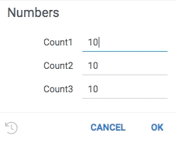
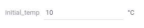
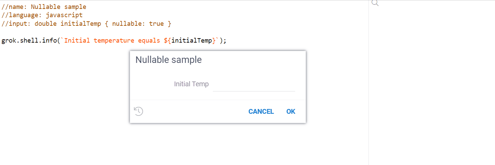
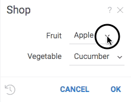
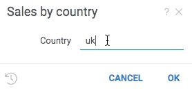

```mdx-code-block
import Tabs from '@theme/Tabs';
import TabItem from '@theme/TabItem';
```

There are various types of [functions](functions.md) such as [scripts](../../compute/scripting.md) or
[queries](../../access/data-query.md). What is common to all of them is the annotation of parameters. This is part of
the mechanism that enables universal support for functions in the platform.

A function annotation is a multi-line comment that is placed above the function declaration and contains information
about the function name, role, input and output parameters, and so on. The parameter annotation is part of the function annotation.

## Header parameters

There are general parameters common to all functions, as well as parameters specific to certain function types. Not all
general parameters are required, the list of parameters depends on the function
[type](#parameters-specific-to-function-type), [role](../../develop/function-roles.md), and so on.

### Common parameters

| Parameter   | Description                                                                         |
|-------------|-------------------------------------------------------------------------------------|
| name        | Name                                                                                |
| description | Description                                                                         |
| tags        | Tags (see also `DG.TAGS`)                                                           |
| input       | Input parameter                                                                     |
| output      | Output parameter                                                                    |
| help-url    | Datagrok's Wiki URL                                                                 |
| reference   | Reference to a research paper, Wikipedia article, Git repository, etc.              |
| top-menu    | Top menu path separated with pipes ("\|")                                           |

### Parameters specific to function type

| Type       | Parameter   | Description                                                                                             |
|------------|-------------|---------------------------------------------------------------------------------------------------------|
| Script     | language    | Script language (see the list of [supported languages](../../compute/scripting.md#supported-languages)) |
| Script     | sample      | Name of a sample file                                                                                   |
| Script     | environment | Environment name                                                                                        |
| Script, info panel | condition   | Function applicability conditions                                                               |
| Query      | connection  | Connection name                                                                                         |

```mdx-code-block
<Tabs>
<TabItem value="script" label="Script" default>
```

```python
#name: Chemical Space Using tSNE
#description: Chemical space using t-distributed Stochastic Neighbor Embedding
#help-url: https://datagrok.ai/help/domains/chem/functions/tsne
#language: python
#sample: chem/smiles_coordinates.csv
#tags: demo, chem, rdkit
```

```mdx-code-block
</TabItem>
<TabItem value="query" label="Query">
```

```sql
--name: Orders
--friendlyName: Orders
--connection: MySQLNorthwind
```

```mdx-code-block
</TabItem>
</Tabs>
```

:::tip Tip

You can also add custom parameters using the `meta.` prefix. For example, `meta.icon` or `meta.ext`.

:::

### Inputs and outputs

The syntax for defining input and output parameters looks like this:

```
<comment symbol><direction>: <type> <name> = <value> {<option tag>:<value>; ...} [<description>]
```

1. **direction** - parameter direction:
    1. input
    2. output
2. **type** - parameter type:
    * **int** - integer (scalar)
    * **double** - float (scalar)
    * **bool** - boolean (scalar)
    * **string** - string (scalar)
    * **dataframe** - dataframe
    * **column** - column from selected table
    * **column_list** - list of columns from selected table
    * **datetime** - datetime
    * **graphics** - graphics
    * **file** - file, variable in the function body contains path to file
    * **blob** - blob, variable in the function body contains path to binary file
    * **list<T\>** - list of objects of type T (support depends on function type)
3. **name** - parameter name that will be used in the function body. Optional for a graphical output.
4. **value** - default value. For scalar inputs, it corresponds to a value; for graphics outputs, it is used as index of
   graphical element. Optional.
5. **options** - the list of options as key-value pairs. It is used to enhance the UI of a function call. Optional.
6. **description** - brief description for a parameter that appears in UI. Optional.

### Options

#### Common

| Option     | Value                     | Description              |
|------------|---------------------------|--------------------------|
| validators | List separated with comma | List of named validators |
| caption    | Text string               | Custom field caption     |
| postfix    | Text string               | Field postfix            |
| units      | Same as postfix           | Value unit name          |
| nullable   | Boolean                   | Value should be nullable or not |

##### Validators

Validators check whether the value falls in the expected range, and provide visual cue if it does not. To add a validator to a parameter, provide a comma-separated list of functions that will be invoked each time a value is changed. A null indicates that the value is valid, anything else indicates an error which gets shown to the user.

A validator is a function that accepts one parameter of any type and returns a string. Choice providers are applicable only to string parameters.

Named validators that can be used and do not require additional registration:

* containsMissingValues
* columnName - checks if table contains the column name
* columnIsNumerical
* columnIsCategorical

```mdx-code-block
<Tabs>
<TabItem value="short" label="Short Sample" default>
```

```javascript
//input: dataframe df
//input: column col {validators: ['containsMissingValues']}
```

```mdx-code-block
</TabItem>
<TabItem value="result" label="Result">
```


```mdx-code-block
</TabItem>
</Tabs>
```

In addition to already existing validators, you can register your own and reuse.

```mdx-code-block
<Tabs>
<TabItem value="short" label="Short Sample" default>
```

```javascript
grok.functions.register({
    signature: 'List<String> jsVal1(int input)',
    run: (input) => input < 11 ? null : "Error val1" });

grok.functions.register({
    signature: 'List<String> jsVal2(int input)',
    run: (input) => input > 9 ? null : "Error val2" });
```

```mdx-code-block
</TabItem>
<TabItem value="sample" label="Full sample">
```

```python
# name: Numbers
# language: python
# input: int count1 {validators: ["jsval1", "jsval2"]} [Number of cells in table]
# input: int count2 {validators: ["jsval1"]} [Number of cells in table]
# input: int count3 {validators: ["jsval2"]} [Number of cells in table]
```

```mdx-code-block
</TabItem>
<TabItem value="result" label="Result">
```



```mdx-code-block
</TabItem>
</Tabs>
```

##### Caption

You can add an arbitrary caption for an input parameter. Proper caption helps user to understand the meaning of the parameter.

```mdx-code-block
<Tabs>
<TabItem value="short" label="Short sample" default>
```

```javascript
//input: double V1 { caption: Initial volume of liquid }
```

```mdx-code-block
</TabItem>
<TabItem value="full" label="Full sample">
```

```javascript
//name: Captions sample
//language: javascript
//input: double V1 { caption: Initial volume of liquid }

grok.shell.info(`V1 equals ${V1}`);
```

```mdx-code-block
</TabItem>
<TabItem value="result" label="Result">
```


```mdx-code-block
</TabItem>
</Tabs>
```

##### Units

You can add a proper unit label for an input parameter. Unit label will appear in the input form next to the input field. Postfix is same as units.

```mdx-code-block
<Tabs>
<TabItem value="short" label="Short sample" default>
```

```javascript
//input: double initialTemp { units: °С }
```

```mdx-code-block
</TabItem>
<TabItem value="full" label="Full sample">
```

```javascript
//name: Units sample
//language: javascript
//input: double initialTemp { units: °С }

grok.shell.info(`Initial temperature equals ${initialTemp}`);
```

```mdx-code-block
</TabItem>
<TabItem value="result" label="Result">
```



```mdx-code-block
</TabItem>
</Tabs>
```

##### Nullable

You can specify the nullable option that allows to enter nothing in the parameter field and use the null value in queries.

```mdx-code-block
<Tabs>
<TabItem value="short" label="Short sample" default>
```

```javascript
//input: double initialTemp { nullable: true }
```

```mdx-code-block
</TabItem>
<TabItem value="full" label="Full sample">
```

```javascript
//name: Nullable sample
//language: javascript
//input: double initialTemp { nullable: true }

grok.shell.info(`Initial temperature equals ${initialTemp}`);
```

```mdx-code-block
</TabItem>
<TabItem value="result" label="Result">
```



```mdx-code-block
</TabItem>
</Tabs>
```

#### For "dataframe" type

| Option      | Value       | Description                             |
|-------------|-------------|-----------------------------------------|
| columns     | numerical   | Only numerical columns will be loaded   |
| columns     | categorical | Only categorical columns will be loaded |

#### For "column" and "column_list" types

| Option     | Value                           | Description                                                                 |
|------------|---------------------------------|-----------------------------------------------------------------------------|
| type       | numerical                       | In a dialog, only numerical columns will be shown                           |
| type       | categorical                     | In a dialog, only categorical columns will be shown                         |
| type       | dateTime                        | In a dialog, only dateTime columns will be shown                            |
| format     | MM/dd/yyyy                      | Datetime format, for dateTime columns and datetime type only                |
| allowNulls | true/false                      | Adds validation of the missing values presence                              |
| action     | join("table parameter name")    | Joins result to the specified table, for output parameters only             |
| action     | replace("table parameter name") | Replaces result with columns in specified table, for output parameters only |

#### For "string" type

| Option      | Value                                                                                      | Description                              |
|-------------|--------------------------------------------------------------------------------------------|------------------------------------------|
| choices     | A comma-separated list of values, or a function name that returns a list of strings        | List of choices for string parameter     |
| suggestions | Name of a function that returns a list of strings to be used as suggestions as the user types the value | List of suggestions for string parameter |

##### Choices

Use choices to provide the editor a list of values to choose from. When choices are provided, the editor becomes a combo box.

A choice provider is a function with no parameters that returns a list of strings.

Choices can be either a fixed list, or a function that returns a list.

```mdx-code-block
<Tabs>
<TabItem value="short" label="Short sample" default>
```

```python
#input: string fruit {choices: ["apple", "banana"]}
#input: string vegetable {choices: jsveggies}
```

```mdx-code-block
</TabItem>
<TabItem value="register-function" label="Register Function">
```

```javascript
grok.functions.register({
    signature: 'List<String> jsVeggies()',
    run: () => ["Cucumber", "Cauliflower"]});
```

```mdx-code-block
</TabItem>
<TabItem value="full" label="Full Sample">
```

```python
#name: Shop
#language: python
#input: string fruit {choices: ["apple", "banana"]}
#input: string vegetable {choices: jsveggies}
```

```mdx-code-block
</TabItem>
<TabItem value="result" label="Result">
```



```mdx-code-block
</TabItem>
</Tabs>
```

##### Suggestions

Use parameter suggestions to help users enter a correct value. For instance, when entering a product name, it might make sense to dynamically query a database for values starting with the already entered text, and suggest to auto-complete the value.

Suggestions are functions that take one string argument, and return a list of strings to be suggested to user. Suggestions work only for string parameters.

The following example helps user enter a country name by dynamically retrieving a list of names from a web service:

```mdx-code-block
<Tabs>
<TabItem value="short" label="Short sample" default>
```

```python
# input: string country = uk {suggestions: jsSuggestCountryName}
```

```mdx-code-block
</TabItem>
<TabItem value="register-function" label="Register Function">
```

```javascript
grok.functions.register({
  signature: 'List<String> jsSuggestCountryName(String text)',
  isAsync: true,
  run: async function(text) {
    let response = await fetch('https://restcountries.eu/rest/v2/name/' + text);
    return response.status === 200 ? (await response.json()).map(country => country['name']) : [];
  }
});
```

```mdx-code-block
</TabItem>
<TabItem value="full" label="Full Sample">
```

```python
# name: Sales by country
# language: python
# input: string country = uk {suggestions: jsSuggestCountryName}
```

```mdx-code-block
</TabItem>
<TabItem value="result" label="Result">
```



```mdx-code-block
</TabItem>
</Tabs>
```

## Examples

<details>
<summary> TypeScript function </summary>
<div>

```ts
//name: Len
//description: Calculates the length of a string
//input: string s
//output: int n
export function getLength(s: string): number {
  return s.length;
}
```

</div>
</details>

<details>
<summary> Python script </summary>
<div>

```python
#name: Template
#description: Calculates number of cells in the table
#language: python
#tags: template, demo
#sample: cars.csv
#input: dataframe table [Data table]
#output: int count [Number of cells in table]
count = table.shape[0] * table.shape[1]
```

</div>
</details>

<details>
<summary> Query </summary>
<div>

```sql
--name: protein classification
--connection: chembl
select * from protein_classification;
--end
```

</div>
</details>

<details>
<summary> Complex annotation example </summary>
<div>

```python
#input: dataframe t1 {columns:numerical} [first input data table]
#input: dataframe t2 {columns:numerical} [second input data table]
#input: column x {type:numerical; table:t1} [x axis column name]
#input: column y {type:numerical} [y axis column name]
#input: column date {type:datetime; format:mm/dd/yyyy} [date column name]
#input: column_list numdata {type:numerical; table:t1} [numerical columns names]
#input: int numcomp = 2 {range:2-7} [number of components]
#input: bool center = true [number of components]
#input: string type = high {choices: ["high", "low"]} [type of filter]
#output: dataframe result {action:join(t1)} [pca components]
#output: graphics scatter [scatter plot]
```

</div>
</details>

<details>
<summary> Hierarchical query example </summary>
<div>

```sql
--name: OrdersByEmployee
--friendlyName: OrdersByEmployee
--connection: PostgresNorthwind
--input: string shipCountry = "Argentina" {choices: Query("SELECT DISTINCT shipCountry FROM orders")}
--input: string shipCity {choices: Query("SELECT DISTINCT shipcity FROM orders WHERE shipCountry = @shipCountry")}
--input: string customerId {choices: Query("SELECT DISTINCT customerid FROM orders WHERE shipCity = @shipCity")}
--input: string employee {choices: Query("SELECT DISTINCT lastName FROM employees INNER JOIN orders ON employees.employeeId = orders.employeeId WHERE customerId = @customerId")}

SELECT *
FROM orders
INNER JOIN employees
ON orders.employeeId = employees.employeeId
WHERE lastName = @employee
```

</div>
</details>

See also:

* [Functions](functions.md)
* [Function parameters enhancement](func-params-enhancement.md)
