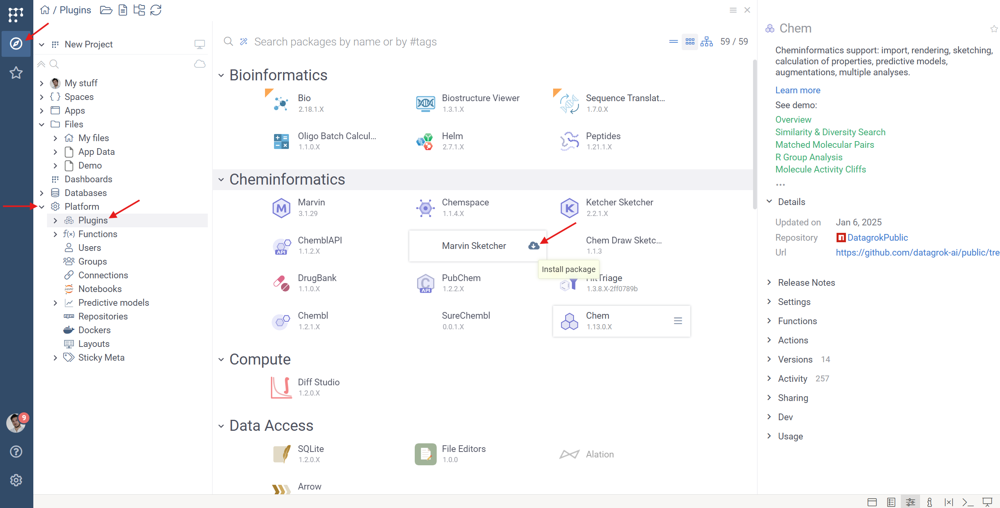

# Where to find help

Now that you have deployed Datagrok, it's time to get benefits! This article gives you pointers
on how to start and grow your data ecosystem. Here is how to get help:

* [Online help](https://datagrok.ai/help) for information on the platform
* **In-platform help** gives you hints and guidance on the current context. Press F1, or "?". 
* [Community forum](https://community.datagrok.ai/) for general questions, suggestions, or discussions
* [Datagrok YouTube channel](https://www.youtube.com/@Datagrok) for lessons, tips, product demos, 
  and recordings of the user group meetings
* **Interactive tutorials**: Complete at [public.datagrok.ai](https://public.datagrok.ai) or your corporate instance
  (requires the Tutorials package). These tutorials cover multiple areas, such as data access, exploratory
  data analysis, cheminformatics, or machine learning. This requires the **Tutorials** plugin to be installed,
  in addition to domain packages (for instance, cheminformatics tutorials is in the **Chem** package)
* Reach out to us - either to your support engineer, or info@datagrok.ai 

# Install plugins

Make sure you have all necessary plugins installed. To do that, go to **Platform | Plugins**, and explore
your areas of interest. Click on the plugin to see its detailed information on the context panel.
You definitely want **Chem** if you deal with small molecules, and **Bio** if you work with biological
structures.

# Make a project and share with others

Let's see how easy it is to load any data, visualize it in a rich way (Datagrok will automatically 
understand molecules, biostructures in HELM formats, etc), and share with others. You surely
have a CSV file around 

* Drag-and-drop a CSV file
* Add scatter plots, histograms, scaffold trees, molecular filters, etc
* Click on molecules, see what can be inferred from them on the context panel (later on we will write our own panels)
* Save, and share with someone. Your colleague will get an email (assuming the email server was set up),
  and will be able to view or edit the project (depending on the privileges you've given when sharing)

# Connect to data

At any point, you can drag-and-drop a CSV file and explore it. But we want more - let's connect
to your proprietary systems and expose the data to your colleagues in a manageable, safe way:
 
* [Connect to your databases](../access/databases/databases.md). Once a connection is created, 
  you can [explore its content](https://datagrok.ai/help/access/databases/#database-manager)
  , and [share it with others](https://datagrok.ai/help/access/databases/#access-control).
  Later on, we will learn how to write [queries](../access/databases/databases.md#working-with-queries)
  and use them in [dynamic dashboards](../access/databases/databases.md#creating-dynamic-dashboards-for-query-results)
* [Connect to your file systems](../access/files/files.md). Similarly to databases, file connections
  can be shared, and files can be used in dynamic dashboards.
* [Connect to your webservices](../access/open-api.md) if you have a Swagger/OpenAPI definition.

# Make dynamic dashboards

Using the data conections we've created previnously, let's create a dynamic dashboard.
Once a query is saved, you can run it by entering parameters via the automatically built UI,
visualize it any way you want, and share with others. 
In the [query editor](../access/databases/databases.md#query-editor), do the following:

* Write a parameterized SQL query against your database
* Design a visual layout (like a scatter plot and a histogram)
* Save and share with a colleague
* Add results to workplace by clicking "+"

You've just created the first dynamic dashboard! Note that you can share results as a URL as well.

# Bio/Chem specific functions

If you are working with biological or chemical data, you will see Bio/Chem menus in the top bar.
These menus contain functions specific to these domains, like different analysis (r-groups, SAR, MMP, dimentionality reduction, clustering), different conversion/calculation methods, and different visualizations.
You can read more about these solutions in [Bio](./solutions/domains/bio/bio.md) and [Chem](./solutions/domains/chem/chem.md) help pages.

* Drag-and-drop a file with molecules or sequences (you can also use the sample data, which you can find in *Files/App Data/Bio* or *Files/App Data/Chem* folders)
* Explore different Bio/Chem functions through top menu items.
* Calculate Molecular properties, descriptors, toxisity risks, etc.. using **Top menu | Chem | Calculate**
* Analyse your data using MMP, SAR, R-groups decomposition, etc.. using **Top menu | Chem | Analyze**
* Analyse biological sequences using methods like SAR, Clustering, Activity cliffs, MSA, ets.. using **Top menu | Bio | Analyze**

