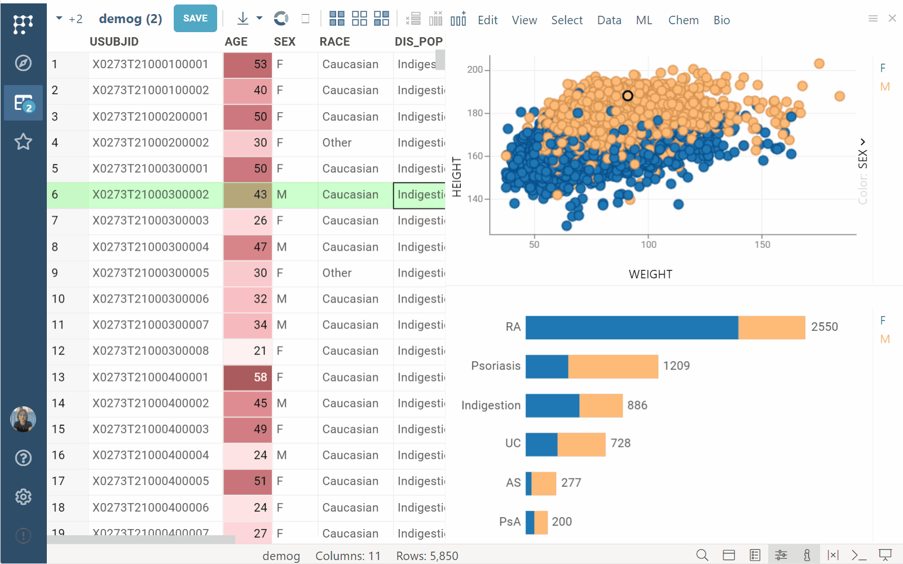
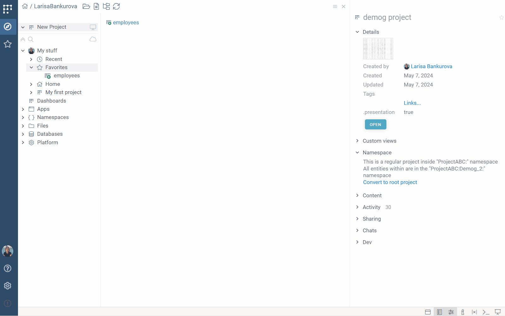

```mdx-code-block
import DownloadIcon from '../../../uploads/icons/download-icon.png';
import ExportCSV from '../../../uploads/pictures/export-csv.png';
```

## Access

### Import

To open a local file, drag and drop it on the platform. Alternatively, go to
**Sidebar** > **Browse** (<FAIcon icon="fa-solid fa-compass"/>) > **Top Menu** and click the **Open file**
(<FAIcon icon="fa-regular fa-folder-open"/>) icon or the **Import text**
(<FAIcon icon="fa-regular fa-file-lines"/>) icon, which lets you
configure the text file before import.

### Open in Datagrok

To open a file, table, or other object in Datagrok, open **Browse** (**Sidebar** > **Browse** (<FAIcon icon="fa-solid fa-compass"/>)). In the **Browse** tree, find your object and double-click it to
open.

To learn more about data access options, see the
[Access](../../../access/access.md) section of our documentation.

## Save and share a table

When you import a table in Datagrok, your changes to
it **_aren't_** saved automatically. Everything stays in your browser's memory. If you close or
refresh the browser tab, any unsaved work will be lost. Click SAVE button on top 
to upload it to the server. A project containing this table will be automatically created.

Uploading the project object doesn't automatically share it with others. You
must share it explicitly.

### Saving a dashboard

When you open a CSV file or run a [function](../../concepts/functions/functions.md)
that produces a table, it opens a [Table View](../views/table-view.md) resembling Excel. Here, you can edit both the data
(the [table](../../concepts/objects.md)) and its visual representation (the
[layout](../../../visualize/view-layout.md)).

Tables and layouts are separate [entities](../../concepts/objects.md). This means you can
choose to save changes made to the data, layout, or both. 

To save:

1. At the top of your screen, click the **SAVE** button top open the **Save project** dialog.
1. In the dialog:
   * **For new entities**: Enter a name and, optionally, a
      description for your project. By default, mew entities are saved to your personal project under **My stuff**. 
   * **For existing (modified) entities**: Remove any tables you don't want to save. By default, all open tables are included. Select one of the following: 
          * **Save original project**: Updates the original project.
          * **Save a copy**: Useful when you want to edit the project, but don't have the privilege to modify the original one. If you choose this option, you must also decide what happens to each table included in your new project:
              * **Clone**: Creates a copy of the table in your new project.
              * **Move**: Moves the table to the new project, leaving a read-only linked copy in the original project. The linked copy updates with changes made to the table in the new project.
              * **Link**: Creates a read-only linked copy of the original table in your project. Changes to the table in the original project are automatically reflected in the linked table in your project.
          * **Personal view customizations**: Saves personalized layout changes visible to you only, without changing the layout seen by others.
   * Optional:
      * To update the data every time you open a project, toggle **Data sync**.
         This feature is commonly used to create [dynamic dashboards](../../../access/databases/databases.md#creating-dynamic-dashboards-for-query-results)
         or when tables link to different projects.
      * To save your project in a presentation mode, toggle **Presentation mode**. Useful for sharing with data consumers. Toolboxes, status bars, menus, ribbons, context panels will not be shown, letting users focus on the data and visualizations you have created.
1. Click **OK** to save. The **SAVE** button in the **Table View** turns grey,
   indicating you have no unsaved changes.

:::note

Moving tables between projects impacts their hierarchy, name, and privileges. [Learn more](../../concepts/project/project.md).

:::

#### Dynamic data

Whenever a table is generated by a [function](../../concepts/functions/functions.md) (such
as a [database query](../../../access/access.md#data-query)), this information
is stored together with the table as its "generation script". This serves
several purposes:

* Provides data lineage
* Lets you refresh data on demand
* Lets you publish [dynamic dashboards](../../../access/databases/databases.md#creating-dynamic-dashboards-for-query-results)

When you upload a table with a generation script, you can activate the **Data sync** option. This saves the table as a generation script instead of a static snapshot. Enabling data sync means that the function behind the table will automatically re-execute each time the project is opened. Additionally, you can refresh the table manually or change the query parameters as needed (**Toolbox** > **Source**).


## Share

You can share Datagrok [entities](../../concepts/objects.md) with other users or
[groups](../../../govern/access-control/users-and-groups#groups). When you share an entity, you grant a
[privilege](../../../govern/access-control/access-control.md#permissions) (typically, _view_ or _edit_) to others.
To learn how to manage groups and privileges, see
[Access control](../../../govern/access-control/access-control.md#authorization).

To share an entity, right-click to open the context menu and click "Share...". You can also do that from the  [Context Panel](../panels/panels.md#context-panel).

You can send the entity's URL to your colleague. To access an entity via a URL, the recipient needs appropriate permissions. 

To share an entity using context actions:

1. Right-click to open the context menu and click "Share...".
1. In the dialog: 
   1. In the identity/email field, start typing the name, username,
      email, or group name and select the appropriate match.
1. Assign access privileges. You can select any
   or all of the following options:
   1. **Can view**: Can view, open, and download.
   1. **Can edit**: Can rename, edit, delete, and share the entity with others.
1. Optional. Add description. Decide if you want to notify users by email or
   through the Datagrok interface: 
   1. To notify via email, when entering the user identity, use emails instead of user/group names. The email notification will include a link to the shared entity and the description provided.
   1. To notify via Datagrok, enter a user or group name. The recipients will receive an in-app notification.
   1. To skip notification, clear the **Send notification** checkbox.
1. Click **OK** to share. The shared item appears in the recipient's [Browse view](../views/browse.md).

:::note

You can share an entity with an email address that doesn't yet have a Datagrok
account. In such cases, Datagrok creates a non-active user account. To access the
shared entity, the recipient will need to register and activate their account
using the specified email address.

:::

## Download

### Tables and visualizations

You can download any open table as a file or a set of files. To do this, use the
**Download** () icon located at the
top of the screen.

<details>
<summary>Supported download formats</summary>

* CSV
* Excel documents (.xlsx)
* JSON
* PNG
* PowerPoint presentations (.pptx)
* Parquet
* Feather
* Fasta
* SDF (for tables containing molecules)

</details>

When downloading a table in the CSV format, you can configure the CSV file
before downloading it. To do this, select the **As CSV (options)...** command from the **Download** menu.
This opens the **Save as CSV** dialog, where you can specify the desired
configuration. If you want to use these settings by default in the future, click
the **SET DEFAULT** button.


When downloading tables in a **CSV** format, only the current table
is downloaded. 

To download all open tables at once, you have two options: 

1. Create a zip archive with separate CVS files. To do this, select the **CSV
and PNG **as ZIP** commands. This generates a zip file that includes CSV files for
each open table, along with "screenshots" that capture the current visual state
of all viewers, including the [grid](../../../visualize/viewers/grid.md).
1. Save open tables as individual worksheets in an XLSX file. To do this, select
   the **As Excel Document** command. This creates a separate worksheet within
   the Excel file for each open table.

To download just the screenshots of all viewers and tables, select the **As
Presentation** command. This generates a PowerPoint presentation with individual
screenshots that you can resize or delete as needed.

:::tip

In Datagrok, the underlying data (tables) and their visual representations
([layout](../../../visualize/view-layout.md)) are distinct entities. You can download a _layout_ for any
open table. 

To download a layout, in the **Top Menu**, select **View** > **Layouts** >
**Download** for your current table. You can then apply this layout to any other
table using drag and drop.



:::

### Files

To download a file, go to **Sidebar** > **Browse**. In the **Browse** tree,
right-click the file and select the download option from its **Context Menu**.

## Add to favorites

To add an entity to favorites, do any of the following:

* Drag-and-drop in the [Browse](../views/browse.md) tree:
    * Drag and drop the entity on the **Favorites** directory under **My stuff**.
    * Click the **Favorites** directory under **My stuff**. This opens the
  **Favorites** view. Drag and drop the entity on the view.
* Use the **Context Panel**
  1. In the **Browse** tree, click the entity you want. The **Context Panel** shows entity-specific information and actions.
  1. On the **Context Panel** next to the entity's name, click the **Add to
     favorites (<FAIcon icon="fa-regular fa-star"/>) icon**. The color of the
     icon changes to orange, and the entity is added to your favorites.

You can later access favorites either from the **Browse** tree or by clicking
the **Favorites (<FAIcon icon="fa-regular fa-star"/>) icon**:
* On the **Sidebar**, or
* On top of the **Context Panel**. 

To remove an entity from favorites, use the context menu. Alternatively, on the
**Context Panel** next to the entity's name, click the orange **Add to favorites
(<FAIcon icon="fa-regular fa-star"/>) icon**. The color changes to neutral, and
the entity is removed from your favorites.



:::note

You can favorite any Datagrok [entity](../../concepts/objects.md) like a data connection, query, or a project.
You can't favorite an individual file or a specific value within a cell. <!--This can be solved with sticky meta.Suggestion submitted-->

:::