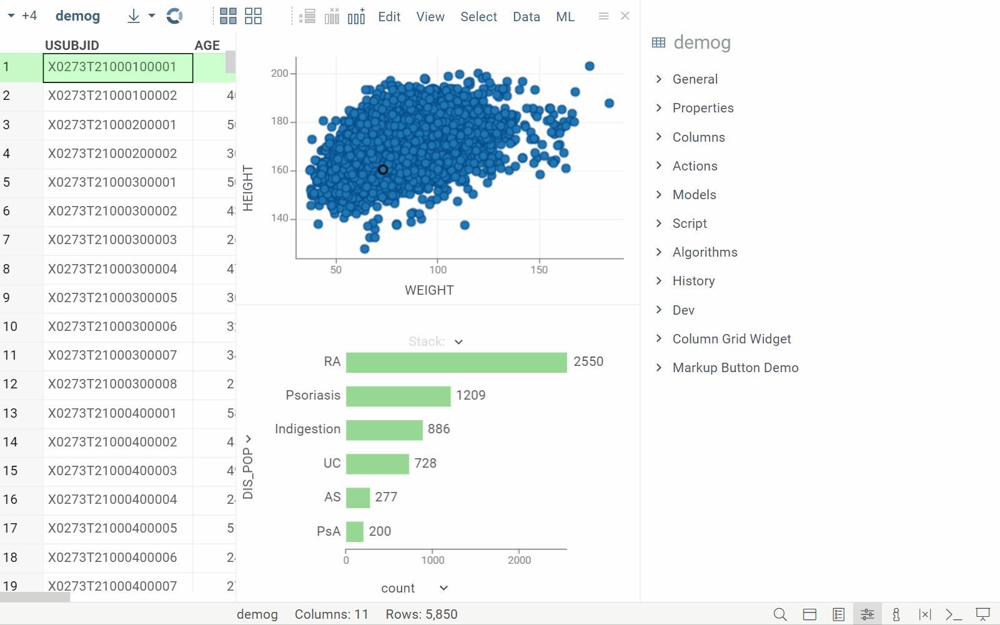

```mdx-code-block
import Tabs from '@theme/Tabs';
import TabItem from '@theme/TabItem';
```

Learn about info panes [here](navigation.md#info-panes). 

>Developers: You can [create custom info panes](../../develop/how-to/ui/add-info-panel.md)

## Tabular data

The following info panes appear by default when working with tabular data. 
Many advanced info panes come from optional  
[PowerGrid](https://github.com/datagrok-ai/public/blob/master/packages/PowerGrid/README.md) 
and [PowerPack](https://github.com/datagrok-ai/public/blob/master/packages/PowerPack/README.md) 
packages, which we recommend for installation.

|Info pane <div style={{ width:500 }}></div> |Input <div style={{ width:120 }}></div>|Required plugin  <div style={{ width:120 }}></div>|
|---|---|---|
|<h5>**Actions**</h5>Lists available actions (subject to permissions) | `table`, `column`, `row`, selection, current object|--|

### Table

|Info pane <div style={{ width:620 }}></div>|Required plugin  <div style={{ width:120 }}></div>|
|---|---|
|<h5>**Dev**</h5>Provides access to documentation, class references, and code snippets for the current object. It also has an editor with template scripts for common actions related to the object <br/><br/> [Learn more](https://github.com/datagrok-ai/public/tree/master/packages/DevTools#components)| [Power Pack](https://github.com/datagrok-ai/public/blob/master/packages/PowerPack/README.md)|
|<h5>**General**</h5>Shows basic metadata, such as number of rows, columns, source, etc.|--|
|<h5>**Columns**</h5> Shows all table columns as clickable links, enabling navigation to individual column info panes|--|
|<h5>**Models**</h5>Shows relevant models for your dataset (created by you or shared by others). From here, you can manage or train models <br/><br/> |--|
|<h5>**History**</h5>Shows the history of actions performed on the table|--|

### Column

|Info pane <div style={{ width:620 }}></div>|Required plugin <div style={{ width:120 }}></div>|
|---|---|
|<h5>**Details**</h5>Shows column properties and summary statistics or distributions for the column's data |--|
|<h5>**Filter**</h5>Quick access to a column's filter|--|
|<h5>**Colors**</h5> Color code a column <br/><br/> |[PowerGrid](https://github.com/datagrok-ai/public/blob/master/packages/PowerGrid/README.md) |
|<h5>**Stats**</h5> Shows summary statistics for a column <br/><br/> |[PowerGrid](https://github.com/datagrok-ai/public/blob/master/packages/PowerGrid/README.md) |
|<h5>**Permissions**</h5> Specify who can edit a column |--|
|<h5>**Plots**</h5>Visualizes selected columns for quick profiling <br/><br/> |[PowerGrid](https://github.com/datagrok-ai/public/blob/master/packages/PowerGrid/README.md) |

### Row

|Info pane <div style={{ width:620 }}></div> |Required plugin  <div style={{ width:120 }}></div>|
|---|---|
|<h5>**Distributions**</h5> Shows distributions for numerical columns based on selected rows <br/><br/>|[PowerGrid](https://github.com/datagrok-ai/public/blob/master/packages/PowerGrid/README.md) |
|<h5>**Content**</h5> Shows details for selected rows in a spreadsheet format<br/><br/>|[PowerGrid](https://github.com/datagrok-ai/public/blob/master/packages/PowerGrid/README.md) |

### Current object

|Info pane <div style={{ width:620 }}></div>|Required plugin  <div style={{ width:120 }}></div>|
|---|---|
|<h5>**Sticky meta**</h5> Shows metadata for the current object. [Learn more](../../govern/catalog/sticky-meta.md)<br/><br/> |[PowerGrid](https://github.com/datagrok-ai/public/blob/master/packages/PowerGrid/README.md) |

<!--
|<h5>**Properties**</h5>|Table|
|<h5>**Script**</h5>|Table|
|<h5>**Markup Button Widget**</h5>|Table|
|<h5>**Column Grid Widget**</h5>|Table|
|<h5>**Serialization**</h5>|Column|

-->

## Domains

### Chem

#### Structure and visualization

| Info pane <div style={{ width:500 }}></div> |Semantic type <div style={{ width:120 }}></div>|Required plugin <div style={{ width:120 }}></div>|
|-----|-----------|---|
| <h5>3D Structure</h5> <br/>Shows an interactive 3D view of the molecule |`Molecule` |[Chem](https://github.com/datagrok-ai/public/blob/master/packages/Chem/README.md) |
| <h5>2D Structure</h5> <br/>Shows a 2D view of the molecule |`Molecule` |[Chem](https://github.com/datagrok-ai/public/blob/master/packages/Chem/README.md) |
| <h5>Mixture</h5> <br/>Mixture components and their properties (structure, name, relation, etc.) in a tabular format (can be opened as its own view) |`ChemicalMixture` |[Chem](https://github.com/datagrok-ai/public/blob/master/packages/Chem/README.md)|
| <h5>Mixture Tree</h5> <br/>Hierarchical visualization of mixture composition (Mixfile format) |`ChemicalMixture` |[Chem](https://github.com/datagrok-ai/public/blob/master/packages/Chem/README.md)|
| <h5>Retrosynthesis</h5> <br/>The most efficient synthetic pathways and commercially available starting materials for target molecule (based on [AiZynthFinder](https://github.com/MolecularAI/aizynthfinder))<br/>|`Molecule`|[Retrosynthesis](https://github.com/datagrok-ai/public/blob/master/packages/Retrosynthesis/README.md) |

#### Properties and descriptors

| Info pane <div style={{ width:500 }}></div> |Semantic type <div style={{ width:120 }}></div>|Required plugin <div style={{ width:120 }}></div>|
|-----|-----------|---|
| <h5>Gasteiger Partial Charges</h5> <br/>[RDKit-based script](https://dev.datagrok.ai/script/7acf813d-4f65-51f2-bc3f-503cde26c460) |`Molecule`| [Chem](https://github.com/datagrok-ai/public/blob/master/packages/Chem/README.md)| 
|<h5>Descriptors</h5> <br/>The following descriptors are shown by default: FractionCSP3, HeavyAtomCount, NHOHCount. To calculate other descriptors, click the **SELECT** button and choose from the list|`Molecule`|[Chem](https://github.com/datagrok-ai/public/blob/master/packages/Chem/README.md)|
| <h5>Properties</h5> <br/>Molecular properties (formula, weight, LogP, etc.) |`Molecule`|[Chem](https://github.com/datagrok-ai/public/blob/master/packages/Chem/README.md) |
| <h5>Identifiers</h5> <br/>Identifiers (SMILES, InChi, ChEMBL ID, etc.) |`Molecule`|[Chem](https://github.com/datagrok-ai/public/blob/master/packages/Chem/README.md) |

#### ADMET / safety

| Info pane <div style={{ width:640 }}></div> |Semantic type <div style={{ width:120 }}></div>|Required plugin <div style={{ width:120 }}></div>|
|-----|-----------|---|
| <h5>Admetica</h5> <br/>[Calculates ADMET](https://github.com/datagrok-ai/public/tree/master/packages/Admetica). In addition, the **Summary** info pane visualizes ADMET in a pie chart |`Molecule`|[Admetica](https://github.com/datagrok-ai/public/blob/master/packages/Admetica/README.md) |
| <h5>Drug likeness</h5> <br/>[Calculates drug likeness](../solutions/domains/chem/info-panels/drug-likeness.md) and displays the results |`Molecule`|[Chem](https://github.com/datagrok-ai/public/blob/master/packages/Chem/README.md) |
| <h5>Structural alerts</h5> <br/>[Calculates and displays structural alerts](../solutions/domains/chem/info-panels/structural-alerts.md) |`Molecule`|[Chem](https://github.com/datagrok-ai/public/blob/master/packages/Chem/README.md)|
| <h5>Toxicity</h5> <br/>[Calculates toxicity](../solutions/domains/chem/info-panels/toxicity-risks.md) and displays the results |`Molecule`|[Chem](https://github.com/datagrok-ai/public/blob/master/packages/Chem/README.md) |

#### Docking and modeling

| Info pane <div style={{ width:640 }}></div> |Semantic type <div style={{ width:120 }}></div>|Required plugin <div style={{ width:120 }}></div> |
|-----|-----------|---|
| <h5>AutoDock</h5> <br/>Displays docking results for molecules that have undergone AutoDock analysis |`Molecule`|[Docking](https://github.com/datagrok-ai/public/blob/master/packages/Docking/README.md)|
| <h5>DiffDock</h5> <br/>Provides an interactive interface for running molecular docking using NVIDIA's DiffDock model |`Molecule`| |

#### Data access and lookup

##### Databases

Depending on the plugins installed, allows to search by substructure and/or similarity.

| Info pane <div style={{ width:640 }}></div> |Semantic type <div style={{ width:120 }}></div>|Required plugin <div style={{ width:120 }}></div>|
|-----|-----------|---|
| <h5>ChEMBL</h5>|`Molecule`|[ChEMBL](https://github.com/datagrok-ai/public/tree/master/packages/Chembl) or<br/>[ChEMBL API](https://github.com/datagrok-ai/public/tree/master/packages/ChemblAPI)|
| <h5>DrugBank</h5> |`Molecule`|[DrugBank](https://github.com/datagrok-ai/public/tree/master/packages/DrugBank)|
| <h5>PubChem</h5> |`Molecule`|[PubChem](https://github.com/datagrok-ai/public/tree/master/packages/PubChemApi)|
| <h5>Chemspace</h5> <br/>Interface for searching and ordering compounds from [Chemspace](https://chem-space.com/) |`Molecule`| [Chemspace](https://github.com/datagrok-ai/public/blob/master/packages/Chemspace/README.md)|
| <h5>SureChEMBL</h5> <br/>Shows patent information for target molecule |`Molecule`|[SureChEMBL](https://github.com/datagrok-ai/public/tree/master/packages/SureChembl)|

##### Compound registration systems and ELNs

| Info pane <div style={{ width:640 }}></div> |Semantic type <div style={{ width:120 }}></div>|Required plugin <div style={{ width:120 }}></div>|
|-----|-----------|---|
| <h5>CDD Vault</h5> <br/>Shows vault data for the current molecule |`Molecule`|[CDD Vault Link](https://github.com/datagrok-ai/public/tree/master/packages/CddVaultLink)|

<!--Revvity?
| <h5>CDD Vault</h5> <br/>Shows data for the current molecule |`Molecule`|[RevvitySignalsLinkk](https://github.com/datagrok-ai/public/tree/master/packages/RevvitySignalsLink)|

--->

### Bio

#### Properties and composition analysis

| Info pane <div style={{ width:500 }}></div> | Semantic type <div style={{ width:120 }}></div> | Required plugin <div style={{ width:120 }}></div>|
|-----------|---------------|----------------|
| **Properties** <br/>Basic properties (formula, molecular weight, extinction coefficient) | `Macromolecule` | [Bio](https://github.com/datagrok-ai/public/blob/master/packages/Bio/README.md) |
| **Composition analysis** <br/>Shows a visual breakdown of a macromolecule’s monomer composition, showing each monomer’s percentage as colored bars representing relative abundance | `Macromolecule` | [Bio](https://github.com/datagrok-ai/public/blob/master/packages/Bio/README.md) |

#### Molecular properties of macromolecule

This pane is automatically populated with the molecule that is generated. It provides a quick way to inspect the molecular properties of the macromolecule. Works for macromolecules with up to 50 monomers.

| Info pane <div style={{ width:640 }}></div> | Semantic type <div style={{ width:120 }}></div> | Required plugin <div style={{ width:120 }}></div>|
|-----------|---------------|----------------|
| **Molecular structure** <br/>Shows a 2D view of the macromolecule  | `Macromolecule` | [Bio](https://github.com/datagrok-ai/public/blob/master/packages/Bio/README.md) |
| **Molecular 3D structure** <br/>Interactive 3D visualization of macromolecule | `Macromolecule` | [Bio](https://github.com/datagrok-ai/public/blob/master/packages/Bio/README.md) |

##### Data access and lookup

###### Databases

Depending on the plugins installed, allows to search by substructure and/or similarity.

| Info pane <div style={{ width:640 }}></div> |Semantic type <div style={{ width:120 }}></div>|Required plugin <div style={{ width:120 }}></div>|
|--------|-----------|-----|
| <h5>ChEMBL</h5>|`Molecule`|[ChEMBL](https://github.com/datagrok-ai/public/tree/master/packages/Chembl) or<br/>[ChEMBL API](https://github.com/datagrok-ai/public/tree/master/packages/ChemblAPI)|
| <h5>DrugBank</h5> |`Molecule`|[DrugBank](https://github.com/datagrok-ai/public/tree/master/packages/DrugBank)|
| <h5>PubChem</h5> |`Molecule`|[PubChem](https://github.com/datagrok-ai/public/tree/master/packages/PubChemApi)|
| <h5>Chemspace</h5> <br/>Interface for searching and ordering compounds from [Chemspace](https://chem-space.com/) |`Molecule`| [Chemspace](https://github.com/datagrok-ai/public/blob/master/packages/Chemspace/README.md)|
| <h5>SureChEMBL</h5> <br/>Shows patent information for target molecule |`Molecule`|[SureChEMBL](https://github.com/datagrok-ai/public/tree/master/packages/SureChembl)|

###### Compound registration systems and ELNs

| Info pane <div style={{ width:640 }}></div> |Semantic type <div style={{ width:120 }}></div>|Required plugin <div style={{ width:120 }}></div>|
|----------|-----------|------|
| <h5>CDD Vault</h5> <br/>Shows vault data for the current molecule |`Molecule`|[CDD Vault Link](https://github.com/datagrok-ai/public/tree/master/packages/CddVaultLink)|

##### ADMET / safety

| Info pane <div style={{ width:640 }}></div> | Semantic type <div style={{ width:120 }}></div> | Required plugin <div style={{ width:120 }}></div>|
|-----|-----------|---|
| <h5>Admetica</h5> <br/>[Calculates ADMET](https://github.com/datagrok-ai/public/tree/master/packages/Admetica). In addition, the **Summary** info pane visualizes ADMET in a pie chart |`Molecule`|[Admetica](https://github.com/datagrok-ai/public/blob/master/packages/Admetica/README.md) |
| <h5>Drug likeness</h5> <br/>[Calculates drug likeness](../solutions/domains/chem/info-panels/drug-likeness.md) and displays the results |`Molecule`|[Chem](https://github.com/datagrok-ai/public/blob/master/packages/Chem/README.md) |
| <h5>Structural alerts</h5> <br/>[Calculates and displays structural alerts](../solutions/domains/chem/info-panels/structural-alerts.md) |`Molecule`|[Chem](https://github.com/datagrok-ai/public/blob/master/packages/Chem/README.md)|
| <h5>Toxicity</h5> <br/>[Calculates toxicity](../solutions/domains/chem/info-panels/toxicity-risks.md) and displays the results |`Molecule`|[Chem](https://github.com/datagrok-ai/public/blob/master/packages/Chem/README.md) |

##### Docking and modeling

| Info pane <div style={{ width:640 }}></div> | Semantic type <div style={{ width:120 }}></div> | Required plugin <div style={{ width:120 }}></div>|
|-----|-----------|---|
| <h5>AutoDock</h5> <br/>Displays docking results for molecules that have undergone AutoDock analysis |`Molecule`|[Docking](https://github.com/datagrok-ai/public/blob/master/packages/Docking/README.md)|
| <h5>DiffDock</h5> <br/>Provides an interactive interface for running molecular docking using NVIDIA's DiffDock model |`Molecule`| |

##### Properties and descriptors

| Info pane <div style={{ width:500 }}></div> | Semantic type <div style={{ width:120 }}></div> | Required plugin <div style={{ width:120 }}></div>|
|-----|-----------|---|
|<h5>Descriptors</h5> <br/>The following descriptors are shown by default: FractionCSP3, HeavyAtomCount, NHOHCount. To calculate other descriptors, click the **SELECT** button and choose from the list|`Molecule`|[Chem](https://github.com/datagrok-ai/public/blob/master/packages/Chem/README.md)|
| <h5>Properties</h5> <br/>Molecular properties (formula, weight, LogP, etc.) |`Molecule`|[Chem](https://github.com/datagrok-ai/public/blob/master/packages/Chem/README.md) |
| <h5>Identifiers</h5> <br/>Identifiers (SMILES, InChi, ChEMBL ID, etc.) |`Molecule`|[Chem](https://github.com/datagrok-ai/public/blob/master/packages/Chem/README.md) |

##### Structure and visualization

| Info pane <div style={{ width:500 }}></div> | Semantic type <div style={{ width:120 }}></div> | Required plugin <div style={{ width:120 }}></div>|
|-----|-----------|---|
| <h5>3D Structure</h5> <br/>Shows an interactive 3D view of the molecule |`Molecule` |[Chem](https://github.com/datagrok-ai/public/blob/master/packages/Chem/README.md) |
| <h5>2D Structure</h5> <br/>Shows a 2D view of the molecule |`Molecule` |[Chem](https://github.com/datagrok-ai/public/blob/master/packages/Chem/README.md) |
| <h5>Retrosynthesis</h5> <br/>The most efficient synthetic pathways and commercially available starting materials for target molecule (based on [AiZynthFinder](https://github.com/MolecularAI/aizynthfinder))|`Molecule`|[Retrosynthesis](https://github.com/datagrok-ai/public/blob/master/packages/Retrosynthesis/README.md) |

## See also

* [Data augmentation](../../explore/data-augmentation/data-augmentation.md)
* [Scripting](../../compute/scripting/scripting.mdx)
* [Semantic types](../../govern/catalog/semantic-types.md)
