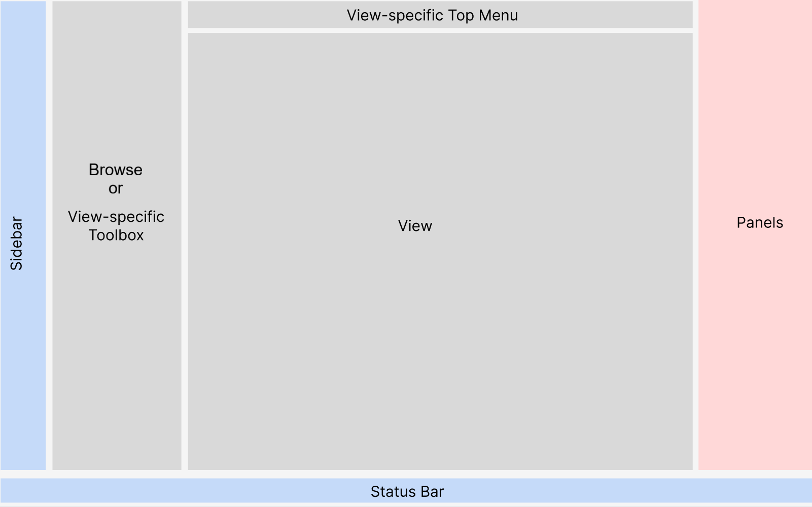
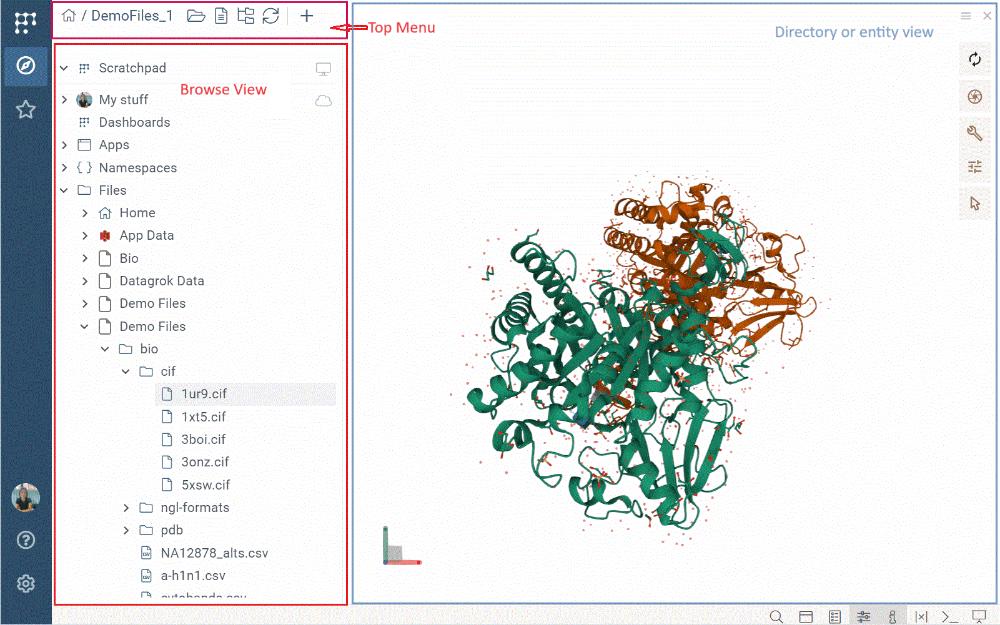
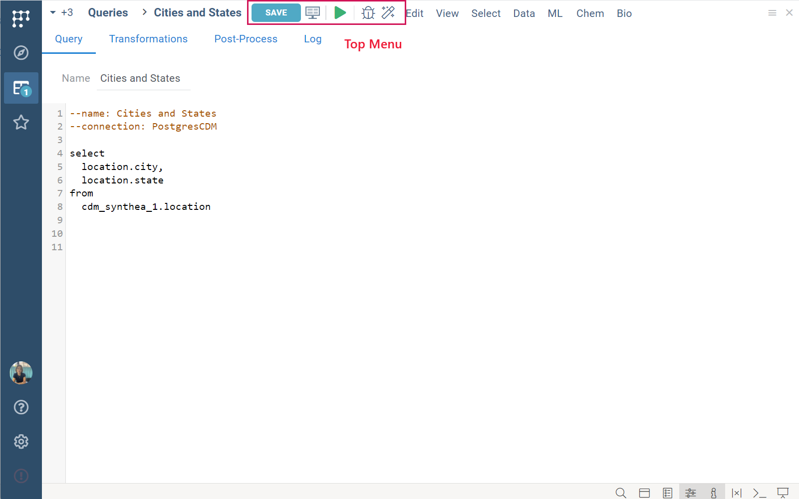

---

title: "User interface"
keywords:
 - navigation
 - UI elements
 - UI
format: mdx
sidebar position: 0
---

```mdx-code-block
import Tabs from '@theme/Tabs';
import TabItem from '@theme/TabItem';
```

Datagrok supports a variety of [data-related tasks](../datagrok.md), with its
interface adapting to the specific data or task at hand. For example, the
interface for analyzing tabular data resembles Excel, the navigation interface
resembles File Explorer, and apps or plugins can introduce custom interfaces.

Yet, despite this variety, the UI consistently includes several key elements:



<Tabs>
<TabItem value="Sidebar" label ="Sidebar" default>

Positioned on the far left, the **Sidebar** provides access to settings,
commands, you [personal profile view](views/user-profile-view.md), and favorites, and lets you switch between different windows. It
remains fixed in its position no matter where you are on the platform or
what you work on.

<details>
<summary>Sidebar icons</summary>

* All Datagrok commands (the Datagrok icon)
* **Browse** view (<FAIcon icon="fa-solid fa-compass"/>)
* Favorites (<FAIcon icon="fa-regular fa-star"/>)
* Your profile (a photo icon)
* Help (<FAIcon icon="fa-regular fa-circle-question"/>)
* Settings (<FAIcon icon="fa-solid fa-gear"/>)
* Feedback (<FAIcon icon="fa-solid fa-circle-exclamation"/>)

</details>

<br/>

</TabItem>
<TabItem value="view" label ="View">

A _view_ is a window designed for specific tasks, such as data analysis or data query.

A view may have these elements associated with it:

1. [Toolbox](views/views.md#toolbox): Located to the left of the _view_, it provides tools and
   functionalities specific to that view. To show the **Toolbox**, hover over
    the **Sidebar**. You can also pin it to keep it visible at all times.
1. **Top Menu**: Often at the top of the _view_, it provides
   view-specific commands.
1. **Status bar**: The central section is view-specific. For example, in **Table
   View**, the **Status Bar** shows the table's name, row/column counts, and
   filtered and selected row counts.

<details>
<summary>Examples</summary>

<Tabs>
<TabItem value="table-view" label="Table View">

The [Table View](../navigation/views/table-view.md) is used to analyze tabular data.

Similar to Excel, the **Top Menu** lets you edit the dataset, format cells, and so on. The **Toolbox** lets you add [viewers](../../visualize/viewers/viewers.md), apply [layouts](../../visualize/view-layout.md), refresh dashboards,
and more.


</TabItem>
<TabItem value="browse" label="Browse">

The [Browse](views/browse.md) view is used for navigation and data management.
From its **Top Menu**, you can open local files, toggle or refresh the
view, and more.

Clicking a tree node or an object in the **Browse** view opens a view associated
with that item. For example, clicking a file opens an interactive preview of
its content, clicking a folder shows its content, and clicking an entity gallery
such as **Projects** or **Users** opens an **Entity View**. 



</TabItem>
<TabItem value="query-editor" label="Query Editor">

[Query Editor](../../access/databases/databases.md#query-editor) is the main
interface for executing database queries. From its **Top Menu**, you can run,
debug, or save changes to the query. <br/>



</TabItem>
</Tabs>

</details>

[Learn more about views](views/views.md).

</TabItem>

<TabItem value="panels" label ="Panels">

Located on the far right, panels provide additional windows alongside your main
_view_ and include:

* [Context Panel](../navigation/panels/panels.md#context-panel): Shows information and options for your current
  object. For example, clicking a molecule shows details
  like its weight or toxicity. Clicking a query shows its SQL code and
  parameters.
* [Context Help](../navigation/panels/panels.md#context-help): Shows a help page for your current object.
* [Console](../navigation/panels/panels.md#console): Automatically logs every function call associated
  with visual data transformations. You can also use it to call functions
  directly.
* [Variables](../navigation/panels/panels.md#variables): Used to declare variables in your current view.

By default, only **Context Panel** and **Context Help** are visible. Depending
on your needs, you can toggle the visibility of any panel from the **Status Bar**.

</TabItem>
<TabItem value="status-bar" label ="Status Bar">

Located at the bottom of the screen, the **Status Bar** has these sections:
* _Right_: Has icons for tabs mode, global search, toggling panels, and activating presentation mode.
* _Left_: Shows progress during task execution.
* _Center_: Is view specific.

</TabItem>
</Tabs>

### UI features

Datagrok UI is flexible. For example, you can move or resize panels, float them
in separate windows, or toggle their visibility.


When you start dragging an object, all potential drop zones are highlighted,
guiding you where to place it. You can drag and drop almost any object. For
example, in a [Table View](views/table-view.md), most viewers and many dialogs can accept columns
dragged into or from them. 


<!--Expand examples to include other views. Reordering columns by dragging doesn't work?-->

Many UI elements are context-driven and adjust dynamically to your
current task or data. For example, when you open a table with molecules, several
changes happen in the UI:

* A **Top Menu** item labeled **Chem** appears.
* Context actions now show molecule specific commands like "sketch" or "copy as SMILES".
* The **Table View** includes a new substructure based filter.
* Clicking a molecule updates the [Context Panel](../navigation/panels/panels.md#context-panel) with molecule-specific info panes.


You can right-click almost anything on the platform to access context actions for that item.

<!---

### Dialogs


### Docking

-->

