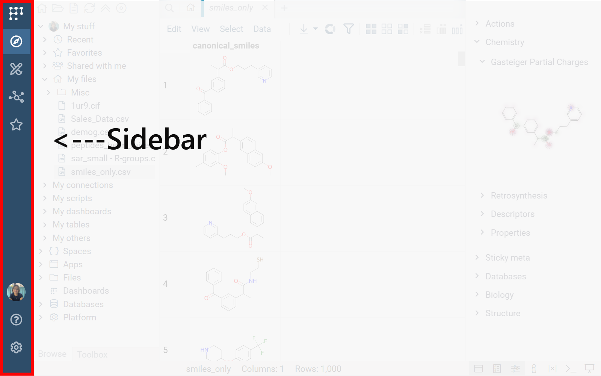
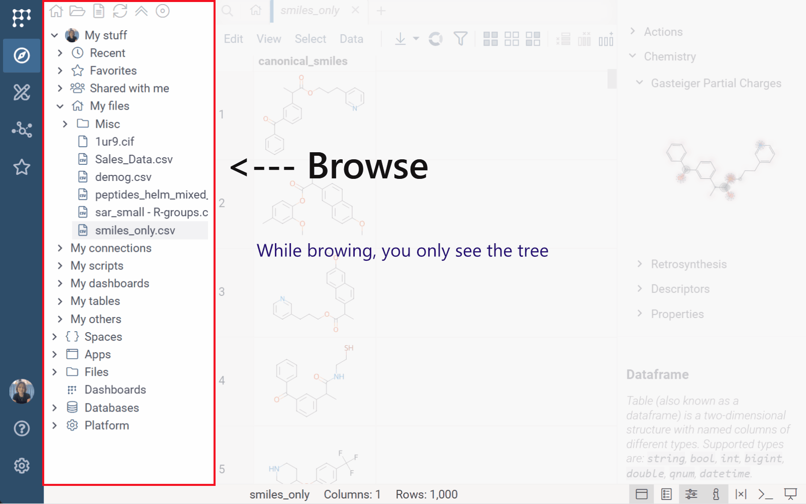
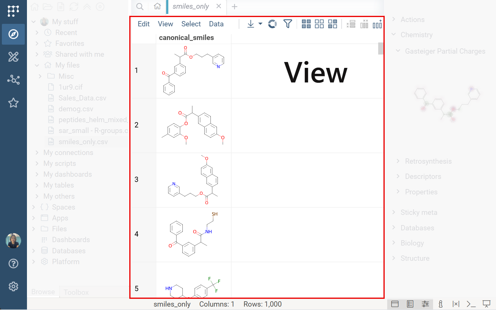
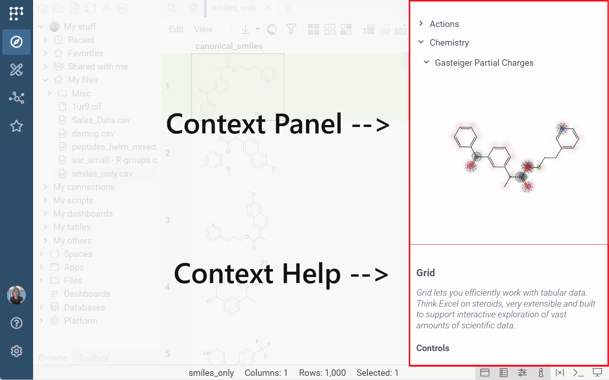
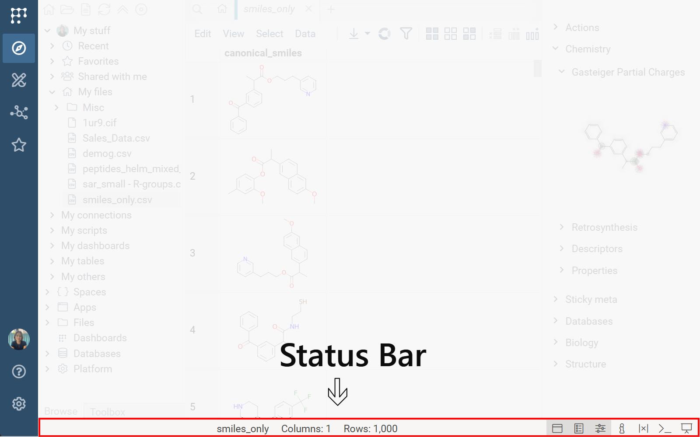
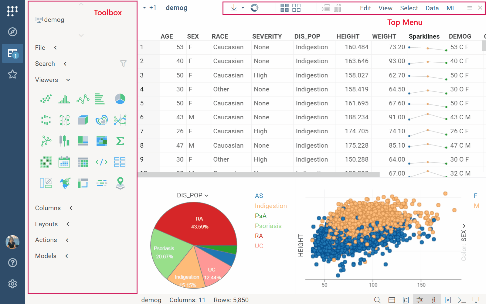
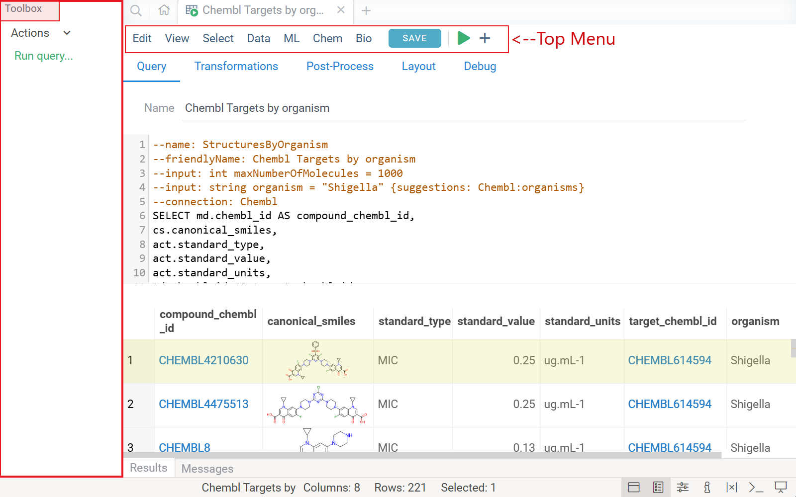
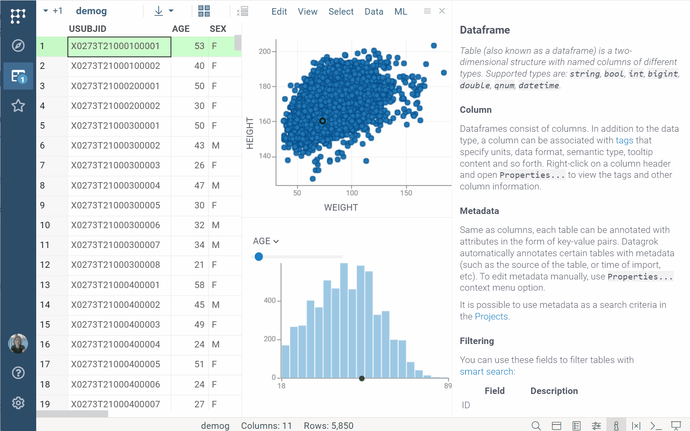
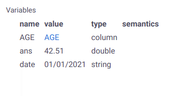

```mdx-code-block
import Tabs from '@theme/Tabs';
import TabItem from '@theme/TabItem';
```

This page explains how the Datagrok interface is organized, how its components
work together, and how to navigate the platform. 

## Design principles

Datagrok builds the interface dynamically based on meaning. Whenever you open or
click something, Datagrok looks at:
* what it is
* what it contains, and
* what can be done with it 

Then it assembles the right UI automatically - the right view, panels, actions,
tools, and visualizations.

Instead of fixed screens, the UI is made of modular components that appear,
disappear, or adjust based on context. This creates a workspace that "groks"
your data and helps you act on it.

### Why this design

<h4>Scientific work is nonlinear</h4>

You move between raw data, transformations, visualizations, computations,
statistics, model results, and heterogeneous data. Datagrok provides a workspace
that allows all those steps to coexist and connect naturally.

It also gives the flexibility to arrange the workspace around your analysis:
stack, dock, collapse, float, or hide elements or open multiple views
side-by-side.

<h4> Many workflows - one mental model</h4>

Across domains and apps:

* the same **Table View**
* the same **Context Panel**
* the same docking and drag-and-drop
* the same viewer behavior
* the same semantic mechanisms

…all work consistently.

The "magic" comes from Datagrok’s semantic and execution layers:

* [Semantic types](../../govern/catalog/semantic-types.md): Identify the meaning of data (UIDs, molecules, zip codes, etc.)
* [Functions](../concepts/functions/functions.md): Describe operations and generate UI elements for those data types
* [File handlers](../../develop/how-to/files/file-handlers.md) and [file viewers](../../develop/how-to/files/create-custom-file-viewers.md): Inspect and interpret file format and content to choose the correct "document type" (e.g.,  protein viewer for PDB files, **Table View** for tabular data)

Together, they determine:
* which [view](#views) opens
* which viewer is used
* which actions appear in [menus](#toolbox--top-menu)
* which [info panes](#info-panes) show up in the [Context Panel](#context-panel)
* which tools appear in the [Toolbox](#toolbox--top-menu)

Once you learn the core components, your skills transfer across the entire
ecosystem, and teams can collaborate freely.

The sections below describe the workspace layout and its core building blocks.
Specific data tools are documented in their
respective sections. Once you're ready to move on to data work, start with
[Table View](../../visualize/table-view-1.md) and 
[viewers](../../visualize/viewers/viewers.md). These are the key interfaces for
exploration and visualization and are covered in the _Visualize_ section.

## Workspace layout

The workspace is organized into five main areas:

<Tabs>
<TabItem value="sidebar" label="Sidebar" default>

Has icons for commands, [Browse](#browse), [Toolbox](#toolbox--top-menu), [dashboards](../concepts/project/dashboard.md), favorites, your profile, help, and settings.<br/>



</TabItem>
<TabItem value="browse-toolbox" label="Browse/Toolbox">

[Browse](#browse) (navigation) and/or [Toolbox](#toolbox--top-menu) (view-specific tools). 
Toggle both from the **Sidebar**.<br/> 



</TabItem>
<TabItem value="view" label="View">

Your current [view](#views) - the main working surface.



</TabItem>
<TabItem value="panels" label="Panels">

Typically on the right. Available panels include: [Context Panel](#context-panel), [Context Help](#context-help), [Console](#console), [Variables](#variables). By default, only **Context Panel** and **Context Help** are visible. Toggle all from the **Status Bar**.



</TabItem>
<TabItem value="status-bar" label="Status Bar">

Has three sections: 
* left: progress bar for running tasks
* center: view-specific info (e.g., table name, row counts, etc.)
* right: viewing mode and [panel](#panels) toggles



</TabItem>
</Tabs>

### Views

A _view_ is a working surface for a specific task (e.g., **Home Page**, 
**Table View**, **Query Editor**) - similar to opening
Word, Excel, or PowerPoint in Microsoft Office.

A view:
* usually occupies the center workspace
* has a **Top Menu**
* may come with a [Toolbox](#toolbox--top-menu)
* contains task-specific components (viewers, UI controls, etc.)

<details>
<summary>Examples</summary>

<Tabs>
<TabItem value="table-view" label="Table View" default>

A [Table View](../../visualize/table-view-1.md), used for [exploratory data analysis](../solutions/workflows/eda.md), 
has a **Top Menu** with data-related commands and a **Toolbox** that provides quick access
to viewers, [view layouts](../../visualize/view-layout.md), models, and more. 



</TabItem>
<TabItem value="query-editor" label="Query Editor">

A [Query Editor](../../access/databases/databases.md#query-editor) has **Top Menu** for working with query output and **Toolbox** with available actions.  



</TabItem>
</Tabs>
</details>

To learn how a particular view works, see its
corresponding section in the documentation (e.g., **Visualize** > **Table View** or **Access** > **Databases** | **Query Editor**).

You can open multiple views and switch between them. Datagrok has three viewing modes:

* **Tabbed**: Browser-style tabs
* **Simple**: Switch using a dropdown selector
* **Presentation**: Hides everything except the active view

Try all (toggle from the **Status Bar**) to see which fits your workflow.

You can also split the center workspace (click the view's **Hamburger** icon and select **Split right** or **Split down**). 

#### Toolbox + Top Menu

These components expose view-specific actions:

* **Top Menu** (fixed at top of view): View-specific commands
* **Toolbox** (left side, tabs with [Browse](#browse)): Used for placing view-specific UI controls: buttons, fields, icons, links, dropdown menus, etc. For example:
   * **Table View**: Search, viewer icons, layouts, models, and more
   * Platform **Settings** view: Links to all settings views 

In browsing mode, the left panel shows **Browse** only. When a view becomes
persistent (e.g., on double-click or when you make an edit) or when you open the
**Toolbox** explicitly via the **Sidebar** icon, **Toolbox**
appears as a tab alongside **Browse** (at the bottom of the left panel). You can
stack, close, or switch between **Browse** and **Toolbox** as needed. Reopen
both from the **Sidebar**.

### Browse

**Browse** is your entry point to everything on the platform - projects,
queries, files, connections, platform settings, apps, and more. It
also serves as your data catalog: an item's location 
determines its access rights ([learn more](../concepts/project/space.md)).


Clicking an item in the tree opens it's view in the center, for example:

* Tables, dashboards, files open as working documents you can explore and edit
* Folders open as folder views
* [Entity](../concepts/objects.md) catalogs (functions, users, layouts, etc.) open as galleries
* Database schemas open as interactive schema browsers

When you click an item, each item's view replaces the previous one. This
is browsing mode. A view becomes persistent (remains open until manually closed)
when you:
1. Make any edit
1. Pin the view (in [tabbed mode](#workspace-layout), hover over the tab's blue left border and click the pin)
1. Double click an item

You can't convert a persistent view back to browsing mode. To start a new
browsing session, on the **Sidebar**, click the **Browse** icon 
(<FAIcon icon="fa-solid fa-compass"/>) and then click the item from the tree.

For details on what each section of the Browse tree contains, see [Browse
tree](#browse-tree) in the Navigation section.

<details>
<summary>Browse controls</summary>

**Browse's Top Menu**:

* <FAIcon icon="fa-solid fa-house" size="1x"/>: open **Home Page** view 
* <FAIcon icon="fa-regular fa-folder-open" size="1x"/>: import file
* <FAIcon icon="fa-regular fa-file-lines" size="1x"/>: open **Import text** view
* <FAIcon icon="fa-solid fa-arrows-rotate" size="1x"/>: refresh tree (pulls updates from the server)
* <FAIcon icon="fa-thin fa-angles-up" size="1x"/>: collapses all tree nodes
* <FAIcon icon="fa-sharp fa-thin fa-circle-0" size="1x"/>: locate current object

**Within the tree**:
* **Click**: opens the item's in an unpinned view
* **Double-click**: opens the item in a persistent (pinned) view
* **Right-click**: opens the context menu

**Keyboard navigation:** 

Use the up/down (↑↓) keys to navigate and the left/right (←→) keys to expand a tree node.
</details>

### Panels

Panels provide contextual and auxiliary tools:

* [Context Panel](#context-panel): settings, actions, and info for the current object
* [Context Help](#context-help): help on the current object
* [Console](#console): command line
* [Variables](#variables): script debugging 

Toggle any panel from the **Status Bar**. 

#### Context Panel

**Context Panel** serves two roles:

1. **Information and actions for your current object**: A container for [info panes](#info-panes) that updates automatically based on context:
   * Click a molecule and see its weight, toxicity, and structure
   * Click a query and see its SQL code and parameters
   * Click a column and see statistics
1. **Component settings**: Access to settings for visual UI components like [viewers](../../visualize/viewers/viewers.md)
or [widgets](../../visualize/widgets.md) (via the **Gear** (<FAIcon icon="fas fa-gear" size="1x" />) icon).


**Context Panel** keeps history and favorites, and you can clone it into a static window.

<details>
<summary>Context Panel controls</summary>

Hover over header to reveal:

|      Icon        |            Action                                           |
|------------------|-------------------------------------------------------------|
| Back/Forward     | Navigate between viewed objects                             |
| Clone and detach | Detach a static copy of the **Context Panel** preserving its content. This action opens a copy of the **Context Panel** in a separate window. The content of the cloned panel remains static, while the main **Context Panel** continues to update with the current object.  |
| Collapse all     | Collapse all info panes                                     |
| Expand all       | Collapse all info panes                                     |
| Favorites        | Show the **Context Panel** for your favorite object             |


> _Note_: You can favorite any Datagrok [entity](../concepts/objects.md) like a data connection, query, or a project. You can't favorite an individual file or a specific value within a cell. <!--This can be solved with sticky meta.Suggestion >submitted-->

</details>

##### Info panes

Info panes provide context-specific information or actions. 
Each info pane serves a specific purpose. The available panes depend on what you
click — chemistry data surfaces different panes than column data or a query. For
default info panes, see [Info panes reference](info-pane-reference.md).

<details>
<summary>Info pane examples</summary>

<Tabs>
<TabItem value="details-actions" label="Details and actions" default>

In this example, the info panes help you browse database objects, get data, and more. For example,
when you click a table, the info panes let you view the table's metadata,
dynamically preview the table's contents, or run queries.

<br/>


</TabItem>

<TabItem value="molecule" label="Calculation and visualization">

In this example, a number of scripts execute when you click a molecule,
including calculation and visualization of the molecule's Gasteiger partial charges,
solubility prediction, toxicity and so on. 
[Learn more about the cheminformatics info panes](../solutions/domains/chem/chem.md#exploring-chemical-data).

<br/>


</TabItem>
<TabItem value="image-augmentation" label="Image augmentation">

In this example, a Python script executes against JPEG and JPG files during the
indexing process to get custom metadata (cell count) and performs specified
transformations (segmenting cells). When you click a corresponding image,
the info pane shows augmented file preview and the number of detected cell
segments.

<br/>


</TabItem>
<TabItem value="dialogs-apps" label="Running queries">

In this example, a query executes a similarity search on the ChEMBL database.
When you click the query, it shows the **Run** info pane with a
sketcher for drawing query molecules. As you sketch, the **Context Panel** updates
dynamically to show details about your substructure.

<br/>


</TabItem>
</Tabs>
</details>

Info panes are displayed based on specific conditions: user, dataset, context, user preferences.

When the current object changes, the conditions of all registered info panes are
checked against the specified parameters, and matching info panes are displayed
accordingly. 

Subject to your permissions, you can control the display of an info pane from
the UI. To hide a specific info pane, click the **Gear** icon on the pane
header, then click **Do not show**. To manage hidden panes, on the **Sidebar**,
click **Settings** > **Panels**, and add or remove hidden panes from there.

#### Context Help

**Context Help** shows help for the current object. By default,
it's located in the bottom right corner of the screen. 
Toggle with <kbd>F1</kbd> or via the **Status Bar**.

To make an object current, click it. 



<details>
<summary>Context Help controls</summary>

Hover over header to reveal:

|      Icon                |            Action              |
|--------------------------|--------------------------------|
| Back/Forward             | Navigate between visited pages  |
| Home page                | Open Datagrok's wiki home page |
| Clone and extend to view | Open a page as your main view   |
| Open in new tab          | Open the help page in a new browser window      |

</details>

#### Console

The **Console** is Datagrok's command-line interface. 
It lets you [call functions](../concepts/functions/function-call.md), inspect objects, record
[macros](../concepts/functions/functions.md#macros), and understand how the platform behaves under the hood.
Clicking the function in the **Console** updates the [Context Panel](#context-panel) with information about it. 

Open with <kbd>~</kbd> or via the **Status Bar**.


<details>
<summary>Command examples</summary>

Console uses [GrokScript](../../develop/under-the-hood/grok-script.md) to call
platform functions. For example:

Run the `Mul` command (multiply two numbers) with the specified parameters:

```
Mul(2,3)
```

Edit parameters of the `Mul` command and evaluate it in a dialog window:

```
Mul
```

Get help for the `Mul` command:

```
Mul?
```

Access the current object from the console with the `o` variable:

```
o.name
```

Select rows with empty values in the `HEIGHT` column:

```
SelectRows("demog", IsNull("HEIGHT"))
```

Extract rows with empty values in the `HEIGHT` column into a new dataframe:

```
ExtractRows("demog", IsNull("HEIGHT"))
```

</details>

<details>
<summary>Console controls</summary>

At the top of the **Console**, there are two icons:

* **Clear**: Clears the **Console**
* **Variables**: opens the [Variables](#variables) panel.

|     Key     |    Action             |
|-------------|-----------------------|
| Tilde `~`   | Open the console      |
| Tab         | Complete a command    |
| Up/Down     | Previous/next command |

</details>

#### Variables

Use the **Variables** panel to declare and inspect variables for script debugging. 
Open with <kbd>Alt + V</kbd> or via the **Sidebar**.



You can declare variables as follows:

* Assign directly in the [Console](#console), e.g., `x = 5`
* Drag and drop an object to the **Variables** panel.

## Arranging your workspace

Datagrok's layout system is fully flexible. 
You can customize the default [panel](#panels) visibility in
**Sidebar** > **Settings** > **Windows**. You can also reposition and resize almost anything. 
Drag any component's header to see
highlighted drop zones, then dock it where you need it. You can: 

* dock components into highlighted drop zones  
* float panels or [info panes](#info-panes) as separate windows  
* stack components vertically or horizontally  
* resize any docked area  
* [split views](#views) to work side-by-side

The only fixed elements are the **Sidebar** and the **Status Bar**.

Most rearrangement happens at the application level (views and panels).
However, some views (especially [Table View](../../visualize/table-view-1.md)) 
also have their own internal docking manager that lets you organize
components (e.g., viewers) inside the view without affecting the global layout.


<details>
<summary>Developer notes</summary>

**Top-level docking**  
- Controlled via `grok.shell.dockManager`  
- Supports docking/undocking windows across main workspace  
- Use `View.dockNode` to programmatically dock a view  

**Nested docking**  
- Certain views (e.g., Table View) include their own `view.dockManager`  
- Arranges viewers and UI components _within_ the view  
- Nested components cannot undock to global workspace

</details>

## Drag and drop

Drag and drop objects to quickly move or apply them. Available drop zones are
highlighted when you start dragging.

Examples:
* Drag **columns** to reorder them within a spreadsheet
* Drag **columns** to viewers, dialogs, or filters
* Drag **items in Browse** to reorganize the tree structure
* Drag **entities from Browse** to info panes to reference them (e.g., adding a user to a chat) or to panels to work with them (like dropping a function into Console to inspect or run it)


## Navigation

Use this section when you want to understand how to find things,
not how each individual view or panel behaves (for that, see [Workspace layout](#workspace-layout)).
For basic tasks like "export a file" or "create a project", see [Basic tasks](basic-tasks/basic-tasks.md).

Datagrok provides several navigation mechanisms so you can pick the most
efficient path for what you’re doing:

* [Browse](#browse-tree): Platform-wide catalog of everything on the platform - 
  your personal workspace, projects, apps, dashboards, files, queries, connected
  repositories, users, roles, and so on

* [Favorites](#favorites): One-click access to bookmarked entities

* [Home Page](#home-page): Your personal landing view with activity feed, recent
  items, notifications, and other widgets (depends on installed plugins and
  enterprise configuration)

* [Global search](#global-search) (accessible from **Home Page**): Find anything
  across the platform and connected sources: internal, external (e.g., ChEMBL), or general knowledge
  (e.g., Wikipedia). Search by keywords or tags, registered identifiers, or ask
  natural language questions like "how do I...?" or
  "bioactivity for _Shigella_"

* [Routing](#routing): Bookmark and access the exact [view](#views) states using URLs
  (e.g., a dashboard with filters set to a specific country)

### Browse tree

The **Browse** view (opened from the **Sidebar**) is the main entry point to
everything on the platform. For how the Browse view itself looks and behaves, 
see [Browse](#browse). This section focuses on _what_ you see in the tree.

<Tabs>
<TabItem value="my-stuff" label="My stuff" default>

|  |
|--|   
|**My stuff** is your personal project - your private folder. Anything you create or upload without choosing a specific project goes here, along with items others have shared with you. The tree offers multiple ways to access this content: **Recent**, **Favorites**, **Shared with me** (grouped by sharing user), and item type-based groups like **My Dashboards**, **My Files**, etc.|

</TabItem>
<TabItem value="spaces" label="Spaces">

|  |
|--|
|**Spaces** organize items into shared "folders" (projects, teams, departments, clients, etc.). Access permissions are set at the space root level and inherited by contents. Moving an entity between spaces changes both its location and who can access it. [Learn more about Spaces](../concepts/project/space.md)|

</TabItem>
<TabItem value="apps" label="Apps">

|  |
|--|
|**Apps** shows installed applications (e.g., **Tutorials**, **HitDesign**, **MolTrack**). Apps appear here after installation from the plugin repository (see the _Platform_ tab).|

</TabItem>
<TabItem value="files" label="Files">

|  |
|--|
|**Files** is a file browser for your connected file storage. The tree is organized into several views: **My files**, **Spaces** (files belonging to individual projects), **App Data** (files bundled with installed apps, e.g., clinical studies for **Clinical Case**), and **Demo** (sample files for exploring platform capabilities on Datagrok's public instance).|

</TabItem>
<TabItem value="dashboards" label="Dashboards">

|  |
|--|
|**Dashboards** shows all [dashboards](../concepts/project/dashboard.md) available  to you - your own plus those shared with you, subject to permissions.|

</TabItem>
<TabItem value="databases" label="Databases">

|  |
|--|
|**Databases** shows all connections available to you. At the top level, you see each connected database. Expanding a database shows its contents: connections, tables and their columns, and any saved queries.<br/>To explore structure and relationships visually, use the [Schema Browser](../../access/databases/#schema-browser) (right-click a connection and choose **Browse schema**).|

</TabItem>
<TabItem value="platform" label="Platform">

|  |
|--|
|Everything _above_ **Platform** represents end-user work (your data, projects, apps, and analyses).<br/>Everything _inside_ **Platform** defines how your Datagrok instance operates: its extensions, configuration, security model, and the components from which UI and workflows are built (see [Design principles](#why-this-design)). This is where platform admins and power users add and manage plugins, functions, API integrations, access control, runtime environments, and other assets that support the rest of the platform.|

</TabItem>
</Tabs>

#### Datagrok entities vs. files

In **Browse**, files appear alongside other objects in the tree. While looking similar,
files are fundamentally different.

**Most items in Browse are _[entities](../concepts/objects.md)_** (e.g.,
dashboards, queries, connections, users, and so on). 
Entities are native Datagrok objects stored inside Datagrok's database with full
metadata. Because of that, they all support the same operations: bookmarking,
access control and sharing, version history, etc.

**Files, by contrast, live outside Datagrok**. The **Files** section in
**Browse** points to external storage (file shares, cloud buckets, S3, your
Datagrok server, etc.). When you open a file, Datagrok interprets its contents
on the fly - tabular files become temporary dataframes, images or protein
structures open in viewers, etc. For tabular data, you can then save the
temporary dataframe as a Datagrok entity (a table or dashboard). You can also
add files to Datagrok projects so they inherit project-level permissions. In all
cases, the original file remains external. This is why certain actions
available for entities may not be available for
files, even though both appear in the **Browse** tree.

### Favorites

Add any [entity](../concepts/objects.md) to favorites for quick access. There are
several ways to favorite an item:
* Right-click the entity and select **Add to Favorites**
* On the **Sidebar**, click the **Favorites** icon (<FAIcon icon="fa-regular fa-star" size="1x"/>). This opens the
  **Favorites Panel**. Drag the entity directly into it.
* Open the **Favorites** view (**Browse > My Stuff > Favorites**) then drag an
  entity from the tree directly into the view.

Access favorites from either the **Favorites Panel** (toggle from **Sidebar**), **Context Panel** (click the star icon in the header), or directly from **Browse > My Stuff > Favorites**.

To remove an item from favorites, click the item, then click the star icon next
to its name in the **Context Panel**. The star changes from orange to clear,
indicating the item is no longer favorited.


### Home Page

When you first log in (or when you click the Home (<FAIcon icon="fa-solid fa-house" size="1x"/>) 
icon on the Browse's **Top Menu**), Datagrok opens the **Home Page**,
a landing view that combines global search with a set of customizable widgets.

At the top is the global search bar, your entry point for
searching across Datagrok and connected external sources (see [global search](#global-search)). 
As soon as you start typing, the widget area is
replaced with live search results.

When the search bar is empty, Datagrok shows
[widgets](../../visualize/widgets.md). Widgets surface information or shortcuts
supplied by your installed plugins. For example, activity summaries, learning
resources, usage insights, or domain-specific tools. What you see
depends entirely on how your instance is configured.

To customize the visibility of available widgets, click **Customize widgets...** at the bottom
of the **Home Page**. This opens the **Context Panel** where you can enable or
disable widgets using checkboxes.

#### Global search

When you type in the global search bar (accessible from the **Home Page**),
Datagrok routes your query through several mechanisms at once:

* **Metadata-based entity search**: Finds platform [entities](../concepts/objects.md) by name, description, [tags](../../govern/catalog/tags.md), [parameters](../concepts/objects.md#parameters), and [properties](../concepts/objects.md#properties). This is deterministic, exact matching. Datagrok searches over what it knows about the objects it stores.
   <details>   
   <summary>Entity search patterns</summary>
   
   Looks for 'biologics' in title and description:

   ```
   Biologics
   ```

   Tagged as #demo:

   ```
   #demo
   ```

   Tagged as either either #demo or #chem:

   ```
   #demo or #chem
   ```

   Created in the last 7 days:

   ```
   createdOn > -1w
   ```

   Complex conditions:

   ```
   (#demo and #chem) or author = "john@google.com"
   starredBy = @current or author = @current
   ```

   Created by recently joined users:

   ```
   author.joined > -5d
   ```
   To apply multiple filters, use
   `AND` and `OR` operators and parentheses.
   </details>

* **Pattern-based identifier search**: Developers can [register custom identifier patterns](../../develop/how-to/db/register-identifiers.md) (e.g., `CHEMBL\d+` for ChEMBL compound IDs). When a query matches a registered pattern, Datagrok recognizes the identifier, queries connected data sources, executes relevant [functions](../concepts/functions/functions.md), and shows the results accordingly (e.g., as info cards or as [info panes](#info-panes) in the **Context Panel**).
* **Natural language search patterns**: Pro users can define [natural language search patterns for functions](../concepts/functions/func-params-annotation.md#search-integrated-functions) (e.g., `bioactivity for ${target}`). Searching for "bioactivity for Shigella" automatically executes the function (e.g., runs a query) with "Shigella" as the parameter.
* **LLM-powered interpretation and orchestration** (in Beta): Adds intelligence on top of deterministic search. The LLM interprets natural-language questions, normalizes fuzzy input, searches documentation, and orchestrates function execution and chaining.

Search respects your access permissions. You only see results for items you are
allowed to access. For external sources, search uses platform-level API
credentials or public endpoints. Results availability depends on your instance's
configuration.

### Routing

Datagrok assigns a unique URL to every [view](#views), file, or
[entity](../concepts/objects.md). This means you can:

* bookmark these URLs for quick access later
* copy them from your browser to share with colleagues
* build links into documentation or reports
* navigate programmatically via the API.

When you open these links, Datagrok loads the applicable view and restores any state
encoded in the URL (such as filters in a **Table View** or specified parameters in query output),
subject to permissions.

<details>
<summary>URL patterns</summary>
      <details>
      <summary>Dashboards</summary>

      Dashboards use this URL pattern:

      ```
      https://<your-instance>/p/{namespace}.{project-name}/{view-name}
      ```

      Where:
      * `namespace`: Namespace containing the dashboard (e.g., `demo`)
      * `project-name`: Project name (e.g., `pic50`)
      * `view-name`: Optional. Specific [Table View](../../visualize/table-view-1.md) within the project

      Example:

      `https://public.datagrok.ai/p/demo.pic50/desc_canvas_aug30`

      This opens the `pic50` dashboard in the `demo` namespace and displays the
      `desc_canvas_aug30` **Table View**. If you omit the **Table View** name, Datagrok opens the
      project's first **Table View**.
      </details>
 
      <details>
      <summary>Files</summary>
      
      File shares are addressable by URL using this pattern:

      ```
      https://<your-instance>/files/{namespace}.{share-name}/{path}
      ```

      Examples:
      * `https://public.datagrok.ai/files/demo.testjobs.files.demofiles`
      * `https://public.datagrok.ai/files/demo.testjobs.files.demofiles/chem/zbb`

      File share URLs support nested directories, so you can bookmark any folder depth directly. The second example opens the `zbb` folder inside the `chem` directory of the `demofiles` file share.
      </details>

      
      <details>
      <summary>Parameterized queries</summary>
      
      Saved queries can be executed directly from URLs:

      ```
      https://<your-instance>/q/{namespace}.{connection}.{query}?param1=value1&param2=value2
      ```

      Example:  
      `https://public.datagrok.ai/q/Demo.CoffeeCompany.StoresInState?state=NY`

      This executes the `StoresInState` query with `state=NY` and displays the
      results. All query parameters are passed as URL query string arguments.
   </details>
</details>

> **Note:** Applications exposed as entities (under `/apps`) can be opened via URL like other entities. Any additional app-specific routing beyond the base URL depends on how the app is implemented.

## Next steps

Now that you understand the UI and navigation:
* You can start working with data: [Table View](../../visualize/table-view-1.md)
* Learn about project organization: [Spaces](../concepts/project/space.md)
* Try common tasks: [Basic tasks](basic-tasks/basic-tasks.md)
* Learn more about core platform concepts (entities, functions, etc.): [Core concepts](../concepts/concepts.md)