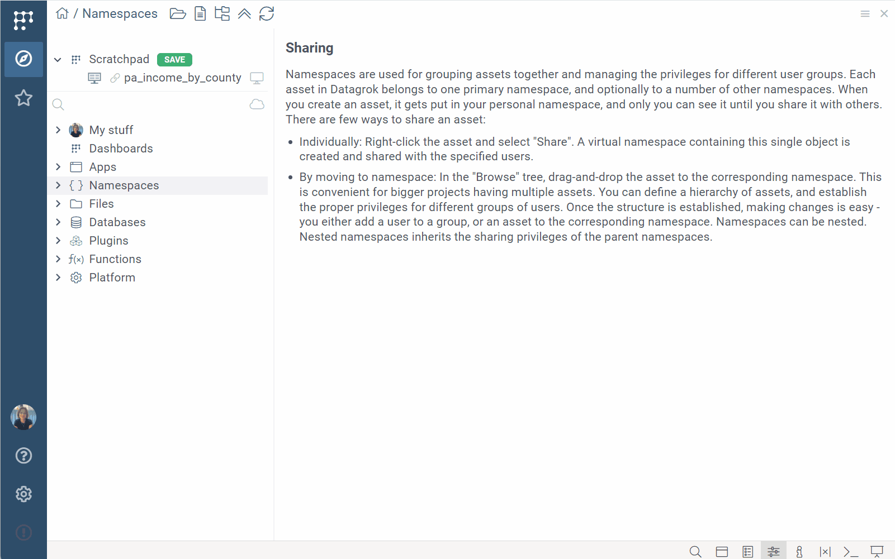
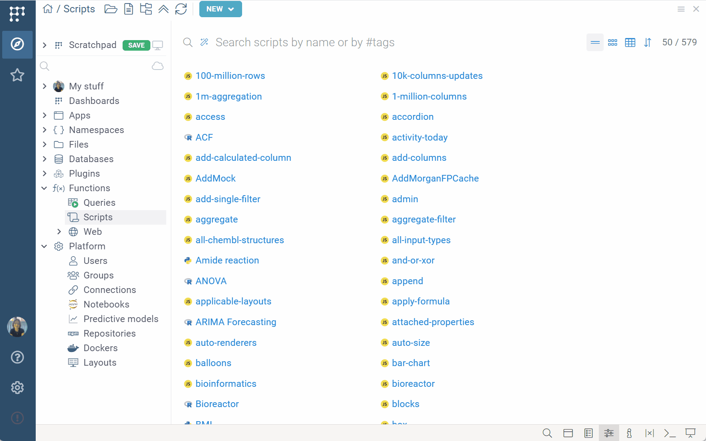
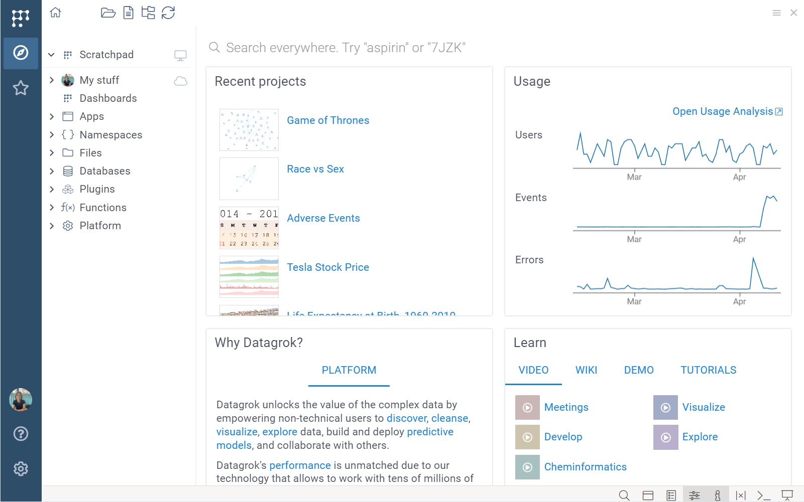
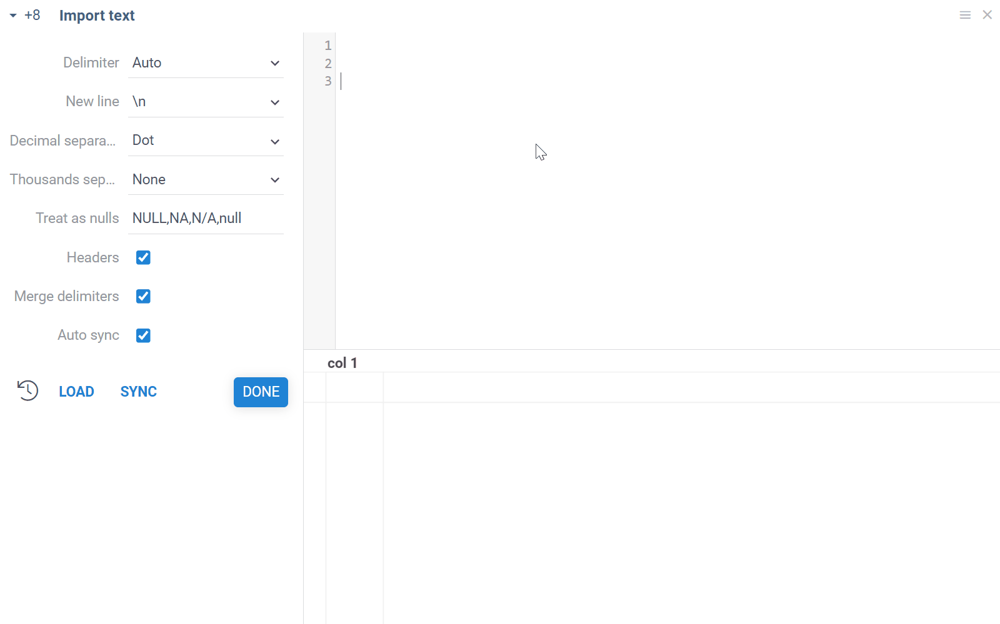

```mdx-code-block
import Tabs from '@theme/Tabs';
import TabItem from '@theme/TabItem';
import BrowseTree from './img/browse-tree.png'
```

**Browse** is a [view](views.md) that organizes all Datagrok objects (like
files, queries, or projects) in a tree, allowing you to search,
preview, manage, and access anything in Datagrok. To open **Browse**, click the **Browse (<FAIcon icon="fa-solid fa-compass" size="1x"/>) icon** on the **Sidebar**.


**Browse** is divided in two sections:

* **Scratchpad** (<FAIcon icon="fa-solid fa-display" size="1x"/>): Located in the upper section, [Scratchpad](#scratchpad) shows all open entities, grouped by [project](../../concepts/project/project.md). It's used to manage and save your work in progress.
* **Main tree** (<FAIcon icon="fa-solid fa-cloud" size="1x"/>): The lower section shows all entities saved to the server and is your primary navigation and data management tool, organized as follows:
   * **My stuff**: This is your personal directory. In addition to entities you create or others share with you, it contains entities relevant to you like your favorites or recent items.
   * **Namespaces**: Here, entities are organized by _project_, typically aligned with organizational use, such as by project or department. To learn how to create projects and add entities to them, see [Projects](../../concepts/project/project.md).
   * The rest of the tree is grouped by entity type:
      * [Dashboards](../../concepts/project/dashboard.md)
      * Apps
      * [Files](../../../access/files/files.md)
      * [Databases](../../../access/databases/databases.md) (includes available connections, queries, database schemas, tables, and columns)
      * **Platform**: Contains galleries for [plugins](../../plugins.md), [functions](../../concepts/functions/functions.md) (queries, scripts, [OpenAPI](../../../access/open-api.md)), [users](../../../govern/access-control/users-and-groups.md#users), [groups](../../../govern/access-control/users-and-groups.md#groups), [connectors](../../../access/databases/connectors/connectors.md), notebooks, predictive models, repositories, dockers, [layouts](../../../visualize/view-layout.md), as well as schemas and entity types for [sticky meta](../../../govern/catalog/sticky-meta.md)
   
Above the **Scratchpad**, is a **Top Menu**. From here, you can do the following:

* Open the [Home Page view](#home-page) (<FAIcon icon="fa-solid fa-house" size="1x"/>)
* Open a file from your local drive (<FAIcon icon="fa-regular fa-folder-open" size="1x"/>)
* [Import text](../../../access/files/files.md) (<FAIcon icon="fa-regular fa-file-lines" size="1x"/>)
* Toggle the **Browse** view (<FAIcon icon="fa-solid fa-folder-tree" size="1x"/>)
* Refresh the **Browse** view (<FAIcon icon="fa-solid fa-arrows-rotate" size="1x"/>)

For active [views](#entity-views), you may also see view-specific options, such as the **Create new connection** button for [databases](../../../access/databases/databases.md).

## Controls

Within the **Browse** tree:
* Click an object to open its [view](#entity-views) and update [Context Panel](../panels/panels.md#context-panel) and [Context Help](../panels/panels.md#context-help) with entity-specific information.
* Double click an object to open it.
* Right click an object to access context commands like _delete_ or _share_.

Use the up/down (↑↓) keys to navigate and the left/right (←→) keys to expand a tree node.

## Managing entities

To share, rename, delete, or perform other common actions, use the entity's context menu
(available on right-click).

To move entities between directories, use drag-and-drop. Depending on your
privileges, you can move entities as follows:

* Within the tree:
  * From anywhere on the tree, to **My stuff**
  * From anywhere on the tree, to **Namespaces**
  * Within **Namespaces**, between projects
* Within the **Scratchpad**:
  * Between **New project** and any other open projects. When you move an entity
between projects in the **Scratchpad**, the **Browse** tree updates to reflect
the change.

:::caution

Moving entities between projects 
impacts their hierarchy, names, and privileges. [Learn more about moving entities between projects](../../concepts/project/project.md#moving-entities-between-projects).

:::

## Entity search

Use the search bar on top to filter the content in the Browse tree. In addition to searching by name,
you can search by the entity's metadata,
like [tags](../../../govern/catalog/tags.md),
[parameters](../../concepts/objects.md#parameters), and
[properties](../../concepts/objects.md#properties). For example, entering
`#demo` shows all entities tagged with `#demo`, and `imported < 01/01/2024`
shows all entities imported before that date. 

To apply multiple filters, use `AND` and `OR` operators and parentheses.

<details>
<summary>Examples</summary>

Unstructured query; looks for 'biologics' in title and description:

```
Biologics
```

Tagged as #demo:

```
#demo
```

Tagged as either either #demo or #chem:

```
#demo or #chem
```

Created in the last 7 days:

```
createdOn > -1w
```

Complex conditions:

```
(#demo and #chem) or author = "john@google.com"
starredBy = @current or author = @current
```

Created by recently joined users:

```
author.joined > -5d
```

</details>

## Scratchpad

**Scratchpad** (<FAIcon icon="fa-solid fa-display"/>) contains objects that have not been saved as 
part of the project yet. For instance, when you open a CSV file from the local drive, it appears in 
the Scratchpad.


All open entities are stored in your browser's memory. If
you refresh or close your browser without saving your work to the server, you will lose it.

### Saving changes

When you upload an entity to the server, it needs to be assigned to a project.
By default, newly created entities are saved to your personal project under **My
stuff**. For changes to entities that belong to existing projects, you have [several saving options](../basic-tasks/basic-tasks.md#save-and-share-a-table). 

Post-upload, the **SAVE** button on the **Scratchpad** and the
[Table View](table-view.md) appear greyed out, indicating there are no unsaved changes.
Though the **SAVE** button turns grey, you can still click it to access additional
options, such as cloning a project, or saving just your personal view customizations.

<!---Update based on the latest changes from A.Paramonov

### Closing entities

In Datagrok, the visual representation of tabular data (a layout) is separated from the data (the table). Consequently, closing the **Table View** doesn't close the table.

To close an open table, you have these options:
1. On the **Scratchpad**, right click the table and select **Close**.
1. In the **Table View**, find the table on the **Toolbox** and close it.
1. If the table is part of a project with multiple open tables and you wish to
close all of them simultaneously, right-click the project in the Scratchpad and
select **Close**.


----->

### Version control

All entities and projects opened from the **Browse** tree are loaded locally in
your browser and are independent from their server-side versions. For example,
if you delete a table from a project in the **Browse** tree, it still remains
part of that project on the **Scratchpad**. Saving this table (or any others)
back to the original project will override server-side changes. Similarly, any
changes made locally won't affect the server version until you explicitly
override the project's content during the upload.

To see the changes in the **Browse** tree after you upload it to the server, on
the **Top Menu**, click the **Refresh (<FAIcon icon="fa-solid fa-arrows-rotate"
size="1x"/>) icon**.

## Entity views

Similar to a Windows Explorer, clicking an entity in the **Browse** tree opens an
entity-specific view alongside it. These views vary depending on what you click.
For example, clicking a file shows its contents, while clicking an entity gallery like **Layouts** shows all entities of that type.

Here are a few examples.

<Tabs>
<TabItem value="files" label="Files" default>

When clicking a file, what you see depends on the file's format and the data inside it. For example:

* Clicking a spreadsheet file visualizes its data using an interactive
  [spreadsheet viewer](../../../visualize/viewers/grid.md).
* Clicking an image file shows the image.
* Clicking a file with molecules or proteins visualizes them using [cell renderers](../../../visualize/viewers/grid.md#cell-renderers) and interactive
  viewers.
* Clicking text-based files like Markdown, TXT, and HTML opens a text editor.


:::note developers

You can create custom viewers for
[files](../../../develop/how-to/create-custom-file-viewers.md) and
[folders](../../../develop/how-to/folder-content-preview.md).

:::

</TabItem>
<TabItem value="databases" label="Databases">

Using **Browse**, you can explore relational databases by viewing their schemas, tables, column info, and query results.
<br/>


</TabItem>
<TabItem value="apps" label="Apps">

Clicking an app opens an app-specific view, which can be it's landing view or a README.


</TabItem>
<TabItem value="dashboards" label="Dashboards">

Clicking a [dashboard](../../concepts/project/dashboard.md) shows a fully interactive [Table View](../views/table-view.md).

<br/>



</TabItem>
<TabItem value="entity-galleries" label="Entity galleries">

Clicking a directory that contains entities of the same type (like queries or
layouts) opens a **Gallery** view. This view typically has three display modes
(cards, table, list) and a search bar that lets you [search for a specific
entity](#entity-search), such as by name or tag.

<br/>



</TabItem>
</Tabs>

Like other _views_, _entity views_ are fully interactive and support drag-and-drop and docking. To learn more about the Datagrok UI, see [User interface](../../navigation/navigation.md).

## Home page

When you first log in or click the **Home (<FAIcon icon="fa-solid fa-home"/>) icon** on the **Top Menu**, **Browse** shows a special landing view called **Home Page**. This view contains
[widgets](../../../visualize/widgets.md) like **Recent projects** or **Usage**.
The widgets you see depend on the [plugins](../../plugins.md) installed. For example, the
**Recent projects** widget is provided by the [PowerPack
package](https://github.com/datagrok-ai/public/tree/master/packages/PowerPack),
and the **Learn** widget appears with the [Tutorials
package](https://github.com/datagrok-ai/public/tree/master/packages/Tutorials).

Above the main area, there is a search ribbon for searching anything both within and outside the platform.

<br/>



You can choose which widgets to display<!--, arrange their order, and assign custom names-->.
To do this, hover over the widget's top to access its controls. You can close
a widget or adjust its settings using the [Context Panel](../panels/panels.md#context-panel). To manage hidden widgets, go to **Sidebar** > **Settings** > **Panels**.

:::note developers

You can [build custom widgets](../../../develop/how-to/home-page-widgets.md) to show up on the Home page.

:::

## Importing text

You can parse delimiter-separated text to table by clicking on the "Open text" icon on top.
Paste your text or edit it right there, adjust the import parameter until you get it right, 
and click "DONE" to open the resulting table in the workspace. 



<!--TODO: Add more info on how the search works here. Also, add a link wrt how to customize the home page programmatically -->


