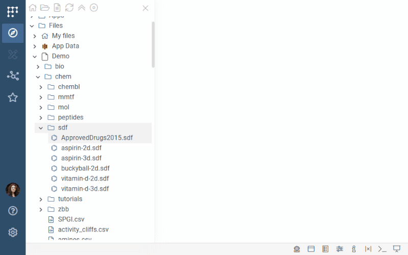
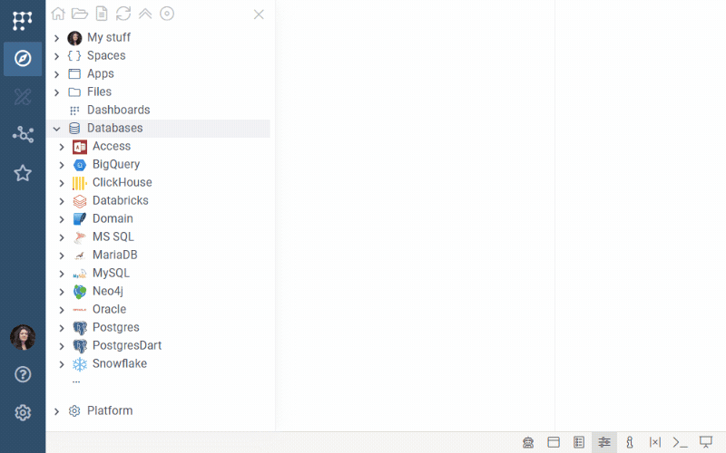
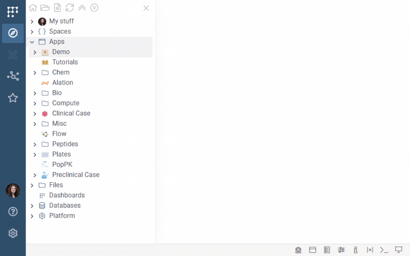
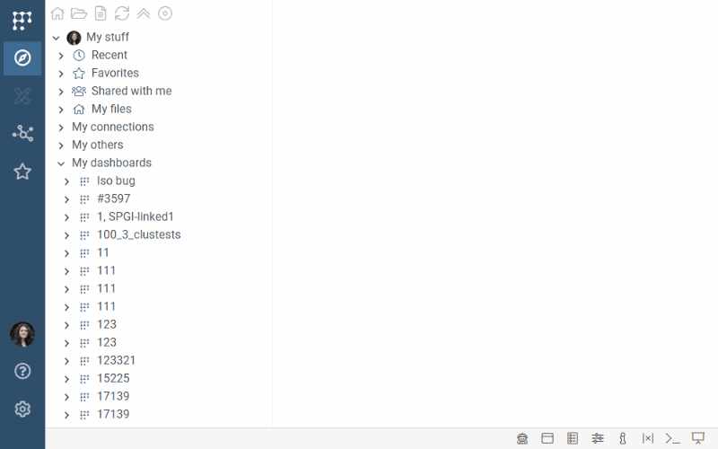
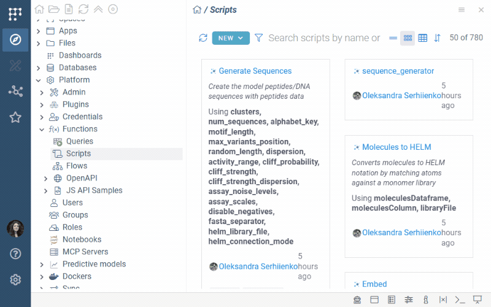
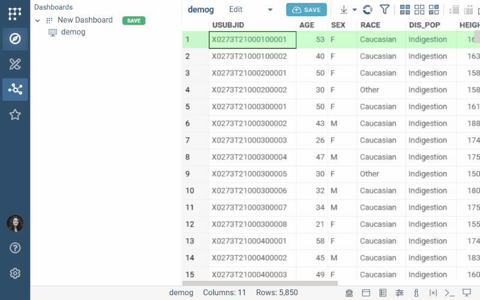
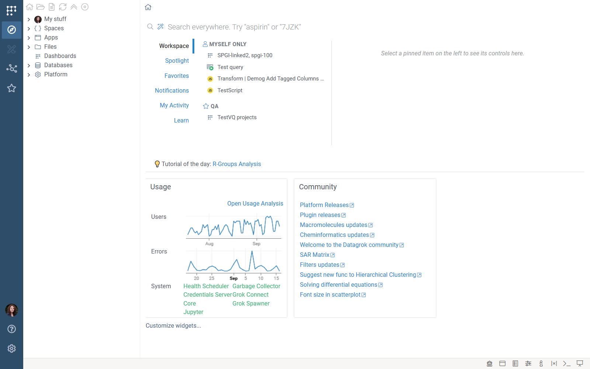
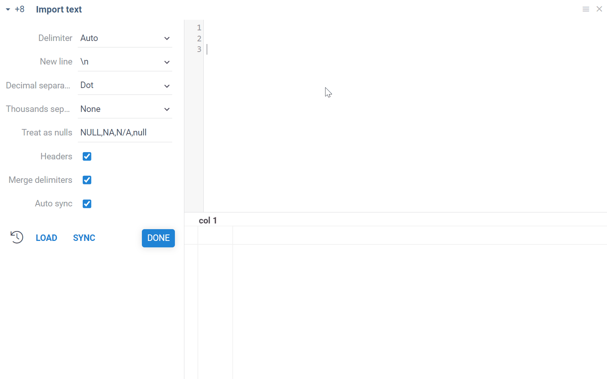

```mdx-code-block
import Tabs from '@theme/Tabs';
import TabItem from '@theme/TabItem';
import BrowseTree from './img/browse-tree.png'
```

**Browse** is a [view](views.md) that organizes everything saved on the
Datagrok server (files, queries, dashboards, spaces, and so on) in a tree.
From here, you can find, preview, open, and manage anything in Datagrok.
To open **Browse**, click the **Browse (<FAIcon icon="fa-solid fa-compass" size="1x"/>) icon**
on the **Sidebar**.


Work in progress that isn't saved to the server yet doesn't appear in
**Browse**. It lives in the **Dashboards** panel on the **Sidebar**. See
[Unsaved work](#unsaved-work).

## Browse tree

The tree has seven top-level nodes, in this order:

* **My stuff**: Your personal directory. It starts with **Recent**,
  **Favorites**, and **Shared with me**, followed by folders for the entities
  you own, grouped by type: **My connections**, **My dashboards**,
  **My scripts**, **My tables**, and others. Everything you create is saved
  here unless you save it to a space.
* **Spaces**: Team spaces, where entities are organized by project,
  department, or any other structure your organization chooses. A space can
  hold dashboards, queries, files, and child spaces, and its permissions
  apply to everything in it. To learn more, see [Spaces](../../concepts/project/space.md).
* **Apps**: Applications from installed [plugins](../../plugins.md), such as
  **Tutorials** and the demo app.
* [**Files**](../../../access/files/files.md): File shares and their folders
  and files.
* [**Dashboards**](../../concepts/project/dashboard.md): Dashboards you can
  access.
* [**Databases**](../../../access/databases/databases.md): Database
  connections grouped by database type, with their queries and, where the
  connector supports it, schemas, tables, and columns.
* **Platform**: Galleries for platform-level entities such as
  plugins, [functions](../../concepts/functions/functions.md)
  (queries, scripts, [OpenAPI](../../../access/open-api.md)),
  [users and groups](../../../govern/access-control/users-and-groups.md),
  [layouts](../../../visualize/view-layout.md), notebooks, predictive models,
  and [sticky meta](../../../govern/catalog/sticky-meta.md) types, along with
  administrative tools and settings. The node is always present, but what
  it contains depends on your privileges, and most users see only part of
  it.

Above the **Browse** tree, there is a **Top Menu**. From here, you can do the
following:

* Open the [Home page](#home-page) (<FAIcon icon="fa-solid fa-home" size="1x"/>)
* Open a file from your computer (<FAIcon icon="fa-regular fa-folder-open" size="1x"/>)
* Open the [Import text](#importing-text) view (<FAIcon icon="fa-regular fa-file-lines" size="1x"/>)
* Refresh the tree from the server (<FAIcon icon="fa-solid fa-arrows-rotate" size="1x"/>). Entities
  saved or shared after the tree was loaded appear only after a refresh
* Collapse all expanded nodes (<FAIcon icon="fa-solid fa-angles-up" size="1x"/>)
* Find the entity that is currently open and select it in the tree (<FAIcon icon="fa-regular fa-circle-dot" size="1x"/>)

## Controls

Within the **Browse** tree:

* Click an object to open its [view](#entity-views) and update the
  [Context Panel](../panels/panels.md#context-panel) and
  [Context Help](../panels/panels.md#context-help) with entity-specific
  information.
* Double-click an object to open it in the workspace.
* Right-click an object to access its context commands, such as **Share...**,
  **Rename...**, or **Delete...**

Use the up and down (↑↓) keys to navigate and the left and right (←→) keys to
expand or collapse a node.

## Managing entities

To share, rename, delete, or perform other common actions, use the entity's context menu
(available on right-click).

Gallery nodes such as **Dashboards** or **Layouts** have no context menu.
Open the gallery and use the commands on the items inside it.

To move entities between directories, drag them in the tree. You can drag
any entity to **My stuff** or into a space, and a space to the **Spaces**
node to make it a root space. When you drop an entity into a space, Datagrok
asks whether to **Move** or **Link** it, and, for entities that are already
on the server, also whether to **Clone** it.

:::caution

Moving an entity between spaces changes its hierarchy, its name, and its
privileges. To learn more, see
[Moving entities between spaces](../../concepts/project/space.md#moving-entities-between-spaces).

:::

## Entity views

Similar to a file explorer, clicking an entity in the **Browse** tree opens an
entity-specific view alongside it. These views vary depending on what you
click. For example, clicking a file shows its contents, while clicking an
entity gallery like **Layouts** shows all entities of that type.

Here are a few examples.

<Tabs>
<TabItem value="files" label="Files" default>

When clicking a file, what you see depends on the file's format and the data inside it. For example:

* Clicking a spreadsheet file visualizes its data using an interactive
  [spreadsheet viewer](../../../visualize/viewers/grid.md).
* Clicking an image file shows the image.
* Clicking a file with molecules or proteins visualizes them using [cell renderers](../../../visualize/viewers/grid.md#cell-renderers) and interactive
  viewers.
* Clicking text-based files like Markdown, TXT, and HTML opens a text editor.



:::note developers

You can create custom viewers for
[files](../../../develop/how-to/files/create-custom-file-viewers.md) and
[folders](../../../develop/how-to/files/folder-content-preview.md).

:::

</TabItem>
<TabItem value="databases" label="Databases">

Using **Browse**, you can explore relational databases by viewing their schemas, tables, column info, and query results.
<br/>



</TabItem>
<TabItem value="apps" label="Apps">

Clicking an app opens an app-specific view: a landing view, a README, or a
package card with a **RUN** button.
Administrative apps such as **Usage Analysis** or **Test Manager** live under
**Platform** > **Admin** rather than under **Apps**.



</TabItem>
<TabItem value="dashboards" label="Dashboards">

Clicking a [dashboard](../../concepts/project/dashboard.md) shows a fully interactive [Table View](../../../visualize/table-view-1.md).

<br/>



</TabItem>
<TabItem value="entity-galleries" label="Entity galleries">

Clicking a directory that contains entities of the same type (like queries or
layouts) opens a **Gallery** view. Its toolbar has a **NEW** button for
creating an entity of that type, a **Toggle filters** command that opens
filters by author, date, and tags, the search bar, three display modes
(cards, table, list) and a **Sort list** command.

The search bar filters the list as you type. You can search by name, by tag,
or by properties, and combine conditions with AND and OR. For the syntax and
examples, see [Entity search](../../concepts/objects.md#entity-search).



</TabItem>
</Tabs>

Like other _views_, _entity views_ are fully interactive and support drag-and-drop and docking. To learn more about the Datagrok UI, see [User interface](../../navigation/navigation.md).

## Unsaved work

Everything you open or create lives in your browser until you save it. Open
tables, views, and the dashboard they belong to are listed in the
**Dashboards** panel on the **Sidebar**. A table you just opened, for example
from a local CSV file, appears there under **New Dashboard**, a dashboard that
doesn't exist on the server yet. Open tables are also listed in the **Tables**
panel.



If you close or refresh the browser tab with unsaved work, the work is lost.

### Saving

To save, click the **SAVE** button in the **Dashboards** panel or at the top
of the Table View. A new dashboard is saved to **My stuff** > **My
dashboards**, and Datagrok opens the **Share** dialog right away, so you can
share it or close the dialog to keep it to yourself.

For a dashboard that already exists on the server, the **Save project**
dialog offers three choices: **Save original project**, **Save a copy**, and
**Save personal view customizations**. After a save, the **SAVE** button turns
grey to indicate that there are no unsaved changes. You can still click it to
save a copy or personal customizations. To learn more, see
[Saving a dashboard](../../concepts/project/dashboard.md#saving-a-dashboard).

### Local copy and server copy

A dashboard you opened is a local copy, independent of the copy on the
server. Changes you make locally reach the server only when you click
**SAVE**, and changes made on the server reach the tree only when you click
**Refresh** on the **Top Menu**.

This has two consequences:

* Saving a local copy with **Save original project** overwrites the tables
  and the layout on the server with what you have locally. Anything a
  colleague, or you in another browser tab, saved to the same dashboard in
  the meantime is lost, and Datagrok doesn't warn about it. The only thing
  that survives is the dashboard's name, which the server keeps. Before saving
  a shared dashboard that has been open for a while, reopen it from **Browse**
  or save it as a copy.
* If a table of an open dashboard is deleted on the server (for example, from
  the **Browse** tree), your local copy keeps the table, but the dashboard
  can't be saved anymore from that session: the save fails with a server
  error. Reopen the dashboard from **Browse** and add the table again.

## Home page

When you first log in or click the **Home** (<FAIcon icon="fa-solid fa-home"/>) icon on the **Top Menu**,
**Browse** shows the **Home** view. At the top, it has a search ribbon
for searching anything within the platform, for example a
compound name or a PDB ID. Below, it shows[widgets](../../../visualize/widgets.md) like  **Spotlight** or **Usage**. The widgets you see depend on the plugins installed. For example, the
**Spotlight** widget is provided by the [PowerPack
package](https://github.com/datagrok-ai/public/tree/master/packages/PowerPack),
and the **Usage** widget appears with the [Usage Analysis
package](https://github.com/datagrok-ai/public/tree/master/packages/UsageAnalysis).




To choose which widgets the Home view shows,
click the **Customize widgets...** link below them and toggle the widgets in
the **Context Panel**. To hide a widget, hover over it and click the
**close** (**✕**) icon in its top-right corner.

:::note developers

You can [build custom widgets](../../../develop/how-to/packages/home-page-widgets.md) to show up on the Home page.

:::

## Importing text

To parse delimiter-separated text into a table, click the **Open text** icon
at
the top. Paste or edit your text, adjust the import
parameters as needed, and click **DONE** to open the resulting table.


