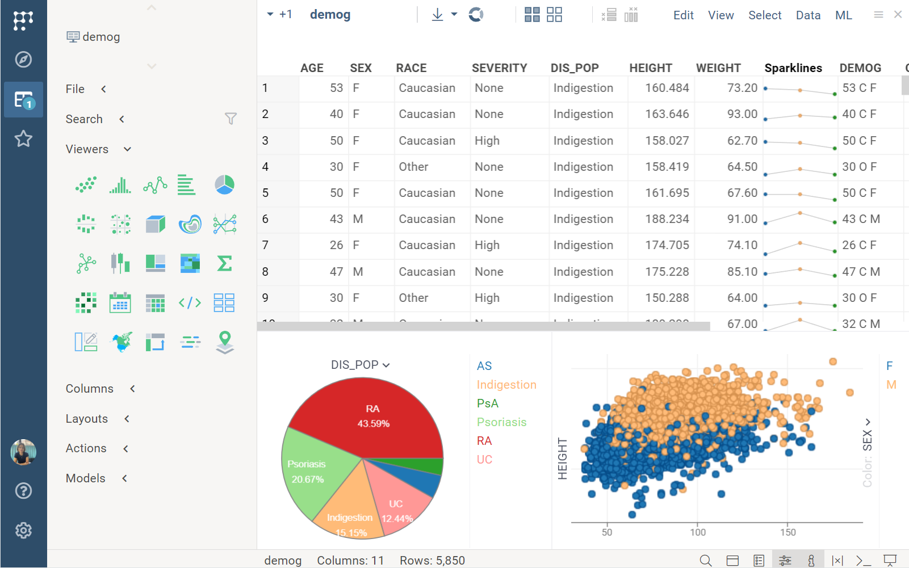
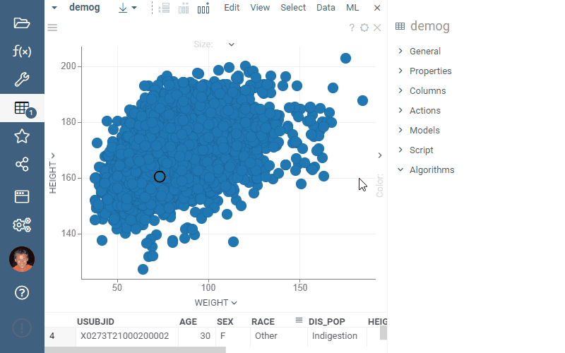
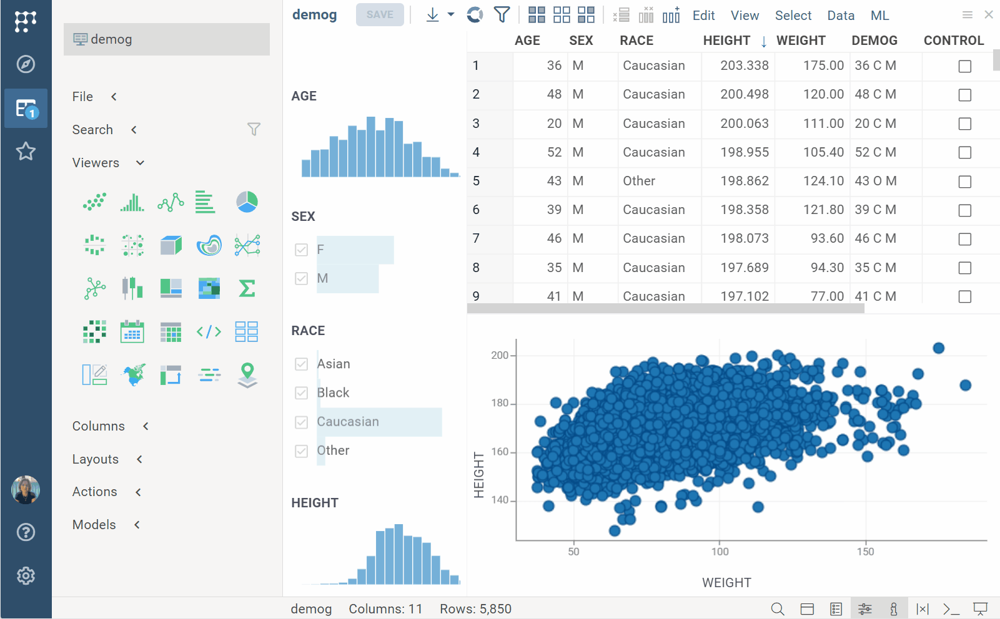

```mdx-code-block
import GoToDialog from './img/go-to-row-dialog.png';
import FunnelIcon from '../../../uploads/icons/funnel.png';
import EmbedViewerDialog from './img/embed-viewer-dialog.png';
import GearIcon from '../../../uploads/icons/gear-icon.png';
import HamburgerIcon from '../../../uploads/icons/hamburger-menu.png';
```

**Table View** is the primary [view](views.md) for working with
[tables](../../concepts/table.md), resembling Excel. It contains:
* A [grid viewer](../../../visualize/viewers/grid.md) that visually represents
  the underlying [table](../../concepts/table.md).
* Additional [viewers](../../../visualize/viewers/viewers.md) that you can add to visualize data.

The **Table View** also has these UI elements associated with it:

* **Toolbox**: To the left of the **Table View**, it has several panels. For
  example, **Viewers** lets you add viewers, while **Search** lets you [search
  values](#search) within a table.
* **Top Menu** with applicable commands. Depending on your dataset, you
  may see context-specific menus like **Chem** or **Bio**.
* **Status bar**: The central section shows the table's name, row/column counts,
   as well as filtered and selected row counts.



## Navigation
   
* To switch between **Table Views**, use the **Sidebar**, **Toolbox**, or the
  [Table Manager](../panels/table-manager.md) (<kbd>Alt + T</kbd>).
* To jump to a specific column, use the [Column Manager](../panels/column-manager.md) (**Status Bar** > **Columns:**).
* To jump to a specific row, press <kbd>Ctrl+G</kbd>, which opens the **Go to**
  dialog. 

  

## Table View layout

The relative positions of viewers in a **Table View**, along with [viewer
properties](#viewer-properties), create a
[layout](../../../visualize/view-layout.md). In Datagrok, layouts are
independent from the underlying tables. This separation lets you
[save](../basic-tasks/basic-tasks.md#save-and-share-a-table) layouts as a standalone entity and
apply them to multiple datasets.

To add a viewer to the **Table View**, on the **Toolbox** click the icon for the
viewer you want to add. Alternatively, at the top of the screen, click the **Add
viewer** () icon and select
the viewer you want.


You can adjust the position and size of any viewer within the **Table View**. To
resize a viewer, drag its border. To reposition it, start dragging the viewer's
header. As you drag, drop zone indicators appear. Continue holding the mouse and
move the cursor to one of these indicators. The target drop area is highlighted
in grey. Release the mouse button to dock the viewer in its new location.

:::note

Developers, you can dock viewers programmatically. See the `dockManager`
property of the `View` class.

:::

### Viewer properties

Each viewer has a set of properties associated with it. These properties define
the viewer's appearance or data. For example, you can hide or color-code grid
columns or change the background color in other viewers.

To access a viewer's settings, do any of the following:
* Click the **Gear () icon** on top of the viewer.
* Press <kbd>F4</kbd> when the viewer has focus.
* Right-click it and select **Properties...**.

These actions update the **Context Panel** with available settings. The most
important data properties are shown on the viewer, for example, combo
boxes that select columns. 

Grid is a special viewer. To learn about how to change its appearance or settings, see [Grid](../../../visualize/viewers/grid.md).



### Tooltips

By default, Datagrok shows tooltips for columns, rows, and data visualized in
viewers. For example,  in tables, tooltips show statistics for numeric
columns and distribution for categorical columns. 

You can change this default information or disable the tooltip altogether. 

To access the tooltip options:
* **For rows**: In the **Top Menu**, select **View** > **Tooltip**. This opens
  the **Tooltip** dialog, where you can select the columns to show or design a
  custom tooltip using a [form viewer](../../../visualize/viewers/form.md).
* **For columns**: Right click the column's header and select the desired option
  under **Tooltip > Current Column**.
* **For viewers**: Click the **Hamburger icon** in the viewer's header and select **Tooltip** > **Edit...** This opens the same **Tooltip** dialog as described above.

By default, tooltips display values from all columns in tables with fewer than 21
columns. Tooltips don't show any column values for tables with 21 or more columns.

:::note developers

[You can set tooltips programmatically](https://public.datagrok.ai/js/samples/ui/viewers/viewew-tooltips).

:::

#### Group tooltips

One of the unique features of Datagrok is the ability to create tooltips that
interactively visualize groups of rows. For example, you can create
a tooltip that uses a scatterplot to visualize the following:

* Bars in a [histogram](../../../visualize/viewers/histogram.md)
* Bars and stacks in a [bar chart](../../../visualize/viewers/bar-chart.md)
* Segments and legend items in a [pie chart](../../../visualize/viewers/pie-chart.md)
* Category labels in a [trellis plot](../../../visualize/viewers/trellis-plot.md)
* Rectangular areas in a [tree map](../../../visualize/viewers/tree-map.md)
* Nodes and edges in a [network diagram](../../../visualize/viewers/network-diagram.md)
* Words in a [word cloud](../../../visualize/viewers/word-cloud.md)
* Categories and histogram bins in a [filter](../../../visualize/viewers/filters.md).

To set a viewer as a group tooltip:

1. Add a viewer.
1. In the viewer's header, click the **Hamburger
   () icon** and select **Tooltip > Use as Group Tooltip**. This viewer is now set as a group tooltip.
  
The tooltip settings remain in effect even if you close the underlying viewer.
To remove the group tooltip, repeat the steps above, but this time, select **Tooltip >
Remove Group Tooltip**.


### Statistical hypothesis testing

Certain viewers include statistical features:

* Box [plots](../../../visualize/viewers/box-plot.md) show the [p-value](../../../visualize/viewers/box-plot.md#t-test), allowing you to determine
  whether the findings are statistically significant.
* Scatterplots can show one or more [regression lines](../../../visualize/viewers/scatter-plot.md#formula-lines) with
  associated equations and color-coding. [Correlation plots](../../../visualize/viewers/correlation-plot.md) highlight the values of
  Pearson's correlation coefficient, making it easy to trace the strength of the
  relationship between given variables.
* The statistics viewer shows key [statistics measures](../../../visualize/viewers/statistics.md#statistical-measures) for
  the selected columns.

To learn about available hypothesis tests, see [Statistical hypothesis testing](../../solutions/domains/data-science.md#statistical-hypothesis-testing).

<!--- ChaRPY package is not active now

In addition, you can use the **To Script > To Python** and **To Script > To R**
commands to recreate Datagrok viewers in Python or R.

-->

## Common actions

### Edit data

To edit data, use the **Top Menu**. Here, you can find commands like adding or
removing columns or rows, aggregating data, or imputing missing values. 

To learn about data transformation options, visit
[Transformation](../../../transform/transform.md). To learn how to cluster data,
analyze variances, and perform other ML tasks, visit
[Explore](../../../explore/explore.md).

### Select and filter

Viewers belonging to the same **Table View** share row states:

* Selected (highlighted in orange)
* MouseOver (on hover, highlighted in light blue)
* Current (click or navigate using the up **(↑)** and down **(↓)** keys, highlighted in green)
* Filtered

This synchronization lets you explore the dataset visually and instantly find patterns. For example:

* Adjusting a slider in one viewer dynamically filters the data in all other
  viewers.
* Hovering over a segment in a pie chart highlights the corresponding
  datapoints on a scatterplot and shows the segment's distribution on a
  histogram.
* Clicking a specific data point on a scatterplot updates the current row across all viewers.


<br/>

To filter, you have these options:

* Use the designated filters viewer
* Use other viewers as filters
* Filter matching rows using a [free text search](#search)

#### Filters viewer

To toggle filters, click the **Funnel () icon** on the **Toolbox** or at the
top of the **Table View**. To choose which columns are visible, at the top of
the **Filters** panel, click the **Hamburger
() icon** and select **Select
Columns...** You can also add specific columns directly by clicking the
**Hamburger () icon** in the
column header and choosing the **Add as filter** command. 


The filters panel is a _viewer_. This means it interacts with viewers
like any other viewer. To learn more about the filters viewer, see
[Filters](../../../visualize/viewers/filters.md).

#### Viewers as filters

By default, clicking a segment representing multiple rows in viewers, like a
[bar](../../../visualize/viewers/bar-chart.md) or a [pie chart](../../../visualize/viewers/pie-chart.md), selects those rows. However,
you can set the viewer to filter the underlying table instead. To do this, click
the **Hamburger () icon** on its
header and select **On click** > **Filter**. 

You can also specify custom behavior using the **Row Source** and **On click**
settings:
* **Row Source** determines which rows are visualized.
* **On Click** determines the action on click. 

To customize these settings, click the **Gear ()
icon** at the viewer's top. You can now adjust the settings in the **Context
Panel** under **Data**.


#### Search

You can filter or select matching rows based on search parameters:

1. In the **Table View**, go to the **Toolbox** and expand the **Search** pane.
1. Click the **Hamburger** () **icon** to choose whether matching rows should be selected or filtered as you modify the search.
1. In the **Search** field, enter your search criteria using a [search pattern](#search-patterns).

   <details> 
   <summary>Examples</summary>

   |Search pattern               | Matches                                        |
   |-----------------------------|------------------------------------------------|
   | > 5                         | all numeric cells with value > 5               |
   | age > 21                    | "age" column > 21                              |
   | disease contains disorder   | "disease" column contains "disorder" substring |
   | disease ends with disorder  | "disease" column ends with "disorder"          |
   | after 9/21/2019             | All dates after 9/21/2019                      |
   | 2014-2020                   | All dates with years 2014-2020                 |
   | open yesterday              | "open" column: yesterday                       |
   
   </details>



<details>
<summary>Search shortcuts</summary>

|        |                        |
|--------|------------------------|
| Ctrl+F | Activate search        |
| Up     | Previous matching cell |
| Down   | Next matching cell     |
| Esc    | Clear search           |
| Enter or Alt+F  | Filter matching rows   |
| Shift+Enter     | Select matching rows   |

</details>

To replace values matching your search, use the [find and replace](../../../transform/find-and-replace.md) command (<kbd>Ctrl + H</kbd>).

##### Search patterns

Search patterns let you specify conditions in a free text search. Datagrok uses
the same syntax to search both in tables and externally, such as
when accessing databases with [parameterized queries](../../../access/databases/databases.md#parameterized-queries). 

When searching in tables, you can use conditions with the column
name (e.g., `age > 21`). However, for external queries, specifying the column
name in the pattern is unnecessary as it's already defined at the query level.

<details>
<summary>Numerical patterns</summary>

| Pattern                | Example    |
|------------------------|------------|
| equals                 | 5          |
| equals                 | = 5        |
| not equals             | != 5       |
| greater than           | > 5        |
| greater than or equals | >= 5       |
| less than              | \< 5        |
| less than or equals    | \<= 5       |
| range (inclusive)      | 10-20      |
| in                     | in (5, 10) |
| not in                 | not in (5, 10) |

For inputs that do not fit the specified patterns, Datagrok defaults to an `exact value` search.

</details>

<details>
<summary>String patterns</summary>

| Pattern                | Example             |
|------------------------|---------------------|
| contains               | contains John       |
| starts with            | starts with John    |
| ends with              | ends with District  |
| [regular expression](https://en.wikipedia.org/wiki/Regular_expression) |  .*\[0-9\]+         |
| in                     | in (asian, other)   |
| not in                 | not in (m, f)       |

String matching is case-insensitive. For inputs that do not fit the specified
patterns, Datagrok defaults to an `exact value` search.

</details>

<details>
<summary>Datetime patterns</summary>

| Pattern                | Example                                       |
|------------------------|-----------------------------------------------|
| 1984                   | years 1984 (ignore date and time)             |
| 1984-1986              | years 1984, 1985, 1986 (ignore date and time) |
| June 1984              | June 1984 (ignore date and time)              |
| Oct 17, 2019           | date = 10/17/2019 (ignore time)               |
| 10/17/2019 5:24 pm     | exact date and time                           |
| before 10/17/2019      | before the specified date                     |
| after 10/17/2019       | after the specified date                      |
| today                  |                                               |
| this week              |                                               |
| this month             |                                               |
| this year              |                                               |
| yesterday              |                                               |
| last week              |                                               |
| last month             |                                               |
| last year              |                                               |

</details>

<details>
<summary>Provider compatibility</summary>

| Provider               | Search supported |
|------------------------|---------|
| Grok in-memory         | +       |
| Access                 | +       |
| Athena                 | +       |
| Cassandra              |         |
| DB2                    | +       |
| Firebird               | +       |
| HBase                  | +       |
| Hive                   | +       |
| Hive2                  | +       |
| Oracle                 | +       |
| MariaDB                | +       |
| MS SQL                 | +       |
| MongoDB                |         |
| MySql                  | +       |
| Postgres               | +       |
| SQLite                 | +       |
| Teradata               | +       |
| Vertica                | +       |
| Redis                  |         |
| SPARQL                 | +       |
| SAP                    |         |
| SAS                    |         |

</details>

### Save and share

You can [save](../basic-tasks/basic-tasks.md#save-and-share-a-table) and [share](../basic-tasks/basic-tasks.md#share) a **Table View** as a special
type of project called a [dashboard](../../concepts/project/dashboard.md). To learn more about projects, see
[Projects](../../concepts/project/project.md). To save just the layout, in the **Top Menu**, select **View** > **Layout** > **Save to Gallery**.

###  Embed

You can embed a dashboard or a single viewer into an external site as an
iframe. Dashboards and individual viewers remain fully interactive and are
synchronized with the tables from which they were created. 

To embed:

1. Save your dashboard.
1. Open the **Embed...** dialog:
   * For dashboards, in the **Top Menu**, select
    **View** > **Embed**.
   * For viewers, hover over the viewer's top, click the **Hamburger
() icon**, and select **General** > **Embed...**
1. Copy the generated iframe and use it on your site.


## Controls

* To edit a _table_, its settings, or _layout_, use the **Top Menu**.
* To edit columns, cells, or viewer properties, use the context actions
  (available on right-click or from the **Context Panel**). Alternatively, click the
**Hamburger () icon** that appears
when you hover over a column header or the top of a viewer.

To see a complete list of available controls, visit [Controls](../shortcuts.md).

### Columns

Properties:

| Property         | Description                                        |
|------------------|----------------------------------------------------|
| New name         | New column name                                    |
| Visible          | Allows to hide column                              |
| Is Color Coded   | Enable/Disable column color coding                 |
| Show Value       | Allows to do not show values on color coded column |
| Width            | Column width, in pixels                            |
| Background Color | Background Color, 32 bit integer                   |
| Decimal Places   | Decimal Places                                     |
| Custom Name      | Custom name, original will be saved                |
| Column Name      | Column Name                                        |
| Custom Format    | Custom Format                                      |
| Cell Type        | Cell Type                                          |

Commands:

|  |   |
|--|---|
| Colors | Edit color-coding |
| Change type | Open change type dialog|

### Viewers

Many viewers support the following:

|              |                                                                                                                                                                                                                                                                                                                            |
|--------------|----------------------------------------------------------------------------------------------------------------------------------------------------------------------------------------------------------------------------------------------------------------------------------------------------------------------------|
| Double-click | Reset View                                                                                                                                                                                                                                                                                                                 |
| Alt+drag     | Zoom                                                                                                                                                                                                                                                                                                                       |
| Mouse drag   | Pan                                                                                                                                                                                                                                                                                                                        |
| Properties   | Show viewer properties in the [Context Panel](../panels/panels.md#context-panel)                                                                                                                                                                                                                                           |
| Reset View   | Reset zoom level. Use in: [scatterplot](../../../visualize/viewers/scatter-plot.md), [line chart](../../../visualize/viewers/line-chart.md), [bar chart](../../../visualize/viewers/bar-chart.md), [3D scatterplot](../../../visualize/viewers/3d-scatter-plot.md), and [box plot](../../../visualize/viewers/box-plot.md) |

General commands available under the **General** submenu:

|                 |                                                                        |
|-----------------|------------------------------------------------------------------------|
| Clone           | Create a copy of the viewer                                            |
| Full Screen (**Alt+F**) | Show in full screen                                         |
| Close           | Close the viewer                                                       |
| Use in Trellis  | Add a [trellis plot](../../../visualize/viewers/trellis-plot.md), using this viewer as a renderer |
| Save to Gallery | Saves this layout to a [gallery](../../../visualize/view-layout.md#layout-suggestions) |
| Embed           | Create HTML code that can be embedded in an external site              |

Style-related commands under the **Style** submenu:

|                      |                                                                                                                                                                                                                |
|----------------------|----------------------------------------------------------------------------------------------------------------------------------------------------------------------------------------------------------------|
| Pick up              | Copy the style of the current viewer                                                                                                                                                                       |
| Apply                | Apply previously copied style to another viewer. This command and the **Apply data settings** and **Apply Style Settings** commands can only be executed after the **Pick up** command. |
| Apply Data Settings  | Apply only the settings from the **Data** section. Can be used for viewers belonging to different views as long as the data source remains the same                                                                    |
| Apply Style Settings | Apply all settings except for the **Data** settings. You can use this option for viewers with different data sources                                                                                        |
| Set as Default       | Set settings as default for all viewers of that type. The properties of all viewers in a **Table View** are automatically updated to the default settings                                                             |
| Reset Default        | Clear default settings                                                                                                        |

<!---                                                                                 |
The commands from the **To Script** submenu produce code that can be used to build a similar visualization using R or
Python:

|           |                                                                   |
|-----------|-------------------------------------------------------------------|
| to R      | Open the visualization preview and get the code snippet in R      |
| to Python | Open the visualization preview and get the code snippet in Python |

-->

Selection:

|                  |                                    |
|------------------|------------------------------------|
| ESC              | Deselect all rows and reset filter |
| Ctrl+A           | Select all rows                    |
| Ctrl+Shift+A     | Deselect all rows                  |
| Ctrl+Click       | Toggle selected state              |
| Shift+Click      | Select point or group              |
| Ctrl+Shift+Click | Deselect point or group            |

To select rows in the [grid](../../../visualize/viewers/grid.md):

|                                 |                                        |
|---------------------------------|----------------------------------------|
| Shift+Mouse Drag                | Select rows                            |
| Ctrl+Shift+Mouse Drag           | Deselect rows                          |
| Mouse Drag row headers          | Select rows                            |
| Shift+drag column headers       | Select columns                         |
| Ctrl+click column headers       | Select columns                         |
| Ctrl+Shift+click column headers | Deselect columns                       |
| (Ctrl+) Shift + ↑↓              | (Un)select rows                        |
| (Ctrl+) Shift + ←→              | (Un)select columns                     |
| (Ctrl+) Shift + mouse-drag      | (Un)select rows                        |
| (Ctrl+) Shift + ENTER           | (Un)Select rows with the current value |

## Resources

* [YouTube video](https://www.youtube.com/watch?v=wAfEqAMOZzw&t=589s)
