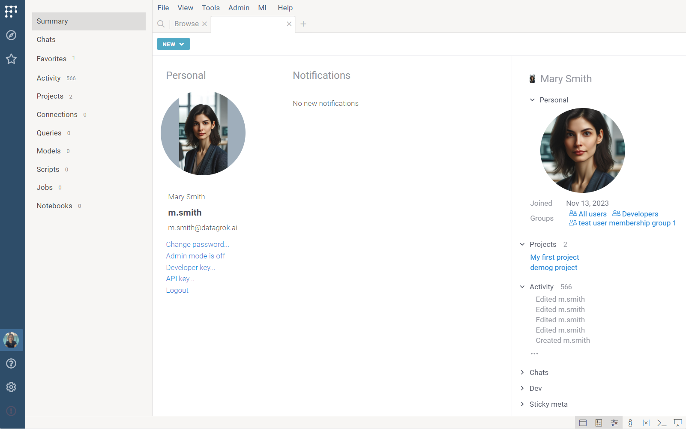

A **User Profile View** provides detailed information about a specific user in Datagrok.

To open a **User View**, you have these options:
1. To open your own **User Profile View**:
  * On the **Sidebar**, click your avatar, or
  * On the **Sidebar**, click **Browse** (<FAIcon  icon="fa-solid fa-compass"/>) and then double click **My Stuff**.

1. To open another user's **User Profile View**: 
     1. On the **Sidebar**, click **Browse > Platform > Users**. A **Users View** opens.
     1. In the **Users View**, find the user you want and double click it. A **User Profile View** for that user opens.

The **User Profile View** consists of several views that you can navigate using the **Toolbox**:

1. **Summary**: Has your avatar (photo) and provides links for changing your
   password, obtaining a developer key, API key, switching off the admin mode
   (for administrators only), and logging out of the platform. It also shows
   messages that were pushed to you as a result of someone else's activity,
   e.g., when someone shares a project with you.
1. **Chats**: Contains the chats you have participated in. You can also start a
   new [chat](../../../collaborate/chat.md) from here.
1. **Favorites**: Shows your favorite [objects](../../concepts/objects.md).
   [Learn how to add an object to favorites](../basic-tasks/basic-tasks.md#favorites).
1. **Activity**: Lists user actions on the platform, with the most recent
   actions appearing on top. To get details about an object you've interacted
   with, click it and explore the details in the [Context Panel](../panels/panels.md#context-panel).
1. **Entity-specific** (**Projects**, **Connections**, **Queries**, **Models**,
   **Scripts**, **Jobs**, and **Notebooks**): Each view contains the
   corresponding entities that were created or used by you.

When you click your avatar or any user in the **Users View**, the **Context
Panel** updates with user-specific [info panes](../panels/info-panels.md):

* **Personal**: Shows your personal information, such as the date you joined and
  the [groups](../../../govern/access-control/users-and-groups.md#groups) you belong to.
* **Projects**: Lists the [projects](../../concepts/project/project.md) you've created or used.
* **Chat**: Shows your chat history.

