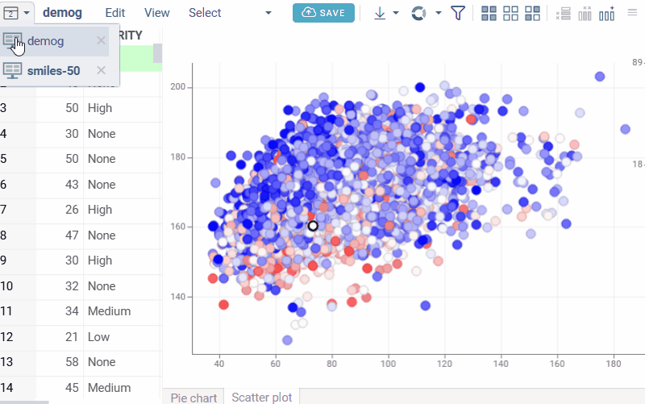

## Quick reference

* [Supported databases](../../access/databases/connectors/connectors.md)
* [Supported file shares](../../access/files/shares/shares.md)
* [Supported file and data formats](../../access/files/supported-formats.md)
* [Supported visualizations](../../visualize/viewers/viewers.md)

##  Drug design and discovery

##### <b>Q: Can Datagrok handle multiple complex data types in one interface?</b>

Datagrok allows access to many different and complex data types in a single user
interface, supporting use cases like
[DMTA](https://datagrok.ai/solutions/dmta-cycle) and other integrated chemical
and assay data workflows. See [Example: Complex data types in one user interface](https://public.datagrok.ai/p/skalkin.medchem_1/Med_Chem)  

##### <b>Q: Can Datagrok support visualization and analysis for different biological and chemical modalities?</b>

Datagrok supports multiple modalities, including:

- Small molecules, see [Cheminformatics](../solutions/domains/chem/chem.md) 
- Peptides with HELM notation, see [Bioinformatics](../solutions/domains/bio/bio.md)  
- Antibodies, see [Bioinformatics](../solutions/domains/bio/bio.md)  

##### <b>Q: What advanced molecular analyses does Datagrok support?</b>

- Chemical structure analysis:

  - [Matched molecular pairs](../solutions/domains/chem/chem.md#matched-molecular-pairs)
  - [R-group analysis](../solutions/domains/chem/chem.md#r-groups-analysis)
  - [Activity cliffs detection](../solutions/domains/chem/chem.md#activity-cliffs)
  - [Scaffold tree analysis](../solutions/domains/chem/chem.md#scaffold-tree-analysis)
  - [Highlighting and aligning to scaffolds](https://github.com/datagrok-ai/public/tree/master/packages/Chem#molecule-fragments-highlight)

- Biological sequence analysis:

  - [Sequence-activity relationship analysis](../solutions/domains/bio/bio.md#sequence-activity-relationship-analysis)
  - [Multiple sequence alignment](../solutions/domains/bio/bio.md#multiple-sequence-alignment-msa)
  - [Atomic-level structure generation](../solutions/domains/bio/bio.md#convert-to-atomic-level)

- Predictive modeling and ADMET:

  - [QSAR/QSPR modeling](../solutions/domains/chem/chem.md#qsar-and-qspr-modeling)
  - [ADMET predictions](../solutions/domains/chem/chem.md#admet-predictions)
  - [Molecular docking](../solutions/domains/chem/chem.md#docking)

##### <b>Q: Can Datagrok handle chemical mixtures?</b>

Yes. Datagrok automatically detects mixtures in the Mixfile format 
and displays them directly in grid cells. Clicking a mixture shows its 
components in the **Context Panel**, including structures and component 
quantities or ratios from the Mixfile. The **Context Panel** also lets you 
explore mixtures in table or tree views.    
[Exploring chemical data](../solutions/domains/chem/chem.md#exploring-chemical-data) | [Supported info panes](../navigation/info-pane-reference.md#structure-and-visualization)

##### <b>Q: Is there a sample dashboard for chemists?</b>

* [This dashboard](https://public.datagrok.ai/p/oahadzhaniandatagrokai.spgi100_2/spgi-100) has multiple visualizations, including chemical spreadsheet, multiple scatterplot views, R-groups, and molecule cards
* [This DMTA spreadsheet](https://public.datagrok.ai/p/skalkin.medchem_1/Med_Chem) shows multiple modalities in one view
* The [Demo App](https://public.datagrok.ai/apps/Tutorials/Demo/Cheminformatics) showcases common analyses like MMP or chemical space, and how they look in Datagrok 

##### <b>Q: Is there a sample dashboard for biologists?</b>

The [Demo App](https://public.datagrok.ai/apps/Tutorials/Demo/Bioinformatics) showcases common analyses like sequence space or Peptide SAR, and how they look in Datagrok.

### Assays, plates, curves

##### <b>Q: Does Datagrok support compound-centric and assay-centric data views?</b> 

Yes. Datagrok supports both:  

* Compound view (compound-centric): multiple endpoints per compound  
[Chemically aware viewers](../../datagrok/solutions/domains/chem/chemically-aware-viewers.md) | 
[Example: rich chemical dataset](https://public.datagrok.ai/p/skalkin.medchem_1/Med_Chem)
* Table view (assay-centric): multiple compounds in a table with configurable endpoints  
[Table view](../../visualize/table-view-1.md) | [Forms](../../visualize/viewers/forms.md) 

Users can configure coloring, highlighting, and switch between compounds as rows or columns, and filter, search, and sort the data.  
[Common actions](../../visualize/table-view-1.md#common-actions) | [Substructure search](../../datagrok/solutions/domains/chem/chem.md#substructure-search--filtering)

##### <b>Q: How can I ingest raw assay data into Datagrok?</b>

Raw data can be ingested through multiple channels, including drag-and-drop, [file shares](../../access/files/files.md#file-sharing-and-access-control), 
[database connections](../../access/databases/databases.md#connecting-to-database), [OpenAPI](../../access/open-api.md), and integrations with services like 
Benchling or Revvity Signals. Datagrok is developing a Plates application
to support predefined plate templates, batch ingestion, and
integrated analysis in one place.

##### <b>Q: How can I perform curve fitting, normalization, QC calculations from raw assay data in Datagrok?</b>

The [Curves](https://github.com/datagrok-ai/public/blob/master/packages/Curves/README.md)
plugin provides a complete workflow for converting raw assay data into fitted curves with QC
calculations. It transforms well-level assay data into fitted dose–response curves, supporting
functions such as 4PL and sigmoid, and can be easily extended to additional analyses, including
Km/Vmax, dose ratio, melt curves (DSF Tm), and qPCR, by defining the corresponding functions
and parameters.

For modeling dynamic systems, see the [Diff-Studio](../../compute/diff-studio.md) plugin that
allows users to solve sets of differential equations interactively through an intuitive UI and 
a declarative approach. 

##### <b>Q: Can Datagrok visualize dose-response curves for multiple compounds?</b> 

Datagrok supports visualizing DR curves for multiple compounds simultaneously and allows plotting curves using custom equations and parameters on the fly (e.g., 4-parameter curve fit over a 10-point dose-response).  
[Multicurve viewer](https://github.com/datagrok-ai/public/blob/master/packages/Curves/README.md#multi-curve-viewer)  | [Use case for assay plates and DRC](https://datagrok.ai/solutions/assay-plates)

## Deploy

##### <b>Q: How is Datagrok deployed?</b>

Datagrok supports Docker, Kubernetes, on-premises, and cloud deployments (AWS, GCP, Azure).  
Learn more about [Deployment](../../deploy/deploy.md)

##### <b>Q: What are the end-user computer and browser requirements?</b>

Datagrok runs completely in the browser. There is no
need to install any additional software. Datagrok is compatible with modern
browsers, including Chrome, Edge, and Safari.

##### <b>Q: How is logging and monitoring handled?</b>

Datagrok uses [AWS CloudWatch](https://aws.amazon.com/cloudwatch/) to collect and analyze logs and metrics.  

##### <b>Q: How are backups and restores managed?</b>

AWS provides automated RDS and S3 backups; RDS can also be restored as a
standard PostgreSQL database.  

##### <b>Q: What is the disaster recovery strategy?</b>

High availability is supported via Docker and AWS clusters that automatically
restart failed instances.  
See [Disaster recovery demo](https://www.youtube.com/watch?v=oFs9RShkHT8) for more information.

<!--## Deployment

#### **Q:** Do you have a guide for installing and deploying Datagrok on a GCP Kubernetes cluster?   
**A:** The fastest way to deploy Datagrok for evaluation is by using Docker Compose on a virtual machine. This setup takes just a minute or two.    
[Learn more](https://datagrok.ai/help/develop/admin/docker-compose)-->

## Access

##### <b>Q: What data sources can Datagrok connect to?</b>

Datagrok connects to any data source, including [databases](../../access/databases/connectors/connectors.md), [file storage systems](../../access/files/files.md), [web services and APIs](../../access/open-api.md). The platform supports [50+ file formats](../../access/files/supported-formats.md), including domain-specific like SDF, FASTA, and others.

##### <b>Q: Can I connect Datagrok to BigQuery or other data stores?</b>

Yes. Datagrok connects to [BigQuery](../../access/databases/connectors/bigquery.md) and most other [popular databases](../../access/databases/connectors/connectors.md) out of the box. In addition, any machine-readable data source can be easily integrated.

##### <b>Q: Can Datagrok accommodate users with different levels of experience for query creation and usage?</b>

Yes. Power users (e.g., modelers) can create or edit queries and share them with their teams, while light users (e.g., experimentalists) can use these queries directly without creating or maintaining them. See [Working with queries](../../access/databases/databases.md#working-with-queries) and [Scripting](../../compute/scripting/getting-started.md).

##### <b>Q: Can users create data queries in Datagrok without prior knowledge of data sources, structures, or SQL?</b>

Yes. Users can build queries using the [Visual Query Editor](../../access/databases/databases.md#visual-query-editor) or the [AI Query Builder](../../access/databases/databases.md#ai-query-builder).

##### <b>Q: Can we connect our own OpenAI or enterprise LLM to the AI Query Builder?</b>

Yes. You can use your own API key or token. The AI assistant uses database schema, existing relations and user set comments to iteratively generate SQL queries based on user prompts.

##### <b>Q: Can data queries in Datagrok be exported for storage, sharing, or reuse?</b>

Yes, see [Sharing query results](../../access/databases/databases.md#sharing-query-results).

##### <b>Q: Can users access data in real-time with responsive performance in Datagrok?</b>

Yes. Users can access data in real-time, and the UI loads data quickly. [Dynamic dashboards](../../access/databases/databases.md#creating-dynamic-dashboards-for-query-results) enable interactive exploration.

## Govern

##### <b>Q: Do you follow secure development standards and industry best practices?</b>

Yes, we adhere to secure development and industry best practices across infrastructure, development, and enterprise security:

* Security-first infrastructure – designed with security from the ground up.
  Features include secure credentials management, flexible authentication
  (OAuth, SSO, Active Directory), and role-based access control.  
  [Learn more](../../deploy/GCP/deploy-gcp-gke-terraform.md) | [Authentication & authorization](../../develop/how-to/apps/build-an-app.md#authentication) | [Role-based access](../../compute/compute.md#privileges-and-visibility)

* Quality assurance – automated check for vulnerabilities (Snyk, Grype) and
  multi-layered testing including unit, integration, UI, and performance tests.  
  [Learn more](../../develop/qa/quality-assurance.md#continuous-integration-and-deployment-system) | [Testing](../../develop/qa/quality-assurance.md#automated-testing)

* Secure development lifecycle – CI/CD pipelines enforce automated build, test,
  and security checks; semantic versioning; and secure credential management.  
  [Learn more](../../develop/develop.md#continuous-integration) | [Version control](../../develop/dev-process/versioning-policy) | [Credential management](../../develop/how-to/packages/manage-credentials.md)

### Governance & access 

#### Authentication & authorization 

##### <b>Q: How does Datagrok handle authentication and authorization?</b>

Datagrok uses role-based access control and integrates with enterprise identity
providers such as LDAP, SSO, and OAuth. 
[Learn more about access control](../../govern/access-control/access-control.md)

##### <b>Q: Is data in Datagrok restricted to users with proper permissions?</b>

Yes. Data is accessible only to users with appropriate permissions, supporting cross-project access and differentiation between internal and external (CRO) users. See [User permissions](../solutions/teams/it/security.md#user-permissions) and [Authorization](../../govern/access-control/access-control.md#authorization).

##### <b>Q: Who has access to Bitbucket, and what are the authentication requirements?</b>

Only datagrok core developers have access. MFA is being enabled to strengthen authentication. Bitbucket also provides built-in security scanning features.  

##### <b>Q: How is MFA enforced for GitHub accounts?</b>

GitHub requires all code contributors to enable two-factor authentication (2FA) as of March 2023. Developers comply by using device-tied passcodes.  

#### Data privacy & usage 

##### <b>Q: What happens to my data when I open a local file in Datagrok?</b>

When you open a local file in Datagrok (like dragging and dropping a file to your browser), you can analyze it without saving. This data stays in your browser's memory and isn't sent to the server unless you run resource-intensive server-side computations. Your data is gone when you close the browser tab. To save your work, you need to upload it to the server. Note that uploading data does not make it accessible to others. Your data stays private and visible to you only until you explicitly share it. Learn how to [share](../concepts/project/space.md#moving-entities-between-spaces) and [share](../navigation/basic-tasks/basic-tasks.md#share) data.

##### <b>Q: What data or telemetry is sent back to Datagrok? </b>

* No automatic telemetry: Datagrok does not send any data to Datagrok servers by default.
* Optional error report/feedback: Users can optionally send feedback or error reports to Datagrok by selecting the "Email" checkbox in the corresponding dialog. This feature can be disabled by the administrator. For details, see [Feedback](../../govern/bug-reports.md)
* Package/image pulls: Datagrok can download images from Docker Hub or packages from NPM.

##### <b>Q: When deployed on-prem, is my data ever gets sent anywhere? </b>

Your data is safe and secure with Datagrok, and nothing gets sent outside your security perimeter by default.
All computations are done either [in-the-browser](../../develop/under-the-hood/performance.md#in-memory-database), or
in [docker containers deployed on your virtual cloud](../../develop/how-to/packages/docker-containers.md).
However, some of the optional [plugins](../plugins.md) are explicitly designed for connectivity with external systems. 
good examples are [CDD Vault Link](https://github.com/datagrok-ai/public/tree/master/packages/CddVaultLink),
[Benchling Link](https://github.com/datagrok-ai/public/tree/master/packages/BenchlingLink) or
[Chemspace](https://github.com/datagrok-ai/public/tree/master/packages/Chemspace).

### Data security 

#### Encryption 

##### <b>Q: Is data encrypted at rest?</b>

Yes, Datagrok relies on Amazon's built-in encryption for [RDS](https://docs.aws.amazon.com/AmazonRDS/latest/UserGuide/Overview.Encryption.html) and [S3 buckets](https://docs.aws.amazon.com/AmazonS3/latest/userguide/bucket-encryption.html).

##### <b>Q: Is data encrypted in transit?</b>

Yes, all client-server communications use [HTTPS](https://en.wikipedia.org/wiki/HTTPS), which means it is secure and encrypted. 

#### Vulnerability & patch management 

##### <b>Q: How do you manage vulnerabilities in the application and cloud infrastructure?</b>

We monitor CISA alerts and run daily [Snyk](https://snyk.io/) scans on container
builds. Vulnerabilities are triaged, remediated via infrastructure-as-code
pipelines, and verified through CI/CD testing. Customers are notified and
supported in version upgrades as needed. Learn more about
[Infrastructure](../../develop/under-the-hood/infrastructure.md)

##### <b>Q: How are OS and server patching handled?</b>

Jenkins and development servers are rebuilt quarterly with a fresh OS.
Documentation for builds is maintained in internal repositories. Learn more about [Deployment](../../deploy/deploy.md)

### Endpoint & device security 

#### Device controls 

##### <b>Q: What controls mitigate risks on BYOD devices?</b>

We have a policy that all devices must have active malware protection, updated
signatures, and drive encryption enabled.  

##### <b>Q: How is data exfiltration via removable media prevented?</b>

We have a policy that sensitive data must not be stored on removable media.
Passwords or credentials must not be transmitted unencrypted.  

#### EDR 

##### <b>Q: What is Datagrok’s current EDR approach?</b>

No dedicated EDR is deployed on associates’ devices. However, all devices must
have up-to-date and active malware protection. Associates are required to report
any suspicious activity via the alert channel. Incident response team triages
and executes the incident management process.  

##### <b>Q: How are security logs collected and monitored?</b>

AWS resources use centralized logging. Currently, there is no proactive log
review, but reporting of failed logins with alert thresholds is being
implemented.  

## Transform

##### <b>Q: Can I add a calculated column from a user interface?</b>

Yes. The [Add new column](../../transform/add-new-column.md) feature is very powerful. You can: 

* write your own expressions manually
* use 500+ available [functions](../../datagrok/concepts/functions/functions.md), or
* add your own functions using custom packages and scripts. 

For example, from a SMILES column you can generate molecular properties (e.g., MW, cLogP) or ADMET predictions.

##### <b>Q: Can I append multiple tables from a user interface?</b>

Yes. Use the Table Manager, <kbd>Alt+T</kbd>, to show tables, select two tables, right-click and navigate to `2 tables > Append`.  A result table will be created containing the common columns and associated data.

## Explore

##### <b>Q: Can Datagrok handle complex scientific data types in a single interface?</b>

Datagrok supports a wide range of capabilities, including:

* Predictions
  e.g., [context panel with predictions](../solutions/domains/chem/info-panels/toxicity-risks),
  [ADME context panels](../solutions/domains/chem/chem.md#admet-predictions)
* [PK/PD](../../compute/compute.md#autogenerated-ui)
* [SAR](../solutions/domains/chem/chem.md#structure-relationship-analysis)
* SPR with sensogram visualization
  e.g., [charts in cells](../../visualize/viewers/grid.md#charts-in-cells)
* Extensibility
  [More than 60 plugins](https://github.com/datagrok-ai/public/tree/master/packages)

[Multiple complex data types in one interface](#q-can-datagrok-handle-multiple-complex-data-types-in-one-interface) | [Explore data](../../explore/explore.md)

##### <b>Q: Can I save a filtered or selected subset as a new dataset? </b>

Yes. Follow these steps:
1. In your dataset, select or filter rows.
1. In the **Status Bar**, click the **Selected: [x]** or **Filtered: [x]** (depending on what you used).
1. From the context menu, select **Extract rows**. This opens a new **Table View** containing only those rows, which you can continue working with and save as a separate dataset. 

## Visualize

##### <b>Q: What are the maximum dataset sizes?</b>

Datagrok handles millions of data points interactively for visualization and exploration. 

The fundamental limitation is the amount of RAM allowed to use by the browser tab, which is different
between browsers (currently no limit for Firefox, and 4GB for Chrome). With Datagrok's efficient
[in-memory data engine](../../develop/under-the-hood/performance.md#in-memory-database), 
even the 4GB lets you work with the following datasets:
* 10 numerical columns: 100,000,000 rows
* 100,000 numerical columns: 1,000 rows
* Small molecules as SMILES: 10,000,000 rows

And if the dataset won't fit in the memory, Datagrok provides 
powerful [ways to work with the database](../../access/databases/databases.md).

##### <b>Q: What visualization options does Datagrok provide for data analysis and chemical structures?</b>  

Datagrok supports rich visualization for both chemical and general data, including:  

* Common chart types: [scatterplot](../../visualize/viewers/scatter-plot.md), [bar chart](../../visualize/viewers/bar-chart.md),  [pie chart](../../visualize/viewers/pie-chart.md), [box plot](../../visualize/viewers/box-plot.md)—[viewers](../../visualize/viewers/viewers.md)
* [Chemically aware viewers](../../datagrok/solutions/domains/chem/chemically-aware-viewers.md) and [Forms](../../visualize/viewers/forms.md)  
* Control charting for assay consistency: [line chart](../../visualize/viewers/line-chart.md), [statistical process control](../../visualize/viewers/line-chart.md#statistical-process-control), scatterplot with [formula lines](../../visualize/viewers/scatter-plot.md#formula-lines)  
* Statistical analysis support: [statistics viewer](../../visualize/viewers/statistics.md), [correlation plot](../../visualize/viewers/correlation-plot.md), scatter plot with [regression lines](../../visualize/viewers/scatter-plot.md#regression-lines), [statistical hypothesis testing](../../visualize/table-view-1.md#statistical-hypothesis-testing)
* Advanced visual features: [coloring](../../visualize/viewers/grid.md#color-code-columns), [shaping and sizing](../../visualize/viewers/grid.md#resizing-columns), [formatting](../../visualize/viewers/grid.md#format-cells), [labeling](../../visualize/viewers/scatter-plot.md#labels), [trellising](../../visualize/viewers/trellis-plot.md)
* Table view integration for visualization, including [charts in cells](https://github.com/datagrok-ai/public/blob/master/help/visualize/viewers/charts-in-cells.md) 

See also: [Viewer gallery](https://github.com/datagrok-ai/public/blob/master/help/visualize/viewers/viewer-gallery.md), [Table view](../../visualize/table-view-1.md), [Grid](../../visualize/viewers/grid.md).

##### <b>Q: Does Datagrok support analytical chemistry plots such as spectrograms?</b>

The [Spectra viewer](https://github.com/datagrok-ai/chem-spectra-viewer/tree/main) plugin is specifically designed for analytical chemistry data and handles common spectral file format (JDX). For custom analytical chemistry visualizations you can create specialized viewers tailored to specific analytical techniques.  
[Can I create custom visualizations](#q-can-i-create-custom-visualizations)| [Scripting viewer](../../visualize/viewers/scripting-viewer.md) | [Custom viewers](../../develop/how-to/viewers/develop-custom-viewer.md)

##### <b>Q: Can I create custom visualizations?</b>

In addition to the built-in [viewers](../../visualize/viewers/viewers.md), which are highly customizable and extendable, you can create fully custom visualizations using various approaches:

* Paste Python/R visualization code directly into a scripting viewer, see [Creating a scripting viewer](../../develop/onboarding/exercises.md#exercise-6-creating-a-scripting-viewer) 
* Write annotated scripts, see [Example: Gasteiger partial charges script](../solutions/domains/chem/chem.md#chemical-scripts) that visualizes molecular properties 
* Build [custom viewers](../../develop/how-to/viewers/develop-custom-viewer.md) using the
[JavaScript API](../../develop/packages/js-api.md)

:::note developers

You can visualize tabular data ([viewers](../../visualize/viewers/viewers.md), [cell renderers](../../develop/how-to/grid/custom-cell-renderers.md)), individual objects (e.g. molecules), file and folder contents. See [Can developers create custom visualizations?](#q-can-developers-create-custom-visualizations) for more information.

:::

##### <b>Q: How can I visualize old and new data side by side?</b>

Multiple [viewers](../../visualize/viewers/viewers.md) and grids can be combined in a single [dashboard](../../datagrok/concepts/project/dashboard.md) to display different datasets side by side. 
Each viewer (scatterplots, charts, etc.) has configurable settings, allowing plots to source data from different tables. There are also multiple ways to [link tables](../../transform/link-tables.md), [join](../../transform/join-tables.md),  [pivot](../../transform/aggregate-rows.md), and apply other [transformations](../../transform/transform.md) 
to data within the intuitive UI. 

##### <b>Q: Can Datagrok tables be exported for presentations or analysis?</b>

Tables can be exported in multiple formats, including images, CSV/TSV, and SDF.  
Learn more about [Downloading](../navigation/basic-tasks/basic-tasks.md#download)

##### <b>Q: Can I merge multiple columns into a single "form cell" that displays label-value pairs (e.g., cLogP: 2.09) for these columns as a formatted list within that cell?</b>

Yes. Use [smart forms](../../visualize/viewers/grid.md#summary-columns).

See visual

##### <b>Q: Can I pivot a table so each object (e.g., molecule) becomes a column and values (e.g., molecular properties) appear as rows?</b>

Yes. Use [Forms](../../visualize/viewers/forms.md) viewer.

See visual

##### <b>Q: How does color coding work in Datagrok?</b>

Datagrok supports several color coding modes applied at the [column](../../visualize/viewers/grid#columns) level, with colors automatically synchronized across viewers: 
* **Linear**: Maps numeric values to a color gradient. You can configure the color palette, min/max values, below/above min colors, and invert the scheme. Absolute Linear mode allows assigning exact colors to specific numeric values.
* **Conditional**: Applies colors based on value ranges or rules. You can configure the rules dictionary (ranges or comparison operators) and choose whether to apply colors to text or background.
* **Categorical**: Assigns colors to categorical values (strings, booleans). You can configure the category-to-color map, fallback color, and select the color scheme via UI or API.

 **Domain-specific color coding**: For chemical data analysis, the [Scaffold tree](https://datagrok.ai/help/datagrok/solutions/domains/chem/#scaffold-tree-analysis) assigns colors to scaffold structures that can be used as the color source in [scatterplot](../../visualize//viewers/scatter-plot.md). Scaffold colors follow inheritance rules where child nodes inherit parent colors unless explicitly overridden.

Color coding remains consistent across the [grid](../../visualize/viewers/grid.md) and all [viewers](../../visualize/viewers/viewers.md) that reference the same column. Color coding persists in saved [projects](../navigation/basic-tasks/basic-tasks.md#saving-a-dashboard) and [layouts](../../visualize/view-layout.md).

See visual

### Filtering & search

##### **Q: How can I search and filter data quickly and intuitively?**

Datagrok provides advanced and intuitive search and filtering capabilities:

* [Global platform search](https://github.com/datagrok-ai/public/tree/master/packages/PowerPack#power-search)
* Dataset-specific [search and filtering](../../visualize/viewers/filters.md#search)
* Chemical/biological property filters (B/D/L-numbers, HELM notation, MW, OEB). See [Filters](../../visualize/viewers/filters.md) and [Calculators](../solutions/domains/chem/chem.md#calculators)
* Substructure/SMARTS search for specific substructures within datasets using [substructure search](../solutions/domains/chem/chem.md#substructure-search--filtering) or [chemical cartridges](../solutions/domains/chem/chem.md#data-access)
* Scientifically logical and searchable lists:  
  - Logical conditions (e.g., `is not null`)  
  - Combined logic with `AND` / `OR`  
  - Date ranges and comparisons (`<`, `>`)  
  - Text substring and fuzzy matching  
  See [Data filtering and search](../../visualize/viewers/filters.md#search) for detailed guidance

## Collaborate

##### <b>Q: Can users save and share custom dashboards, analyses, and visualizations in Datagrok?</b>  

Users can create projects that include data, analyses, and dashboards, then share them with others. Dashboards are dynamic and customizable.   
[Creating and managing projects](../concepts/project/dashboard.md) | [Creating dynamic dashboards](../../access/databases/databases.md#creating-dynamic-dashboards-for-query-results)  

##### <b>Q: How can I link raw data, metadata, and analysis results to compounds or sequences so that this information can be easily recalled and shared across Datagrok dashboards?</b>

The [Sticky meta](../../govern/catalog/sticky-meta.md) feature allows tagging
compounds, sequences, or other entities with meta-information, such as
calculated properties, analysis results, or comments. Tagged information can be
recalled anywhere in Datagrok when the same entity appears, supporting
collaborative workflows and effective communication between team members.  

##### <b>Q: Can users subscribe to notifications about new or updated data in Datagrok?</b>

Datagrok keeps you informed about relevant activity.  See [Collaborate](../../collaborate/collaborate.md), [Notifications](../../collaborate/collaborate.md#notifications), and [Discussions](../../collaborate/collaborate.md#discussions).

##### <b>Q: Can colleagues see my notes about the molecules, experiments, or other objects?</b>

Yes. With [sticky meta](../../govern/catalog/sticky-meta.md), you can add
comments, ratings, tags, or other metadata to any object in Datagrok (molecules,
experiments, samples, users, etc.). These annotations automatically follow the
object across the platform. So if you leave a note on a molecule in one table,
your collaborators will see the same note when that molecule appears in a
different table or dataset.

## Develop

### Architecture

##### <b>Q: How is Datagrok architected?</b>

Datagrok is built as a modular, service-oriented platform with client-server separation.  
Learn more about [Datagrok's architecture](../../develop/under-the-hood/architecture.md#goals)

### Interoperability

##### <b>Q: Can Datagrok call external web services?</b>

Yes, both client and server can call authenticated web services and integrate
responses with the Datagrok API. See [Developer guide](../../develop/develop.md) for details

##### <b>Q: How do I interact with Datagrok from the server?</b>

Use Datagrok’s REST server API with authentication tokens.  
See [Proof of concept video](https://www.youtube.com/watch?v=TjApCwd_3hw) for more information

##### <b>Q: How do I interact with Datagrok from the client?</b>

Use the JavaScript API for custom applications and extensions.  
Learn more about  [JavaScript API](../../develop/packages/js-api.md)

### Developer experience

##### **Q:** Does Datagrok support programmatic integration through customized scripts and APIs?

Datagrok provides robust capabilities for programmatic integration:

- Scripting: users can automate tasks and extend functionality using JavaScript or Python scripts. See [Scripting](https://github.com/datagrok-ai/public/tree/master/help/develop/scripting)
- APIs: Datagrok provides two primary types of APIs: JavaScript and Python. See [API](https://github.com/datagrok-ai/public/tree/master/help/develop/api)
- Develop: the platform supports the development of custom plugins and modules to enhance its capabilities. See [Develop](https://github.com/datagrok-ai/public/tree/master/help/develop)

##### <b>Q: How do I develop and debug Datagrok customizations?</b>

Follow the [step-by-step guide](../../develop/how-to/packages/create-package.md) for creating your own package. If your package is based on a non-standard template, you may need to configure it differently for [debugging](../../develop/advanced/debugging.md). See also a [debug demo](https://youtu.be/PDcXLMsu6UM) for details.

##### <b>Q: How does Datagrok handle package development and deployment?</b>

The process includes package deployment, dependency management, and versioning.  
See [Developer guide](../../develop/develop.md) for details

##### <b>Q: Can multiple developers work concurrently?</b>

Yes, with versioning, branching, and package management.  
Learn more about [Concurrent development](../../develop/develop.md#development)

##### <b>Q: Are Datagrok’s functions and APIs well documented?</b>

Datagrok provides detailed documentation for all functions and APIs to help developers integrate, automate, and extend the platform. See [APIs](https://datagrok.ai/api/js/).

##### <b>Q: Does Datagrok provide support and training for users?</b>

Datagrok offers extensive [help](https://datagrok.ai/help/datagrok/), [videos](https://www.youtube.com/channel/UCXPHEjOd4gyZ6m6Ji-iOBYg), [community forum](https://community.datagrok.ai/), [self-guided learning](../resources/self-guided-learning.md), [tutorials](https://public.datagrok.ai/?browse=apps), and [on-platform demos](https://public.datagrok.ai/apps/Tutorials/Demo?browse=apps) to help scientists gain familiarity and mastery of the platform.

### Scalability and performance

##### <b>Q: How stable is the platform under heavy load?</b>

Datagrok is designed for horizontal scaling, ensuring stability with concurrent users.  
See [Scaling and stability](../../develop/under-the-hood/infrastructure.md#scalability) for more information

### Extensibility

##### <b>Q: Can developers create custom visualizations?</b>

Datagrok offers multiple options for creating and embedding custom visualizations:

* [Custom viewers](../../develop/how-to/viewers/develop-custom-viewer.md) via [JavaScript API](../../develop/packages/js-api.md)  
* [Scripting](../../compute/scripting/scripting.mdx) viewers using R, Python, or Julia    
* Third-party library integration (see [Charts package](https://github.com/datagrok-ai/public/tree/master/packages/Charts)) 
* [Custom file and folder viewers](../../develop/how-to/files/create-custom-file-viewers.md) (e.g., PDB files via [NGL viewer](../../visualize/viewers/ngl.md) through the [Biostructure Viewer](https://github.com/datagrok-ai/public/tree/master/packages/BiostructureViewer#biostructure-viewer) package) 
* [Custom cell renderers](../../develop/how-to/grid/custom-cell-renderers.md)

##### <b>Q: Can I build server-side components?</b>

Yes, custom back-end logic can be added.  
See [Admetica example](https://github.com/datagrok-ai/public/tree/master/packages/Admetica)

##### <b>Q: Can I add scripts and reuse them in components?</b>

Yes, Datagrok supports multiple scripting languages.  
Learn more about [Scripting](../../compute/scripting/scripting.mdx)

##### <b>Q: Can I reskin Datagrok?</b>

Yes, you can build tailored UI applications.  
See [Example app](https://public.datagrok.ai/apps/HitTriage/HitTriage?browse=apps)

##### <b>Q: Can I build full custom applications?</b>

Yes, including workflows, data models, state management, and persistence.  
See [Custom application packages](https://github.com/datagrok-ai/public/tree/master/packages)

### Frontend

##### <b>Q: What frontend capabilities does Datagrok provide for scientific data analysis?</b>

Datagrok delivers a high-performance, interactive frontend for handling, visualizing, and analyzing large-scale scientific datasets. Key capabilities include:

- Data capacity and client-side handling – load and explore millions of rows directly in the browser using Datagrok’s in-memory data engine. Supports high-throughput and virtual screening scenarios with GPU-accelerated visualizations.  
  See also: [Example: 2.7M ChEMBL molecules](../../datagrok/datagrok.md#why-datagrok) | [WebGPU acceleration](../../visualize/viewers/scatter-plot#webgpu-acceleration)
- Cross-connecting multiple large data tables – perform sophisticated data manipulation including joins, filters, and aggregation. Linked tables enable interactive cross-referencing across datasets.  
  Learn more about [Transformations](../../transform/transform.md)
- Visualization capabilities – Over 50 interactive [viewers](../../visualize/viewers/viewers.md) for synchronized dashboards, including [chemically-aware viewers](../../datagrok/solutions/domains/chem/chemically-aware-viewers.md)  
- 2D/3D structure rendering and interaction.  
See [Cheminformatics](../../datagrok/solutions/domains/chem/chem.md) for details
- Interactivity features – live data masking, filter by selection, synchronized updates across viewers, multiple input methods including 2D sketching.  
See [Common actions](../../visualize/table-view-1.md#common-actions), [Structure search](../../datagrok/solutions/domains/chem/chem.md#structure-search), and [Sketching and editing](../solutions/domains/bio/bio.md#sketching-and-editing) for details
- API integration and extensibility. See [JavaScript API](../../develop/packages/js-api.md) for details
- Frontend scripting scalability. See [Compute](../../compute/compute.md) for details

<!--Q: Can infrastructure be managed as code?  
**A:** Yes, using Docker-compose, Jenkins, CloudFormation, or Terraform.  
Datagrok Docker containers are built using Jenkins, all software are upgraded and patched on every build.
Docker-compose manifest is used to describe and deploy Datagrok applications.
Also, there are multiple advanced options to deploy application:
CloudFormation template to deploy to AWS ECS
Terraform scripts to deploy to AWS ECS-->
