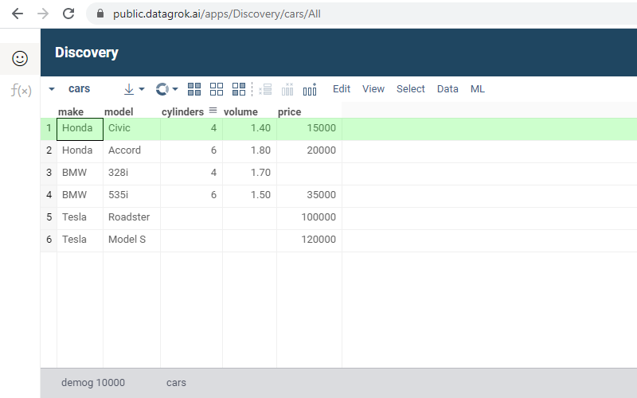
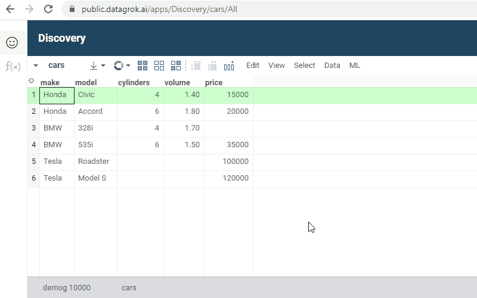

<!-- TITLE: Routing -->
<!-- SUBTITLE: -->

# Routing

In this article, we will consider in which cases the Datagrok platform retains the state in which it was before
refreshing the browser page. Routing allows you to quickly share something by simply copying a URL and sending it to
another person to whom you want to show a particular view, project, application, etc. We will find out which actions
Datagrok can perform under the hood as the user goes to a specific URL (for example, executing a query with given
parameters).

## Entity browsers

Entity browsers are special platform views that display a set of certain entities to the user. Each such browser is
available by a URL.

The platform has browsers for the following entities:

| Entity Browser                                 | URL                                                                                |
|------------------------------------------------|------------------------------------------------------------------------------------|
| [Projects](project.md)                         | [https://public.datagrok.ai/projects](https://public.datagrok.ai/projects)         |
| [Files](../access/connect-a-file-share.md)              | [https://public.datagrok.ai/files](https://public.datagrok.ai/files)               |
| [Queries](../access/data-query.md)             | [https://public.datagrok.ai/queries](https://public.datagrok.ai/queries)           |
| [Scripts](../compute/scripting.md)             | [https://public.datagrok.ai/scripts](https://public.datagrok.ai/scripts)           |
| [Functions](functions/function.md)             | [https://public.datagrok.ai/functions](https://public.datagrok.ai/functions)       |
| [Applications](../develop/develop.md)          | [https://public.datagrok.ai/apps](https://public.datagrok.ai/apps)                 |
| [Models](../learn/predictive-modeling.md)      | [https://public.datagrok.ai/models](https://public.datagrok.ai/models)             |
| [Notebooks](../compute/jupyter-notebook.md)    | [https://public.datagrok.ai/notebooks](https://public.datagrok.ai/notebooks)       |
| [Users](../govern/user.md)                     | [https://public.datagrok.ai/users](https://public.datagrok.ai/users)               |
| [Groups](../govern/group.md)                   | [https://public.datagrok.ai/groups](https://public.datagrok.ai/groups)             |
| [Connections](../access/data-connection.md)    | [https://public.datagrok.ai/connections](https://public.datagrok.ai/connections)   |
| [Jobs](../access/data-job.md)                  | [https://public.datagrok.ai/jobs](https://public.datagrok.ai/jobs)                 |
| [Packages](../develop/develop.md)              | [https://public.datagrok.ai/packages](https://public.datagrok.ai/packages)         |
| [Repositories](../develop/develop.md)          | [https://public.datagrok.ai/repositories](https://public.datagrok.ai/repositories) |
| [Layouts](../visualize/view-layout.md)         | [https://public.datagrok.ai/view_layouts](https://public.datagrok.ai/view_layouts) |

## Projects

A [project](project.md) uploaded to the server can be opened via a direct URL. If a project has more than one table
view, you can pass the name of a specific view to the URL so that you can see it after opening. Links to projects are
generated according to the following
rule: `https://public.datagrok.ai/p/{project.namespace}.{project.name}/{tableView.name}`

Example: [https://public.datagrok.ai/p/demo.pic50/desc_canvas_aug30](https://public.datagrok.ai/p/demo.pic50/desc_canvas_aug30)

The above link will open the `https://public.datagrok.ai/p/demo.pic50/desc_canvas_aug30` view from the `pic50` project,
which belongs to the `demo` namespace. Notice that it is not necessary to include a table view in the project URL. If
not specified, the first view from the project will open.

## Files

A [file share](../access/connect-a-file-share.md) for which the user has access is available by the link. You should
specify the file share name and the namespace in which it exists in the URL, for
example, [https://public.datagrok.ai/files/demo.testjobs.files.demofiles](https://public.datagrok.ai/files/demo.testjobs.files.demofiles)
.

The above link will open a view for the `demofiles` file share. Since the platform supports nesting of namespaces, there
can be more than one namespace in a URL. Our example has several namespaces separated by periods: `demo`, `testjobs`,
and `files`. This means that every next namespace can be reached from the previous one (in practice, this is possible
when one project is nested within another).

Here is an example of a link to a file share with one
namespace: [https://public.datagrok.ai/files/skalkin.datagrokdata](https://public.datagrok.ai/files/skalkin.datagrokdata)
. In this case, the namespace is a personal project of the user who created this file share.

File share URLs support directory nesting. With its help, you can easily get to subdirectories of any nesting depth. For
example: [https://public.datagrok.ai/files/demo.testjobs.files.demofiles/chem/zbb](https://public.datagrok.ai/files/demo.testjobs.files.demofiles/chem/zbb)
. After following the link above, you will see the `zbb` folder, which exists inside the `chem`
folder in the `demofiles` file share.

## Queries

Datagrok supports execution of saved queries via URL. For example, after following the
link [https://public.datagrok.ai/q/Demo.Northwind.Products](https://public.datagrok.ai/q/Demo.Northwind.Products)
, the query `Products` will be executed and we will see the table that has just been created as a query result.

The link to a [data query](../access/data-query.md), in addition to its name, must also contain the
corresponding [data connection](../access/data-connection.md) name and the namespace (or several nested namespaces).

[Parameterized queries](../access/parameterized-queries.md) can be executed as well. In this case, query parameters are
passed directly in the URL. For example:

[https://public.datagrok.ai/q/Demo.CoffeeCompany.StoresInState?state=NY](https://public.datagrok.ai/q/Demo.CoffeeCompany.StoresInState?state=NY)

Opening the above link triggers the `StoresInState` query execution, with the `state` parameter value equal to `NY`.
Once completed, it will output the resulting table.

<!--## Applications

Remarkably, routing works for [applications](../develop/how-to/build-an-app.md). They are shipped as part of
a [package](../develop/develop.md) and used by developers as a means to extend the Datagrok platform. An application
link has the following form: `https://public.datagrok.ai/apps/{package.name}/{application.name}`

The application name can be omitted, in which case it follows the same rule as for views, that is, the first application
found in a package is launched. For example, the following
link [https://public.datagrok.ai/apps/UsageAnalysis](https://public.datagrok.ai/apps/UsageAnalysis)
points to the main view of the first application in the `UsageAnalysis` package.

Since Datagrok provides very flexible development tools, each application can define its own routing rules. Let's
illustrate this on a demo
application `Discovery` ([https://public.datagrok.ai/apps/Discovery](https://public.datagrok.ai/apps/Discovery))
. After opening this application, we will see the `Cars` table and the URL will look like
this: [https://public.datagrok.ai/apps/Discovery/cars/All](https://public.datagrok.ai/apps/Discovery/cars/All)
.

If we move the mouse cursor to the left screen side, a panel will appear where we can select a filter by car
manufacturer:

We can see that the URL changed after the filter was applied. If we now follow this
URL [https://public.datagrok.ai/apps/Discovery/cars/Honda](https://public.datagrok.ai/apps/Discovery/cars/Honda)
, we will go back to the filtered table.-->

See also:

* [Navigation](navigation.md)
* [Entities](objects.md)
* [Smart search](smart-search.md)
