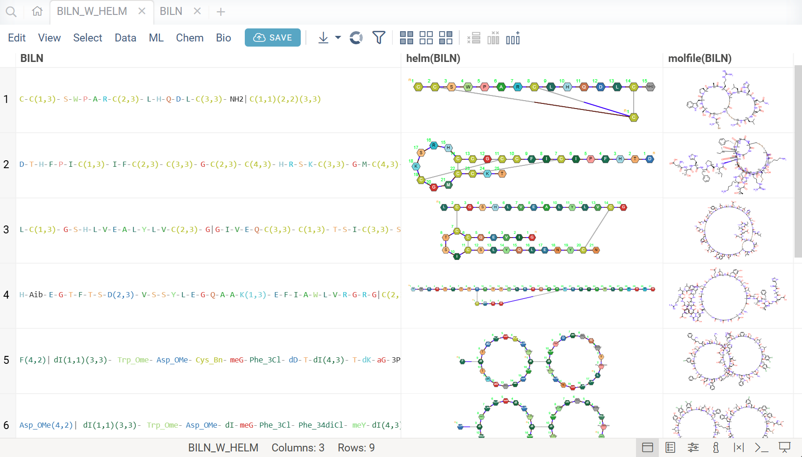
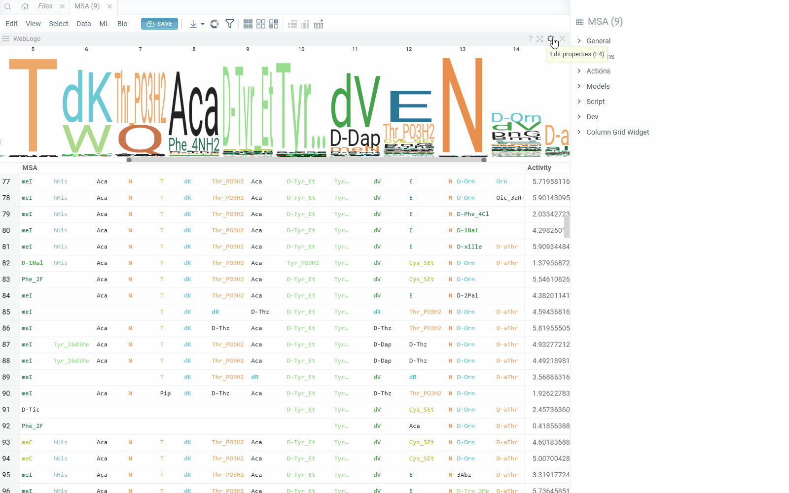
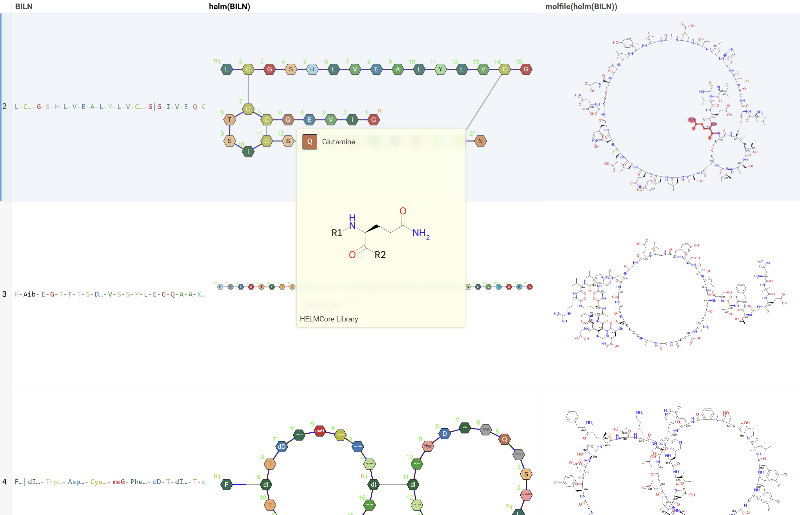
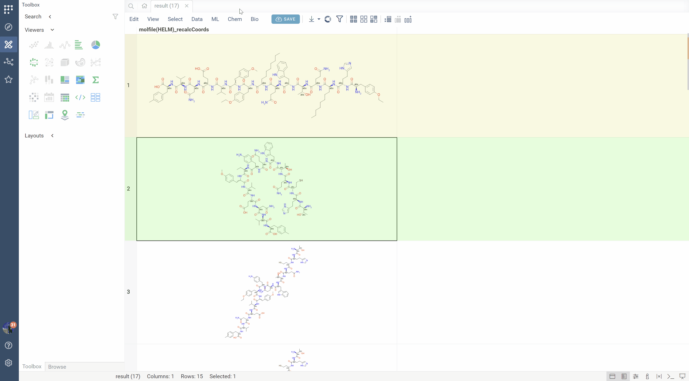
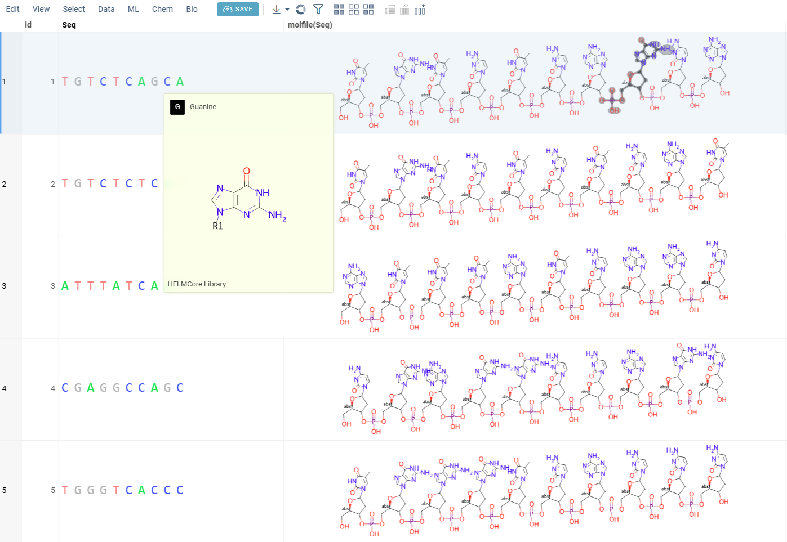

```mdx-code-block
import Tabs from '@theme/Tabs';
import TabItem from '@theme/TabItem';
```

<details>
<summary>Requirements</summary>

To access the bioinformatics functionality, install these
packages using the [Package Manager](https://public.datagrok.ai/packages) (on the **Sidebar**, click **Manage** > **Packages**):

* Required. [Bio](https://github.com/datagrok-ai/public/blob/master/packages/Bio/README.md).
* Optional. [Biostructure Viewer](https://github.com/datagrok-ai/public/tree/master/packages/BiostructureViewer/README.md): Visualization of macromolecules in 3D.
* Optional. [Helm](https://github.com/datagrok-ai/public/tree/master/packages/Helm/README.md): Rendering, editing, managing monomer libraries.
* Optional. [Sequence Translator](https://github.com/datagrok-ai/public/tree/master/packages/SequenceTranslator): Translates oligonucleotide sequences between multiple representations.
* Optional. [Peptides](https://github.com/datagrok-ai/public/tree/master/packages/Peptides/README.md): SAR analysis for sequences.
<!--* Optional. [Oligo Batch Calculator](https://github.com/datagrok-ai/public/tree/master/packages/OligoBatchCalculator/README.md): Calculators for oligonecleotide properties.-->

</details>

Datagrok lets you work with macromolecules both on the macro (sequence) level and atomic level:

* Data visualization and exploration
  * [Formats](#formats): such as FASTA (DNA/RNA/protein), delimiter-separated FASTA, [HELM](https://en.wikipedia.org/wiki/Hierarchical_editing_language_for_macromolecules), [BILN](https://pubs.acs.org/doi/10.1021/acs.jcim.2c00703), [PDB](https://en.wikipedia.org/wiki/Protein_Data_Bank_(file_format)), and [others](../../../../access/files/supported-formats.md). Handles nucleotides, natural and non-natural peptides, 3D-structures, and other modalities.
  * [Format conversion](#format-conversion): SMILES to HELM, HELM to SMILES, [Polytool notation](polytool.md), etc
  * [Automatic detection of sequences](../../../../govern/catalog/semantic-types.md) upon data import.
  * Flexible and fast [spreadsheet](#spreadsheet) that shows both macro and small molecules.
  * [Interactive visualization of biological data](#exploring-biological-data).
  * Customizable [info panes](../../../../datagrok/navigation/panels/info-panels.md) with information about macromolecules and context actions.
  * [Sequence editing](#sketching-and-editing), [search, and filtering](#searching-and-filtering).
  * Sequence analysis
    * [Sequence composition](#sequence-composition)
    * [Sequence space](#sequence-space)
    * [Hierarchical clustering](#hierarchical-clustering)
    * [Multiple sequence alignment](#multiple-sequence-alignment-msa)
  * Structure-Activity Relation (SAR) analysis
    * [Activity cliffs](#activity-cliffs)
    * A fit-for-purpose application for [SAR analysis for peptides](#sar-for-peptides)
  * A comprehensive [ML toolkit](../../../solutions/domains/data-science.md) for
clustering, dimensionality reduction techniques, imputation, PCA/PLS, and other tasks. Built-in statistics.
  * Flexible reporting and sharing options, including [dynamic dashboards](../../../../access/databases/databases.md#sharing-query-results).
* [Oligonucleotides chemical modifications and format conversion](#oligo-toolkit).
* Connection to chemistry level: [split to monomers](#split-to-monomers), and [get the atomic-level structure](#convert-to-atomic-level).
* [Extensible environment](#customizing-and-extending-the-platform)
  * Ability to add or customize any functionality using [scripts](../../../../compute/scripting/scripting.mdx) in Python, R, Matlab, and other supported languages.
  * Ability to create custom plugins and fit-for-purpose applications.
* [Enterprise-grade platform](../../teams/it/enterprise-evaluation-faq.md) for efficient data access and management.

## Data access

Datagrok provides a single, unified access point for organizations.
You can connect to local file storage, clouds (Amazon S3, Google cloud, etc),
SQL and NoSQL databases or any other of the
[30+ supported data sources](../../../../access/databases/connectors/connectors.md),
retrieve data, and securely share data with others.
Datagrok can ingest data in [multiple file formats](../../../../access/files/supported-formats.md) (such as Fasta or CSV)
and multiple notations for nucleotide and amino acid / protein sequences, with natural and modified monomers,
aligned and non-aligned forms.

You can also create macromolecule queries against data sources using built-in querying tools. To learn more about querying data and data access in general, see the [Access](../../../../access/access.md) section of our documentation.

## Exploring biological data

Datagrok provides a range of tools for analyzing macromolecules (**Top Menu** > **Bio**).
In addition, Datagrok provides a comprehensive
[machine learning toolkit](../../../solutions/domains/data-science.md) for
clustering, dimensionality reduction techniques, imputation, PCA/PLS, and other tasks (**Top Menu** > **ML**). Some of these tools can be applied directly to macromolecules.

When you open a dataset, Datagrok automatically detects macromolecules and makes macromolecule-specific context actions available. For example, when you open a CSV file containing sequences in FASTA format, the following happens:

* Data is parsed, and the [semantic type](../../../../govern/catalog/semantic-types.md) _macromolecule_ is assigned to the corresponding column.
* Macromolecules are automatically rendered in the spreadsheet.
* Hovering over monomers in the sequence shows their name and molecular structure, as per the active monomer library.
* Column tooltip now shows the sequence composition.
* Default column filter is now a subsequence search.
* A top menu item labeled **Bio** becomes available.
* Column and cell properties now show macromolecule-specific actions, such as sequence renderer and libraries options, sequence and macromolecule space preview, molecular structure and others.


<!--When you click on a macromolecule, you see the following in the **Context Panel**:

* Macromolecule composition by monomer (**Composition**).
* Macromolecule similarity (**Similarity**).
* Macromolecule sequence and notations in supported formats (**Notations**).
* Ability to get atomic level (**To Atomic Level**).-->

When you click on a column with macromolecules, you see the following in the **Context Panel**:

* Filter
* Manage Libraries
* Sequence Renderer: Rendering options.
* Peptides: From this pane, you can launch the [SAR analysis for peptides](#sar-for-peptides).
<!--* **Peptide space**: From this pane, you can launch the [peptide space analysis](#sequence-space).-->

<details>
<summary>Info pane options</summary>

Some info panes can be customized. To reveal an info pane's available options, hover over it:

* View and/or edit the underlying script (click the **Script** icon).
* Change parameters (click the **Parameter** icon).
* Change the info pane's settings (click the **Gear** icon).
* Append info pane as a column (click the **More actions** icon and select **Add as a column**).

To learn how to customize and extend the platform programmatically, see the [Develop](../../../../develop/develop.md) section of our documentation.

</details>

:::note developers

Info panes be extended with [functions](../../../concepts/functions/functions.md) in any supported language.

:::

### Spreadsheet

The [grid viewer](../../../../visualize/viewers/grid.md) lets you visualize and [edit](#sketching-and-editing) sequences and macromolecules. You can add new columns with calculated values, interactively [filter and search](#searching-and-filtering) rows, color-code columns, pin rows or columns, set edit permissions, and more.

Clicking on any sequence cell highlights the differing monomers in other sequences, allowing you to quickly identify similarities and differences.

```mdx-code-block
<Tabs>
<TabItem value="display-for-fasta" label="FASTA" default>
```

Sequences in various modalities are color-coded based on monomer properties, natural analog or explicitely set colors.


```mdx-code-block
</TabItem>
<TabItem value="display-for-helm" label="HELM">

```

HELM is used for macromolecules with non-natural monomers, circular and branching structures.
The structures are displayed with colors corresponding to each monomer.


```mdx-code-block
</TabItem>
<TabItem value="display-for-biln" label="BILN">
```

Various sseparated formats, such as BILN, '.', '-' or '/' separators are supported. Such sequences can encode non-canonical monomers (see [Monome Manager](#manage-monomers)), multiple chains, branching and cyclic structures.



```mdx-code-block
</TabItem>
<TabItem value="display-for-pdb" label="PDB">
```

For PDB files, cells display a preview of the 3D structure. When you click a cell, a separate viewer opens up, allowing you to rotate, zoom in, or switch the color scheme.


```mdx-code-block
</TabItem>
</Tabs>
```

### Interactive sequence header

Long biological sequences, such as antibodies, are displayed with an interactive, scrollable WebLogo and conservation headers. You can click on any position in the sequence to highlight it and open a position statistics viewer, which shows the distribution of activities across different monomers at that site


### Macromolecule aware viewers

Datagrok _viewers_ recognize and display macromolecules. The majority of the viewers were built from scratch to take
advantage of Datagrok's in-memory database, enabling seamless access to the same data across all viewers.
Viewers also share a consistent design and usage patterns. Any action taken on one viewer, such as hovering, selecting,
or [filtering](../../../../visualize/viewers/filters.md), is automatically applied to all other viewers, creating
an interconnected system ideal for exploratory data analysis.

Macromolecule-specific viewers include [sequence logo](../../../../visualize/viewers/web-logo.md), 3D structure viewers
([biostructure](../../../../visualize/viewers/biostructure.md) and [NGL viewer](../../../../visualize/viewers/ngl.md)),
and [sequence tree viewers](../../../../visualize/viewers/dendrogram.md). Examples of general-purpose viewers that
can be used to analyze biological data include a [scatterplot](../../../../visualize/viewers/scatter-plot.md),
a [network diagram](../../../../visualize/viewers/network-diagram.md), a [tile viewer](../../../../visualize/viewers/tile-viewer.md),
a [bar chart](../../../../visualize/viewers/bar-chart.md), a [form viewer](../../../../visualize/viewers/form.md),
and [trellis plot](../../../../visualize/viewers/trellis-plot.md), and others.

<details>
<summary>Examples</summary>

```mdx-code-block
<Tabs>
<TabItem value="spreadsheet-for-msa" label="Spreadsheet" default>
```

Composition analysis for MSA.


```mdx-code-block
</TabItem>
<TabItem value="scatterplot-for-macromolecules" label="Scatterplot">
```

Activity cliffs analysis using a scatterplot.


```mdx-code-block
</TabItem>
</Tabs>
```

</details>

All viewers can be saved as part of the [layout](../../../../visualize/view-layout.md) or a dashboard. Some viewers offer built-in statistics.

To learn how to use viewers to explore data, complete [this tutorial](https://public.datagrok.ai/apps/tutorials/Tutorials/ExploratoryDataAnalysis/Viewers) or visit the [Visualize](../../../../visualize/viewers/viewers.md) section of our documentation.

:::note developers

You can [add custom viewers](../../../../develop/how-to/viewers/develop-custom-viewer.md).

:::

### Analyzing docking results

To explore the binding interactions between small ligand molecules and biological structures, you can use either the [NGL](../../../../visualize/viewers/ngl.md) or [biostructure](../../../../visualize/viewers/biostructure.md) viewer. Both viewers visualize the docked ligands in their spatial context and let you examine their orientation and positioning within the binding site.

<details>
<summary>How to use</summary>

Prerequisites: Prepare the simulation data in two separate files:

* File 1: Contains the structure of a macromolecule in a [supported format](../../../../access/files/supported-formats.md), such as PDB.
* File 2: Contains the simulation results of the position of small molecules relative to the structure.

To visualize docked ligands, follow these steps:

1. Open the table with ligands (File 2) in Datagrok.
1. Add either the NGL or biostructure viewer.
1. In the viewer, drop the file with the macromolecule structure (File 1).

You can interact with the ligands as follows:

* To visualize docking for a particular ligand, click it. You can visualize multiple ligands simultaneously by selecting or hovering over rows.
* If one ligand is selected, it will be visualized with a full-color ball+stick representation.
* For multiple ligands:
  * The current row ligand is shown in green.
  * The mouse-over row ligand is shown in light gray.
  * The selected row(s) ligands is shown in orange.

You can further analyze the ligand data by applying filters, allowing you to focus on specific subsets based on criteria such as binding energy estimates or scoring functions. You can also cluster the ligands based on one or more parameters to identify patterns and groups within the dataset.

<!--GIF PLACEHOLDER-->

</details>

## Sketching and editing

You can create and edit macromolecules:

* For DNA, RNA, and protein sequences in the linear format, you can edit the sequences.
* For HELM notation, you can add or remove monomers and modify connections. The editor supports circular and branching structures.


## Searching and filtering

Datagrok offers an intuitive searching and filtering functionality for exploring datasets.

### Filtering

For sequence-based filtering, Datagrok uses an [integrated HELM editor](#sketching-and-editing) for HELM notations and text-based filter for linear notations. All filters are interactive — hovering over categories or distributions in the **Filter Panel** instantly highlights relevant data points across all viewers.

<details>
<summary>How to filter</summary>

To filter by sequence:

1. On the **Top Menu**, click the **Filter** icon to open the **Filter Panel**. The panel shows filters for all dataset columns. By default, the subsequence filter is displayed on top but you can rearrange, add, or remove filter columns by using available controls.
1. To enter a subsequence, click the **Click to edit** button.
1. Once finished, click **OK** to apply the filter.

To clear the filter, use the checkbox provided. To remove the filter altogether, use the **Close** (**x**) icon.

</details>

### Substructure Search

The substructure search feature finds sequences containing a specific pattern or motif and filters the dataset. Search results can be also presented as a new boolean column in the table, where checkboxes indicate matches. You can color-code results for visual profiling or use the column as an additional filter for further analysis.

<details>
<summary>How to use</summary>

1. In the **Top Menu**, select **Bio** > **Search** > **Substructure Search...**. Filter panel will open with Sequence column filter.
1. Enter or paste the sequence pattern in the provided substructure field. This will filter the dataset based on prompt. 

</details>

### Similarity Search

Similarity search identifies sequences most similar to a target sequence using configurable distance metrics (Needleman-Wunsch, Hamming, Levenshtein, or monomer chemical distance). This is useful for finding close homologs or variants of a known sequence.

The tool generates an interactive results grid showing similar sequences ranked by similarity score, with visual highlighting of differences between the target and matches. You can adjust the similarity cutoff and choose different distance metrics and fingerprint types for comparison.

<details>
<summary>How to use</summary>

1. In the **Top Menu**, select **Bio** > **Search** > **Similarity Search**. A similarity search viewer is added to the view.
2. Click on any sequence in the main grid to see top similar sequences to it.
3. Configure parameters:
   * **Cutoff**: Similarity threshold (0-1)
   * **Distance metric**: Choose from Needleman-Wunsch, Hamming, Levenshtein, or monomer chemical distance
   * **Fingerprint type**: For monomer chemical distance (Morgan, RDKit, etc.)
   * **Number of neighbors**: How many similar sequences to return
4. Results appear in an interactive grid, sorted by similarity. Click any result to highlight differences on the context panel.

</details>

### Diversity Search

Diversity search finds the most diverse subset of sequences in your dataset, useful for selecting representative samples or reducing redundancy while maintaining coverage of sequence space. The algorithm uses distance-based metrics to identify sequences that are maximally different from each other.

<details>
<summary>How to use</summary>

1. In the **Top Menu**, select **Bio** > **Search** > **Diversity Search**. A diversity search viewer is added to the view.
1. Configure parameters:
   * **Number of diverse sequences**: How many sequences to select
   * **Distance metric**: Choose the metric for calculating diversity
   * **Fingerprint type**: For chemical distance calculations
1. Results appear in a new table containing the most diverse sequences from your dataset.

</details>


To learn more about filtering, watch this [video](https://www.youtube.com/watch?v=GM3XixUFFUs&t=2688s) or read [this article](../../../../visualize/table-view-1.md#select-and-filter).

## Manage monomer libraries

Datagrok enables you to manage monomer libraries for various macromolecule types, including DNA, RNA, peptides, and custom structures. These libraries define the building blocks, or monomers, that compose polymers and store detailed metadata about each monomer, such as properties, labels, and molecular structures. This metadata supports flexible and accurate functionality across the platform, such as the [To Atomic Level](#convert-to-atomic-level) conversion, sequence analysis, and polymer enumeration in tools like [Polytool](polytool.md). By managing monomer libraries, users can select specific monomers for custom analyses and workflows, ensuring precise control over macromolecule representation and manipulation.


The default [HELM monomer library](https://github.com/datagrok-ai/public/blob/master/packages/Bio/files/monomer-libraries/HELMCoreLibrary.json) is pre-installed with the [Bio package](https://github.com/datagrok-ai/public/tree/master/packages/Bio). You can add your own monomer libraries using the view accessible from **Top Menu** > **Bio** > **Manage** > **Monomer Libraries**:


To make the monomers from a library available throughout Datagrok, select the checkbox next to the library name. Similarly, to exclude monomer library, uncheck the checkbox. The changes are applied immediately and reflected throughout the platform.

To add a new monomer library file, click **ADD** button. All monomer library files are validated against the standard HELM [JSON schema](https://github.com/datagrok-ai/public/blob/master/packages/Bio/files/tests/libraries/HELMmonomerSchema.json) and must fully conform to it. The added files will be stored under `AppData/Bio/monomer-libraries` in [file shares](../../../../access/files/files.md#connecting-to-file-storage).

You can also merge selected monomer libraries into a single file by clicking **MERGE** button. The merged file will be saved in the same location as the original files or can be downloaded.
Not needed monomer libraries can be removed by clicking **Delete** icon next to their name.

Some combinations of monomer libraries can contain conflicting monomer definitions (different structures/properties for same monomer symbol). In such cases, you will see duplicate monomer symbols, along with their structures and sources on the right side of the view. You can manually resolve these conflicts by selecting the correct monomer structure for the given symbol, and the choice will be immediately applied throughout the platform.


### Manage monomers

Apart from being able to manage which monomer libraries are used, you can also manage and edit individual monomers within them. To do so, click on the **Edit** icon next to the monomer library name. You can also access monomer management through **Top Menu** > **Bio** > **Manage** > **Monomers**. Monomer manager allows you to view, add, edit and delete monomers within the selected library.

The Monomer manager view consists of two main parts: On the left side, you can see a molecular sketcher, where you can draw the structure of the monomer, along with the monomer properties editors such as name, symbol, natural analog, r-groups, colors and others. On the right side, you can see a list of all monomers in the library, along with their structures and properties. You can select a monomer from the list to view or edit its properties, or delete it from the library.


<details>
<summary>How to use</summary>

* To remove a monomer from the library, right click on the monomer in the table, and select **Remove Monomer**. Alternatively, you can select the monomer and click the **Delete** icon on the top ribbon pannel. You can also remove multiple monomers at once by selecting them and clicking the **Delete** icon.


* To add a new monomer to the library, click the **Add** icon on the top ribbon panel. This will create a blank monomer, for which you can draw molecular structure, fill in the properties and save it to the library.
  * If the given symbol or molecular structure already exists in the library, you will be prompted about it.
  * The molecular structure is requeired to have at least one R-group.
  * Upon drawing the structure, monomer natural analogue will be automatically set to the most similar natural monomer (based on tanimoto similarity of corresponding Morgan fingerprints).


* You can also edit existing monomers, or use them as template for new ones. To do so, simply click on any monomer in the table, and its properties will be loaded into the editor. You can then modify the properties, and save the changes to the library. To find a monomer in the table, you can use standard datagrok filters, which enables you to search based on names, symbols, molecular substructure, similarity, and other properties.


</details>


## Sequence analysis

### Sequence composition

You can create a
[sequence logo](https://en.wikipedia.org/wiki/Sequence_logo) to show the letter composition for each position in
a collection of sequences. A sequence logo is usually created from a set of aligned sequences
and helps identify patterns and variations within those sequences.
A common use is to visualize protein-binding sites in DNA or functional motives in proteins.

 <!--redo gif due to poor resolution-->

<details>
<summary>How to use</summary>

1. In the **Top Menu**, select **Bio** > **Composition Analysis**. The sequence logo viewer is added to the **Table View**.
2. To edit parameters, hover over the viewer's top and click the **Gear** icon.

</details>

### Sequence space

Sequence space visualizes a collection of sequences in 2D such that similar sequences are placed close to each other
(geekspeak: [dimensionality reduction](https://en.wikipedia.org/wiki/Dimensionality_reduction), [tSNE](https://scikit-learn.org/stable/modules/generated/sklearn.manifold.TSNE.html), [UMAP](https://umap-learn.readthedocs.io/en/latest/), [distance functions](https://www.sciencedirect.com/science/article/pii/S0888613X07000382)). This allows to identify clusters of similar sequences, outliers, or patterns that might be difficult to detect otherwise. Results are visualized on the interactive [scatterplot](../../../../visualize/viewers/scatter-plot.md).

Sequence space analysis is particularly useful for separating groups of sequences with common motifs, such as different variants of complementarity-determining regions (CDRs) for antibodies.


<details>
<summary> How to use </summary>

Go to the **Top Menu** and select **Bio** > **Analyse** > **Sequence Space...** This opens a **Sequence Space** parameter dialog.

The dialog has the following inputs:

* **Table**: The table containing the column of sequences.
* **Column**: The column containing the sequences.
* **Encoding function**: The encoding function that will be used for pre-processing of sequences. For non-helm notation sequences, only one encoding function is available, that will encode them in single character form and calculate the substitution matrix for each individual monomer. For [Helm](https://en.wikipedia.org/wiki/Hierarchical_editing_language_for_macromolecules) sequences, apart from prior function, another one is offered that will use [chemical fingerprint](https://www.rdkit.org/UGM/2012/Landrum_RDKit_UGM.Fingerprints.Final.pptx.pdf) distances between each macromolecule to calculate distance matrix. The `Encode sequences` function has 3 parameters which you can adjust using the gear (⚙️) button next to the encoding function selection: 
    * Gap open penalty: The penalty for opening a gap in the alignment (used for [Needleman-Wunsch](https://en.wikipedia.org/wiki/Needleman%E2%80%93Wunsch_algorithm) algorithm).
    * Gap extend penalty: The penalty for extending a gap in the alignment (used for [Needleman-Wunsch](https://en.wikipedia.org/wiki/Needleman%E2%80%93Wunsch_algorithm) algorithm).
    * Fingerprint type: The type of molecular fingerprints that will be used to generate monomer substitution matrix.
* **Method**: The dimensionality reduction method that will be used. The options are:
    * UMAP: [UMAP](https://umap-learn.readthedocs.io/en/latest/) is a dimensionality reduction technique that can be used for visualization similarly to t-SNE, but also for general non-linear dimension reduction.
    * t-SNE: [t-SNE](https://en.wikipedia.org/wiki/T-distributed_stochastic_neighbor_embedding) is a machine learning algorithm for dimensionality reduction developed by Geoffrey Hinton and Laurens van der Maaten. It is a nonlinear dimensionality reduction technique that is particularly well-suited for embedding high-dimensional data into a space of two or three dimensions, which can then be visualized in a scatter plot.

    Other parameters for dimensionality reduction method can be accessed through the gear (⚙️) button next to the method selection.

* **Similarity**: The similarity/distance function that will be used to calculate pairwise distances. The options are:
    * Needleman-Wunsch: [Needleman-Wunsch](https://en.wikipedia.org/wiki/Needleman%E2%80%93Wunsch_algorithm) is a dynamic programming algorithm that performs a global alignment on two sequences. It is commonly used in bioinformatics to align protein or nucleotide sequences.
    * Hamming: [Hamming distance](https://en.wikipedia.org/wiki/Hamming_distance) is a metric for comparing two macromolecules of same length. Hamming distance is the number of positions in which the two monomers are different.
    * Monomer chemical distance: Similar to Hamming distance, but instead of penalizing the mismatch of monomers with -1, the penalty will be based on the chemical distance between the two monomers. The chemical distance is calculated using the [chemical fingerprint](https://www.rdkit.org/UGM/2012/Landrum_RDKit_UGM.Fingerprints.Final.pptx.pdf) of the monomers.
    * Levenshtein: [Levenshtein distance](https://en.wikipedia.org/wiki/Levenshtein_distance) is a string metric for measuring the difference between two sequences. Informally, the Levenshtein distance between two sequences is the minimum number of single-monomer edits (insertions, deletions or substitutions) required to change one sequence into the other.
* **Plot embeddings**: If checked, the plot of the embeddings will be shown after the calculation is finished.
* **Postprocessing**: The postprocessing function that will be applied to the resulting embeddings. The options are:
    * **None**: No postprocessing will be applied.
    * **DBSCAN**: The DBSCAN algorithm groups together points that are closely packed together (points with many nearby neighbors), marking as outliers points that lie alone in low-density regions (whose nearest neighbors are too far away). The DBSCAN algorithm has two parameters that you can adjust through the gear (⚙️) button next to the postprocessing selection:
        * **Epsilon**: The maximum distance between two points for them to be considered as in the same neighborhood.
        * **Minimum points**: The number of samples (or total weight) in a neighborhood for a point to be considered as a core point. This includes the point itself.
    * **Radial Coloring**: The radial coloring function will color the points based on their distance from the center of the plot. The color will be calculated as a gradient from the center to the border of the plot.

**WebGPU Acceleration**

WebGPU is an experimental feature that enables GPU-accelerated calculations directly in the browser. We have implemented WebGPU support for KNN graph generation (with support for all distance functions including Needleman-Wunsch, Levenshtein, etc.) and UMAP algorithm, which can provide up to 100x speedup for large datasets.

To enable WebGPU acceleration, check the corresponding option in the gear (⚙️) button next to the method selection (UMAP).

**Requirements and limitations:**
* Requires hardware GPU support
* To ensure your browser uses the high-performance GPU:
  1. Go to system settings → Display settings → Graphics settings
  2. Find your browser in the app list
  3. Set it to use "High performance" GPU

If WebGPU is not supported in your browser, the checkbox will not appear in the dialog.

</details>

### Hierarchical clustering

Hierarchical clustering groups sequences into an interactive [dendrogram](../../../../visualize/viewers/dendrogram.md).
In a dendrogram, distance to the nearest common node represents the degree of similarity between each pair of sequences.
Clusters and their sizes can be obtained by traversing the trunk or branches of the tree and deciding at which level
to cut or separate the branches. This process lets you identify different clusters based on the desired level
of similarity or dissimilarity between data points.


<details>
<summary>How to use</summary>

To add a dendrogram viewer, do the following:

1. In the **Top Menu**, select **Bio** > **Hierarchical clustering**. A dialog opens.
1. In the dialog, select the parameters and click **OK** to add the dendrogram to the **Table View**.

</details>

### Multiple sequence alignment (MSA)

[Multiple Sequence Alignment](https://en.wikipedia.org/wiki/Multiple_sequence_alignment) aligns sequences for macromolecules in both FASTA and HELM formats. For DNA, RNA, and natural peptides, we use
[KAlign](https://github.com/TimoLassmann/kalign), which can be modified to work with custom substitution matrices for
sequences. For non-natural sequences, we use [PepSeA](https://github.com/Merck/PepSeA), which enables alignment of multiple linear peptide sequences in HELM notation, with lengths of up to 256 non-natural amino acids. <!--PepSeA uses a substitution matrix calculated with Rapid Overlay of Chemical Structures Similarities Across ChEMBL 28 HELM Monomers.-->

<details>
<summary>How to use</summary>

To perform MSA, do the following:

1. In the Top Menu, select **Bio** > **MSA...** . A dialog opens.

   <!--replace png with a GIF file showing the steps-->

1. In the dialog, select the sequence column (**Sequence**) and set other parameters.
   If your data has been clustered already, you can align sequences only within the same cluster. To do so, specify a column containing clusters (**Cluster**).
1. Click **OK** to execute. A new column containing the aligned sequences is added to the table.

</details>

<!---

This part of functionality was describes a while ago and haven't been tested by me,
so for now it's hidden

### Sequence alignments
When a file containing aligned sequences is imported,
Datagrok splits the aligned data into an alignment table by MSA
positions (see the illustration below)
and performs composition analysis in a barchart on the top of this table.
It visualizes multiple sequence alignments with long monomer identifiers.

The composition barchart is interactive,
the corresponding rows could be selected by clicking on the segment.
The rows are also highlighted in other open visualizations (such as scatter plots)
when you hover over the bar.
This enables interactive data exploration,
including on-the-fly statistical analysis of differences in measured values (activity)
associated with sequences.

For identifiers that do not fit in a cell, an ellipsis is shown.


Sequence alignment visualization allows for manually modifying the alignment in the case when automatic alignment result
is not satisfactory. The composition analysis plot changes interactively, providing a quick indication of how good the
alignment is.


-->

## Sequence-Activity relationship analysis

### Activity cliffs

The **Activity Cliffs** tool in Datagrok detects and visualizes pairs of sequences with highly similar monomer composition but significantly different activity levels, known as "activity cliffs". The **Activity Cliffs** tool is an enhanced version of [Sequence Space](#sequence-space), specifically designed for Sequence-Activity Relationship (SAR) analysis. To run the analysis, you need a dataframe that contains peptide/DNA sequences
along with numerical data representing the associated activity.
For example, you can use sequences of short peptides with measured antimicrobial effects
or DNA sequences with measured affinity to a specific protein.

<Tabs>
<TabItem value="activity-cliffs" label="Activity Cliffs" default>


</TabItem>
<TabItem value ="activity-cliffs-pairs" label="Cliff pairs">

<!--replace both with 1 GIF-->

</TabItem>
</Tabs>

<details>
<summary>How to use</summary>

To run the activity cliffs analysis, do the following:

1. In the **Menu Ribbon**, select **Bio** > **Activity Cliffs...** A parameter dialog opens.
1. In the parameter dialog, specify the following:
   1. Select the source table, sequence column, and activity data column to analyze.
   1. Set the similarity cutoff.
   1. Select a dimensionality reduction algorithm and adjust its parameters using the **Gear** icon next to the **Method** control.
1. Click **OK** to execute the analysis. A scatterplot visualization is added to the view.
1. Optional. In the scatterplot, click the link with the detected number of cliffs to open an **Activity Cliffs** table containing all pairs of molecules identified as cliffs. The tables also has detailed information such as similarity score, activity difference score, and other data.

In the scatterplot, the marker color corresponds to the level of the sequence activity, and the size represents the maximum detected activity cliff for that sequence. The opacity of the line connecting sequence pairs corresponds to the size of the activity cliff.

To explore the sequence pairs:

* Click a sequence in the source dataframe to zoom in on the scatterplot and focus on the pair that includes the selected molecule. Hover over sequence pairs and connecting lines to see summary information about them.
* Click the line connecting sequences in the scatterplot to select a corresponding pair of sequences in the underlying dataframe and **Activity Cliffs** table. The reverse also applies: clicking a pair in the **Activity Cliffs** table updates the scatterplot and selects the corresponding rows in the underlying dataframe.

As you browse the dataset, the **Context Panel** updates with relevant information.

</details>

### SAR for peptides

The [Peptides](peptides-sar.md)
application performs SAR analysis of peptides. The app offers the following features:

* Automatic detection of most potent monomer/positions.
* Filtering based on monomer, position, or any other attribute.
* Ability to analyze differences in activity distribution for groups of peptides.
* Dynamic calculations of statistically significant differences in activity distributions between groups.
* Analyzing the peptide space.


<!--replace with a gif-->

## Additional tools and utilities

### Data formats and notations {#formats}

Datagrok supports a wide range of file formats and sequence notations for representing biological macromolecules.

### File Formats

**Sequence files:**
* **FASTA**: Standard format for DNA, RNA, and protein sequences
* **CSV/TSV**: Tabular data with sequence columns
* **XLSX**: Excel files with biological data
* **PDB**: Protein Data Bank format for 3D structures

For a complete list, see [supported formats](../../../../access/files/supported-formats.md).

### Sequence Notations

**Linear sequences:**
* **FASTA**: Single-letter codes for natural amino acids and nucleotides (e.g., `ACDEFGHIKLMNPQRSTVWY`)
* **Separator-based**: Custom delimiters for multi-character monomers (e.g., `A-C-meD-E-F` or `dA.dC.dG.dT`)
* **HELM**: Hierarchical format supporting both natural and non-natural monomers (e.g., `PEPTIDE1{A.C.D.E.F}$$$$`)

**Complex structures:**
* **HELM**: Industry standard for cyclic, branched, and conjugated structures
* **BILN**: Bracket-based notation for modified oligonucleotides (e.g., `[mA].[mC].[mG].[mU]`)
* **[Polytool notation](polytool.md)**: Rules-based notation with support for custom connection rules and chemical reactions

**3D structures:**
* **PDB**: Atomic coordinates and structural information

### Modalities

Datagrok handles diverse biological modalities, automatically detects them and applies appropriate analysis tools:

* **DNA/RNA**: Natural and modified nucleotides
* **Proteins**: Natural and non-natural amino acids
* **Peptides**: Linear, cyclic, branched, and bicyclic structures
* **Oligonucleotides**: With chemical modifications (phosphorothioate, 2'-OMe, LNA, etc.)
* **Conjugates**: Peptides with small molecules, lipids, or other chemical groups
* **Antibodies**: Full sequences, CDRs, and fragments

### Automatic Detection

When you import data, Datagrok:
1. Automatically detects sequence columns
2. Determines the notation type (FASTA, HELM, separator, etc.)
3. Identifies the alphabet (DNA, RNA, protein)
4. Assigns appropriate [semantic types](../../../../govern/catalog/semantic-types.md)
5. Enables notation-specific rendering and analysis tools

This automatic detection works across all supported notations and handles mixed formats within the same dataset.

### Format conversion

Datagrok provides bidirectional conversion between multiple sequence notations and molecular representations. The platform maintains structural fidelity during conversion and supports both linear and non-linear topologies.

**Supported conversions:**

* **Sequence to sequence**: HELM ↔ FASTA ↔ BILN ↔ Separator notations ↔ [Polytool notation](polytool.md)
* **Sequence to molecule**: HELM/FASTA/BILN/Polytool → SMILES/MOLBLOCK
* **Molecule to sequence**: SMILES → HELM

The conversion engine recognizes monomers from active [monomer libraries](#manage-monomer-libraries) and maintains topology information including:
* Cyclic structures (ring closures)
* Branching points
* Chemical modifications
* Linkers and connectors

When converting to molecular form, hovering over monomers in the sequence highlights the corresponding fragment in the resulting molecule structure, enabling easy verification of the conversion.

Also, check out a YouTube video of [RDKit UGM presentation](https://www.youtube.com/watch?v=la-kj52djeI) about the conversion toolkit.

<details>
<summary>Sequence notation conversion</summary>

To convert between sequence notations (e.g., HELM to FASTA, FASTA to separator format):

1. In the **Top Menu**, select **Bio** > **Convert** > **Notation...**
1. Select the source column containing sequences
1. Choose the target notation (HELM, FASTA, Separator)
1. For separator format, specify the delimiter character (e.g., `-`, `.`, `/`)
1. Click **OK** to add the converted column to your table

</details>

<details>
<summary>Sequence to SMILES conversion</summary>



When you convert a sequence to molecular form:
* Non-linear structures (cyclic, branched) are fully supported
* The resulting molecule preserves all connections and modifications
* Hovering over sequence monomers highlights corresponding molecular fragments
* Useful for further cheminformatics analysis or molecular property calculations

</details>

<details>
<summary>SMILES to HELM conversion</summary>



The platform can recognize monomer patterns in SMILES strings and convert them back to HELM notation:
* Matches molecular fragments against the active monomer library
* Reconstructs the sequence with proper monomer symbols
* Identifies connection patterns (backbone, side chains, modifications)
* Reports unrecognized fragments for manual review

This is particularly useful when working with peptide-like molecules from chemical databases or when integrating with traditional small molecule workflows.

</details>


## Sequence manipulation and transformation

### Split to monomers

You can split linear macromolecules into individual monomers, generating one column for each position in the sequence. This is useful for position-specific analysis, such as studying the effect of specific residues at particular positions.

The tool maintains position information and monomer properties, enabling downstream statistical analysis or machine learning on individual positions.


<details>
<summary>How to use</summary>

1. In the **Top Menu**, select **Bio** > **Transform** > **Split to Monomers**. A dialog opens.
1. In the dialog, select the sequence column and click **OK** to execute. New columns containing monomers are added to the table.

</details>

### Get region

Extract specific regions from macromolecule sequences while preserving position annotations and labels. This is particularly useful for analyzing antibody CDRs, protein domains, or specific motifs across a dataset.

The Get Region function maintains `.positionNames` and `.positionLabels` tags for extracted regions. If a column is annotated with a `.regions` tag (JSON format), the input form displays predefined regions for easy selection.


<details>
<summary>How to use</summary>

1. To call Get Region:
    * Select **Bio** > **Calculate** > **GetRegion**. A dialog opens. In the dialog select a table and a sequence column.
    * Alternatively, click on the **Hamburger** icon of a Macromolecule column and expand the **Get Region** section.

2. Fill in start and end positions of the region of interest, and name for the output column. A new column containing sequences of the region of interest is added to the table.

</details>

### Convert to atomic level {#convert-to-atomic-level}

Datagrok enables you to generate atomic-level structures for macromolecule sequences in HELM, FASTA, BILN or Separator notations. This bridges the gap between sequence-level and chemistry-level analysis, allowing you to:

* Perform molecular property calculations
* Analyze structures with cheminformatics tools
* Visualize 3D conformations
* Study molecular interactions

You have two options for generating atomic structures:

**Option 1: Optimized 3D structures**
* Converts non-linear, cyclic, and branched sequences
* Generates optimized 3D conformations using RDKit
* Suitable for structure-based analysis and visualization
* Handles complex topologies including rings and branches

**Option 2: Linear representation**
* Reproduces the linear form of sequences
* Useful for visual inspection and comparison
* Depicts molecules (DNA/RNA/peptides) in a more user-friendly way, without optimizing for 3D conformation

The conversion uses monomers defined in active [monomer libraries](#manage-monomer-libraries). After conversion, hovering over monomers in the sequence highlights the corresponding part of the atomic structure in the molecule, enabling easy structure verification.

```mdx-code-block
<Tabs>
<TabItem value="display-for-non-linear" label="Non-linear sequences" default>
```

Non-linear sequences, represented in HELM or BILN notations, can be converted to atomic-level structures. The conversion process involves generating the molecular structure based on the sequence and optimizing it using RDKit.


```mdx-code-block
</TabItem>
<TabItem value="display-for-linear" label="Linear sequences" default>
```

Linear sequences, represented in any notation (HELM, FASTA, BILN, Separator), can be converted to atomic-level structures by reconstructing the linear form of the molecules. This method is particularly useful for visual inspection of linear peptide or nucleotide sequences.



```mdx-code-block
</TabItem>
</Tabs>
```

<details>
<summary>How to use</summary>

1. In the **Top Menu**, select **Bio** > **Convert** > **To Atomic Level**. A dialog opens.
2. In the dialog, configure:
   * **Sequence column**: Select the column containing sequences
   * **Non-Linear**: Choose between optimized structures or linear representation
3. Click **OK** to execute. A new column containing atomic structures is added to the table. A **Chem** menu appears in the **Top Menu**, providing access to cheminformatics tools applicable to generated molecules.

When you click on the atomic-level structures, the **Context Panel** displays chemistry-related information and actions.

</details>

### Polytool

Polytool is a comprehensive suite of tools for working with custom rules-based sequence notations and sequence enumeration. It provides a simplified notation system that supports both simple R-group connections and complex chemical reactions between monomers.

Key features include:
* Rules-based connection system with UI management
* Support for reaction-based chemistry (e.g., click reactions)
* Sequence enumeration for library generation
* Conversion to atomic structures and other notations

To learn more, see the [Polytool](polytool.md) documentation.

### Oligo Toolkit

The Oligo Toolkit is a collection of tools helping you to work with oligonucleotide sequences.
To learn more and how to use, see the [OligoToolkit](oligo-toolkit.md) page.

## Customizing and extending the platform

Datagrok is a highly flexible platform that can be tailored to meet your specific needs and requirements.
With its comprehensive set of [functions](../../../../develop/function-roles.md) and
[scripting capabilities](../../../../compute/scripting/scripting.mdx),
you can customize and enhance any aspect of the platform to suit your biological data needs.

For instance, you can add new data formats,
custom libraries, apply custom models, or perform advanced calculations and analyses
using powerful bioinformatics libraries
like [Biopython](https://biopython.org/),
[Bioconductor](https://www.bioconductor.org/),
[ScanPy](https://scanpy.readthedocs.io/en/stable/),
and others.

You can also add or change UI elements, create custom connectors, menus, context actions, and more.
You can even develop entire applications on top of the platform
or customize any existing [open-source plugins](https://github.com/datagrok-ai/public/tree/master/packages).

[Learn more about extending and customizing Datagrok](../../../../develop/develop.md).

## Resources

* [Demo app](https://public.datagrok.ai/apps/Tutorials/Demo)
* Community: 
  * [Macromolecules updates](https://community.datagrok.ai/t/macromolecules-updates/661)
* Videos:
  * [Peptides](https://www.youtube.com/watch?v=HNSMSf2ZYsI&ab_channel=Datagrok)
