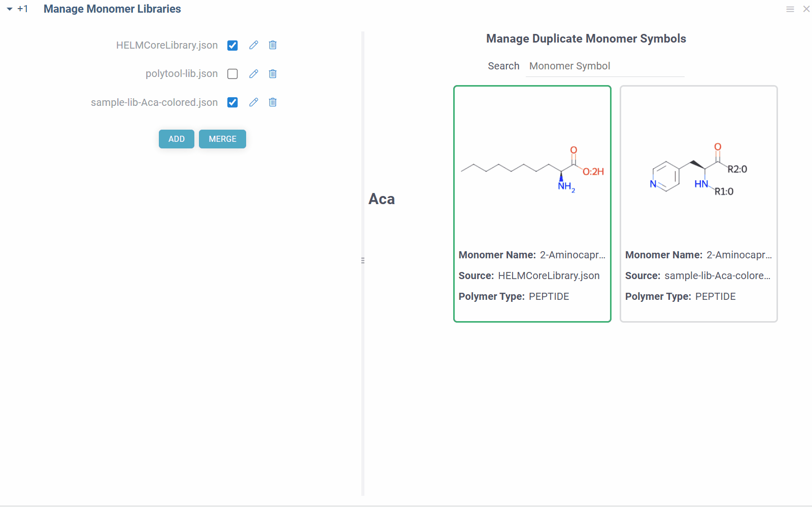

```mdx-code-block
import Tabs from '@theme/Tabs';
import TabItem from '@theme/TabItem';
```

<details>
<summary>Requirements</summary>

To access the bioinformatics functionality, install these
packages using the [Package Manager](https://public.datagrok.ai/packages) (on the **Sidebar**, click **Manage** > **Packages**):

* Required. [Bio](https://github.com/datagrok-ai/public/blob/master/packages/Bio/README.md).
* Optional. [Biostructure Viewer](https://github.com/datagrok-ai/public/tree/master/packages/BiostructureViewer/README.md): Visualization of macromolecules in 3D.
* Optional. [Helm](https://github.com/datagrok-ai/public/tree/master/packages/Helm/README.md): Rendering, editing, managing monomer libraries.
<!--* Optional. [Sequence Translator](https://github.com/datagrok-ai/public/tree/master/packages/SequenceTranslator): Translates oligonucleotide sequences between multiple representations.-->
* Optional. [Peptides](https://github.com/datagrok-ai/public/tree/master/packages/Peptides/README.md): SAR analysis for sequences.
<!--* Optional. [Oligo Batch Calculator](https://github.com/datagrok-ai/public/tree/master/packages/OligoBatchCalculator/README.md): Calculators for oligonecleotide properties.-->

</details>

Datagrok lets you work with macromolecules both on the macro (sequence) level and atomic level:

* Data visualization and exploration
  * Support for multiple formats, such as FASTA (DNA/RNA/protein), delimiter-separated FASTA, [HELM](https://en.wikipedia.org/wiki/Hierarchical_editing_language_for_macromolecules), [PDB](https://en.wikipedia.org/wiki/Protein_Data_Bank_(file_format)), and [others](../../../../access/files/supported-formats.md). Handles nucleotides, natural and non-natural peptides, 3D-structures, and other modalities.
  * [Automatic detection of sequences](../../../../govern/catalog/semantic-types.md) upon data import.
  * Flexible and fast [spreadsheet](#spreadsheet) that shows both macro and small molecules.
  * [Interactive visualization of biological data](#exploring-biological-data).
  * Customizable [info panes](../../../../datagrok/navigation/panels/info-panels.md) with information about macromolecules and context actions.
  * [Sequence editing](#sketching-and-editing), [search, and filtering](#searching-and-filtering).
  * Sequence analysis
    * [Sequence composition](#sequence-composition)
    * [Sequence space](#sequence-space)
    * [Hierarchical clustering](#hierarchical-clustering)
    * [Multiple sequence alignment](#multiple-sequence-alignment-msa)
  * Structure-Activity Relation (SAR) analysis
    * [Activity cliffs](#activity-cliffs)
    * A fit-for-purpose application for [SAR analysis for peptides](#sar-for-peptides)
  * A comprehensive [ML toolkit](../../../solutions/domains/data-science.md) for
clustering, dimensionality reduction techniques, imputation, PCA/PLS, and other tasks. Built-in statistics.
  * Flexible reporting and sharing options, including [dynamic dashboards](../../../../access/databases/databases.md#sharing-query-results).
* [Oligonucleotides chemical modifications and format conversion](#oligo-toolkit).
* Connection to chemistry level: [split to monomers](#split-to-monomers), and [get the atomic-level structure](#get-atomic-level-structure).
* [Extensible environment](#customizing-and-extending-the-platform)
  * Ability to add or customize any functionality using [scripts](../../../../compute/scripting/scripting.mdx) in Python, R, Matlab, and other supported languages.
  * Ability to create custom plugins and fit-for-purpose applications.
* [Enterprise-grade platform](../../../solutions/enterprise/enterprise-evaluation-faq.md) for efficient data access and management.

## Data access

Datagrok provides a single, unified access point for organizations.
You can connect to local file storage, clouds (Amazon S3, Google cloud, etc),
SQL and NoSQL databases or any other of the
[30+ supported data sources](../../../../access/databases/connectors/connectors.md),
retrieve data, and securely share data with others.
Datagrok can ingest data in [multiple file formats](../../../../access/files/supported-formats.md) (such as Fasta or CSV)
and multiple notations for nucleotide and amino acid sequences, with natural and modified monomers,
aligned and non-aligned forms.

You can also create macromolecule queries against data sources using built-in querying tools. To learn more about querying data and data access in general, see the [Access](../../../../access/access.md) section of our documentation.

## Exploring biological data

Datagrok provides a range of tools for analyzing macromolecules (**Top Menu** > **Bio**).
In addition, Datagrok provides a comprehensive
[machine learning toolkit](../../../solutions/domains/data-science.md) for
clustering, dimensionality reduction techniques, imputation, PCA/PLS, and other tasks (**Top Menu** > **ML**). Some of these tools can be applied directly to macromolecules.

When you open a dataset, Datagrok automatically detects macromolecules and makes available macromolecule-specific context actions. For example, when you open a CSV file containing macromolecules in the FASTA format, the following happens:

* Data is parsed, and the [semantic type](../../../../govern/catalog/semantic-types.md) _macromolecule_ is assigned to the corresponding column.
* Macromolecules are automatically rendered in the spreadsheet.
* Column tooltip now shows the sequence composition.
* Default column filter is now a subsequence search.
* A top menu item labeled **Bio** appears.
* Column and cell properties now show macromolecule-specific actions, such as sequence renderer and libraries options, sequence preview, and macromolecule space preview.


<!--When you click on a macromolecule, you see the following in the **Context Panel**:

* Macromolecule composition by monomer (**Composition**).
* Macromolecule similarity (**Similarity**).
* Macromolecule sequence and notations in supported formats (**Notations**).
* Ability to get atomic level (**To Atomic Level**).-->

When you click on a column with macromolecules, you see the following in the **Context Panel**:

* Filter
* Manage Libraries
* Sequence Renderer: Rendering options.
* Peptides: From this pane, you can launch the [SAR analysis for peptides](#sar-for-peptides).
<!--* **Peptide space**: From this pane, you can launch the [peptide space analysis](#sequence-space).-->

<details>
<summary>Info pane options</summary>

Some info panes can be customized. To reveal an info pane's available options, hover over it:

* View and/or edit the underlying script (click the **Script** icon).
* Change parameters (click the **Parameter** icon).
* Change the info pane's settings (click the **Gear** icon).
* Append info pane as a column (click the **More actions** icon and select **Add as a column**).

To learn how to customize and extend the platform programmatically, see the [Develop](../../../../develop/develop.md) section of our documentation.

</details>

:::note developers

Info panes be extended with [functions](../../../concepts/functions/functions.md) in any supported language.

:::

### Spreadsheet

The [spreadsheet](../../../../visualize/viewers/grid.md) lets you visualize and [edit](#sketching-and-editing) sequences and macromolecules. You can add new columns with calculated values, interactively [filter and search](#searching-and-filtering) rows, color-code columns, pin rows or columns, set edit permissions, and more.

```mdx-code-block
<Tabs>
<TabItem value="display-for-helm" label="HELM" default>
```

HELM is used for macromolecules with non-natural monomers, circular and branching structures.
The structures are displayed with colors corresponding to each monomer.


```mdx-code-block
</TabItem>
<TabItem value="display-for-fasta" label="FASTA">
```

Peptide sequences are color-coded based on amino acid properties. DNA sequences are colored-coded to distinguish between various nucleotides.


```mdx-code-block
</TabItem>
<TabItem value="display-for-pdb" label="PDB">
```

For PDB files, cells display a preview of the 3D structure. When you click a cell, a separate viewer opens up, allowing you to rotate, zoom in, or switch the color scheme.


```mdx-code-block
</TabItem>
</Tabs>
```

### Macromolecule aware viewers

Datagrok _viewers_ recognize and display macromolecules. The majority of the viewers were built from scratch to take
advantage of Datagrok's in-memory database, enabling seamless access to the same data across all viewers.
Viewers also share a consistent design and usage patterns. Any action taken on one viewer, such as hovering, selecting,
or [filtering](../../../../visualize/viewers/filters.md), is automatically applied to all other viewers, creating
an interconnected system ideal for exploratory data analysis.

Macromolecule-specific viewers include [sequence logo](../../../../visualize/viewers/web-logo.md), 3D structure viewers
([biostructure](../../../../visualize/viewers/biostructure.md) and [NGL viewer](../../../../visualize/viewers/ngl.md)),
and [sequence tree viewers](../../../../visualize/viewers/dendrogram.md). Examples of general-purpose viewers that
can be used to analyze biological data include a [scatterplot](../../../../visualize/viewers/scatter-plot.md),
a [network diagram](../../../../visualize/viewers/network-diagram.md), a [tile viewer](../../../../visualize/viewers/tile-viewer.md),
a [bar chart](../../../../visualize/viewers/bar-chart.md), a [form viewer](../../../../visualize/viewers/form.md),
and [trellis plot](../../../../visualize/viewers/trellis-plot.md), and others.

<details>
<summary>Examples</summary>

```mdx-code-block
<Tabs>
<TabItem value="spreadsheet-for-msa" label="Spreadsheet" default>
```

Composition analysis for MSA.


```mdx-code-block
</TabItem>
<TabItem value="scatterplot-for-macromolecules" label="Scatterplot">
```

Activity cliffs analysis using a scatterplot.


```mdx-code-block
</TabItem>
</Tabs>
```

</details>

All viewers can be saved as part of the [layout](../../../../visualize/view-layout.md) or a dashboard. Some viewers offer built-in statistics.

To learn how to use viewers to explore data, complete [this tutorial](https://public.datagrok.ai/apps/tutorials/Tutorials/ExploratoryDataAnalysis/Viewers) or visit the [Visualize](../../../../visualize/viewers/viewers.md) section of our documentation.

:::note developers

You can [add custom viewers](../../../../develop/how-to/develop-custom-viewer.md).

:::

### Analyzing docking results

To explore the binding interactions between small ligand molecules and biological structures, you can use either the [NGL](../../../../visualize/viewers/ngl.md) or [biostructure](../../../../visualize/viewers/biostructure.md) viewer. Both viewers visualize the docked ligands in their spatial context and let you examine their orientation and positioning within the binding site.

<details>
<summary>How to use</summary>

Prerequisites: Prepare the simulation data in two separate files:

* File 1: Contains the structure of a macromolecule in a [supported format](../../../../access/files/supported-formats.md), such as PDB.
* File 2: Contains the simulation results of the position of small molecules relative to the structure.

To visualize docked ligands, follow these steps:

1. Open the table with ligands (File 2) in Datagrok.
1. Add either the NGL or biostructure viewer.
1. In the viewer, drop the file with the macromolecule structure (File 1).

You can interact with the ligands as follows:

* To visualize docking for a particular ligand, click it. You can visualize multiple ligands simultaneously by selecting or hovering over rows.
* If one ligand is selected, it will be visualized with a full-color ball+stick representation.
* For multiple ligands:
  * The current row ligand is shown in green.
  * The mouse-over row ligand is shown in light gray.
  * The selected row(s) ligands is shown in orange.

You can further analyze the ligand data by applying filters, allowing you to focus on specific subsets based on criteria such as binding energy estimates or scoring functions. You can also cluster the ligands based on one or more parameters to identify patterns and groups within the dataset.

<!--GIF PLACEHOLDER-->

</details>

## Sketching and editing

You can create and edit macromolecules:

* For DNA, RNA, and protein sequences in the linear format, you can edit the sequences.
* For HELM notation, you can add or remove monomers and modify connections. The editor supports circular and branching structures.


## Searching and filtering

Datagrok offers an intuitive searching and filtering functionality for exploring datasets.

For sequence-based filtering of macromolecules, Datagrok uses [integrated HELM editor](#sketching-and-editing) for HELM notations and text-based filter for linear notations. All filters are interactive. Hovering over categories or distributions in the **Filter Panel**  instantly highlights relevant data points across all viewers.

The search feature provides another way to analyze your dataset. The search results are presented as a new column in the table, where checkboxes indicate whether each sequence is a match or not. You can color-code the search results for quick visual profiling. In addition, like any other column in the table, this column can be used as a filter. This means you can create and apply additional filters based on the search results, facilitating further analysis and exploration of the dataset.


<details>
<summary>How to filter</summary>

To filter by sequence, do the following:

1. On the **Top Menu**, click the **Filter** icon to open the **Filter Panel**. The panel shows filters for all dataset columns. By default, the subsequence filter is displayed on top but you can rearrange, add, or remove filter columns by using available controls.
1. To enter a subsequence, **Click to edit** button.
1. Once finished, click **OK** to apply the filter.

To clear the filter, use the checkbox provided. To remove the filter altogether, use the **Close** (**x**) icon.

</details>

<details>
<summary>How to search</summary>

To search a dataset for matching sequences, do the following:

1. In the **Top Menu**, select **Bio** > **Substructure Search...** A dialog opens.
1. In the dialog, paste or type the sequence in the field provided and click **OK**. A new column is added to the table.

</details>

To learn more about filtering, watch this [video](https://www.youtube.com/watch?v=GM3XixUFFUs&t=2688s) or read [this article](../../../navigation/views/table-view.md#select-and-filter).

## Manage monomer libraries

Datagrok allows you to manage monomer libraries for any Macromolecule type (DNA, RNA, Peptide or custom). Monomer libraries are used to define the monomers, their properties and molecular structures that are
used throughout the platform. They are crucial for functions like [To Atomic Level](#get-atomic-level-structure) conversion, sequence analysis, and other bioinformatics tasks, ensuring accurate representation and manipulation of macromolecules.

The default [HELM monomer library](https://github.com/datagrok-ai/public/blob/master/packages/Bio/files/monomer-libraries/HELMCoreLibrary.json) is pre-installed with the [Bio package](https://github.com/datagrok-ai/public/tree/master/packages/Bio). You can add your own monomer libraries using the view accessible from **Top Menu** > **Bio** > **Manage** > **Monomer Libraries**:


To include monomers from a library, click on a checkbox next to its name. Similarly, to exclude monomer library, uncheck the checkbox. The changes are applied immediately and reflected throughout the platform.

To add a new monomer library file, click **ADD** button. All monomer library files are validated against the standard HELM [JSON schema](https://github.com/datagrok-ai/public/blob/master/packages/Bio/files/tests/libraries/HELMmonomerSchema.json) and must fully conform to it. The added files will be stored under `AppData/Bio/monomer-libraries` in [file shares](../../../../access/files/files.md#connecting-to-file-storage).

You can also merge selected monomer libraries into a single file by clicking **MERGE** button. The merged file will be saved in the same location as the original files or can be downloaded.
Not needed monomer libraries can be removed by clicking **Delete** icon next to their name.

Some combinations of monomer libraries can contain conflicting monomer definitions (different structures/properties for same monomer symbol). In such cases, you will see duplicate monomer symbols, along with their structures and sources on the right side of the view. You can manually resolve these conflicts by selecting the correct monomer structure for the given symbol, and the choice will be immediately applied throughout the platform.



### Manage monomers

Apart from being able to manage which monomer libraries are used, you can also manage and edit individual monomers within them. To do so, click on the **Edit** icon next to the monomer library name. You can also access monomer management through **Top Menu** > **Bio** > **Manage** > **Monomers**. This view allows you to view, add, edit and delete monomers within the selected monomer library.

The view consists of two main parts: On the left side, you can see a molecular sketcher, where you can draw the structure of the monomer, along with the monomer properties editors such as name, symbol, natural analog, r-groups, colors and others. On the right side, you can see a list of all monomers in the library, along with their structures and properties. You can select a monomer from the list to edit its properties, or delete it from the library.


<details>
<summary>How to use</summary>

* To remove a monomer from the library, right click on the monomer in the table, and select **Remove Monomer**. Alternatively, you can select the monomer and click the **Delete** icon on the top ribbon pannel. You can also remove multiple monomers at once by selecting them and clicking the **Delete** icon.


* To add a new monomer to the library, click the **Add** icon on the top ribbon panel. This will create a blank monomer, for which you can draw molecular structure, fill in the properties and save it to the library.
  * If the given symbol or molecular structure already exists in the library, you will be prompted about it.
  * The molecular structure is requeired to have at least one R-group.
  * Upon drawing the structure, monomer natural analogue will be automatically set to the most similar natural monomer (based on tanimoto similarity of corresponding Morgan fingerprints).


* You can also edit existing monomers, or use them as template for new ones. To do so, simply click on any monomer in the table, and its properties will be loaded into the editor. You can then modify the properties, and save the changes to the library. To find a monomer in the table, you can use standard datagrok filters, which enables you to search based on names, symbols, molecular substructure, similarity, and other properties.


</details>


## Sequence analysis

### Sequence composition

You can create a
[sequence logo](https://en.wikipedia.org/wiki/Sequence_logo) to show the letter composition for each position in
a sequence. A sequence logo is usually created from a set of aligned sequences
and helps identify patterns and variations within those sequences.
A common use is to visualize protein-binding sites in DNA or functional motives in proteins.

 <!--redo gif due to poor resolution-->

<details>
<summary>How to use</summary>

1. In the **Top Menu**, select **Bio** > **Composition Analysis**. The sequence logo viewer is added to the **Table View**.
1. To edit parameters, hover over the viewer's top and click the **Gear** icon.

</details>

### Sequence space

Sequence space visualizes a collection of sequences in 2D such that similar sequences are placed close to each other
(geekspeak: [dimensionality reduction](https://en.wikipedia.org/wiki/Dimensionality_reduction), [tSNE](https://scikit-learn.org/stable/modules/generated/sklearn.manifold.TSNE.html), [UMAP](https://umap-learn.readthedocs.io/en/latest/), [distance functions](https://www.sciencedirect.com/science/article/pii/S0888613X07000382)). This allows to identify clusters of similar sequences, outliers, or patterns that might be difficult to detect otherwise. Results are visualized on the interactive [scatterplot](../../../../visualize/viewers/scatter-plot.md).

Sequence space analysis is particularly useful for separating groups of sequences with common motifs, such as different variants of complementarity-determining regions (CDRs) for antibodies.


<details>
<summary> How to use </summary>

Go to the **Top Menu** and select **Bio** > **Analyse** > **Sequence Space...** This opens a **Sequence Space** parameter dialog.

The dialog has the following inputs:

* **Table**: The table containing the column of sequences.
* **Column**: The column containing the sequences.
* **Encoding function**: The encoding function that will be used for pre-processing of sequences. For non-helm notation sequences, only one encoding function is available, that will encode them in single charachter form and calculate the substitution matrix for each individual monomer. For [Helm](https://en.wikipedia.org/wiki/Hierarchical_editing_language_for_macromolecules) sequences, apart from prior function, another one is offered that will use [chemical fingerprint](https://www.rdkit.org/UGM/2012/Landrum_RDKit_UGM.Fingerprints.Final.pptx.pdf) distances between each macromolecule to calculate distance matrix. The `Encode sequences` function has 3 parameter which you can adjust using the gear (⚙️) button next to the encoding function selection: 
    * Gap open penalty: The penalty for opening a gap in the alignment (used for [Needleman-Wunsch](https://en.wikipedia.org/wiki/Needleman%E2%80%93Wunsch_algorithm) algorythm).
    * Gap extend penalty: The penalty for extending a gap in the alignment (used for [Needleman-Wunsch](https://en.wikipedia.org/wiki/Needleman%E2%80%93Wunsch_algorithm) algorythm).
    * Fingerprint type: The type of molecular fingerprints that will be used to generate monomer substitution matrix.
* **Method**: The dimensionality reduction method that will be used. The options are:
    * UMAP: [UMAP](https://umap-learn.readthedocs.io/en/latest/) is a dimensionality reduction technique that can be used for visualisation similarly to t-SNE, but also for general non-linear dimension reduction.
    * t-SNE: [t-SNE](https://en.wikipedia.org/wiki/T-distributed_stochastic_neighbor_embedding) is a machine learning algorithm for dimensionality reduction developed by Geoffrey Hinton and Laurens van der Maaten. It is a nonlinear dimensionality reduction technique that is particularly well-suited for embedding high-dimensional data into a space of two or three dimensions, which can then be visualized in a scatter plot.

    Other parameters for dimensionality reduction method can be accessed through the gear (⚙️) button next to the method selection.

* **Similarity**: The similarity/distance function that will be used to calculate pairwise distances. The options are:
    * Needleman-Wunsch: [Needleman-Wunsch](https://en.wikipedia.org/wiki/Needleman%E2%80%93Wunsch_algorithm) is a dynamic programming algorithm that performs a global alignment on two sequences. It is commonly used in bioinformatics to align protein or nucleotide sequences.
    * Hamming: [Hamming distance](https://en.wikipedia.org/wiki/Hamming_distance) is a metric for comparing two macromolecules of same length. Hamming distance is the number of positions in which the two monomers are different.
    * Monomer chemical distance: Similar to Hamming distance, but instead of penalizing the missmatch of monomers with -1, the penalty will be based on the chemical distance between the two monomers. The chemical distance is calculated using the [chemical fingerprint](https://www.rdkit.org/UGM/2012/Landrum_RDKit_UGM.Fingerprints.Final.pptx.pdf) of the monomers.
    * Levenshtein: [Levenshtein distance](https://en.wikipedia.org/wiki/Levenshtein_distance) is a string metric for measuring the difference between two sequences. Informally, the Levenshtein distance between two sequences is the minimum number of single-monomer edits (insertions, deletions or substitutions) required to change one sequence into the other.
* **Plot embeddings**: If checked, the plot of the embeddings will be shown after the calculation is finished.
* **Postprocessing**: The postprocessing function that will be applied to the resulting embeddings. The options are:
    * **None**: No postprocessing will be applied.
    * **DBSCAN**: The DBSCAN algorithm groups together points that are closely packed together (points with many nearby neighbors), marking as outliers points that lie alone in low-density regions (whose nearest neighbors are too far away). The DBSCAN algorithm has two parameters that you can adjust through the gear (⚙️) button next to the postprocessing selection:
        * **Epsilon**: The maximum distance between two points for them to be considered as in the same neighborhood.
        * **Minimum points**: The number of samples (or total weight) in a neighborhood for a point to be considered as a core point. This includes the point itself.
    * **Radial Coloring**: The radial coloring function will color the points based on their distance from the center of the plot. The color will be calculated as a gradient from the center to the border of the plot.

**WebGPU (experimental)**

WebGPU is an experimental feature that allows you to use the GPU for calculations in browser. We have implemented the KNN graph generation (with support to all simple and non-trivial distance functions like Needleman-Wunsch, Levenstain, etc.) and UMAP algorithms in webGPU, which can be enabled in the dimensionality reduction dialog. This can speed up the calculations significantly, especially for large datasets, up to 100x. This option can be found in the gear (⚙️) button next to the method selection (UMAP). 

Please note, that webGPU is still considered as experimental feature, and for now only works in Chrome or Edge browsers (although it is planned to be supported in Firefox and Safari in the future). If webGPU is not supported in your browser, this checkbox will not appear in the dialog. To make sure that your opperating system gives browser access to correct(faster) GPU, you can check the following:
* Go to settings and find display settings
* Go to Graphics settings.
* In the list of apps, make sure that your browser is set to use high performance GPU.

</details>

### Hierarchical clustering

Hierarchical clustering groups sequences into an interactive [dendrogram](../../../../visualize/viewers/dendrogram.md).
In a dendrogram, distance to the nearest common node represents the degree of similarity between each pair of sequences.
Clusters and their sizes can be obtained by traversing the trunk or branches of the tree and deciding at which level
to cut or separate the branches. This process lets you identify different clusters based on the desired level
of similarity or dissimilarity between data points.


<details>
<summary>How to use</summary>

To add a dendrogram viewer, do the following:

1. In the **Top Menu**, select **Bio** > **Hierarchical clustering**. A dialog opens.
1. In the dialog, select the parameters and click **OK** to add the dendrogram to the **Table View**.

</details>

### Multiple sequence alignment (MSA)

[Multiple Sequence Alignment](https://en.wikipedia.org/wiki/Multiple_sequence_alignment) aligns sequences for macromolecules in both FASTA and HELM formats. For DNA, RNA, and natural peptides, we use
[KAlign](https://github.com/TimoLassmann/kalign), which can be modified to work with custom substitution matrices for
sequences. For non-natural sequences, we use [PepSeA](https://github.com/Merck/PepSeA), which enables alignment of multiple linear peptide sequences in HELM notation, with lengths of up to 256 non-natural amino acids. <!--PepSeA uses a substitution matrix calculated with Rapid Overlay of Chemical Structures Similarities Across ChEMBL 28 HELM Monomers.-->

<details>
<summary>How to use</summary>

To perform MSA, do the following:

1. In the Top Menu, select **Bio** > **MSA...** . A dialog opens.

  <!--replace png with a GIF file showing the steps-->

1. In the dialog, select the sequence column (**Sequence**) and set other parameters.
   If your data has been clustered already, you can align sequences only within the same cluster. To do so, specify a column containing clusters (**Cluster**).
1. Click **OK** to execute. A new column containing the aligned sequences is added to the table.

</details>

<!---

This part of functionality was describes a while ago and haven't been tested by me,
so for now it's hidden

### Sequence alignments
When a file containing aligned sequences is imported,
Datagrok splits the aligned data into an alignment table by MSA
positions (see the illustration below)
and performs composition analysis in a barchart on the top of this table.
It visualizes multiple sequence alignments with long monomer identifiers.

The composition barchart is interactive,
the corresponding rows could be selected by clicking on the segment.
The rows are also highlighted in other open visualizations (such as scatter plots)
when you hover over the bar.
This enables interactive data exploration,
including on-the-fly statistical analysis of differences in measured values (activity)
associated with sequences.

For identifiers that do not fit in a cell, an ellipsis is shown.


Sequence alignment visualization allows for manually modifying the alignment in the case when automatic alignment result
is not satisfactory. The composition analysis plot changes interactively, providing a quick indication of how good the
alignment is.


-->

## Sequence-Activity relationship analysis

### Activity cliffs

The **Activity Cliffs** tool in Datagrok detects and visualizes pairs of sequences with highly similar monomer composition but significantly different activity levels, known as "activity cliffs". The **Activity Cliffs** tool is an enhanced version of [Sequence Space](#sequence-space), specifically designed for Sequence-Activity Relationship (SAR) analysis. To run the analysis, you need a dataframe that contains peptide/DNA sequences
along with numerical data representing the associated activity.
For example, you can use sequences of short peptides with measured antimicrobial effects
or DNA sequences with measured affinity to a specific protein.

<Tabs>
<TabItem value="activity-cliffs" label="Activity Cliffs" default>


</TabItem>
<TabItem value ="activity-cliffs-pairs" label="Cliff pairs">

<!--replace both with 1 GIF-->

</TabItem>
</Tabs>

<details>
<summary>How to use</summary>

To run the activity cliffs analysis, do the following:

1. In the **Menu Ribbon**, select **Bio** > **Activity Cliffs...** A parameter dialog opens.
1. In the parameter dialog, specify the following:
   1. Select the source table, sequence column, and activity data column to analyze.
   1. Set the similarity cutoff.
   1. Select a dimensionality reduction algorithm and adjust its parameters using the **Gear** icon next to the **Method** control.
1. Click **OK** to execute the analysis. A scatterplot visualization is added to the view.
1. Optional. In the scatterplot, click the link with the detected number of cliffs to open an **Activity Cliffs** table containing all pairs of molecules identified as cliffs. The tables also has detailed information such as similarity score, activity difference score, and other data.

In the scatterplot, the marker color corresponds to the level of the sequence activity, and the size represents the maximum detected activity cliff for that sequence. The opacity of the line connecting sequence pairs corresponds to the size of the activity cliff.

To explore the sequence pairs:

* Click a sequence in the source dataframe to zoom in on the scatterplot and focus on the pair that includes the selected molecule. Hover over sequence pairs and connecting lines to see summary information about them.
* Click the line connecting sequences in the scatterplot to select a corresponding pair of sequences in the underlying dataframe and **Activity Cliffs** table. The reverse also applies: clicking a pair in the **Activity Cliffs** table updates the scatterplot and selects the corresponding rows in the underlying dataframe.

As you browse the dataset, the **Context Panel** updates with relevant information.

</details>

### SAR for peptides

The [Peptides](peptides-sar.md)
application performs SAR analysis of peptides. The app offers the following features:

* Automatic detection of most potent monomer/positions.
* Filtering based on monomer, position, or any other attribute.
* Ability to analyze differences in activity distribution for groups of peptides.
* Dynamic calculations of statistically significant differences in activity distributions between groups.
* Analyzing the peptide space.


<!--replace with a gif-->

## Utilities

### Format conversion

Datagrok converts macromolecules between formats, such as HELM or FASTA.

For individual macromolecules, the conversion happens automatically as you interact with them in the dataset. The **Context Panel** shows all supported notations, along with the sequence view <!--in the **Sequence** info pane (**Context Panel** > **Sequence**)-->. You can also perform conversion on the entire column by choosing the corresponding option from the **Bio** > **Convert** menu.

### Split to monomers

You can split linear macromolecules to monomers.


<details>
<summary>How to use</summary>

1. In the **Top Menu**, select **Bio** > **Convert** > **Split to Monomers**. A dialog opens.
1. In the dialog, select the sequence column and click **OK** to execute. New columns containing monomers are added to the table.

</details>

### Get atomic-level structure

You have two options to generate the atomic structure of the sequences:

* Generate the sequence using the Helm Editor which results in the unordered molecule graph.
* For linear sequences, reproduce the linear form of molecules. This is useful for better visual inspection of a sequence and duplex comparison.

This approach could be used for any given case of HELM notation
in order to get a visually appropriate form of monomers
in cycles etc. Structure at atomic level could be saved in available notations.


<details>
<summary>How to use</summary>

1. In the **Top Menu**, select **Bio** > **Convert** > **To Atomic Level**. A dialog opens.
2. In the dialog, select the sequence column and click **OK** to execute. A new column containing atomic structures
   of sequences is added to the table. In addition, a menu **Chem** appears in the **Top Menu**. Clicking
   the atomic-level structures displays cheminformatics-related information in the **Context Panel**.

</details>

### Get region

With Datagrok, you can extract a region of sequences in a Macromolecule column.
The Get Region function maintains `.positionNames` and `.positionLabels` for extracted region.
The Get Region input form shows Region input if a Macromolecule column is annotated with `.regions` tag (JSON format),
to easy selection region of interest to extract.


<details>
<summary>How to use</summary>

1. To call Get Region:

    * Select **Bio** > **Convert** > **GetRegion**. A dialog opens. In the dialog select a table and a sequence column.
    * Click on the **Hamburger** icon of a Macromolecule column. Expand section **Get Region**.

2. Fill in start and end positions of the region of interest, and name of
   a column. A new column containing sequences of the region of interest is added to the table.

</details>

### Oligo Toolkit

The Oligo Toolkit is a collection of tools helping you to work with oligonucleotide sequences.
To learn more and how to use, see the [OligoToolkit](oligo-toolkit.md) page.

## Customizing and extending the platform

Datagrok is a highly flexible platform that can be tailored to meet your specific needs and requirements.
With its comprehensive set of [functions](../../../../develop/function-roles.md) and
[scripting capabilities](../../../../compute/scripting/scripting.mdx),
you can customize and enhance any aspect of the platform to suit your biological data needs.

For instance, you can add new data formats,
custom libraries, apply custom models, or perform advanced calculations and analyses
using powerful bioinformatics libraries
like [Biopython](https://biopython.org/),
[Bioconductor](https://www.bioconductor.org/),
[ScanPy](https://scanpy.readthedocs.io/en/stable/),
and others.

You can also add or change UI elements, create custom connectors, menus, context actions, and more.
You can even develop entire applications on top of the platform
or customize any existing [open-source plugins](https://github.com/datagrok-ai/public/tree/master/packages).

[Learn more about extending and customizing Datagrok](../../../../develop/develop.md).

## Resources

* [Demo app](https://public.datagrok.ai/apps/Tutorials/Demo)
* Videos:
  * [Peptides](https://www.youtube.com/watch?v=HNSMSf2ZYsI&ab_channel=Datagrok)
