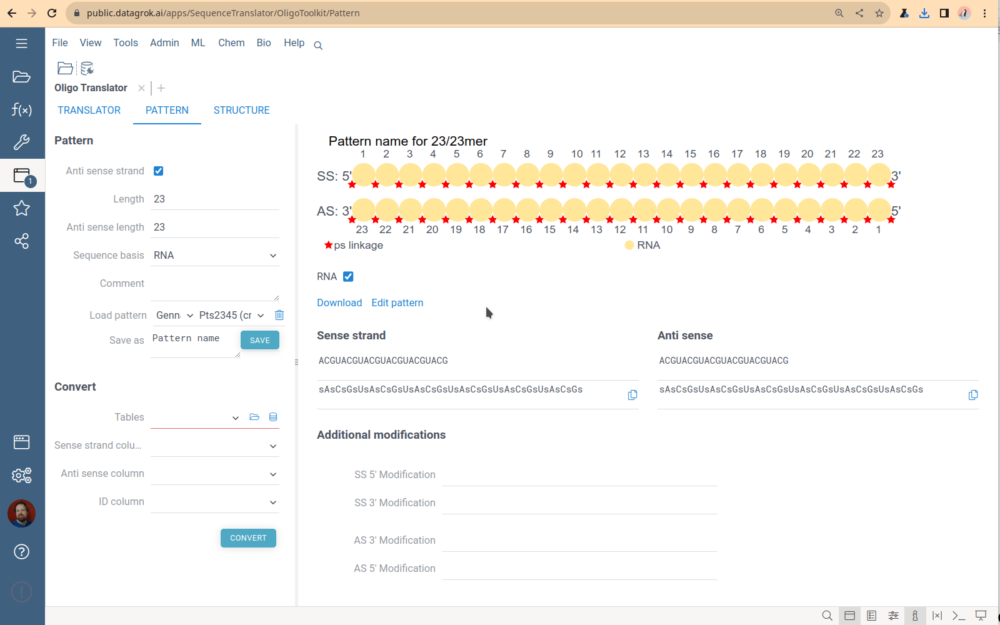
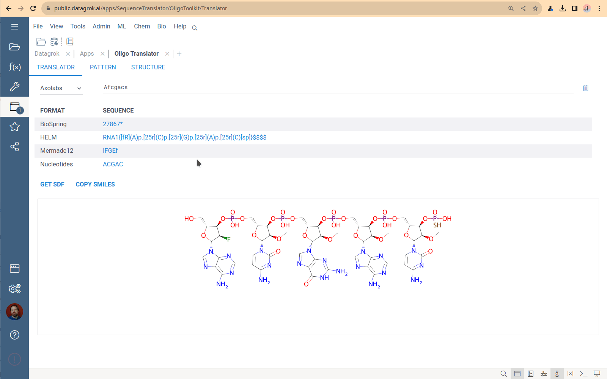
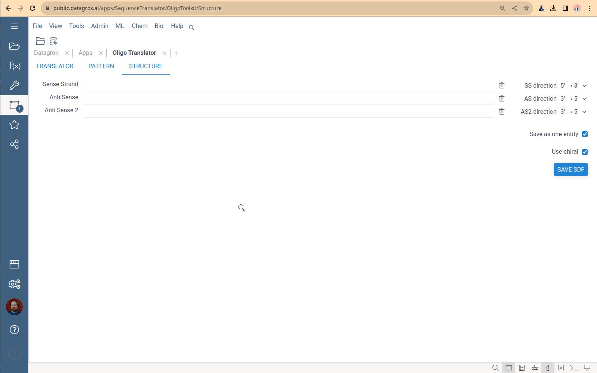

The OligoToolkit is a collection of tools helping you to work with oligonucleotide sequences 
– primarily for synthesizing DNA/RNA oligonucleotides with various chemical modifications.
An example use-case is producing double-stranded RNAs for the RNA-silencing.

To open the app, on the **Sidebar**, select **Functions** > **Apps** > **Oligo Toolkit**.

The OligoToolkit 
application contains several independent modules, 
allowing you to do the following:

* Individual and batch modification of the FASTA-encoded DNA/RNA sequences according to the pattern. 
* Conversion of chemically modified sequences between several open and commercial formats: FASTA, HELM, MerMade, BioSpring.
* Producing chemical structures for the natural and modified oligonucleotides.

## Chemical modification by pattern

The **Pattern** tool applies a modification pattern to a sequence or set of sequences.
To apply modification:
1. Create the pattern using the **Pattern** input sections.
   * In the **Pattern** input section, choose the sequence basis (DNA/RNA) and pattern length
     for sense and anti-sense strands.
   * Alternatively, load the pattern from the list of saved patterns.  
     Loading patterns created by other users are also available.
2. Paste the nucleotide sequences (sense and/or anti-sense) in the text boxes under the pattern image, 
   and obtain modified sequences in the Axolabs format.
3. When you edit the pattern, OligoToolkit automatically updates the resulting sequences.

### Nucleotide batch conversion

To apply one pattern to a list of nucleotides, use the **Batch conversion** mode
of the **Pattern** tool.

1. Upload/choose a dataframe containing unmodified sequences using the **Convert** input section.
   The dataframe should contain at least three columns: sequence ID, sense, and anti-sense strands. 
2. Press the **Convert** button and receive the modified sequence in Axolabs format.

### Supported modifications

* Type of the bases: Methylated, with 2’-fluorescent mark, artificial bases.
* Additional groups at the 5’ and 3’ ends of the chain.
* Phospho-tiole connections.
* Nucleotide connection type (2’ instead of 3’).
* Tio-sulfur bond between nucleotides.

## Sequence format translator

A tool to convert oligonucleotide sequences 
between different formats and generate SDF and SMILES representations. 

You specify one sequence, choose a format, and receive the set of sequences in all other supported formats. 
The Translator application has no bulk load supported. 
This tool is designed to convert only 1-2 sequences. 
The most common use case is checking that the conversion is correct for a particular structure.

### Viewing and managing the monomer library

Click the book icon next to the caption on the Translator tab to open the Monomer library – 
the collection of all monomers that the Translator uses to generate chemical formulas.
The monomers used by sequencing machines do not follow the monomer definition in the HELM standard. 
So, historically, the OligoToolkit monomer library is a simple dataframe 
containing monomer chemical structures and codes for sequence formats.
To download the library, click the “Down arrow” icon next to the caption and select format. 
Currently, the only way to add new monomers to this library and specify connection points 
is by using the custom Python script from the OligoToolkit package, which is tricky.
This part of the code is being refactored now.

### Chemical structure generator

A tool to convert nucleotide sequences to SDF. 
It is designed especially for generating siRNA chemical structure 
with the sense strand and one or two anti-sense strands. 
Paste the sequences for sense and anti-sense strands and get the structure in the SDF format.
You can save separate structures for each strand or combined SDF for all strands.
Also, you can choose the direction for strands.

## OligoBatch Calculator

The OligoBatch Calculator tool calculates properties of the oligonucleotides 
(for example, obtained from sequencing machine or purchased).

To use it, specify the nucleotide yield amount: value and units. 
Then, paste oligonucleotide sequences in the FASTA or AxoLabs format.
The tool shows the table containing oligonucleotide properties: 
length, molecular weight, the amount in different units (mkg, nMols), 
optical density, and extinction coefficient.
