Datagrok provides the Peptides package to analyze peptide [structure-activity relationship](https://en.wikipedia.org/wiki/Structure%E2%80%93activity_relationship).
From the computational and analytical point of view, peptides are an intermediate case between small molecules and
large proteins. Analyzing peptides requires the use of different analytical methods with adequate precautions.

Datagrok automatically detects biological sequences in various formats from data, highlights monomers and unlocks a toolkit for their processing:

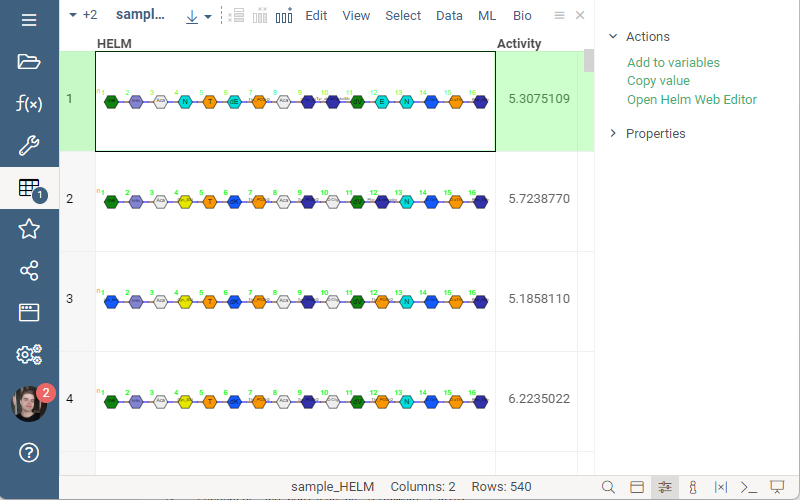

You can perform SAR analysis on any dataset containing macromolecules and activities:

1. Click **Bio > SAR > Peptides...** in the top menu to prepare for the analysis. The dialog containing analysis
options will appear. In the dialog, you can preview the composition analysis with WebLogo.
2. Choose the sequences column, this can be any Macromolecule column.
3. Choose the activity column, this can be any numeric column.
4. Choose an activity scaling method. On the right of the inputs, you can find the distribution of the scaled
activity.
5. Optionally, choose a clusters column. The clusters column enables composition analysis and
   useful statistics for each of the clusters. if left empty, the analysis will perform clustering based on Markov clustering algorithm.
   Clustering parameters such as distance function and others can be configured through the dialog
6. Click "OK" to start the analysis.

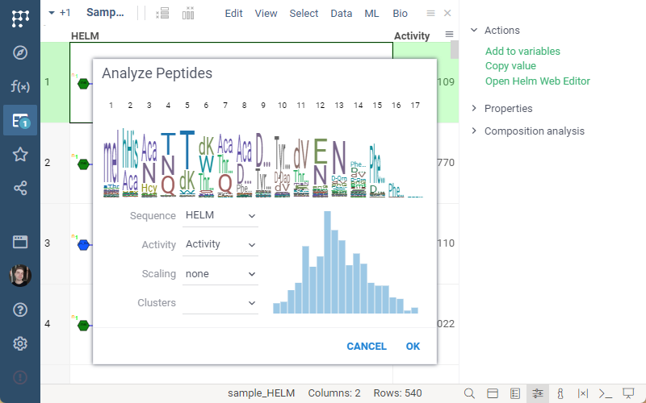

## Analysis View

The analysis view consists of 5 main parts:

1. **Table view** on the top left contains split sequences at each position, activities and composition analysis on the column headers.
2. **Sequence Variability Map viewer** on bottom left is a matrix-like table with positions as columns and monomers as rows.
The Sequence Variability Map viewer can work in two modes: Mutation Cliffs and Invariant Map.
3. **Most Potent Residues viewer** attempts to build a sequence, using the most potent monomers for each position based on invariance statistics.
4. **Logo Summary Table viewer** is a table with WebLogo, activity distribution and other statistics or aggregations for each cluster.
5. **MCL viewer** is a scatter plot that shows Markov clustering of sequences, with lines connecting similar sequences.

   ### Table view

   The default table view contains a set of columns corresponding to the positions of sequences and a scaled activity
   column. The table contains hidden columns from the original data. Users can show, hide and reorder columns in the
   table view. Read more about column actions [here](../../../../visualize/viewers/grid.md#show-hide-or-reorder-columns).

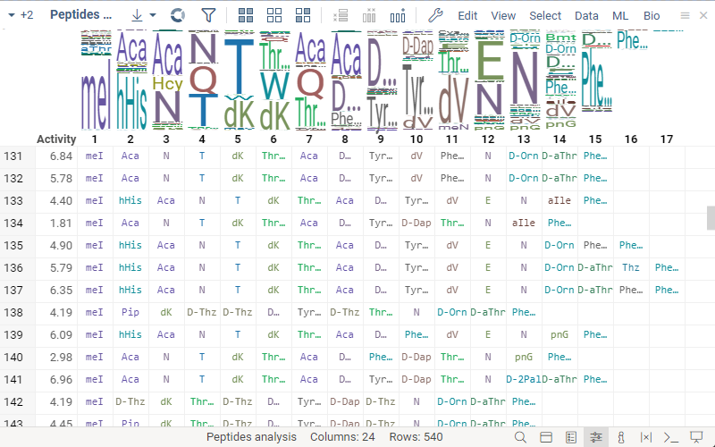

### Monomer structure rendering

The position columns contain monomers and render them according to amino acid residues from preconfigured monomer library. You can hover over the monomer cells and the tooltip with its chemical structure will pop up.
The structure for non-natural amino acid residues is provided with a monomer library. More about the monomer library
can be found [here](../bio/bio.md#manage-monomer-libraries).

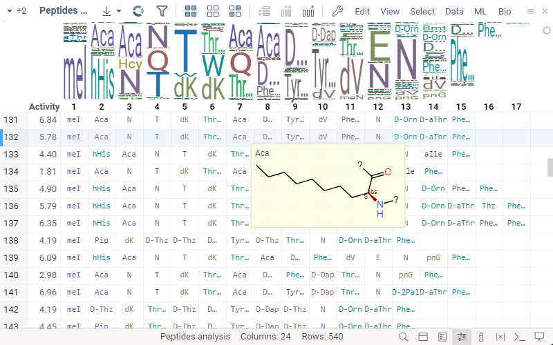

### Composition analysis

The table view contains composition analysis in the position columns header, which shows the proportion of the
monomers at the position. You can hover over the monomers in WebLogo to see the distribution of activities for
sequences that contain the corresponding monomer at that position, compared to the activity distribution of all
the sequences, and additional metrics.

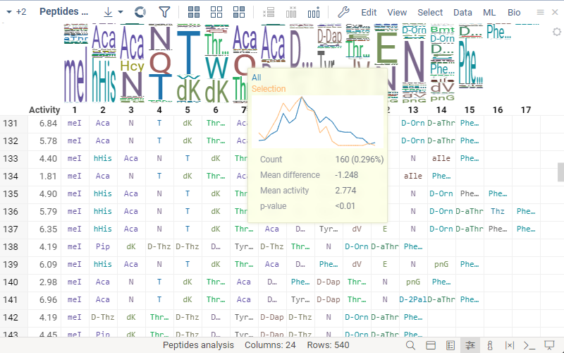

Click on the monomer to select the rows that contain a given monomer at a given position. More about selection with
viewers can be found [here](../../../navigation/views/table-view.md#select-and-filter). The selected monomer-position will
be highlighted in composition analysis, in the monomer-position viewer and the most potent residues viewer.

## Monomer-Position viewer

Monomer-Position viewer is a matrix-like table that contains positions as columns and monomers as rows.
This viewer has two modes: Mutation Cliffs and Invariant Map. Click the radio button in the viewer header to switch
between modes. Hover over any non-empty cell to see the tooltip with activity distribution and statistics.
Click the cell to select the mutation cliffs sequences in mutation cliffs mode, or the sequences containing
monomer-position in invariant map mode.

### Mutation Cliffs mode

Mutation Cliffs mode shows the significance of the monomer position regarding activity with circles.
The circle size corresponds to the mean difference between the sequences containing monomer-position vs. all.
The color intensity represents the p-value. Red circles represent negative mean difference and blue circles represent
positive mean difference. Some of the cells contain the number of sequences that form mutation cliffs pairs. You can
configure the maximum number of mutations or the minimum activity difference between two sequences in viewer properties.

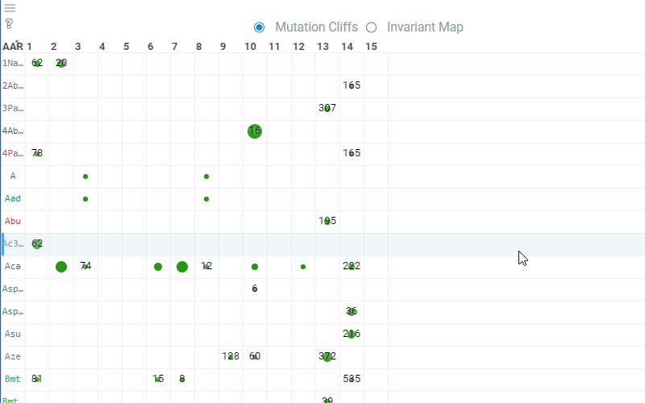

Choose the target column and category in viewer properties to calculate the mutation cliffs for that target.
Learn more about viewer properties [here](../../../../datagrok/navigation/views/table-view.md#viewer-properties).

### Invariant Map mode

Invariant Map represents the number of sequences that contain a given monomer-position. The background color
corresponds to the aggregated value of some numeric column - by default, it is set to be the average of scaled
activity for a given monomer-position. You can modify the column and the aggregation function in viewer properties
under the Invariant Map section.

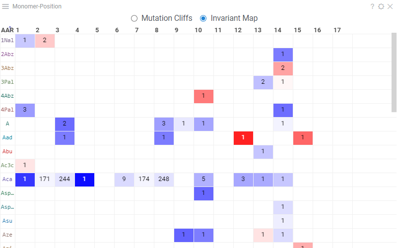

## Most Potent Residues viewer

Most Potent Residues viewer shows the most significant monomer for each position and its statistics.
Hover over the Diff column cells to see the tooltip with statistics and click to select the corresponding sequences.

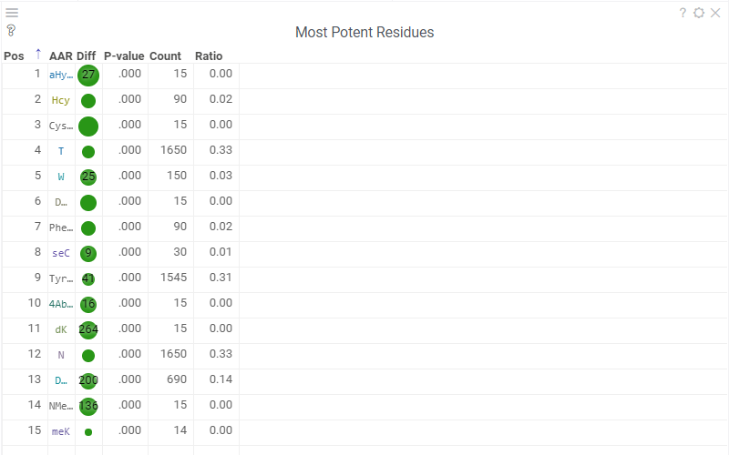

## Logo Summary Table viewer

Logo Summary Table viewer is a table that contains cluster information such as the number of members, WebLogo,
activity distribution and statistics such as p-value and mean difference.

You can set the WebLogo rendering mode and members ratio threshold in viewer properties. WebLogo rendering mode can
be either full-height or entropy (defaults to entropy). Learn more about WebLogo
[here](https://github.com/datagrok-ai/public/tree/master/packages/Bio#web-logo).
The member ratio threshold property filters out the clusters that have a ratio of members below the threshold, relative
to the cluster with the most members (defaults to 0.3).

Hover over the Clusters column values to see the tooltip with the activity distribution and statistics.
Click to select the cluster.

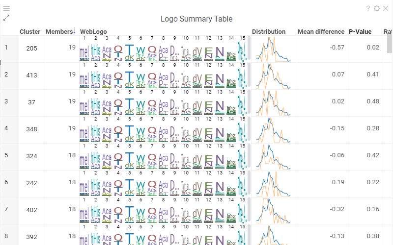

# Interactivity

The property panel gets updated according to the current selection and filtering. There are three main sections in
the property panel: actions, mutation cliff pairs and distribution.

## Actions

The Actions panel contains the following actions:

1. **New cluster** creates and adds the new cluster from the intersection of the applied filter and selection.
2. **Remove cluster** deletes selected custom clusters.
3. **New view** button creates a new table view from the intersection of the current filter and selection and adds
a Logo Summary Table for that view.

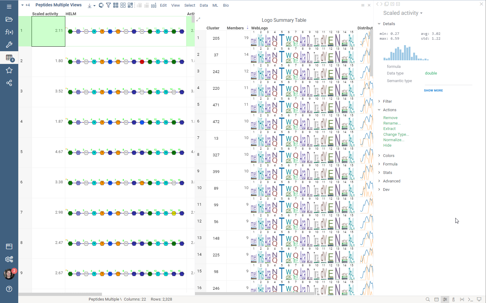

## Mutation Cliffs pairs

The Mutation Cliffs pairs panel contains the table with the sequence pairs and the table with the unique sequences
that form the mutation cliffs pairs. You can input a monomer in the "Mutated to" field to filter the sequence pairs
table. Click the sequence pair to filter the unique sequences table.

## Distribution

The Distribution panel shows the distribution of the activities of selected sequences compared to all, and statistics
such as the number of selected sequences, mean difference and p-value.

Use checkboxes "Monomers", "Positions" and "Clusters" to see separate distributions and statistics for each of
the monomers, positions or clusters groups.

# Settings

You can find analysis settings in the top menu under the wrench icon. The settings contain four sections:
general, viewers, columns and sequence space.

## General

The General section has settings for the activity column and activity scaling method.

## Viewers

The Viewers section contains inputs to add and remove additional viewers. Dendrogram is one of the supported viewers.
Learn more about dendrogram [here](../../../../visualize/viewers/dendrogram.md).

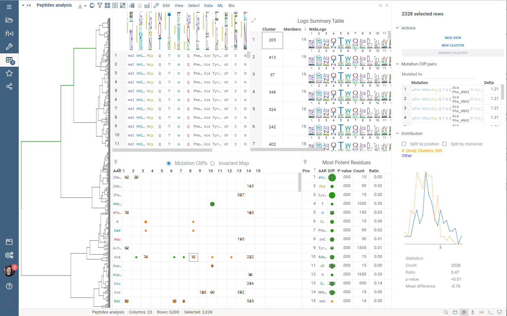

## Columns

The Columns section lists all the numeric columns in the dataset, except activity. Enable the checkbox near the
column name and choose the aggregation function to add the aggregated value to all the tooltips with statistics,
Logo Summary Table and Distribution panel. The column also appears in the table view and Mutation Cliffs pairs panel.

## Sequence Space

The Sequence Space section contains settings for the Sequence Space viewer such as distance function, fingerprint type,
gap open and gat extend penalties, whether to perform clustering on sequence embeddings, etc.

# Analysis sharing

You can easily save and share Peptide analysis with Datagrok projects. Learn more about Datagrok project saving and
sharing [here](../../../concepts/project/project.md).
