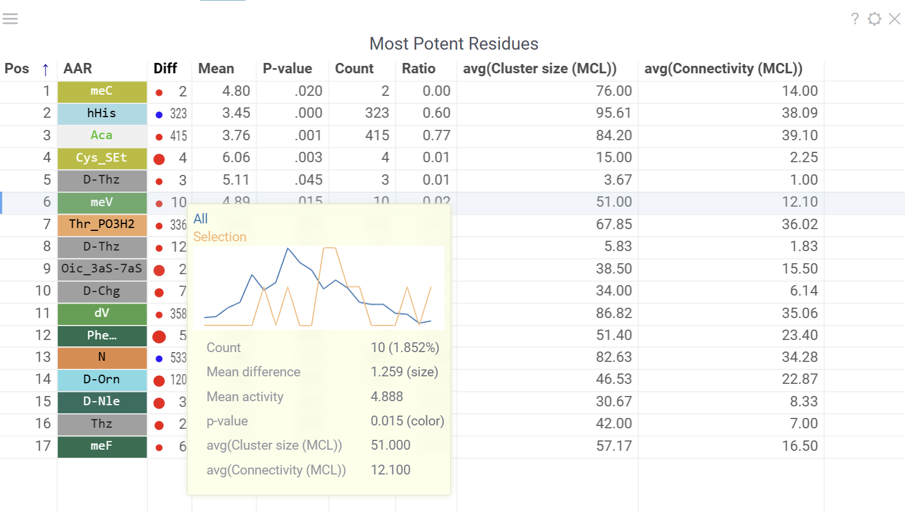

Datagrok's Peptides package provides tools for analyzing peptide [structure-activity relationship (SAR)](https://en.wikipedia.org/wiki/Structure%E2%80%93activity_relationship). Datagrok automatically detects biological sequences in various formats like HELM, Fasta, Separator, highlights monomers, understands their structure and provides analysis tools. Among these, the Peptides SAR tool enables you to explore sequence-activity trends efficiently, offering interactive visualizations and meaningful insights. 

To analyze a dataset containing macromolecules and activities:

1. Select Bio > Analyze > SAR... from the top menu
2. In the dialog:
    * Select the sequence column, activities column and scaling method.
    * Visualize the distribution of activities and sequence WebLogo.
    * Optionally specify cluster column, or use Markov clustering with configurable parameters.
3. Click OK to start the analysis.

The results of SAR analysis are presented in multiple integrated tables and viewers, which all work together, allowing you to:

* **Cluster** sequences using various algorithms such as [MCL](https://micans.org/mcl/), [UMAP](https://en.wikipedia.org/wiki/Nonlinear_dimensionality_reduction#Uniform_manifold_approximation_and_projection), [t-SNE](https://en.wikipedia.org/wiki/T-distributed_stochastic_neighbor_embedding), [Hierarchical Clustering](https://en.wikipedia.org/wiki/Hierarchical_clustering), and others.
* **Analyze cluster compositions** using [WebLogo summary table](../../../../visualize/viewers/logo-summary-table.md), along with useful statistics and other aggregated data.
* **Visualize** point-mutations and sequence variability for every monomer-position.
* **Explore** Mutation cliffs that lead to significant changes in activity.
* **Predict** Most potent residues for every monomer-position based on activity statistics.

## Table View

The table view displays sequences split by position along with activity values. Position columns show monomers, and column headers contain composition analysis.

Position columns render monomers according to the [configured monomer library](bio.md#manage-monomers). Hovering over monomer cells displays chemical structure tooltips for both natural and non-natural amino acid residues.

Column headers show the proportion of monomers at each position. Hovering over monomers in the WebLogo displays activity distribution and statistical metrics. Clicking a monomer selects all rows containing that monomer at the specified position.

## Sequence Variability Map

This matrix-style viewer displays positions as columns and monomers as rows, operating in two distinct modes that can be toggled via radio buttons in the header:

1. **Mutation Cliffs Mode** shows sequences that differ by a single point mutation at every monomer-position, indicating significant activity changes:

    * Circle size represents the number of unique sequences forming a mutation cliff
    * Circle Color indicates mean activity difference and its sign (blue: negative, red: positive, white: zero)
    * Numbers in cells show the ammount of sequence pairs forming a mutation cliff
    * Selecting a cell will add [mutation cliffs section](#interactive-features) to the context panel, allowing you to inspect cliff pairs and their corresponding sequences.
    * Configuration options include maximum mutations (1 by default to target single mutation point cliffs) and minimum activity difference threshold.

    

2. **Invariant Map Mode** displays the number of sequences containing each monomer-position combination.

    * Numbers in cells indicate the number of sequences containing the corresponding monomer at the specified position
    * Background color represents the aggregated activity value
    * Configurable options include activity and color columns, their aggregation functions and color scale.

    

- Hovering over a cell displays detailed tooltip with activity statistics, distribution comparison and other aggregated data.
- Selecting a cell selects every sequence that corresponds to given mutation cliff or monomer-position combination.
- Select additional columns from viewer properties to aggregate them alongside each monomer-position, enabling the display of their aggregated values in tooltips or within the [distributions](#interactive-features) section of the context panel.
- Choose a target filter to compute mutation cliffs and position invariants specifically for selected sequence groups.

## Most Potent Residues

This viewer identifies the most significant monomers for each position based on mean activity difference and their p-values

* Numbers show sequence counts for each monomer-position
* Circle size represents mean activity difference
* Circle color indicates p-value significance
* Hovering over a circle displays detailed statistics and distribution comparison
* Clicking a circle selects all sequences containing the corresponding monomer at the specified position

Configurable options include activity column, scaling method and activity target (minimize or maximize).

## Logo Summary Table and Clustering

The analysis uses Markov clustering to group sequences based on their distances and visualizes the clusters on a [scatterplot](../../../../visualize/viewers/scatter-plot.md) with connecting lines. These lines indicate that the distance between two sequences is below a specified threshold. During clustering, some connections are removed while others are reinforced, leading to distinct clusters that may still be interconnected.

From these clusters, the analysis generates a Logo Summary Table, which provides the following details for each cluster:

* WebLogo representation of the cluster along with members count
* Activity distribution of the squences in the cluster vs the whole dataset
* Statistical metrics including p-value and mean difference
* Other aggregated data

Configurable options include sequence, cluster and activity columns, WebLogo mode and other aggregated columns.

Hovering over a cluster in the table shows tooltip with detailed statistics and highlights the sequences in scatterplot and other viewers.

## Interactive Features

The context panel updates dynamically based on current selections and filtering, with several sections:

* **Selection Sources** displays information about current selections from clusters, monomer-positions, most potent residues, mutation cliffs, and WebLogo.
* **Actions** provides the following options for the current selection:
    * **New cluster**: Creates a cluster from the intersection of filter and selection
    * **Remove cluster**: Deletes selected custom cluster
    * **New view**: Creates and adds a new table from current selection with Logo Summary Table
* **Mutation Cliffs Pairs** displays sequence pairs and unique sequences forming mutation cliffs. Filter by specific monomers or expand to full screen for detailed examination.
* **Distribution** shows statistics and activity distribution of selected sequences compared to all sequences. Optional breakdown by monomers, positions, or clusters is available via checkboxes.
* **Selection Table** Lists selected sequences with corresponding activity values and a summary WebLogo header.

## Analysis options

You can modify parameters such as activity column, sequence column, other aggregations and parameters through individual viewer settings or change them globally in the Peptides SAR settings dialog, which can be accessed from the `wrench` icon in the ribbon panel. The dialog contains following sections:

* **General** - Set sequence column, activity column and scaling method.
* **Viewers** - Add or remove supplementary viewers such as Dendrogram, Sequence Space, and Active Peptide Selection.
* **Columns** - Select numeric columns to include in tooltips, summaries, and visualizations with configurable aggregation functions.
* **Sequence Space and Markov Clustering** - Configure parameters including distance functions, fingerprint types, gap penalties, and sequence embedding options.

## Sharing Analysis Results

Analysis results can be saved and shared using Datagrok projects for collaboration purposes. Learn more about Datagrok project saving and
sharing [here](../../../concepts/project/project.md).

## Videos

