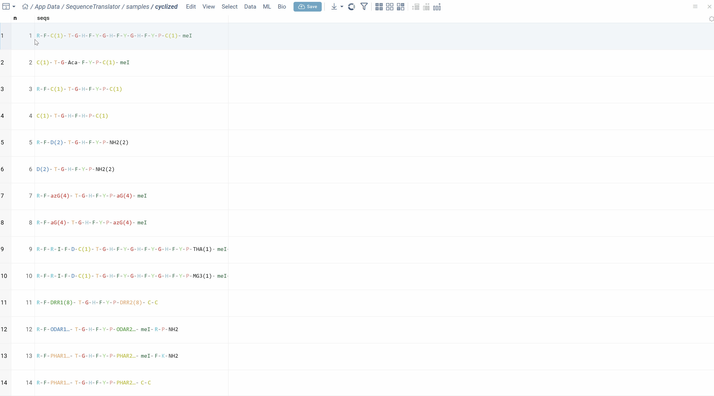
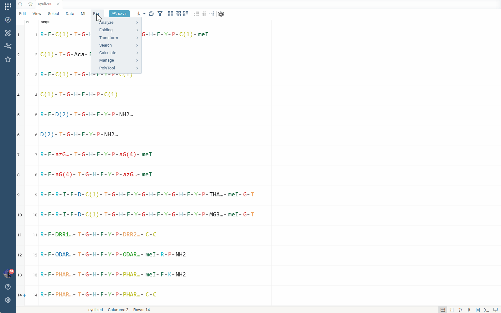
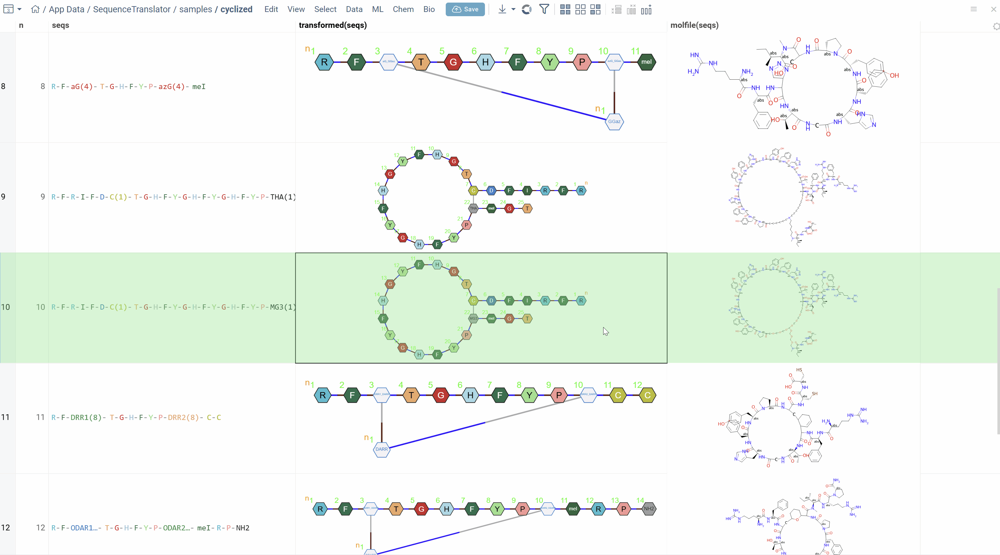

Polytool is a comprehensive suite of tools that extends Datagrok's capabilities for working with custom rules-based sequence notations and includes powerful utilities for sequence enumeration. This functionality is provided through the Sequence Translator plugin and enables flexible representation and manipulation of sequences.

For the broader context on how Datagrok handles macromolecules, see the [Bioinformatics overview](bio.md). Polytool relies on the same platform concepts, including [macromolecule semantic type assignment](../../../../govern/catalog/semantic-types.md), [monomer libraries](bio.md#manage-monomer-libraries), and [format conversion](bio.md#format-conversion).

## Quick Links

* [Bioinformatics overview](bio.md)
* [Sequence notation formats](bio.md#formats) (FASTA, HELM, BILN, etc.)
* [Format conversion](bio.md#format-conversion) and [convert to atomic level](bio.md#convert-to-atomic-level)
* [Manage monomer libraries](bio.md#manage-monomer-libraries) and [manage monomers](bio.md#manage-monomers)
* [Peptides SAR](peptides-sar.md) (common downstream analysis for enumerated libraries)
* [Oligo toolkit](oligo-toolkit.md) (if you're working with oligonucleotide modalities)
* [Supported file formats](../../../../access/files/supported-formats.md)

## Overview

Polytool introduces a simplified, rules-based sequence notation that offers significant advantages over existing formats like BILN and HELM. The notation uses a dash-separated format that is more human-readable while supporting complex structural features including branches and connections.

### Key Features

* **Rules-based connection system**: Define custom connection rules between monomers
* **Reaction-based chemistry**: Support for complex chemical reactions between monomers
* **Simplified notation**: More concise than HELM, more readable than BILN
* **UI-based rule management**: Configure and share rules across the platform
* **Sequence enumeration**: Generate variant libraries for exploration
* **Full platform integration**: Visualization, conversion, and analysis support

## Rules-Based Notation

### Notation Format

The Polytool notation format is similar to BILN (dash-separated monomers) but uses a simplified numbering system for connections. Unlike BILN, which requires two numbers in braces (connection identifier and R-group), Polytool notation uses a single number that references a predefined connection rule.

**Example sequence:**
```
R-F-C(1)-T-G-H-F-Y-G-H-F-Y-G-H-F-Y-P-C(1)-meI
```

In this example, `(1)` indicates that the two cysteine (C) residues are connected via rule 1. The rule defines how the connection is formed (e.g., R3 to R3).

### Advantages Over BILN and HELM

The Polytool notation provides several key advantages:

* **Conciseness**: Shorter notation using single-number rule references
* **Configurability**: All rules are managed through an intuitive UI
* **Multiple rule sets**: Support for different rule sets for different use cases
* **Reaction support**: Unlike BILN and HELM, which are limited to R-group connections, Polytool supports complex reaction rules

To learn more about these formats and how Datagrok uses them, see [Sequence notation formats](bio.md#formats), as well as the external references for [HELM](https://en.wikipedia.org/wiki/Hierarchical_editing_language_for_macromolecules) and [BILN](https://pubs.acs.org/doi/10.1021/acs.jcim.2c00703).

### Reaction-Based Rules

The most powerful feature of Polytool is its support for reaction-based connection rules. Instead of simply linking R-groups, you can define rules that produce reaction products between monomers.

**Example:** An azide-alkyne click reaction can be defined as a rule. When applied, the rule generates the product of the click reaction between the two participating monomers.

This capability opens new possibilities for representing complex chemical modifications and non-standard connections that cannot be expressed in traditional BILN or HELM notations.



## Converting Sequences to Molecular Structures

The primary use case for Polytool notation is storing company-specific rules-based sequences in monomeric form and converting them to [atomic-level structures](bio.md#convert-to-atomic-level) for further analysis. The conversion uses the active [monomer libraries](bio.md#manage-monomer-libraries) and can optionally produce [HELM](https://en.wikipedia.org/wiki/Hierarchical_editing_language_for_macromolecules) for interoperability.

### Using the Convert Tool

<details>
<summary>How to convert sequences</summary>

1. On the **Top Menu**, select **Bio** > **Polytool** > **Convert...**
2. In the dialog, select the column containing your sequences
3. Configure conversion options:
   * **Get HELM**: Add a column with HELM representation of the sequences
   * **Chirality Engine**: Specify how to handle chirality and enhanced stereochemistry
   * **Linearize**: Use linear conversion engine for more readable 2D depiction (without 3D optimization)
4. At the bottom of the dialog, select which rule set to use for conversion
5. Hover over rule sets to see a summary of their contents in the tooltip
6. Click **OK** to perform the conversion

After conversion, a new column with molecular structures is added to the table. If you selected **Get HELM**, that column is also added.

</details>

### Conversion Options

**Get HELM**  
Adds an additional column with HELM representation of the sequences. This is useful for compatibility with other tools and platforms that support HELM format.

**Chirality Engine**  
Controls how stereochemistry is handled during conversion:
* Standard chirality rules
* Enhanced stereochemistry support

**Linearize**  
When enabled, uses a linear conversion engine that depicts linear molecules in a more human-readable 2D layout without 3D optimization. This is ideal for visualization and documentation purposes.

### Technical Details

Under the hood, reaction-based rules use [RDKit](https://www.rdkit.org/) for chemical transformations. The conversion process:

1. Creates temporary monomers for reaction participants and products
2. Applies reaction rules using RDKit
3. Generates the final molecular structure
4. Temporary monomers are not saved to monomer libraries
5. Output HELM notation includes the temporary monomers

This approach allows you to work with complex, custom chemistry while maintaining compatibility with standard formats.

## Managing Connection Rules

Polytool provides an intuitive interface for managing connection rules. Rules are shared across users on the Datagrok platform, enabling consistent notation throughout your organization.

### Editing Rule Sets

<details>
<summary>How to manage rules</summary>

1. In the **Convert** dialog, click the **edit icon** next to any rule set
2. This opens the rule management view where you can:
   * View all rules in the set, along with examples of the connections they define and produced products
   * Add new rules (simple link-based or reaction-based)
   * Edit existing rules
   * Delete rules
3. Changes are automatically saved and shared with other users

</details>

### Rule Types

**Link-Based Rules**  
Simple rules that connect specific R-groups between monomers. For example, a rule that connects R3 of monomer 1 to R3 of monomer 2.

**Reaction-Based Rules**  
Advanced rules that define chemical reactions between monomers. These rules generate reaction products rather than simple linkages, enabling representation of complex chemical transformations.



## Sequence Enumeration

The enumerate feature is a powerful tool for generating multiple sequence variants based on specified positions and monomers. This is especially useful for creating peptide libraries and exploring sequence space (see [Bioinformatics overview](bio.md)).

### Enumeration Modes

**Breadth Enumeration**  
Choose specific monomers that will be enumerated at each specified position.

**Placeholder Enumeration**  
Specify positions and monomers (or entire monomer libraries) for enumeration with two sub-modes:

* **Single Enumeration**: At each position, only one monomer from the list is chosen for each variant
* **Matrix Enumeration**: All combinations of monomers at specified positions are generated (combinatorial expansion)

### Additional Options

* Convert results to molecular structures
* Generate HELM representation of variants and their names based on a naming pattern

### Using the Enumerate Tool

<details>
<summary>How to enumerate sequences</summary>

1. Right-click on any sequence (template) in any supported notation
2. Select **Polytool Enumerate** from the context menu
3. The dialog opens with HELM representation of the sequence
4. Click on positions in the HELM sequence to select them for enumeration
5. Specify which monomers to use at each selected position:
   * Individual monomers
   * Multiple monomers
   * Entire monomer libraries
6. Choose enumeration mode (single or matrix)
7. Optionally enable conversion to molecular structures
8. Click **OK** to generate variants

The tool generates all specified variants and displays them in a new table.

</details>



### Use Cases

* **Peptide library design**: Generate variants for SAR studies (see [Peptides SAR](peptides-sar.md))
* **Optimization campaigns**: Explore substitutions at key positions
* **Chemical space exploration**: Systematically vary sequence composition
* **Lead compound generation**: Create focused libraries around hit sequences


## Platform Integration

Polytool notation is fully integrated throughout Datagrok:

* **Visualization**: Sequences render correctly in all viewers using monomer colors and styles
* **Conversion**: Convert to atomic structures and other notations
* **Analysis**: Apply all standard macromolecule SAR analysis tools
* **Interoperability**: Convert between Polytool, HELM, and BILN formats (where applicable)

For related platform features, see [Searching and filtering](bio.md#searching-and-filtering), [Sketching and editing](bio.md#sketching-and-editing), and the list of macromolecule-aware viewers in the [Bioinformatics overview](bio.md).

This seamless integration ensures that sequences in Polytool notation can be used in all aspects of your workflow, from initial data exploration to final analysis and reporting.

## See Also

* [Bioinformatics Overview](bio.md)
* [Manage Monomer Libraries](bio.md#manage-monomer-libraries)
* [Sequence Notation Formats](bio.md#formats) 
* [Format conversion](bio.md#format-conversion)
* [Convert to atomic level](bio.md#convert-to-atomic-level)
* [Peptides SAR](peptides-sar.md)
* [Oligo toolkit](oligo-toolkit.md)
* [Supported file formats](../../../../access/files/supported-formats.md)
* [Semantic types](../../../../govern/catalog/semantic-types.md)
