```mdx-code-block
import Tabs from '@theme/Tabs';
import TabItem from '@theme/TabItem';
```

Datagrok provides an intuitive, [enterprise-ready](../../teams/it/enterprise-evaluation-faq.md) 
high-performance environment for working with chemical data, covering full-range of tasks - from data access to _de novo_
design.

* **Data access**
  * Built-in connectors to [30+ data sources](../../../../access/databases/connectors/connectors.md)
  * Automatic structure detection on [import](../../../../access/access.md)
  * Support for SMILES, SMARTS, InChI, InChiKey, SDF, PDB, MOL2, [and more](../../../../access/files/supported-formats.md#cheminformatics)
  * [Integration with compound registration systems](#compound-registration-systems)
* **Interactive exploration and analysis**
  * Highly customized 2D (RDKit or OpenChemLib) and 3D (NGL) rendering of molecules, rendering of chemical mixtures
  * Powerful chemically-aware [spreadsheet](#chemically-aware-spreadsheet) and [viewers](#chemically-aware-viewers)
  * [Chemical space](#chemical-space) and interactive [structure search](#structure-search)
  * Comprehensive [ML toolkit](../../../solutions/domains/data-science.md) for
    clustering, dimensionality reduction, imputation, PCA/PLS, and more. Built-in statistics
  * [Dynamic dashboards](../../../../access/databases/databases.md#sharing-query-results)
* **Sketching and structure analysis**
  * Multiple molecular [sketchers](#sketching)
  * Tools for [R-groups](#r-groups-analysis), [scaffold trees](#scaffold-tree-analysis), [retrosynthesis](#retrosynthesis), and [elemental analysis](#elemental-analysis)
* **SAR analysis**  
  * [Activity cliffs](#structure-relationship-analysis)
  * [Matched molecular pairs](#matched-molecular-pairs)
* **Predictive and generative modeling**
  * [QSAR/QSPR modeling](#qsar-and-qspr-modeling) and [ADMET predictions](#admet-predictions)
  * [Docking](#docking) using AutoDock Vina
  * [Generative chemistry](#generative-chemistry) via REINVENT4
* **Data augmentation and utilities**
  * Calculated columns using [500+ functions](../../../concepts/functions/functions.md) (or create your own)
  * [Chemical scripts](#chemical-scripts) and [custom plugins](#customizing-and-extending-the-platform)
  * [Calculators](#calculators), [curation](#curation), [mutation](#mutation), [virtual synthesis](#virtual-synthesis)

To get started, install the required [packages](../../../plugins.md#chem) 
(see [instructions](../../../../deploy/complete-setup/install-packages.md)).

## Data access

Datagrok provides a single, unified access point for organizations. You can connect to any of the [30+ supported data sources](../../../../access/databases/connectors/connectors.md), retrieve data, and securely share data with others.

Chemical queries against data sources require a chemical cartridge, such as [RDKit Postgres cartridge](https://www.rdkit.org/docs/Cartridge.html) or [JChem cartridge](https://docs.chemaxon.com/display/docs/JChem+Cartridge). These cartridges allow molecule-specific operations (like substructure or similarity searches) to be integrated into SQL queries using SQL syntax.

<details>
<summary> Example: Substructure search in a database </summary>

To create a chemically-aware query, use the SQL syntax specific to your cartridge. [Annotate parameters](../../../../access/databases/databases.md#parameterized-queries) like you would for a function. Here is an example of querying ChEMBL on Postgres with the RDKit cartridge installed:

Substructure search:

```
--name: @pattern substructure search
--connection: chembl
--input: string pattern {semType: Substructure}
--input: int maxRows = 1000
 select molregno,m as smiles from rdk.mols where m@>@pattern
 limit @maxRows
```

Similarity search:

```
--name: @pattern similarity search
--connection: chembl
--input: string pattern {semType: Substructure}
--input: int maxRows = 1000
select fps.molregno, cs.canonical_smiles as smiles
from rdk.fps fps
join compound_structures cs on cs.molregno = fps.molregno
where mfp2%morganbv_fp(@pattern)
limit @maxRows
````

To run a query, sketch the substructure and click **OK**. Datagrok retrieves the data and opens it in a spreadsheet.


</details>

To learn more about querying data and data access in general, see the [Access](../../../../access/access.md) section of our documentation.

### Compound registration systems

Datagrok integrates with compound registration systems. You can browse and analyze your assay data directly in the platform.

#### CDD Vault

Datagrok integrates with [CDD Vault](https://www.collaborativedrug.com/cdd-informatics-platform).
You can:
* browse molecules available in the selected vault
* search vaults by similarity and substructure
* save searches and explore them in Datagrok
* view linked assay data for a target compound in the **Context Panel**  

<details>
<summary> How to use </summary>

To use the app, you need to be registered in the CDD Vault system and have at least one vault set up.
The CDD Vault api key should be set in package credentials manager under `apiKey` key.

To access assay data, in the **Browse** panel, go to **Apps** > **Chem** > **CDD Vault**.
The app lists all connected vaults. Each vault contains 3 sections. 
You can also explore the vault data directly in the **Context Panel** (**Databases** > **CDD Vault**). 
[Watch a video tutorial](https://www.youtube.com/watch?v=BUQnzbjCqIs) (~2 mins).

<Tabs>
<TabItem value="molecules" label="Molecules" default>
* Shows all molecules available in the selected vault
* The **Id** column contains contains direct links to corresponding molecules in your vault
<br/>
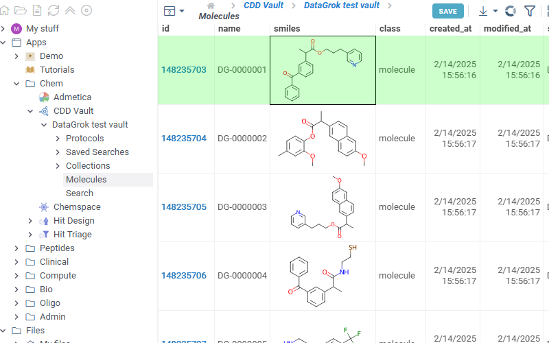
</TabItem>
<TabItem value="protocols" label="Protocols">
* Shows all protocols available in the selected vault. Click any protocol to show corresponding molecules
<br/>
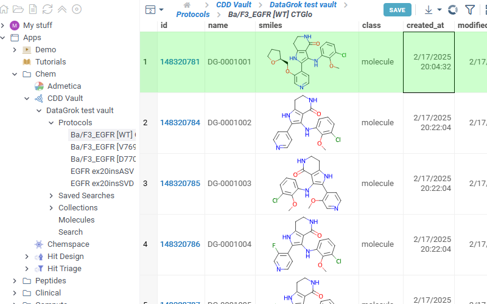
</TabItem>
<TabItem value="saved-searches" label="Saved searches">
Lists all saved searches in your vault. Click any search in the list to view its results
<br/>
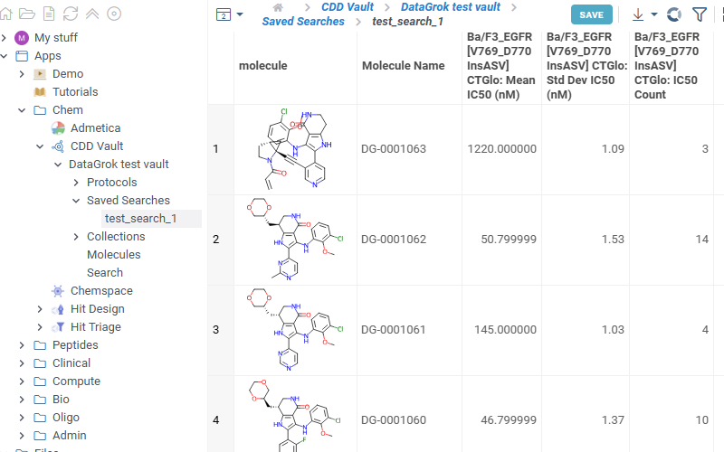
</TabItem>
<TabItem value="collections" label="Collections">
Lists all collections available in the selected vault. Click any collection to show corresponding molecules
<br/>
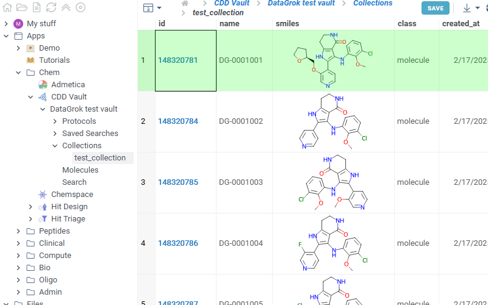
</TabItem>
<TabItem value="search" label="Search">
Provides basic vault search functionality with similarity and diversity searches
<br/>
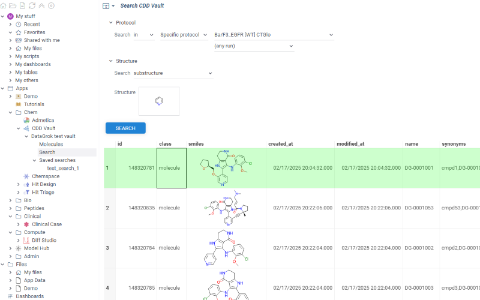
</TabItem>
<TabItem value="context-panel" label="Context Panel">
Shows vault data for the current molecule
<br/> 
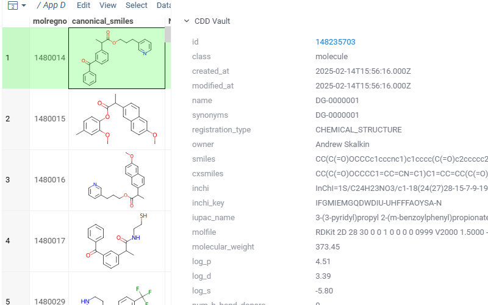
</TabItem>
</Tabs>
</details>

## Exploring chemical data

When you open a dataset, Datagrok automatically detects molecules and makes available molecule-specific context actions. For example, when you open a CSV file containing molecules in the SMILES format, the following happens:

* Data is parsed, and the [semantic type](../../../../govern/catalog/semantic-types.md) _molecule_ is assigned to the corresponding column.
* Molecules are automatically rendered in the spreadsheet.
* Column tooltip now shows the most diverse molecules in your dataset.
* Default column filter is now a sketcher-driven substructure search.
* A top menu item labeled **Chem** appears.
* When you click a molecule, the **Context Panel** on the right shows molecule-specific [info panes](../../../../datagrok/navigation/panels/info-panels.md), such as **Toxicity** or **Drug Likeness** ([see the full list](info-panels/info-panels.md)).


The following info panes are shown by default for the current molecular column:

* Most Diverse Structures
* Rendering (offers rendering options for molecules):
  * Render a molecule or show its textual representation (**Show structures**).
  * Aligned to a particular scaffold (**Scaffold**).
  * Aligned to a scaffold defined in the specified column (**Scaffold column**).
  * Highlight the scaffold (**Highlight from column**).
  * Force regeneration for atom coordinates, even if the molecule is defined as a MOLBLOCK (**Regenerate coords**).
  * Type of the filter for that column (sketcher or categorical)(**Filter type**).

<details>
<summary>Info pane options</summary>

Some info panes can customized. To reveal an info pane's available options, hover over it:

* View and/or edit the underlying script (click the **Script** icon).
* Change parameters (click the **Parameter** icon).
* Change the info pane's settings (click the **Gear** icon).
* Append info pane as a column (click the **More actions** icon and select **Add as a column**).


To learn how to customize and extend the platform programmatically, see the **Develop** section of our documentation.

</details>

:::note developers

Info panes can be extended with [functions](../../../concepts/functions/functions.md) in any supported language.

:::

Also Datagrok is capable of detecting and rendering mixtures. Mixtures should be in a [Mixfile](https://github.com/cdd/mixtures) format introduced by Collaborative Drug Discovery, Inc.
Mixfiles are automatically detected by Datagrok and the data is assigned with ChemicalMixture semantic type, allowing you to render mixtures of any complexity and retrieve detailed information through context panel.
The main features are:

* rendering of the list of components in one cell with clear differentiation between components (square brackets are used for nested mixtures). In case component quantity/ratio is present in the Mixfile, it is also shown within the cell

* interaction with each mixture component straight from the grid cell. Hover over any component to get more details in the tooltip. Click on separate component to get structure details in the context panel

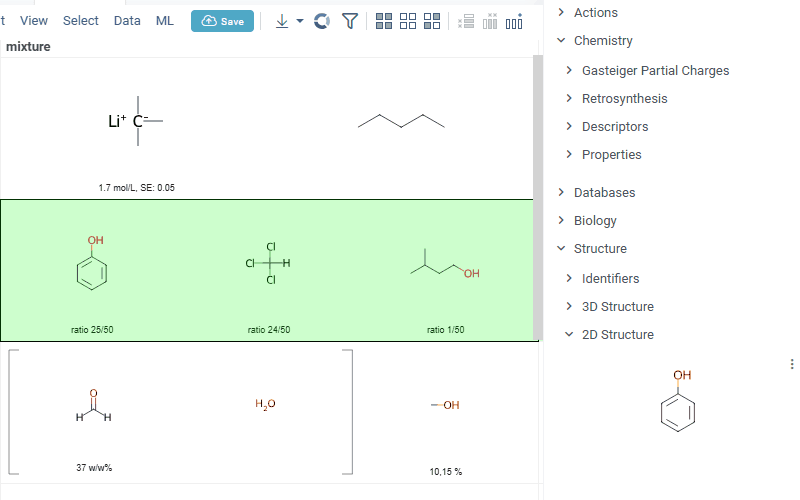

* summary of mixture information in the context panel. You can browse the mixture using either table or tree view

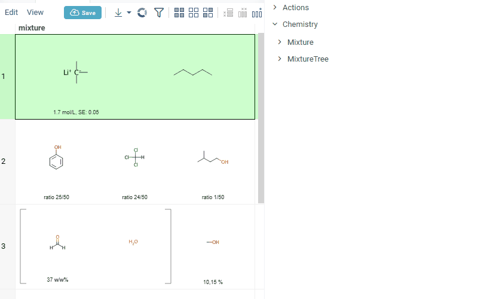

### Chemically aware spreadsheet

The spreadsheet lets you visualize, edit, and efficiently work with chemical structures. Additionally, you can add new columns with calculated values or visualizations from info panes or context actions. The features also include the ability to interactively filter rows, color-code columns, pin rows or columns, set edit permissions, and more. To learn how to work with the spreadsheet, see [this article](../../../../visualize/viewers/grid.md) or complete [this tutorial](https://public.datagrok.ai/apps/tutorials/Tutorials/ExploratoryDataAnalysis/GridCustomization).


### Chemically aware viewers

Datagrok _viewers_ recognize and display chemical data. The viewers were built from scratch to take advantage of Datagrok's in-memory database, enabling seamless access to the same data across all viewers. They also share a consistent design and usage patterns. Any action taken on one viewer, such as hovering, selecting, or [filtering](../../../../visualize/viewers/filters.md), is automatically applied to all other viewers, creating an interconnected system ideal for exploratory data analysis.

In addition to the chemical spreadsheet, examples of viewers include a [scatterplot](../../../../visualize/viewers/scatter-plot.md), a [network diagram](../../../../visualize/viewers/network-diagram.md), a [tile viewer](../../../../visualize/viewers/tile-viewer.md),a [bar chart](../../../../visualize/viewers/bar-chart.md), a [form viewer](../../../../visualize/viewers/form.md), and [trellis plot](../../../../visualize/viewers/trellis-plot.md), and [others](chemically-aware-viewers.md). All viewers can be saved as part of the [layout](../../../../visualize/view-layout.md) or a dashboard. Some viewers offer built-in statistics.

To learn how to use viewers to explore chemical data, complete [this tutorial](https://public.datagrok.ai/apps/tutorials/Tutorials/ExploratoryDataAnalysis/Viewers) or visit the [Visualize](../../../../visualize/viewers/viewers.md) section of our documentation.

:::note developers

You can [add custom viewers](../../../../develop/how-to/viewers/develop-custom-viewer.md).

:::

### Chemical space

Analyze chemical space using distance-based dimensionality reduction algorithms, such as [tSNE](https://scikit-learn.org/stable/modules/generated/sklearn.manifold.TSNE.html) and [UMAP](https://umap-learn.readthedocs.io/en/latest/). These algorithms use fingerprints to convert cross-similarities into 2D coordinates. This allows to visualize the similarities between molecular structures and identify clusters of similar molecules, outliers, or patterns that might be difficult to detect otherwise. The results are visualized on the interactive [scatterplot](../../../../visualize/viewers/scatter-plot.md).


<details>
<summary> How to use </summary>

Go to the **Top Menu Ribbon** and choose **Chem** > **Analyze** > **Chemical Space...** This opens a **Chemical Space** parameter dialog.

The dialog has the following inputs:

* **Table**: The table containing the column of sequences.
* **Column**: The column containing the sequences.
* **Encoding function**: The encoding function that will be used for pre-processing of molecules. Currently, only one encoding function is available, that will use [chemical fingerprint](https://www.rdkit.org/UGM/2012/Landrum_RDKit_UGM.Fingerprints.Final.pptx.pdf) distances between each molecule to calculate pairwise distances. The `Fingerprints` function has 1 parameter which you can adjust using the gear (⚙️) button next to the encoding function selection: 
  * Fingerprint type: The type of molecular fingerprints that will be used to generate monomer substitution matrix. Options are `Morgan`, `Pattern` or `RDKit`.
* **Method**: The dimensionality reduction method that will be used. The options are:
  * UMAP: [UMAP](https://umap-learn.readthedocs.io/en/latest/) is a dimensionality reduction technique that can be used for visualization similarly to t-SNE, but also for general non-linear dimension reduction.
    * t-SNE: [t-SNE](https://en.wikipedia.org/wiki/T-distributed_stochastic_neighbor_embedding) is a machine learning algorithm for dimensionality reduction developed by Geoffrey Hinton and Laurens van der Maaten. It is a nonlinear dimensionality reduction technique that is particularly well-suited for embedding high-dimensional data into a space of two or three dimensions, which can then be visualized in a scatterplot.

    Other parameters for dimensionality reduction method can be accessed through the gear (⚙️) button next to the method selection.
* **Similarity**: The similarity/distance function that will be used to calculate pairwise distances between fingerprints of the molecules. The options are: `Tanimoto`, `Asymetric`, `Cosine` and `Sokal`. All this distance functions are based on the [bit array](https://en.wikipedia.org/wiki/Bit_array) representation of the fingerprints.

* **Plot embeddings**: If checked, the plot of the embeddings will be shown after the calculation is finished.
* **Postprocessing**: The postprocessing function that will be applied to the resulting embeddings. The options are:
  * **None**: No postprocessing will be applied.
  * **DBSCAN**: The DBSCAN algorithm groups together points that are closely packed together (points with many nearby neighbors), marking as outliers points that lie alone in low-density regions (whose nearest neighbors are too far away). The DBSCAN algorithm has two parameters that you can adjust through the gear (⚙️) button next to the postprocessing selection:
        * **Epsilon**: The maximum distance between two points for them to be considered as in the same neighborhood.
        * **Minimum points**: The number of samples (or total weight) in a neighborhood for a point to be considered as a core point. This includes the point itself.
  * **Radial Coloring**: The radial coloring function will color the points based on their distance from the center of the plot. The color will be calculated as a gradient from the center to the border of the plot.

**WebGPU (experimental)**

WebGPU is an experimental feature that allows you to use the GPU for calculations in browser. We have implemented the KNN graph generation (with support to all simple and non-trivial distance functions like Tanimoto, Cosine, etc.) and UMAP algorithms in webGPU, which can be enabled in the dimensionality reduction dialog. This can speed up the calculations significantly, especially for large datasets, up to 100x. This option can be found in the gear (⚙️) button next to the method selection (UMAP). 

Please note, that webGPU is still considered as experimental feature, and for now only works in Chrome or Edge browsers (although it is planned to be supported in Firefox and Safari in the future). If webGPU is not supported in your browser, this checkbox will not appear in the dialog. To make sure that your operating system gives browser access to correct(faster) GPU, you can check the following:
* Go to settings and find display settings
* Go to Graphics settings.
* In the list of apps, make sure that your browser is set to use high performance GPU.

</details>

## Sketching

:::note

Datagrok provides integrations with various sketchers, but their availability depends on their licensing options. Some sketchers require a commercial license from the vendor before they can be used in Datagrok. To use these sketchers, you must provide a path to the license server.

<details>
<summary> How to provide a license path </summary>

1. Go to [**Manage** > **Packages**](https://public.datagrok.ai/packages) and select a package that you want to use.
1. Navigate to the **Context Panel** > **Settings** and enter the license path in the **License path** field.
1. Click **SAVE** to activate the license.

</details>

:::

To launch a sketcher, double-click a molecule.  Alternatively, in the **Actions** info pane, select **Sketch**.

You can sketch a molecule or retrieve one by entering SMILES, compound identifier, or a common name (like aspirin).<!--do we support FASTA sequences for small peptides?--> The following compound identifiers are natively understood since they have a prefix that uniquely identifies the data source: SMILES, InChI, InChIKey, ChEMBL, MCULE, comptox, and zinc (example: CHEMBL358225). The rest of the 30+ identifier systems can be referenced by prefixing the source name followed by a colon to the identifier (example: 'pubchem:11122').

<details>
<summary> Supported identifier systems </summary>

|              |             |              |                 |
|--------------|-------------|--------------|-----------------|
| actor        | drugbank    | lipidmaps    | pubchem         |
| atlas        | drugcentral | mcule        | pubchem_dotf    |
| bindingdb    | emolecules  | metabolights | pubchem_tpharma |
| brenda       | fdasrs      | molport      | recon           |
| carotenoiddb | gtopdb      | nih_ncc      | rhea            |
| chebi        | hmdb        | nikkaji      | selleck         |
| chembl       | ibm         | nmrshiftdb2  | surechembl      |
| chemicalbook | kegg_ligand | pdb          | zinc            |
| comptox      | lincs       | pharmgkb     |                 |

</details>

:::note developers

You can register a function to instruct Datagrok to retrieve molecules from a database using custom identifiers. To do so, [annotate the function](../../../concepts/functions/func-params-annotation.md) with the following parameters: `--meta.role: converter`and `--meta.inputRegexp:`. These annotations provide the necessary instructions for Datagrok to recognize the function as a converter and handle the input appropriately.

<details>
<summary>Example</summary>

The following code snippet defines a converter function that retrieves the SMILES representation of a molecule from the ChEMBL database using the provided ChEMBL identifier. The output is the canonical SMILES string representing the molecule.

```
--name: chemblIdToSmiles
--friendlyName: Converters | ChEMBL to SMILES
--meta.role: converter
--meta.inputRegexp: (CHEMBL[0-9]+)
--connection: Chembl
--input: string id = "CHEMBL1185"
--output: string smiles { semType: Molecule }
--tags: unit-test
select canonical_smiles from compound_structures s
join molecule_dictionary d on s.molregno = d.molregno
where d.chembl_id = @id
--end
```

</details>

:::

From the **Hamburger** (☰) menu, you can access the following features:

* Copy a molecule as SMILES or MOLBLOCK.
* View recently sketched structures.
* View/add to favorites.
* Switch between available sketchers. Datagrok remembers your preferred sketcher type, so you don't have to select it every time you use it.


Sketchers are synchronized with the **Context Panel**. As you draw or edit a molecule, the info panes on the right dynamically update with the information about the sketched compound.

## Structure search

### Substructure search / Filtering

Datagrok offers an intuitive filtering functionality to explore and filter datasets. Hovering over categories or distributions in the **Filter Panel** instantly highlights relevant data points across all viewers. For molecules, Datagrok uses integrated [sketchers](#sketching) to allow structure-based filtering. After applying the filter, Datagrok highlights the queried substructures in the filtered subset.


<details>
<summary>How to use</summary>

To filter by substructure, follow these steps:

1. On the **Menu Ribbon**, click the **Filter** icon to open the **Filter Panel**. The panel shows filters for all dataset columns. By default, the substructure filter is displayed on top, but you can rearrange, add, or remove filter columns by using available controls.
1. Open the sketcher by clicking the **Click to edit** button. Sketch or enter a substructure.
1. Once finished, click **OK** to apply the filter.

To clear the filter, use the checkbox provided. To remove the filter altogether, use the **Close** (**x**) icon.

</details>

To learn more about filtering, watch this [video](https://www.youtube.com/watch?v=GM3XixUFFUs&t=2688s) or read [this article](../../../../visualize/table-view-1.md#select-and-filter).

### Similarity and diversity search

Datagrok offers two analytical tools to help you analyze a collection of molecules based on molecular similarity: _similarity search_ and _diversity search_. Similarity search finds structures similar to the reference molecule, while diversity search shows N molecules of different chemical classes presented in the dataset. Both tools are based on fingerprints, with the customizable distance metric.

<details>
<summary> Available distance metrics </summary>

* Tanimoto
* Dice
* Cosine

</details>

To sort a dataset by similarity, right-click your reference molecule and select **Current value** > **Sort by similarity**. The dataset is sorted with the reference molecule pinned at the top.

To explore the dataset further, use the similarity and diversity viewers (**Top Menu** > **Chem** > **Search** > **Similarity Search...**  or **Diversity Search...**). The viewers are interactive and let you quickly switch between the molecules of interest. 

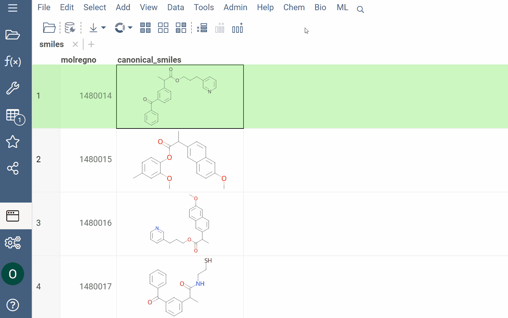

<details>
<summary>How to use</summary>

To configure a similarity or diversity viewer, click the **Gear** icon at the viewer's top. The **Context Panel** updates with available controls. You can change parameters like the similarity threshold, fingerprint type<!--we only have Morgan?-->, or the distance measure.

By default, a reference molecule follows the current row. If you click a different molecule, the similarity viewer updates accordingly. To lock in a specific reference molecule, clear the **Follow Current Row** control. To sketch a custom reference molecule, click the **Edit** icon on the reference molecule card.

You can enhance the viewer cards by incorporating column data. To do so, use the **Molecule Properties** control. If a column is color-coded, its format is reflected on the card's value. To adjust how the color is shown (either as a background or text), use the **Apply Color To** control. To remove highlighting, clear the color-coding from the corresponding column in the dataset.


</details>

### External data sources

Datagrok integrates with multiple data sources to enable structure-based
search, including:
* ChEMBL
* DrugBank
* PubChem (supports identity search)
* [SureChEMBL](info-panels/surechembl.md) (search patented molecules similar to your compounds)
* Chemspace (includes filters by shipping country and compound category)

To see the full list, see [Plugins](../../../plugins.md#chem).

To run a substructure or similarity search, either [sketch](#sketching) or click a molecule in your
dataset and expand the **Databases** section of the **Context Panel** to view
matches for your target molecule. You can also open the results in a separate [Table View](../../../../visualize/table-view-1.md) by clicking the plus (**+**) icon within the relevant info pane.

:::note Developers

To dynamically enrich compound IDs with linked data, 
[register identifier patterns](../../../../develop/how-to/db/register-identifiers.md) 
(e.g., `CHEMBL\d+`). Once registered, the matching values:

* are automatically detected and highlighted across the platform
* show linked content on click, hover, and in search results

This is especially useful when working with diverse identifiers from sources
like GDB exports, internal registries, or assay results. 

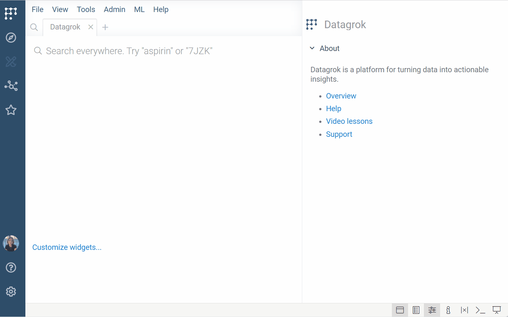

:::

## Structure analysis

### R-groups analysis

R-group analysis decomposes a set of molecules into a core and R-groups (ligands at certain attachment positions), and visualizes the results. The query molecule
consists of the scaffold and ligand attachment points represented by R-groups.
R-group analysis runs in browser using RDKit JS library.

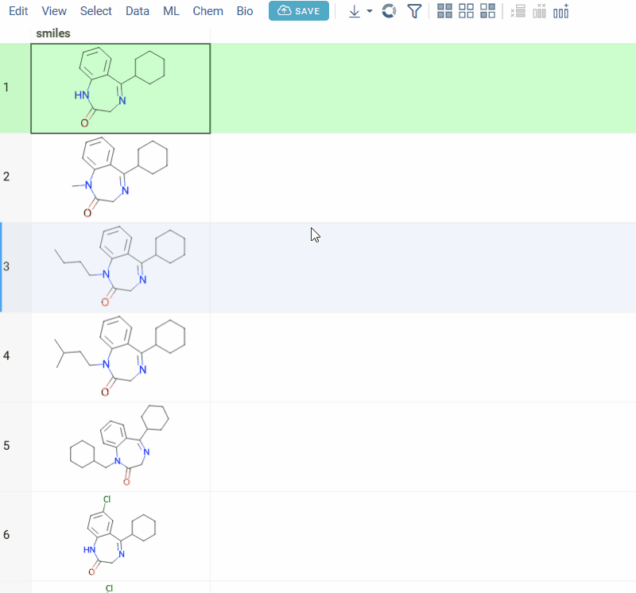

<details>
<summary> How to use </summary>

<Tabs>
<TabItem value="workflow" label="Workflow" default>

1. Go to **Chem** > **Analyze** > **R-Groups Analysis...**
A [sketcher](#sketching) opens.
1. In the sketcher, specify the common core (scaffold) for the selected molecular column using one of these methods:
   * Draw or paste a scaffold in the sketcher. You can define core with custom enumerated R groups.
   * Click **MCS** to automatically identify the most common substructure.
1. Click the **Gear** icon to adjust R group analysis parameters.
1. Click **OK** to execute. The R-group columns are added to the dataframe, along with a [trellis plot](../../../../visualize/viewers/trellis-plot.md) for visual exploration.

R-groups are highlighted with different colors in the initial molecules in grid. Molecules are automatically aligned by core. To filter molecules with R group present in each enumerated position use **isMatch** column.

The trellis plot initially displays pie charts. To change the chart type, use the **Viewer** control in the top-left corner to select a different viewer.

If you prefer not to use a trellis plot, close it or clear the **Visual analysis** checkbox
during Step 3. You can manually add it later. You can also use other [chemical viewers](chemically-aware-viewers.md), like scatterplot, box plot, bar chart, and others.

Use **Replace latest** checkbox to remove previous analysis results when running the new one. Or check it to add new analysis results in addition to existing.
</TabItem>
<TabItem value="Match" label="Only match at R groups">

You can restrict R-groups analysis to molecules that have actual substituents at the specified R-group positions:
1. Define a core with labeled R-groups in the sketcher
1. Click the **Gear** icon and enable **Only match at R groups**.
Before running the analysis, the tool verifies that the core contains properly labeled R groups. The selected setting is saved automatically for future sessions.

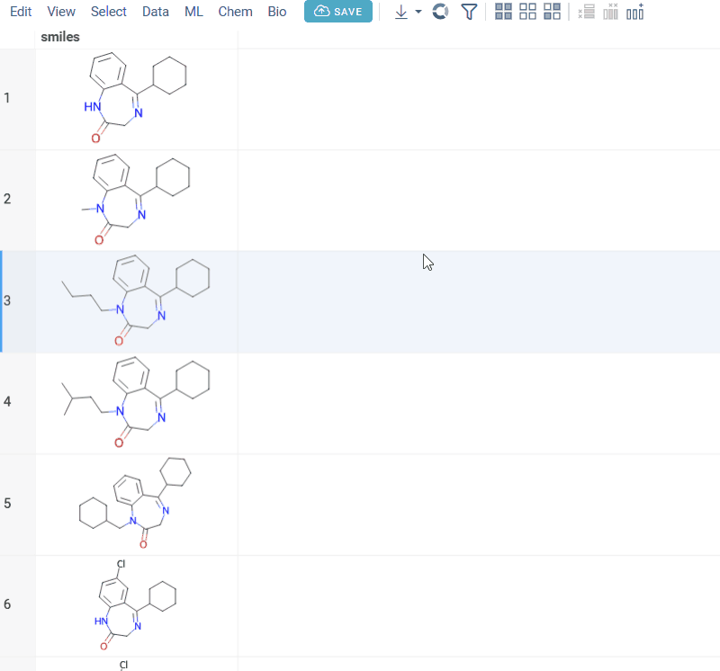

</TabItem>
</Tabs>
</details>

:::note developers

To run the r-group decomposition programmatically, see [this sample script](https://public.datagrok.ai/js/samples/domains/chem/r-group).

:::

### Scaffold tree analysis

The scaffold tree viewer viewer organizes molecules into a hierarchical tree
based on their scaffolds, making it easy to explore structure-activity
relationships, filter datasets, and navigate chemical space.

You can:
* Automatically generate scaffold trees using a customized [ScaffoldGraph](https://github.com/UCLCheminformatics/ScaffoldGraph) algorithm
* Manually sketch the tree or edit nodes
* Highlight matching molecules, filter datasets, and color-code scaffolds for easy profiling 

The scaffold tree is synchronized with other viewers and can be saved as part of a
[layout](../../../../visualize/view-layout.md) or dashboard.

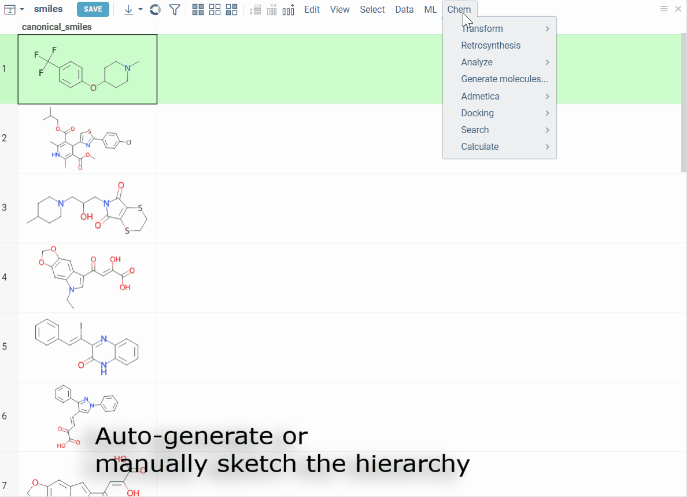

<details>
<summary>How to use</summary>

<Tabs>
<TabItem value="anatomy" label="Anatomy" default>

Each node represents a scaffold. Nodes form a hierarchy where:
* The root scaffold is the smallest common substructure
* Child scaffolds contain their parent as a substructure
* Each scaffold builds on the structure above it in the tree
* Orphan nodes contains the parent scaffold but don't have any sibling scaffolds


</TabItem>
<TabItem value="add-scaffold-tree" label="Add">

**Generate automatically**:
 1. Go to **Top Menu** > **Chem** > **Analyze** > **Scaffold Tree**. This adds the scaffold tree viewer to your dataset. 
 1. On the viewer, click **Generate** to build the tree. Generation may take several minutes for large datasets.

**Load from your computer**:
* **To download**, click the **Download** icon at the top of the viewer.
* **To upload**, click the **Open** icon at the top of the viewer and select your file.

**Sketch manually**:
 1. Go to **Top Menu** > **Chem** > **Analyze** > **Scaffold Tree**. This adds the viewer to your dataset.
 1. To create the root scaffold, at the top of the viewer, click the **Add new root structure** (**+**) icon and sketch your structure.
 1. To add scaffolds below, click the **Add new scaffold** (**+**) icon on a scaffold and sketch. 

>Tip: The viewer's toolbar icons appear when the viewer is active or when you hover over it. 


</TabItem>
<TabItem value="edit-tree" label="Edit">

**Viewer controls (top of viewer)**:
* **Clear all scaffolds**: Click the **Drop all trees** (trash) icon
* **Add root scaffold**: Click the **Add new root structure** (**+**) icon

**Scaffold controls (on each scaffold card)**:
* **Add scaffold below**: Click the **Add new scaffold** (**+**) icon
* **Edit scaffold**: Click the **Edit** icon to sketch
* **Delete scaffold**: Click the **Remove scaffold** (trash) icon to delete the scaffold and all scaffolds below it
>Tip: You can also right-click any scaffold for these options: **Add New...**, **Edit...**, or **Remove**.


</TabItem>
<TabItem value="filter" label="Selection and filtering">

**Selection**:
* **Highlight rows**: Hover over any scaffold
* **Select rows**: Click the **Select rows** icon on the scaffold
* **Deselect rows**: Click the **Deselect rows** icon on the scaffold
* **Exclude from selection**: Click the **≠** icon on the scaffold (inverts the selection state)

**Filtering**:
* **Filter by scaffold**: Click it
* **Exclude from filtered subset**: Click the **≠** icon on the scaffold (inverts the filtered state)
* **Clear filters**: At the top of the viewer, click the **Filter** icon.

To select or filter by multiple scaffolds, select the checkbox to the left of each desired scaffold. 
Use the **AND/OR** control at the top of the viewer to define the logic:
* **OR** (default): includes rows matching _any_ selected scaffold
* **AND**: includes only rows matching _all_ selected scaffolds

Selections and filters sync across all viewers in your dataset. 
You can use the scaffold tree in combination with other [filters](../../../../visualize/viewers/filters.md). 
<!---- You can also add the tree as a filter to the **Filter panel** (see details below)--->.

<!---

<details>
<summary>Add scaffold tree to the **Filter Panel**</summary>

1. In the **Top Menu**, click the **Filter** icon. This toggles the **Filter panel**.
1. In the panel's top left corner, click the **Hamburger** (☰) icon > **Add Filter** >
   **Scaffold Tree Filter**. A dialog opens.
1. In the dialog, select the column and click **OK**. A scaffold tree
   filter is added to the **Filter panel**.
1. To filter, click the **Add** (**+**) icon, then paste or draw a scaffold
   using a sketcher.
</details>

----->

</TabItem>
<TabItem value="color-code" label="Color-code">

Color scaffolds to highlight relationships. The colors appear both in the
dataset column and the scaffold tree.

* To toggle coloring, on the scaffold, click the **Circle** icon. When off, the
  node inherits color from its nearest colored parent.
* To assign new color, click the **Palette** icon. The color applies to the scaffold
  and all its child scaffolds unless they already have custom colors.
* To override an inherited color, assign the new color. Custom node colors
  takes precedence.

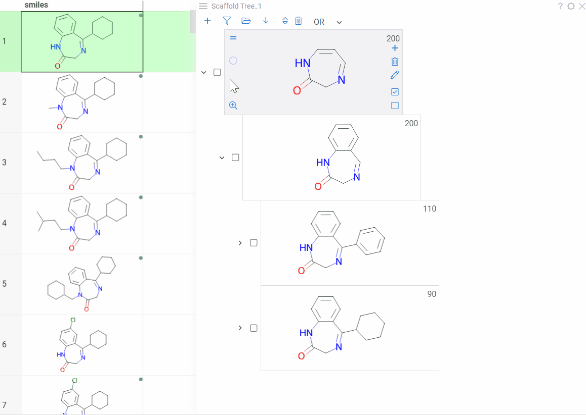

</TabItem>
</Tabs>
</details>

### Retrosynthesis

You can explore the most efficient synthetic pathways and commercially available
starting materials for your target molecules. To view the results for your
target, click or sketch a molecule, and expand the **Retrosynthesis** pane in
the **Context Panel**. Requires the [Retrosynthesis](https://github.com/datagrok-ai/public/blob/master/packages/Retrosynthesis/README.md) plugin.

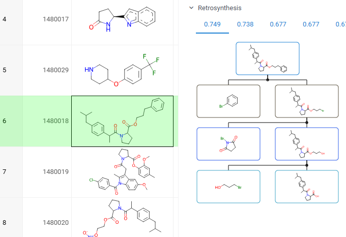

<details>
<summary>How to use</summary>

[Watch a video tutorial](https://youtu.be/FScZ4W_etEE) (~3 mins).

To explore retrosynthesis pathways for a compound:
1. **Select a target molecule**: Click on a molecule in your dataset or [sketch](#sketching) one
1. In the **Context Panel**, open the **Retrosynthesis pane**
1. **View routes**: Each tab shows a different pathway, ranked by score based on
   stock availability, route length, and confidence. The best routes appear
   first
1. **Interact with the results**: 
   * Click any precursor or intermediate to view its details in the **Context Panel**
   * Hover over a pathway to reveal action icons, then click the **Add to
     workspace** (**+**) icon to open the entire pathway in a separate [Table View](../../../../visualize/table-view-1.md)
 
You can use custom models, stock databases, and
display parameters (e.g., route length). 

To set up a custom configuration:
1. **Create a configuration folder**: Go to **Browse** > **AppData** >
   **Retrosynthesis** > **configs** and create a folder with your custom
   configuration name
1. **Add required files** to your configuration folder. The minimum required files are:
   * Expansion model
   * Templates file
   * Stock file
   * `config.yml` with file paths and parameters
1. **Define file paths in `config.yml`**. Paths must follow this format: `/app/aizynthcli_data/configs/<your_custom_config_name>/<file_name>`
  
    **IMPORTANT**: Correct path naming is critical for the configuration to work properly.
    
    Example: 
  
   ```yaml
    expansion:
      full:
        - /app/aizynthcli_data/configs/my_config/my_expansion_model.onnx
        - /app/aizynthcli_data/configs/my_config/my_templates.csv.gz
    stock:
      my_stock: /app/aizynthcli_data/configs/my_config/my_stock.hdf5
   ```
1. **Apply your configuration**: Hover over any route and click the gear icon,
   and select your custom configuration as the current one.

</details>

### Elemental analysis

**Elemental Analysis** analyzes the elemental composition of a molecular structure and visualizes the results in a [radar viewer](../../../../visualize/viewers/radar.md). Each point on the chart represents an element, and the distance from the center of the chart to the point indicates the relative abundance of that element in the structure. Use it as a basic tool to explore the dataset and detect rare elements and unique properties.

<details>
<summary>How to use</summary>

1. In the **Menu Ribbon**, open the **Chem** menu and select **Analyze structure** > **Elemental Analysis...** A parameter input dialog opens.
1. In the dialog:
   1. Select the source table and the molecular column that you want to analyze.
   1. Select the desired visualization option. You can choose between a standalone viewer (select **Radar View**) and sparklines (select **Radar Grid**), both of which use a radar viewer.
1. Click **OK** to execute the analysis. New columns with atom counts and molecule charges are added to the spreadsheet and plotted on a radar chart using the selected visualization option.

</details>

## Structure relationship analysis

### Activity cliffs

The Activity Cliffs tool in Datagrok detects and visualizes pairs of molecules with highly similar structures but significantly different activity levels, known as "activity cliffs." This tool uses distance-based dimensionality reduction algorithms (such as [tSNE](https://scikit-learn.org/stable/modules/generated/sklearn.manifold.TSNE.html) and [UMAP](https://umap-learn.readthedocs.io/en/latest/)) to convert cross-similarities into a [2D scatterplot](../../../../visualize/viewers/scatter-plot.md).


<details>
<summary>How to use</summary>

1. Open the **Chem** menu and select **Analyze SAR** > **Activity Cliffs**.
1. In the parameter input dialog, specify the following:
   1. Select the source table, molecular column, and activity data column to analyze.
   1. Set the similarity cutoff.
   1. Select a dimensionality reduction algorithm and adjust its parameters using the **Gear** icon next to the **Method** control.
1. Click **OK** to execute the analysis. A scatterplot visualization is added to the view.
1. Optional. In the scatterplot, click the link with the detected number of cliffs to open an **Activity Cliffs** table containing all pairs of molecules identified as cliffs. The tables also have detailed information such as similarity score, activity difference score, and other data.

In the scatterplot, the marker color corresponds to the level of molecule activity, and the size represents the maximum detected activity cliff for that molecule. The opacity of the line connecting molecule pairs corresponds to the size of the activity cliff.

To explore the molecule pairs:

* Click a molecule in the source dataframe to zoom in on the scatterplot and focus on the pair that includes the selected molecule. Hover over molecule pairs and connecting lines to see summary information about them.
* Click the line connecting molecules in the scatterplot to select a corresponding pair of molecules in the underlying dataframe and **Activity Cliffs** table. The reverse also applies: clicking a pair in the **Activity Cliffs** table updates the scatterplot and selects the corresponding rows in the underlying dataframe.

As you browse the dataset, the **Context Panel** updates with relevant information.

</details>

### Matched molecular pairs

The **Matched Molecular Pairs** (MMP) tool supports lead optimization by
quantifying how specific structural changes affect potency, solubility,
permeability, and ADMET properties across your dataset.

MMP analysis automatically detects matched molecular pairs within your
dataset, calculates the differences in their properties, and aggregates these
results. The mean property change derived from these
transformations highlights consistent structure-activity relationships, indicating
the expected effect of applying a similar modification to a new molecule.

The results of the MMP analysis are presented in a series of tables and
visualizations, allowing you to:

* Identify high-impact structural modifications that enhance target properties
* Evaluate how specific chemical changes affect a compound's profile
* Generate optimized molecules with predicted properties based on transformations data


<details>
<summary>How to use</summary>

To run MMP analysis:

1. In the **Top Menu**, select **Chem** > **Analyze** > **Matched Molecular
 Pairs...** to open the analysis dialog.
2. In the dialog, configure the analysis by selecting:
    * **Table**: The dataset you want to analyze
    * **Molecules**: The column containing molecules
    * **Activity**: The column(s) representing activity or property values
    * **Fragment Cutoff**: The maximum allowed fragment size relative to the core
3. Click OK. An MMP analysis is added to the view with four tabs:

<Tabs>
<TabItem value="substitutions" label="Substitutions" default> 

The **Substitutions** tab has two interactive tables:

1. **Fragments** table (upper): Shows all fragment substitutions found in your
  dataset along with their frequency and mean change in activity or property. It
  has two viewing modes:
   * **All**: Shows all fragment pairs. Clicking a row here highlights molecules in
your dataset that contain either fragment from a current substitution.
   * **Current molecule**: Shows only fragment pairs relevant to the current molecule
molecule in your dataset, enabling exploration of molecule-specific
substitutions. The number of corresponding substitutions appears in the top-left
corner.

1. **Molecule pairs** table (lower): Shows pairs of molecules and their property changes corresponding to the current
   substitution in the **Fragments** table. Clicking a row here pins the molecule pair at the top of your
   dataset and shows the details about the pair in the **Context Panel**. 

To select multiple rows in any table, use **Ctrl+click**. To open a table in a separate view, click the **+** icon above the corresponding table.

 

</TabItem>
<TabItem value="fragments" label="Fragments">

The **Fragments** tab contains:

1. [Trellis plot](../../../../visualize/viewers/trellis-plot.md): Shows
identified fragments along the _x_ and _y_ axes, with property changes shown at
their intersections. Click a cell to filter corresponding molecule pairs in the
table below. Use the filter icon to refine results, or sort fragments by
frequency or molecular weight using the sorting icons on the axes.

1. **Molecule pairs** table: Shows molecule pairs for the selected substitution
   and functions identically to the **Molecule pairs** table in the
   **Substitutions** tab.


</TabItem>
<TabItem value="cliffs" label="Cliffs"> 

The **Cliffs** tab includes:

1. [Scatterplot](../../../../visualize/viewers/scatter-plot.md): Shows clusters
of molecules with similar structures but significant differences in the activity
or property. Arrows connecting molecules represent a property change, pointing
toward the molecule with the higher value.

1. **Molecule pairs** table: Shows molecule pairs for the selected substitution,
identical to the table in the **Substitutions** tab. Clicking a row here zooms
to that pair on the scatterplot and shows the pair's details in the **Context
Panel**. Conversely, clicking an arrow on the scatterplot shows that pair in the
table. Toggle the table's visibility with the **Show Pairs** checkbox above the
scatterplot. 

Use activity filters on the scatterplot to refine results in both views.


</TabItem>
<TabItem value="generation" label="Generation">

The **Generation** tab uses transformation rules derived from your dataset
to create and predict new molecules. For each molecule, the table shows:

* Original and transformed molecules
* Molecule status (existing or newly generated)
* Maximum common substructure and the substituted fragment for this pair
* Original and predicted property or activity values

The **Context Panel** shows a scatterplot comparing observed vs. predicted values based on your dataset molecules.


</TabItem>
</Tabs>
</details>

## Docking

Use molecular docking to analyze how small molecules bind to protein targets (powered by [AutoDock Vina](https://autodock.scripps.edu/)).
Datagrok visualizes predicted poses and calculates binding scores. Requires the [Docking](https://github.com/datagrok-ai/public/blob/master/packages/Docking/README.md) package.


<details>
<summary>How to use</summary>

**Step 1. Prepare targets**

Prepare receptor structures using AutoDock tools and upload them to Datagrok. 

To learn how, see the [video tutorial](https://www.youtube.com/watch?v=IIcJfTJ0Hn8) 
or [plugin docs](https://github.com/datagrok-ai/public/blob/master/packages/Docking/README.md).

**Step 2. Run docking**

1. Go to **Top Menu** > **Chem** > **Docking...**
1. In the dialog, select the ligand column, choose a target, and set the number of conformations
1. Click **OK** to start docking 

> Note: Docking may take time during the first run. Subsequent runs use cached results and are faster.

**Step 3. Analyze the results**

Explore predicted poses and binding scores in your dataset and the **Context Panel** (under **Docking**).

</details>

## Predictive modeling

### QSAR and QSPR modeling

Use Datagrok to train, apply, and integrate structure-based [predictive models](../../../solutions/domains/data-science.md#predictive-modeling) for molecular property prediction and virtual screening. Supported approaches include:

1. Classical machine learning (e.g., XGBoost) using calculated descriptors
1. Deep learning models designed for chemistry, such as [Chemprop](https://chemprop.readthedocs.io/en/latest/#).

<Tabs>
<TabItem value="train" label="Train" default>

Train a model based on a measured response using calculated descriptors as
features. Use built-in [modeling engine](../../../../learn/learn.md), 
which supports different backends, dozens of model types, and extensive hyperparameter tuning. 

Try it in the
[Virtual screening tutorial](https://dev.datagrok.ai/apps/tutorials/Tutorials/Cheminformatics/VirtualScreening)
for a guided example.


</TabItem>
<TabItem value="apply" label="Apply">

Apply existing models to new compounds using [the same engine](../../../../learn/learn.md#apply-model). 
Predictions are written directly to the data table and can be explored with all Datagrok tools.


</TabItem>
<TabItem value="augment" label="Augment">

Deploy models for real-time prediction using [info panes](../../../../datagrok/navigation/panels/info-panels.md). 
Predictions appear dynamically as users click, sketch, or modify structures.


</TabItem>
</Tabs>

### ADMET predictions

Quickly evaluate the drug-likeness and safety of compounds. 
The [Admetica package](https://github.com/datagrok-ai/public/tree/master/packages/Admetica) 
provides in-browser access to [23 models](https://github.com/datagrok-ai/admetica?tab=readme-ov-file#available-predictive-models) that predict pharmacokinetic and toxicity
properties. Models include both classification and regression outputs for endpoints such as:
* Caco-2 permeability
* Plasma protein binding
* CYP450 inhibition
* hERG inhibition
* Clearance
* LD50 toxicity

These models are trained on public datasets and can be extended with proprietary
data ([see details](https://github.com/datagrok-ai/admetica?tab=readme-ov-file#usage)). 
Datagrok visualizes the results directly in the grid and **Context
Panel**, making it easy to assess compounds during screening and optimization.


<details>
<summary>How to use</summary>

**For a single molecule:** 
* Click on a molecule in your dataset. The **Context
Panel** automatically updates, showing ADMET predictions in the **Admetica** info
pane.

**For a column with molecules**:

1. Go to **Top Menu** > **Chem** > **Admetica** > **Calculate...**
1. In the dialog, choose which properties to predict and configure how results are interpreted and displayed
1. Click **OK**. Datagrok adds a new column for each predicted property along with the visualization of results.

Use built-in tools to explore and analyze the prediction results.

</details>

## Multiparameter optimization

Medicinal chemistry is a balancing act: potency must rise while properties like solubility, permeability, clearance, safety, and selectivity stay in acceptable ranges. In practice, teams use a mix of complementary methods to optimize across many (often conflicting) endpoints:

* **Property rules & gates.** Start with simple [filters](../../../../visualize/viewers/filters.md) to eliminate obvious non-starters. These are fast guardrails but can be blunt and may miss promising trade-offs.

  New numeric columns can be added for immediate charting and filtering such as physical chemical properties (Top menu: Chem → Calculate → Chemical Properties...) or ADME properties with the Admetica plugin (Top menu: Chem → Admetica → Calculate...). Custom properties, like Ligand Efficiency (LE) or Lipophilic Ligand Efficiency (LLE), can be calculated using the [Add New Column](../../../../transform/add-new-column.md) feature.  Viewers, like [parallel coordinates plot](../../../../visualize/viewers/pc-plot.md), [radar](../../../../visualize/viewers/radar.md) or [row-level pie bar charts](../../../../visualize/viewers/grid.md#summary-columns), are especially useful for examining the profile of properties.  

* **Desirability/utility functions & composite scores.** Map each property to a 0–1 “desirability” curve, then combine (sum/mean/weighted) into a single score that encodes the team’s preferences. Desirability functions can be either drawn manually or constructed automatically from a labeled dataset using probabilistic MPO. A well-known example that is included by default is CNS MPO from Pfizer, which combines six physicochemical properties into a 0–6 score and correlates with clinical CNS success. 

  <details>
  <summary> Probabilistic MPO </summary>

  Probabilistic MPO ([pMPO](https://pmc.ncbi.nlm.nih.gov/articles/PMC4716604/)) is a data-driven method for constructing desirability profiles from labeled datasets, in which statistically significant and non-redundant molecular descriptors are identified through significance testing and correlation filtering. It then combines these descriptors into weighted desirability functions, enabling robust multi-parameter optimization and compound ranking based on balanced property trade-offs.

  Build a desirability profile using the interactive pMPO [application](../../../../learn/pMPO.md):

  

  </details>

  Available from `Chem -> Calculate -> MPO Score...`:

  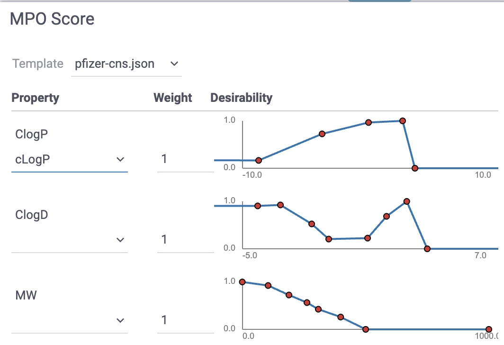

* **Pareto (multi-objective) optimization.** Instead of collapsing objectives, identify the Pareto front: compounds for which no property can be improved without worsening another. Common in modern DDD pipelines and often paired with evolutionary algorithms or scalarization for ranking. 

* **Active/Bayesian multi-objective optimization.** Use surrogate models to propose new compounds that efficiently move the Pareto front (or a scalarized objective), reducing screening cost and focusing make/test cycles. 

* **Desirability-based QSAR/MQSAR.** Use the built-in [predictive modeling capabilities](#predictive-modeling) to predict property desirabilities directly (or predict properties first, then score). 

<details>
<summary> Pareto front </summary>

The Pareto front represents a set of non-dominated solutions in multi-objective optimization, where improving one objective necessarily degrades at least one other, revealing optimal trade-offs between conflicting goals. Use the [Pareto front viewer](../../../../visualize/viewers/pareto-front-viewer.md) to display these Pareto-optimal points on an interactive scatterplot:

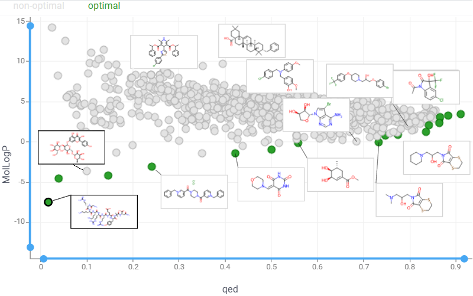

Launch an interactive Pareto Front [application](../../../../visualize/viewers/pareto-front-viewer.md#application) that enables real-time exploration of optimization results.

</details>

## Generative chemistry

Generate novel compounds optimized for specific properties using [Reinvent4](https://github.com/MolecularAI/REINVENT4). 
For details, see the [Reinvent4 package docs](https://github.com/datagrok-ai/public/tree/master/packages/Reinvent4). 

## Utilities

Datagrok offers [multiple ways to transform and enrich your data](../../../../transform/transform.md). For example, you can link tables, extract values, or add metadata to annotate your dataset with experimental conditions or assay results<!--need a link out to how to add metadata-->. You can also use [chemical scripts](#chemical-scripts) to execute operations on chemical data, including calculation of fingerprints and descriptors, toxicity prediction, and more.

### Calculators

#### Molecular descriptors and fingerprints

Datagrok supports the calculation of different sets of descriptors and fingerprints:

* Lipinski, Crippen, EState, EState VSA, Fragments, Graph, MolSurf, QED. See [this reference article](descriptors.md) for additional details.
* RDKFingerprint, MACCSKeys, AtomPair, TopologicalTorsion, Morgan/Circular. See [this reference article](fingerprints.md) for additional details.

For individual molecules, descriptors are calculated in real-time and presented in the **Descriptors** info pane (**Context Panel** > **Chemistry** > **Descriptors**), which dynamically updates as you interact with a chemical structure (e.g., upon clicking, modifying, or sketching a molecule.) You can also calculate descriptors or fingerprints for the entire column by choosing the corresponding option from the **Chem** > **Calculate** menu.

#### Molecule identifier conversions

Datagrok supports the conversion of various molecule identifiers, including proprietary identifiers, allowing you to work with multiple data sources and tools. For example, you can convert a SMILES string to an InChI and vice versa.

<details>
<summary> Supported data sources</summary>

|              |             |              |                 |
|--------------|-------------|--------------|-----------------|
| actor        | drugbank    | lipidmaps    | pubchem         |
| atlas        | drugcentral | mcule        | pubchem_dotf    |
| bindingdb    | emolecules  | metabolights | pubchem_tpharma |
| brenda       | fdasrs      | molport      | recon           |
| carotenoiddb | gtopdb      | nih_ncc      | rhea            |
| chebi        | hmdb        | nikkaji      | selleck         |
| chembl       | ibm         | nmrshiftdb2  | surechembl      |
| chemicalbook | kegg_ligand | pdb          | zinc            |
| comptox      | lincs       | pharmgkb     |                 |

</details>

For individual molecules, the conversion happens automatically as you interact with molecules, and the **Context Panel** shows all available identifiers in the **Identifiers** info pane (**Context Panel** > **Structure** > **Identifiers**). You can also convert the entire column by choosing the corresponding option from the **Chem** > **Calculate** menu.

:::note developers

To run programmatically, use the `#{x.ChemMapIdentifiers}` function.

:::

### Curation

Datagrok supports [chemical structure curation](https://pubs.acs.org/doi/10.1021/ci100176x), including kekulization, normalization, reorganization,  neutralization, tautomerization, and the selection of the main component.

<details>
<summary> How to use </summary>

To perform chemical structure curation:

1. Navigate to **Menu Ribbon** > **Chem** > **Transform** > **Curate**.
1. In the **CurateChemStructures** dialog, select from the available options and click **OK**. This action adds a new column containing curated structures.

<!--replace with new UI-->

</details>

### Mutation

You can generate a dataset based on the preferred structure.

<details>
<summary> How to use </summary>

To perform chemical structure mutation:

1. Navigate to **Menu Ribbon** > **Chem** > **Transform** > **Mutate**.
1. In the **Mutate** dialog, draw or paste the desired structure and set other parameters, including the number of mutated molecules. Each mutation step can have randomized mutation mechanisms and places (select the **Randomize** checkbox).
1. Click **OK** to execute. A new table with mutated structures opens.

</details>

### Virtual synthesis

You can use the `Chem: TwoComponentReaction` function to apply specified chemical reactions to a pair of columns containing molecules in a virtual synthesis workflow. The output table contains a row for each product yielded by the reaction for the given inputs.


<details>
<summary>How to use</summary>

1. Open the **Two Component Reaction** dialog by executing the `Chem: TwoComponentReaction` function in the **Console**. This opens a parameter input dialog.
1. In the dialog:
   1. Select the reactants to use.
   1. Enter reaction in the filed provided.
   1. Choose whether to combine the reactants from two sets, or sequentially, and whether to randomize, by checking or clearing the Matrix Expansion and Randomize checkboxes.
   1. Set other parameters, such as seed, the number of maximum random reactions.
   1. Click **OK** to execute.

</details>

## Customizing and extending the platform

Datagrok is a highly flexible platform that can be tailored to meet your specific needs and requirements. With its comprehensive set of [functions](../../../../develop/function-roles.md) and
[scripting capabilities](../../../../compute/scripting/scripting.mdx), you can customize and enhance any aspect of the platform to suit your chemical data needs.

For instance, you can add new data formats, apply custom models, and perform other operations on molecules. You can also add or change UI elements, create custom connectors, menus, context actions, and more. You can even develop entire applications on top of the platform or customize any existing [open-source plugins](https://github.com/datagrok-ai/public/tree/master/packages).

[Learn more about extending and customizing Datagrok](../../../../develop/develop.md), including this
[cheminformatics-specific section](../../../../develop/domains/chem/cheminformatics.md).

### Chemical scripts

Chem package comes with several scripts that can be used either directly, or as an example for building custom chemical functions in languages such as Python (with RDKit) or R. These chemical functions can be integrated into larger scripts and workflows across the platform, enabling a variety of use cases such as data transformation, enrichment, calculations, building UI components, workflow automation, and more. Here's an example:

```mdx-code-block
<Tabs>
<TabItem value="script" label="Script" default>
```


```mdx-code-block
</TabItem>
<TabItem value="script-output" label="Script output">
```


```mdx-code-block
</TabItem>
<TabItem value="script-output-in-info-pane" label="Script output in info pane">
```


```mdx-code-block
</TabItem>
</Tabs>
```

In this example, a [Python script based on RDKit](https://public.datagrok.ai/script/276a5929-6f21-5105-8eec-576845aabae0)
calculates and visualizes Gasteiger partial charges. When you run the script
explicitly, Datagrok shows a dialog for sketching a query molecule and
visualizes the results. In this case, however, the script is also tagged as a
`panel`. This instructs Datagrok to show the results as an interactive UI
element that updates dynamically for the current molecule.

To view the chemical scripts you've created or those shared with you, open the [Scripts Gallery](https://public.datagrok.ai/scripts?q=%23chem) (**Functions** > **Scripts**) and filter by the tag `#chem`. You can search for individual scripts and use the **Context Panel** to view details, edit, run, manage, and perform other actions for the selected script.

:::note

For a full list of chemical scripts, along with details on their implementation and associated performance metrics, see [Chemical scripts](scripts/chem-functions.md). To learn more about scripting, see [Scripting](../../../../compute/scripting/scripting.mdx).

:::

## Resources

* [Cheminformatics tutorial](https://public.datagrok.ai/apps/tutorials/Tutorials/Cheminformatics/VirtualScreening)
* [Demo app](https://public.datagrok.ai/apps/Tutorials/Demo)
* Community:
  * [Cheminformatics updates](https://community.datagrok.ai/t/cheminformatics-updates/457)
* Videos:
  * [Cheminformatics](https://www.youtube.com/watch?v=k1NVdTRpYOM)
  * [Molecular similarity and diversity](https://www.youtube.com/watch?v=wCdzD64plEo)

<!--* [Package help reference]-->
