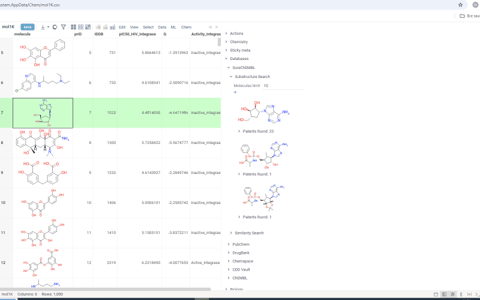

The [SureChEMBL plugin](https://github.com/datagrok-ai/public/tree/master/packages/SureChembl) 
provides local access to the [SureChEMBL](https://www.surechembl.org) database. 

You can: 
* Search either by similarity or substructure
* Set result limits and similarity thresholds
* View associated patent information

[Watch a video tutorial](https://www.youtube.com/watch?v=A31ZfDyNm7k) (~3 mins).

## Searching patents with SureChEMBL

1. **Finding related molecules**:
   1. In the dataset, click a cell containing your target molecule structure.
   1. In the **Context Panel**, expand **Databases** > **SureChEMBL**. 
   1. Expand the corresponding info panes:
      * **Substructure Search**: For molecules containing your structure  
      * **Similarity Search**: For structurally similar molecules (results display similarity scores above each molecule)
2. **Adjusting search parameters**:
   * **Molecules limit**: Change the number of results shown (default is 10)
   * **Similarity cutoff**: Set the minimum similarity threshold for matches (for **Similarity Search** only)
3. **Viewing patent information**:
   * **Quick view**: Expand the patents pane beneath any molecule to see associated patents. A marker indicates the total number of patents found.
   * **Detailed view** (opens a separate **Table View**): 
     * To view all patents across all search molecules, click the plus (**+**) icon beneath the search settings.
     * To view patents for a specific molecule, click the plus (**+**) icon next to a specific molecule's patent count
   * **Direct access**: The patent information contains patent ID links. Click the link to see the original patent on the SureChEMBL website.

