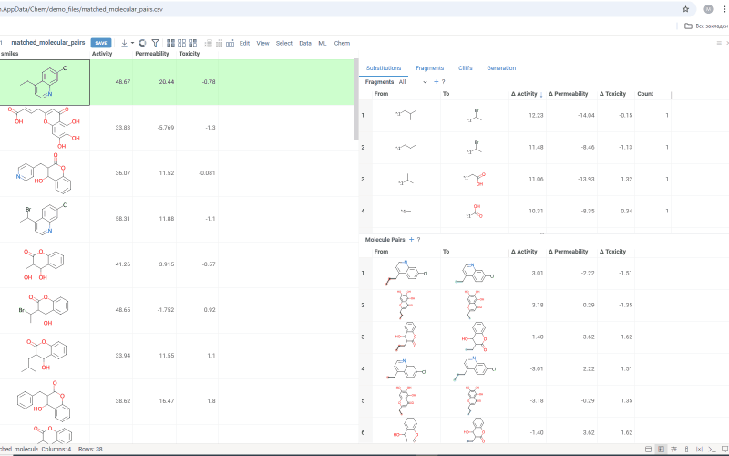
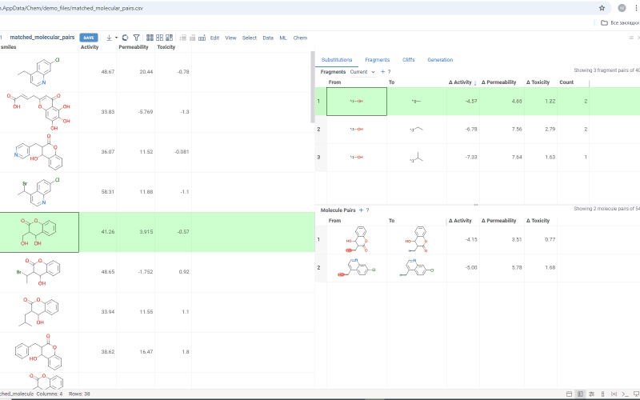
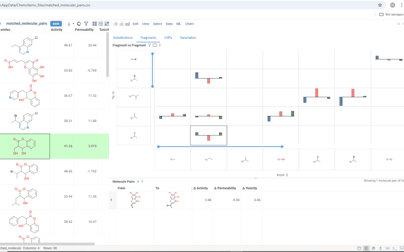

# Matched molecular pairs


```mdx-code-block
import Tabs from '@theme/Tabs';
import TabItem from '@theme/TabItem';
```

The **Matched Molecular Pairs** (MMP) tool is a powerful cheminformatics method for analyzing structural transformations within chemical datasets.
It enables chemists and computational researchers to identify small,
well-defined molecular modifications and quantify their impact on key properties such
as potency, solubility, permeability, and/or ADMET characteristics.

MMP analysis is particularly valuable in lead optimization, where systematic exploration of chemical space can guide the design of more effective drug candidates.
By studying how molecular fragments influence activity, the tool helps users make data-driven decisions when selecting modifications to improve lead compounds.

Traditionally, lead optimization relies on trial and error, guided by medicinal chemistry intuition.
MMP analysis enhances this process by providing quantitative insights into structure-activity relationships (SAR), helping to answer key questions:

* Which molecular transformations are most frequently associated with improved activity?
* Does replacing a specific fragment increase or decrease potency?
* Are there consistent trends in physicochemical properties across multiple transformations?
* Can we predict the impact of a given substitution before synthesizing a new molecule?

By leveraging a data-driven approach, the MMP tool provides a systematic way to explore molecular modifications, ensuring that optimization efforts are based on real-world patterns rather than guesswork.

## How It Works

1. **Pair Identification** – The algorithm scans the dataset to detect matched molecular pairs, defined as molecules that differ by a single small transformation while having a common core.
2. **Activity & Property Calculation** – The difference in biological activity or physicochemical properties between each pair is calculated.
3. **Statistical Aggregation** – Changes across multiple pairs are averaged to identify consistent transformation trends.
4. **Visualization & Exploration** – Users can interactively explore the results through various tables, chemical space plots and other graphical representations.
5. **Molecule Generation** – Transformations identified in the dataset can be applied to new molecules, predicting their potential properties.

## From Analysis to Action

MMP analysis not only reveals how structural modifications impact molecular properties but also provides a framework for making informed optimization decisions.
By systematically examining transformations, researchers can:

* Identify key substitution patterns that lead to increased activity or improved ADMET/other properties.
* Uncover structure-property relationships that guide rational lead optimization.
* Generate and evaluate new compounds, leveraging known transformations to design better drug candidates.

With its interactive visualizations and predictive capabilities, the MMP tool transforms raw chemical data into actionable insights,
helping scientists refine molecular designs with greater confidence and efficiency.
Whether optimizing a single lead or exploring large compound libraries, MMP analysis provides the clarity needed to make smarter, faster decisions in drug discovery.


<details>
<summary>How to use</summary>

To run MMP analysis:

1. In the **Top Menu**, select **Chem** > **Analyze** > **Matched Molecular
   Pairs...** A dialog opens.
1. In the dialog, select the table you want to analyze (**Table**), the column
   containing molecules within this table (**Molecules**), the
   activity/property columns (**Activity**) and maximum fragment size relative to core (**Fragment Cutoff**). Click **OK**. An MMP section is
   added to the view. It has four tabs:

<Tabs>
<TabItem value="substitutions" label="Substitutions" default> 

The **Substitutions** tab has two tables:

* **The upper table (Fragments)** shows all fragment substitutions found in the dataset. It includes the frequency of each substitution and the
  corresponding change in the analyzed activity or property. There are two modes to explore fragments dataset:
  - *All* shows all found fragment pairs at once
  - *Current* shows fragment pairs fount for current molecule in the initial dataset.
  Information message on the left top corner of the table shows how many rows of total are filtered. 
  

  Click any row in the table to show all molecule pairs from the initial dataset having corresponding substitution.
  Select rows with `Ctrl` + click to select all molecules with corresponding substitution (having either *From* or *To* fragment) in the initial dataset.
  


* **The lower table (Molecule pairs)** shows all pairs of molecules associated with the
  substitution from the upper table. It provides details about the analyzed
  activity or property for each pair of molecules.
  Click any row in the **Fragments** table to filter molecule pairs with current substitution. If *Current* mode is selected on **Fragments** table then pair containing current molecule from initial dataset will be on top.
  Corresponding fragments are highlighted within each molecule.
  Click any row in **Molecule pairs** table to pin corresponding *From* and *To* molecules in the initial dataset and open **Context panel** with molecules details.
  Select rows with `Ctrl` + click to select corresponding *From* and *To* molecules in the initial dataset.
  

Click **+** icon above corresponding table to add it to workspace.

</TabItem>
<TabItem value="fragments" label="Fragments">

The **Fragments** tab has two components:

* [trellis plot](../../../../visualize/viewers/trellis-plot.md) shows all identified
fragments on the x and y axes. Each intersection in the plot displays the change
in the analyzed activity or property resulting from a fragment substitution.

* **Molecule pairs** table. The same as on **Substitutions** tab

Click on any non-empty cell on the trellis plot to filter molecule pairs with corresponding substitution in the **Molecule pairs** table.


Filter trellis plot using the filter icon above the viewer.


Sort trellis plot using sort icons on the axes. Two sorting options are available: by fragment frequency and molecular weight.


</TabItem>
<TabItem value="cliffs" label="Cliffs"> 

The **Cliffs** tab has two components:

* [scatterplot](../../../../visualize/viewers/scatter-plot.md) shows clusters of
molecules with similar structures but significant differences in the analyzed
activity or property. Arrows connecting molecules represent changes in the
specified activity or property, with the arrow pointing toward the molecule with
the higher value.

* **Molecule pairs** table. The same as on **Substitutions** tab. Show or hide the table using **Show Pairs** checkbox above the scatter plot.
Click any row to zoom to the corresponding molecule pair on the scatter plot and show details in the **Context Panel**.
Navigation also works vice versa: click an arrow on a scatter plot to zoom in and make molecule pair current in the **Molecule pairs** table.


Use activity filters on a scatter plot to filter pairs by activity difference. Filter is reflected in the **Molecule pairs** table.


</TabItem>
<TabItem value="generation" label="Generation">

In the **Generation** tab, transformation rules derived from the matched molecule pairs in
your dataset are used to generate new molecules and predict their property and
activity values. For every molecule in your dataset, the table shows each
potential transformation, providing:

* Both the starting and new compounds.
* The maximum common substructure for this pair and the substituted fragment.
* Original and predicted values for one of the analyzed activities or
  properties.
* Whether new molecule already exists in the initial dataset or newly generated

In the **Context panel** there is scatter plot showing observed vs predicted values for each activity for molecules from initial dataset.


</TabItem>
</Tabs>
</details>