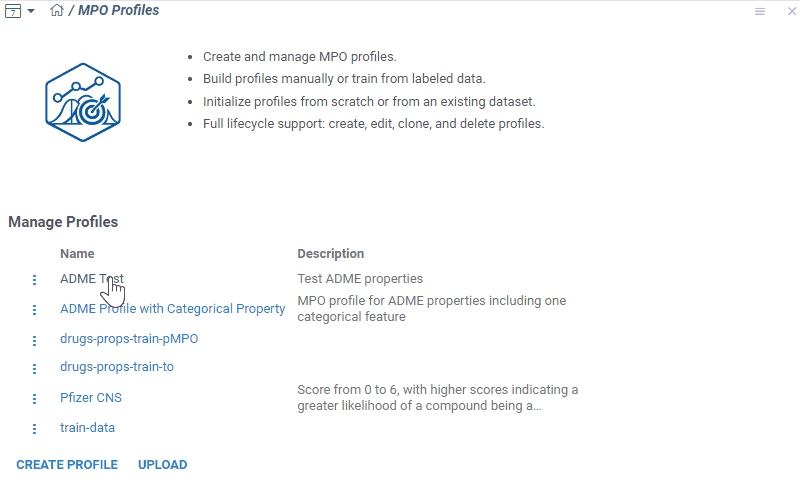
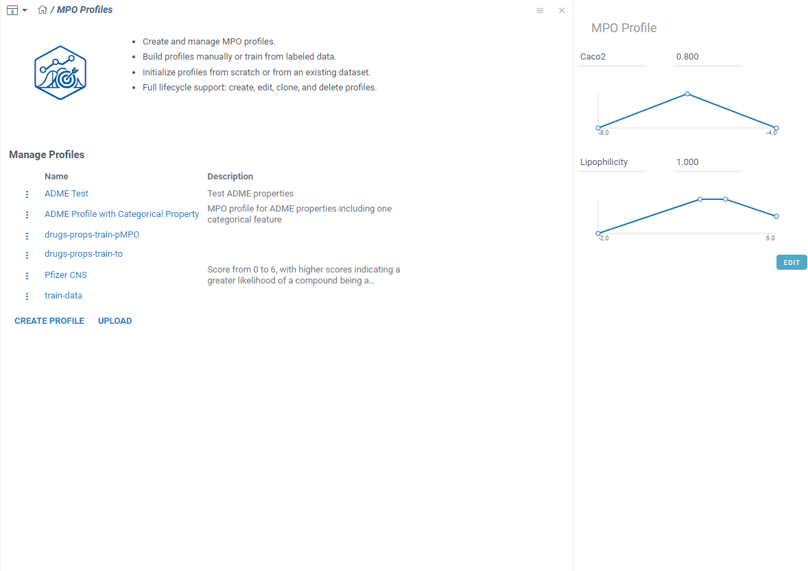
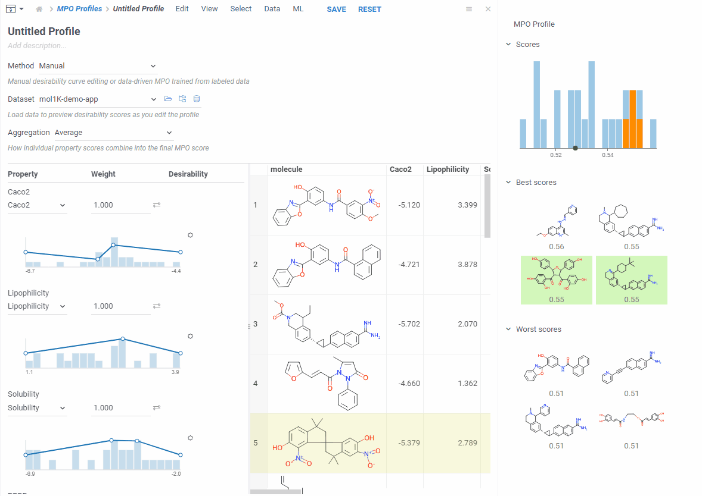
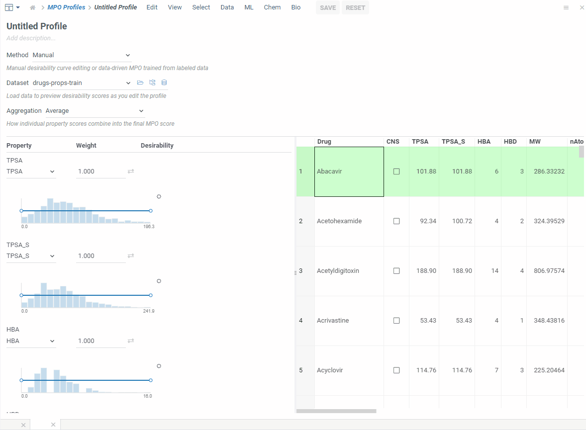
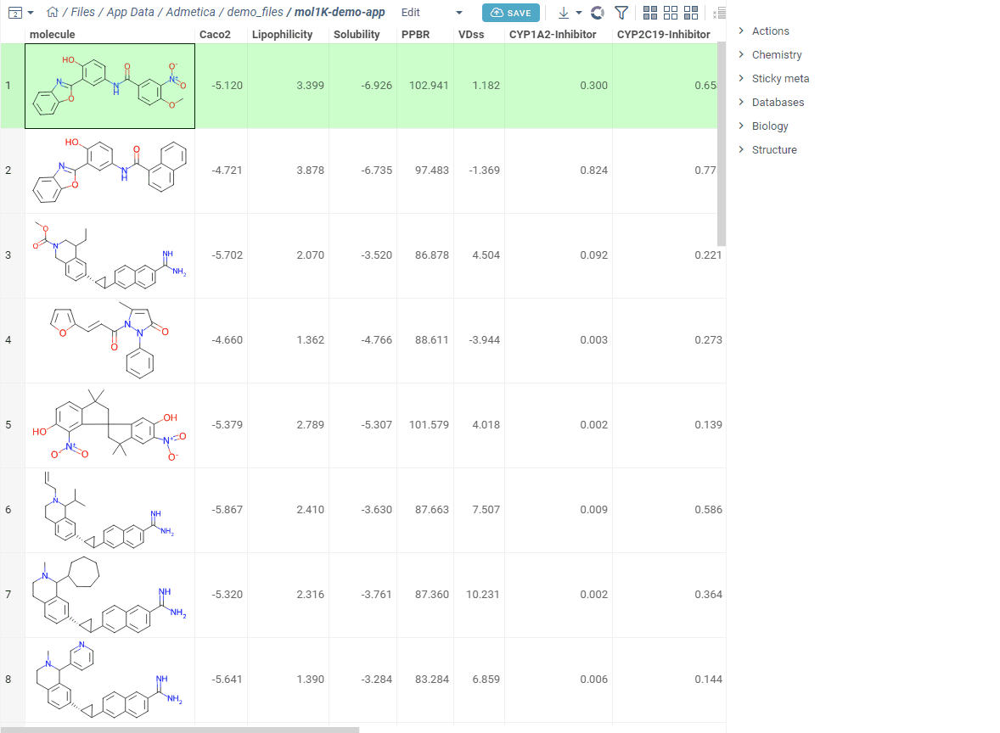

Multiparameter optimization (MPO) helps you rank and prioritize compounds by combining
multiple properties into a single composite score. You define how each property maps to a
0–1 desirability scale, assign weights, and aggregate the results. MPO is especially useful
in medicinal chemistry, where potency, solubility, permeability, clearance, and safety
must all stay within acceptable ranges.

This page covers MPO profiles, desirability curves, scoring, and visualization tools
available in Datagrok.

## Profiles

An MPO profile defines which properties to evaluate, how to shape their desirability
curves, and how to aggregate the results into a final score. Datagrok includes built-in
profiles (such as the Pfizer CNS MPO) and lets you create your own.

To manage profiles, select **Apps** > **Chem** > **MPO Profiles**. From here, you can:

* Create a new profile
* Edit an existing profile
* Clone a profile
* Delete a profile
* Download a profile as JSON
* Upload a previously saved profile

### Create a profile

To create a new profile, click **Create Profile**. A dedicated view opens where you
can:

* Add properties and shape their desirability curves.
* Track changes in real time via the context panel (score histogram,
  best and worst scoring molecules).
* Add computed functions for properties missing from the dataset.

### Desirability curves

Each property maps to a 0–1 desirability scale using one of three curve types:

| Curve type | Description |
|:-----------|:------------|
| Freeform | Draw a custom curve by placing control points |
| Gaussian | Bell-shaped curve centered on an optimal value |
| Sigmoid | S-shaped curve for monotonically increasing or decreasing desirability |

#### Categorical properties

For categorical properties (such as compound class or assay outcome), you assign a
desirability score to each category directly instead of drawing a curve.

#### Missing values

You can configure how the profile handles missing property values:

| Option | Behavior |
|:-------|:---------|
| Skip row | Exclude the compound from scoring |
| Use fallback score | Assign a default desirability value |
| Ignore property | Score the compound using the remaining properties |

### Aggregation

Combine individual desirability scores into a final MPO score using one of these methods:

* Average
* Sum
* Product
* Geometric mean
* Min
* Max

You can also assign weights to individual properties to reflect their relative importance.

### Built-in profiles

Datagrok includes the Pfizer CNS MPO profile by default. It combines six physicochemical
properties into a 0–6 score that correlates with clinical CNS drug success.

## Data-driven mode

Instead of designing desirability curves manually, you can train a profile from labeled
data. Switch to data-driven mode and select a column that defines desirability (boolean,
numeric, or categorical). MPO automatically shapes all curves to match the labeled data
and generates a ROC curve and confusion matrix for validation.

:::tip

Data-driven mode is useful when you have a trusted dataset with known outcomes and want
to build a profile without manually tuning each curve.

:::

## Scoring

To score compounds against a profile, select **Chem** > **Calculate** > **MPO Score**.
Compatible profiles display a checkmark (✓) indicator.

## Visualization

After scoring, you can use several tools to explore the results:

* **Sort by MPO score** to identify top candidates.
* **Radar charts** show per-property score breakdowns directly in the grid.
* **Pareto front** toggle highlights compounds where no property can improve without
  worsening another. For details, see the
  [Pareto front viewer](../../../../visualize/viewers/pareto-front-viewer.md).

## See also

* [Cheminformatics](chem.md)
* [Pareto front viewer](../../../../visualize/viewers/pareto-front-viewer.md)
* [Predictive modeling](chem.md#predictive-modeling)
