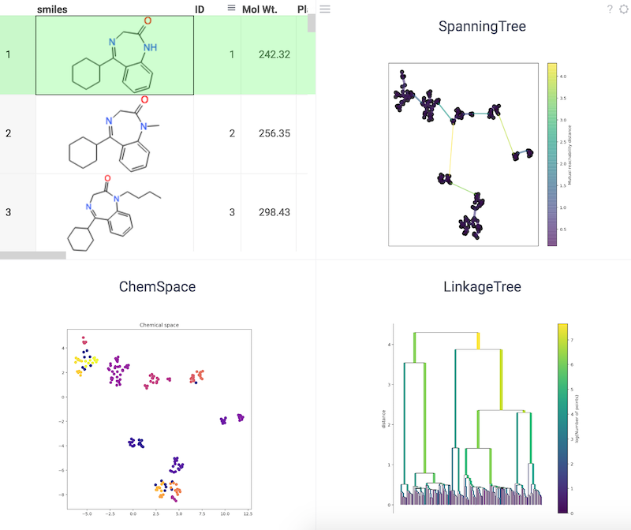

## Supported scripts

| Name                               | Function                  |
|------------------------------------|---------------------------|
| Substructure search                | <pre>`\#{x.ChemSubstructureSearch}`</pre>|
| Find MCS                           | <pre>`\#{x.ChemFindMCS}`</pre> |
| Descriptors                        | <pre>`\#{x.ChemDescriptors}`</pre> |
| R-Groups                           | <pre>`\#{x.ChemGetRGroups}`</pre> |
| Fingerprints                       | <pre>`\#{x.ChemFingerprints}`</pre> |
| Similarity SPE                     | <pre>`\#{x.ChemSimilaritySPE}`</pre> |
| SMILES to InchI                    | <pre>`\#{x.ChemSmilesToInchi}`</pre> |
| SMILES to Canonical                | <pre>`\#{x.ChemSmilesToCanonical}`</pre> |
| Chemical map identifiers           | <pre>`\#{x.ChemMapIdentifiers}`</pre> |
| Butina cluster                     | <pre>`\#{x.ChemScripts:ButinaMoleculesClustering}`</pre> |
| Filter by catalogs                 | <pre>`\#{x.ChemScripts:FilterByCatalogs}`</pre> |
| Gasteiger partial charges          | <pre>`\#{x.ChemScripts:GasteigerPartialCharges}`</pre> |
| Murcko scaffolds                   | <pre>`\#{x.ChemScripts:MurckoScaffolds}`</pre>|
| Similarity maps using fingerprints | <pre>`\#{x.ChemScripts:SimilarityMapsUsingFingerprints}`</pre> |
| Chemical space using tSNE          | <pre>`\#{x.ChemScripts:ChemicalSpaceUsingtSNE}`</pre> |
| Two component reactions            | <pre>`Chem:TwoComponentReaction`</pre> |
| Chemical space using UMAP          | <pre>`\#{x.ChemScripts:ChemicalSpaceUsingUMAP}`</pre> |
| USRCAT                             | <pre>`\#{x.ChemScripts:USRCAT}`</pre> |
| Mutate                             | <pre>`[PLACEHOLDER]`</pre> |
| Solubility prediction              | <pre>`\#{x.18b704d0-0b50-11e9-b846-1fa94a4da5d1."Predict Solubility"}`</pre>|
| Curate                             | <pre>`[PLACEHOLDER]`</pre> |

The following table gives an indicative data for the performance of certain chemical functions:

 Indicative performance of chemical functions 

| Function                              | Molecules | Execution time, s |
|---------------------------------------|-----------|-------------------|
| ChemSubstructureSearch                | 1M        | 70                |
| ChemFindMcs                           | 100k      | 43                |
| ChemDescriptors (201 descriptor)      | 1k        | 81                |
| ChemDescriptors (Lipinski)            | 1M        | 164               |
| ChemGetRGroups                        | 1M        | 233               |
| ChemFingerprints (TopologicalTorsion) | 1M        | 782               |
| ChemFingerprints (MACCSKeys)          | 1M        | 770               |
| ChemFingerprints (Morgan/Circular)    | 1M        | 737               |
| ChemFingerprints (RDKFingerprint)     | 1M        | 2421              |
| ChemFingerprints (AtomPair)           | 1M        | 1574              |
| ChemSmilesToInChI                     | 1M        | 946               |
| ChemSmilesToInChIKey                  | 1M        | 389               |
| ChemSmilesToCanonical                 | 1M        | 331               |

### Butina cluster

Uses desired similarity within the cluster, as defined by Tanimoto index, as the only input to the clustering program.

References:

* [RDKit Cluster Butina Module](https://rdkit.org/docs/source/rdkit.ML.Cluster.Butina.html)
* [Butina JCICS 39 747-750 (1999)](http://www.l4patterns.com/uploads/dbclus-paper.pdf)

### Chemical space using tSNE

tSNE, short for t-distributed Stochastic Neighbor Embedding, is a data visualization tool designed to handle high-dimensional data. It achieves this by transforming the similarities between data points into joint probabilities, then minimizing the Kullback-Leibler divergence between the low-dimensional embedding and the original high-dimensional data. tSNE uses a non-convex cost function, meaning that different initializations can lead to different results. The following image illustrates the use of tSNE to visualize chemical space.

References:

* [RDKit](https://www.rdkit.org)
* [tSNE](https://scikit-learn.org/stable/modules/generated/sklearn.manifold.TSNE.html)

### Chemical space using UMAP

Uniform Manifold Approximation and Projection (UMAP) is a dimensionality reduction technique that can be used for
visualization similarly to [tSNE](https://scikit-learn.org/stable/modules/generated/sklearn.manifold.TSNE.html), but
also for general non-linear dimensionality reduction.

References:

* [RDKit](https://www.rdkit.org)
* [UMAP](https://umap-learn.readthedocs.io/en/latest/)
* [tSNE scikit](https://scikit-learn.org/stable/modules/generated/sklearn.manifold.TSNE.html)

### Filter by catalogs

Screen out or reject undesirable molecules based on various criteria.

Filter sets:

* **PAINS**: Pan assay interference patterns, separated into three sets (PAINS_A, PAINS_B, and PAINS_C).
* **BRENK**: Filters unwanted functionality due to potential toxicity reasons or unfavorable pharmacokinetics.
* **NIH**: Annotated compounds with problematic functional groups
* **ZINC**: Filtering based on drug-likeness and unwanted functional groups.

References:

* [RDKit FilterCatalogs](https://github.com/rdkit/rdkit/blob/master/Code/GraphMol/FilterCatalog/README)

### Gasteiger partial charges

Visualizes atomic charges in a molecule.

References:

* [RDKit Visualization of Descriptors](https://www.rdkit.org/docs/GettingStartedInPython.html#visualization-of-descriptors)
* [Gasteiger-Marsili empirical atomic partial charges](https://www.codessa-pro.com/descriptors/electrostatic/gmc.htm)

### Murcko scaffolds

Converts a column with molecules to Murcko scaffolds.

References:

* [rdkit.Chem.Scaffolds.MurckoScaffold module](https://rdkit.org/docs/source/rdkit.Chem.Scaffolds.MurckoScaffold.html)
* [Computational Exploration of Molecular Scaffolds in Medicinal Chemistry](https://europepmc.org/abstract/MED/26840095)
* [Comparative analyses of structural features and scaffold diversity for purchasable compound libraries](https://www.ncbi.nlm.nih.gov/pmc/articles/PMC5400773/)

### Mutate

Mutate molecules using different mechanisms:

* Adding atoms
* Adding bonds
* Removing bonds

Mutations can be randomized using **randomize** flag. Mutation mechanisms and place will be in randomized for each mutation step.

References:

* [RDKit](https://www.rdkit.org/)

### Reactions

Reaction template is in [SMARTS](https://www.daylight.com/dayhtml/doc/theory/theory.smarts.html) format. Reactants can be combined from two sets, or sequentially depending on the **matrixExpansion** flag.

References:

* [RDKit Chemical reaction handling](https://rdkit.org/docs/RDKit_Book.html#chemical-reaction-handling)
* [SMARTS](https://www.daylight.com/dayhtml/doc/theory/theory.smarts.html)

### Similarity maps using fingerprints

Visualizes the atomic contributions to the similarity between a molecule and a reference molecule.

References:

* [RDKit generating similarity maps using fingerprints](https://www.rdkit.org/docs/GettingStartedInPython.html#generating-similarity-maps-using-fingerprints)
* [Similarity maps - a visualization strategy for molecular fingerprints and machine-learning methods](https://jcheminf.biomedcentral.com/articles/10.1186/1758-2946-5-43)

### Solubility prediction

The H2O modeling engine was used to train the model using the "Solubility Train" dataset  (`#{x.Demo:SolubilityTrain."Solubility Train"}`). The modelling method used was "Generalized Linear Modeling".

Molecular descriptors used in the model:

* **MolWt**: Molecular weight
* **Ipc**: The information content of the coefficients of the characteristic polynomial of the adjacency matrix of a hydrogen-suppressed graph of a molecule
* **TPSA**: Total polar surface area
* **LabuteASA**: Labute's approximate surface area
* **NumHDonors**: Number of hydrogen donors
* **NumHAcceptors**: Number of hydrogen acceptors
* **MolLogP**: Wildman-Crippen LogP value
* **HeavyAtomCount**: Number of heavy atoms
* **NumRotatableBonds**: Number of rotatable bonds
* **RingCount**: Number of rings
* **NumValenceElectrons**: Number of valence electrons

References:

* [RDKit](https://www.rdkit.org)
* [MoleculeNet: A benchmark for molecular machine learning](https://arxiv.org/abs/1703.00564)

### USRCAT

USRCAT is an extension of the Ultrafast Shape Recognition (USR) algorithm, which is used for molecular shape-based virtual screening to discover new chemical scaffolds in compound libraries. USRCAT incorporates pharmacophoric information in addition to molecular shape, which enables it to distinguish between compounds with similar shapes but distinct pharmacophoric features.

References:

* [RDKit](https://www.rdkit.org)
* [USRCAT](https://www.ncbi.nlm.nih.gov/pmc/articles/PMC3505738/)
