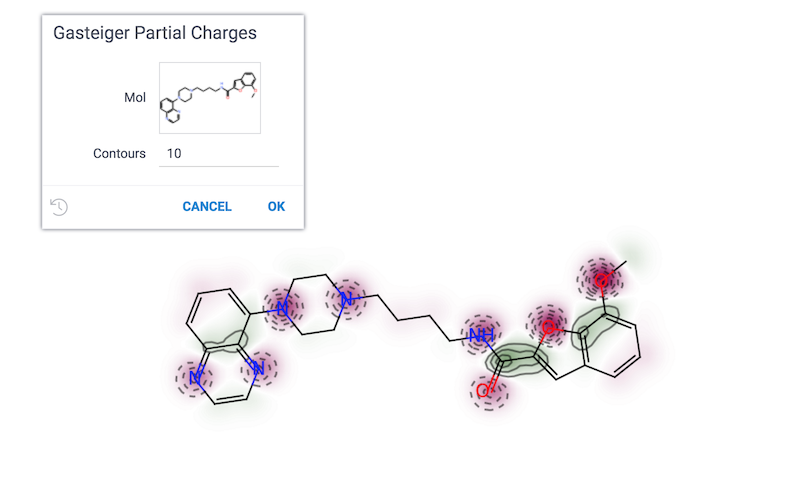

Visualizes atomic charges in a molecule.

See also:

* [Cheminformatics](../chem.md)

References:

* [RDKit Visualization of Descriptors](https://www.rdkit.org/docs/GettingStartedInPython.html#visualization-of-descriptors)
* [Gasteiger-Marsili empirical atomic partial charges](https://www.codessa-pro.com/descriptors/electrostatic/gmc.htm)
