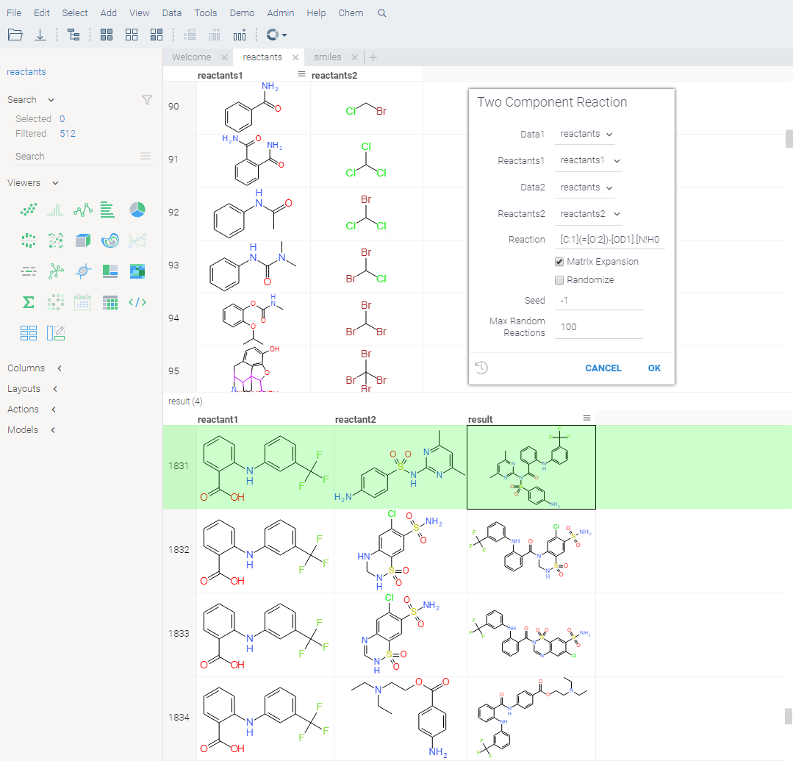

Enumeration of many molecules with template reaction and building blocks are useful for library generation. Reaction
template is in [SMARTS](https://www.daylight.com/dayhtml/doc/theory/theory.smarts.html) format. Reactants can be combined
from two sets, or sequentially depending from **matrixExpansion** flag.

See also:

* [Cheminformatics](../chem.md)

References:

* [RDKit Chemical reaction handling](https://rdkit.org/docs/RDKit_Book.html#chemical-reaction-handling)
* [SMARTS](https://www.daylight.com/dayhtml/doc/theory/theory.smarts.html)
