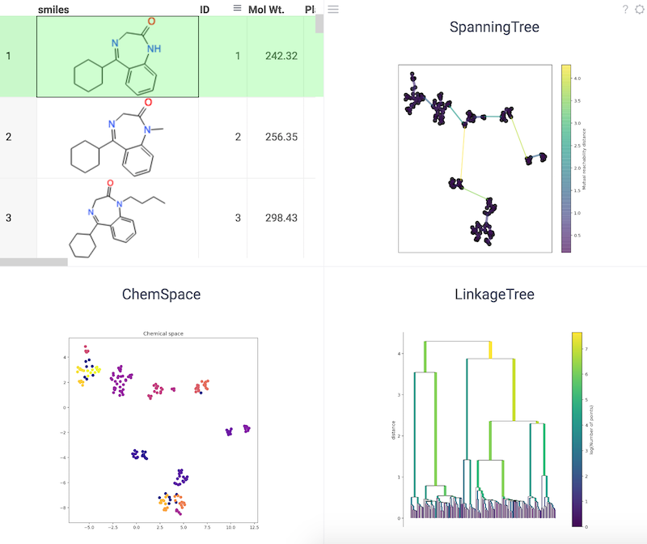

Uniform Manifold Approximation and Projection (UMAP) is a dimensionality reduction technique that can be used for
visualization similarly to [tSNE](https://scikit-learn.org/stable/modules/generated/sklearn.manifold.TSNE.html), but
also for general non-linear dimensionality reduction.

See also:

* [tSNE](tsne.md)
* [Cheminformatics](../chem.md)

References:

* [RDKit](https://www.rdkit.org)
* [UMAP](https://umap-learn.readthedocs.io/en/latest/)
* [tSNE scikit](https://scikit-learn.org/stable/modules/generated/sklearn.manifold.TSNE.html)
