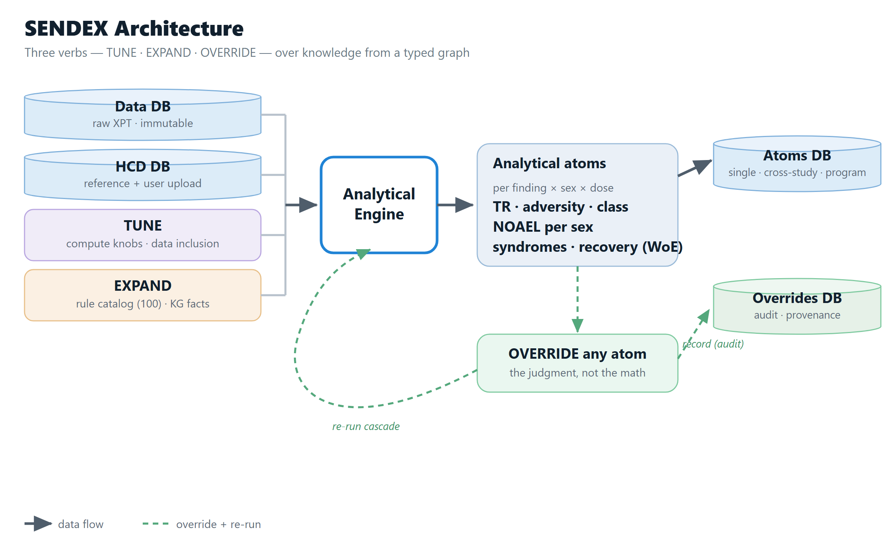

<b>SENDEX is a toxicologist in a box: a transparent, instant, traceable first-draft
verdict on an animal study - and the queryable data that verdict leaves behind.</b>

Every study comes down to the same questions. For a given dose group: is the
biological state adverse, and is it treatment-related? How certain is that call?
Does it translate across species, including animal to human?  

SENDEX does that legwork and shows how it got there (so human experts can check
it, tune it, or overrule it), then encodes each call as queryable data. 

## Analytical landscape

A study in SEND format is structurally rich: every animal, dose, timepoint,
endpoint, and lesion is captured. However, many analytical tools
flatten the analysis to a series of endpoint visualizations and statistics. 

The adversity verdict, however, rarely attaches to a single
endpoint. "ALT is up" can reflect an adaptive change or genuine hepatocellular
injury, depending on the _constellation_ around it. A mass in a
Sprague-Dawley rat can be background pathology, treatment-related,
or a background lesion the test article exacerbated.

The problem is the grain.

## Biology as rules

SENDEX's analytical backbone is a set of biological rules that reason over
treatment-relatedness, progression, causality, temporality, and concordance. The
output isn't "there is liver injury" but which injury — hepatocellular,
cholestatic, or mixed; adaptive or injurious; with severity, dose-response,
onset, and recovery, resolved to the individual animal.

Until the biological rules and reference knowledge become typed
facts, that reasoning lives in the toxicologist's head and survives only as
prose in a PDF - not reproducible, not mineable.

## Every capability traces to a published problem

Two decades of consensus agree on the principles: treatment-relatedness precedes
adversity; a finding non-adverse in isolation can be adverse in constellation;
clinical pathology is rarely adverse on its own; statistical significance alone
is never the predicate; the grain matters as much as the sequence:

* **Containment** (anatomical scope): administration site → organ/system →
  cross-organ / multi-system → organism
* **Aggregation** (statistical pooling): animal → dose group

Some attributions are settled per animal (e.g., procedure-related), others only at the
group level (a background finding). The adversity verdict is conferred animal by
animal, then aggregated up the dose-group axis to resolve treatment-relatedness.

SENDEX isn't a new theory. It operationalizes what the field has already
established by turning the doctrine into a _pipeline_:

* every judgment attaches to its proper grain;
* endpoint findings become members in biological rules, so the constellation is computable;
* trajectory is expressed through temporality, lesion-progression chains, and
  syndrome-member participation (biomarker → tissue → consequence);
* every call is scoped to species/strain × sex, and the reference values it reads are data, not code. 

Weight of evidence becomes computable.

## Architecture

Immutable study data and reference data feed the engine. The engine emits typed
analytical atoms; the atoms persist as queryable facts; overrides write through
and trigger re-computation.

The user exercises judgement through three verbs - **TUNE** (adjust compute knobs and data
inclusion), **EXPAND** (add typed facts and rules), **OVERRIDE** (override the engine's call).

Because every determination is typed and queryable, a corpus run through SENDEX
becomes a structured set of mechanism-grade preclinical calls - the substrate
that downstream models for translatability, ML, and first-in-human risk have
been starved of.  The first-draft verdict is the
immediate payoff; the data it leaves behind is the compounding one - and it's measurable.

## Animal-to-human translatability

From Olson's foundational 150-drug study (2000) to the Liu & Fan 7,565-drug
analysis (2026), the results hold the same shape: concordance is
weak at the organ-category grain (the broad System Organ Class) and only becomes
decision-relevant at the finer, mechanistically specific grain, whether or not
the term names the mechanism. 

Liu & Fan's hepatobiliary numbers make this concrete: the nonspecific umbrella
"hepatotoxicity" translates at a likelihood ratio of 2.2, and "liver disorder"
at 3.2, because each pools immune, cholestatic, and idiosyncratic injury into
one label, whereas the mechanistically resolved "immune-mediated hepatitis"
translates at 321.8. The signal even survives terminology: in Liu & Fan's cross-term
analysis, findings whose labels barely overlap still translate strongly when the
underlying mechanism is shared.

That is the gap SENDEX closes on the supply side. It produces
species- and modality-specific, mechanistically resolved, per-subject,
adaptive-vs-injurious, severity- and dose-aware determinations, generated rather
than retrieved.

## What makes SENDEX different

* **A toxicologist in a box**: A transparent, instant, traceable first-draft verdict on an animal study. 
* **A mineable substrate**: Determinations are typed and queryable. Run a corpus through SENDEX and you get a structured set of mechanism-grade preclinical calls - the substrate downstream models (translatability, ML, first-in-human risk) have been starved of.
* **Knowledge is data, not code**: Every threshold, biological rule, and species exception is a typed knowledge-graph fact, not logic buried in code. Users add their own facts, and the engine reasons over them.
* **Engine proposes, human disposes**: Every engine determination is overridable, with governance and audit baked in.
* **Uncertainty surfaced, not buried**: Small N, fragile estimates, power limits, and "not evaluable" are flagged as such, never hidden behind a number or a verdict.

