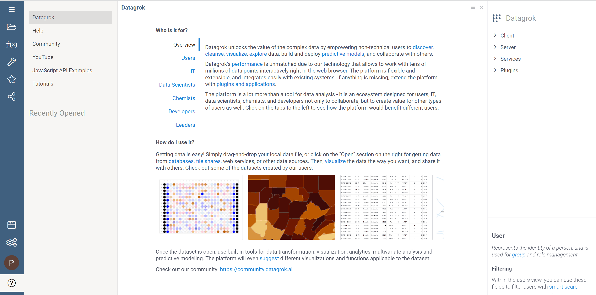

# Export logs to Amazon CloudWatch

Datagrok can send logs to [Amazon CloudWatch](https://aws.amazon.com/cloudwatch/) according to the **Log Export Blocks** you can create.

> Note: You need already configured CloudWatch and created Log group with streams.

To export logs you need to create connection to AWS and configure **Log Export Blocks** in **Settings**.

## To create connection to AWS

  1. Go to **Data** > **Databases**.

  2. Right-click the **AWS** data source and select the context action **Add new connection**.

  3. Fill the form with the region and credentials of the IAM user that has [PutLogEvents](https://docs.aws.amazon.com/AmazonCloudWatchLogs/latest/APIReference/API_PutLogEvents.html) permission.

## To configure **Log Export Blocks**

1. Go to **Settings** > **Logger** > **Export logs to CloudWatch**. Click **Add new export block** link. The **Log Export Block** appears. It consists of several fields where you can specify the level, type of logs, as well parameters by which events will be filtered and sent to the Log group and stream. Moreover, you can configure maximum number of log events in a batch. 
     You can create several Log Export Blocks to export different types of logs to different Log groups or streams. Log sending is done in the order of forms. So it's better to put more specific cases above more generalized ones.

   
2. Fill out **Log Export Block** with the necessary information and choose the appropriate connection to **AWS**.
3. Click **Apply** button. It schedules the job which exports log events every minute. 
   
## To disable log sending

   1. Toggle **Enabled** in the **Log Export Block**. It disables log sending without the need to remove the block.
