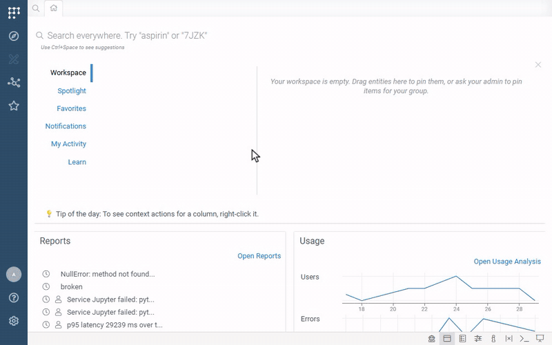

Datagrok can send logs to [Amazon CloudWatch](https://aws.amazon.com/cloudwatch/) through **Log sync**. The same
settings also send logs to Google Cloud Logging or to any OpenTelemetry (OTLP) collector.

Datagrok sends events to each destination as they are posted. Events don't need to be saved to the database first.

Without a connection, Datagrok authenticates with the instance role and creates the log group and stream if they don't
exist. With a connection, create the log group and stream in CloudWatch first.

## To create a connection to AWS

A connection is optional. Without one, Datagrok authenticates with the instance role.

  1. Go to **Browse** > **Databases**.

  2. Right-click the **AWS** data source and select **New connection...**.

  3. Fill the form with the region and credentials of the IAM user that has [PutLogEvents](https://docs.aws.amazon.com/AmazonCloudWatchLogs/latest/APIReference/API_PutLogEvents.html) permission.

## To configure **Log sync**

1. Go to **Settings** > **Logger** and expand **Log sync**.
2. Click **Add new sync block**. A new destination appears.
3. Set **Cloud** to **Amazon CloudWatch**, then fill in **Log Group** and **Stream**.
4. Select the **Levels** to sync. Optionally, narrow the events with **Event type** and **Params**, and set **Batch Size** and **Format**.
5. Optionally, choose a **Connection**.
6. Click **Save and apply**.

You can add several destinations to send different levels to different log groups, streams, or clouds.
For **Google Cloud Logging**, set **Log Name** and a connection. For **OpenTelemetry (OTLP)**, set **Endpoint** and **Auth**.
OpenTelemetry destinations also receive alert and heartbeat records regardless of the selected levels, unless you turn
off **Alerts**. For every setting, see [Export logs](../../../../govern/audit/audit.md#export-logs).

Only posted levels can be synced. **Log settings** on the same page control what is posted. They apply per user or group
and offer the **Standard**, **Verbose**, and **Custom** presets.

:::note

On a platform-managed instance, the **Log sync** section is hidden. The deployment owns the destinations.

:::

## To disable log sending

To pause a destination without deleting it, turn off **Enabled** in its block. To delete it, click **Remove this destination**.
