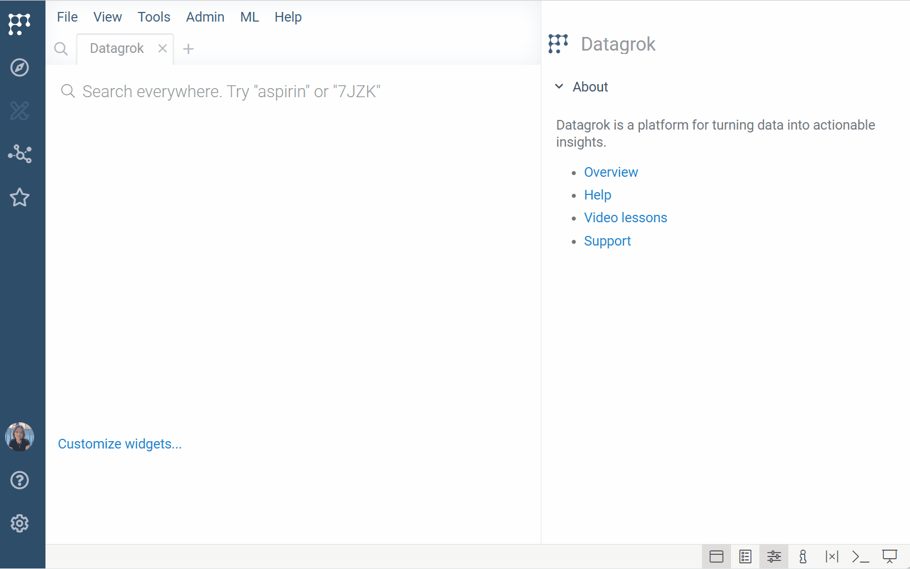
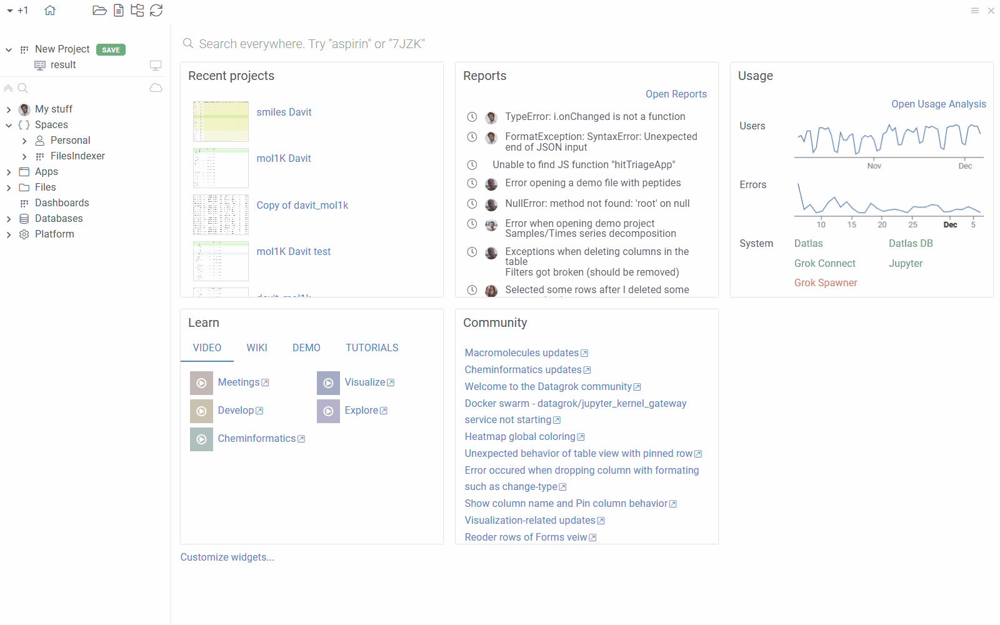

```mdx-code-block
import Tabs from '@theme/Tabs';
import TabItem from '@theme/TabItem';
```

Traditional "walled garden" systems lock users into fixed views and predefined
workflows, creating silos and fragmented decisions. 

Datagrok takes a fundamentally different approach. It provides a fluid,
responsive environment that adapts to how people naturally work with data - what
we call "free-world data exploration". As users interact, Datagrok
surfaces relevant tools, computations, models, and linked records. There's no
need to switch systems, ask for data, or even know the data exists. It's appears
in context exactly when needed.

While most of this behavior works out of the box, power users can customize
and extend the platform to match the specific needs of their users.

## Semantic types

Semantic types define what data represents (e.g.,` molecules`, `coordinates`)
and form the basis for automatic behavior across the platform. When Datagrok
detects a semantic type, it connects the data with
[functions](../../concepts/functions/functions.md) that accept that type as
input. 

For example, when a column contains SMILES strings, Datagrok automatically assigns it
the semantic type `molecule`, renders structures in 2D, enables the **Chem** menu, and
activates tools like sketchers and chemical info panes as users interact with
data. 

Datagrok supports built-in detection for [many common types](../../../govern/catalog/semantic-types.md#automatic-semantic-type-detection). 
You can [write custom functions](../../../compute/scripting/scripting.mdx) 
for the existing ones or 
[define new semantic types](../../../develop/how-to/functions/define-semantic-type-detectors.md) as needed. 

### Text as semantic value

Datagrok can treat plain text (e.g., compound IDs) as semantic values and
dynamically surface related content. For example, registering a pattern like `CHEMBL\d+` allows Datagrok to:
* Detect and highlight matching values across the platform
* Make identifiers clickable and searchable
* Show related data in tooltips, search cards, or [info panes](../../navigation/panels/info-panels.md)

This is especially useful when working with multiple identifier types, such
as those found in GDB exports or compound registries. When a user interacts with a
matching value (by hovering, clicking, or searching for it), your handler can
query the data source and show the result in context. 

This capability is delivered through Datagrok packages. Once the package is
published, patterns work globally for all users who have the
package installed. To implement, you'll need basic familiarity with regular
expressions, JavaScript, and the Datagrok plugin framework. [See documentation](../../../develop/how-to/db/register-identifiers.md).



## Functions 

Scripts and queries are [entities](../../concepts/objects.md) governed by 
[permission framework](../../../govern/access-control/access-control.md#permissions). 
This means you can expose data securely, with full
control over access, provenance, and auditability.

### Function annotations

Function annotations let you control how functions (queries, scripts) interact with the Datagrok's
UI and data context.  
You can define the input (e.g., `molecule`), output presentation (e.g., tooltip, [info pane](../../navigation/panels/info-panels.md)), and link functions to user-friendly search patterns (e.g., "activity for _Shigella_").

This allows Datagrok to:

* Match functions to relevant data
* Provide data-specific tools and information without cluttering the UI
* "Push" data automatically in response to user actions
* Democratize data access through global search

**Examples**:

<Tabs>
  <TabItem value="data-augmentation" label="Data augmentation" default>
    
    By specifying the function's `#input`, `#output`, and `#tags`, 
    you can configure it to run automatically without user input. 
    For example, a script can execute and display results in an 
    [info pane](../../navigation/panels/info-panels.md) 
    when a user clicks a molecule.

    

  </TabItem>
  <TabItem value="search-integration" label="Search integration">

       You can annotate queries with search patterns using `meta.searchPattern`. 
       With this annotation, users can view the results by typing a natural language query 
       like "bioactivity for bacterial targets for _Shigella_" into the search bar". 
       [Learn more](../../concepts/functions/func-params-annotation.md#search-integrated-functions)
       
       

  </TabItem>
</Tabs>

## Custom metadata

Using configurable schemas, you can attach structured, persistent metadata to [entities](../../concepts/objects.md) or custom class of objects (e.g., molecules). Datagrok then automatically shows metadata wherever that entity or object appears.

For example, SAR comments added to a compound in one project are
visible when the same structure appears in a screening dataset or
the Hit Design app. Users can edit metadata
directly in the [Context Panel](../../navigation/panels/panels.md#context-panel), add it as table columns, use in filters,
and so on. <!---TODO: Update once implemented:  Metadata visibility is controlled by user permissions.--->

To implement, no coding is needed. Define the target objects using a matching expression 
(e.g., `semtype=molecule`) and create a schema with parameters. [Learn how](../../../govern/catalog/sticky-meta.md).

<!--TODO: Add a visual--->


