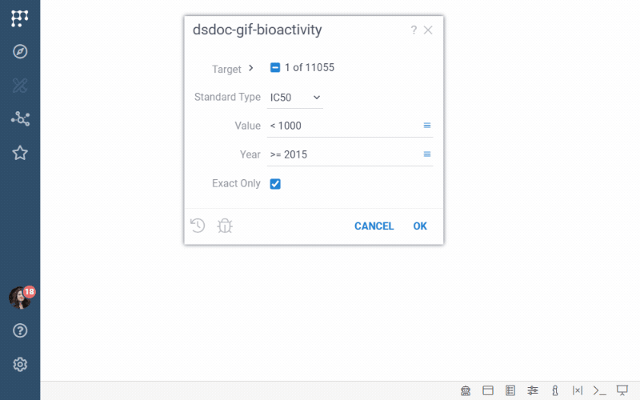
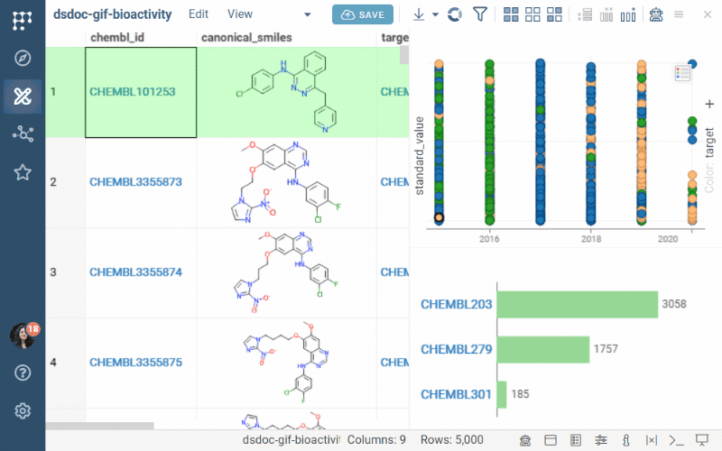
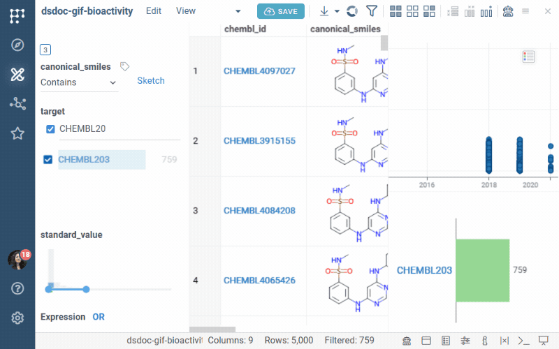

Experimental data has a familiar shape: many measurements per compound, per
assay, per batch, and per date, with units, qualifiers, and replicates.
Getting a useful view of such data is a two-stage task. First, you retrieve
the right slice from the database. Second, you narrow it down interactively
while looking at it. This page walks through both stages and shows how to
keep the result as a dashboard that others can reuse with their own
parameters.

The examples use [ChEMBL](../../../access/public-datasets.md), which is
available as a demo Postgres connection. Measurements live in the
`activities` table, one row per measurement, and everything else is a join
away: `assays` (what was measured), `target_dictionary` (against what),
`molecule_dictionary` and `compound_structures` (the compound), and `docs`
(where it was published). An in-house results database usually has the same
shape with different names.

## Where to filter

You can narrow data in the database (with SQL) or in Datagrok (with
filters), and a good workflow uses both. The SQL determines how much data
crosses the network, and the filters determine which part of the loaded data
is shown.

Filter in SQL when:

* The full table is too large to load. To look at a large table before
  writing a query, use **Get TOP 100** on the table in **Browse**, or add a
  `LIMIT` clause.
* The criteria are stable, such as the target, the assay type, or a date window.
* Recipients should get only their slice of the data.
* The condition needs joins or indexes.

Filter in Datagrok when:

* The loaded data is a few hundred thousand rows or fewer.
* The criteria change every minute as you explore.
* Everyone gets the same slice and narrows it down themselves.
* The condition is visual, such as a range on a histogram, a substructure, or
  a selection on a chart.

A well-built parameterized query handles the first list, and the filter panel
handles the second.

## Retrieving data

### Parameterized query

To create a query, go to **Browse** > **Databases**, right-click the
connection, and select **New Query...** You define the inputs as SQL
comments in the query header. For the full syntax, see
[Parameterized queries](../../../access/databases/databases.md#parameterized-queries).
The following query covers the typical needs of experimental data:

```sql
--name: Bioactivity for targets
--connection: Chembl
--input: list<string> target = ['CHEMBL301'] {choices: Query("SELECT chembl_id FROM target_dictionary WHERE target_type = 'SINGLE PROTEIN' ORDER BY 1")}
--input: string standardType = "IC50" {choices: ['IC50', 'Ki', 'EC50', 'Kd']}
--input: string value = "< 1000" {pattern: double}
--input: string year = ">= 2015" {pattern: int}
--input: bool exactOnly = true
SELECT md.chembl_id,
       cs.canonical_smiles,
       td.chembl_id AS target,
       a.description AS assay,
       act.standard_type,
       act.standard_relation,
       act.standard_value,
       act.standard_units,
       d.year
FROM activities act
  JOIN assays a              ON a.assay_id = act.assay_id
  JOIN target_dictionary td  ON td.tid = a.tid
  JOIN molecule_dictionary md ON md.molregno = act.molregno
  JOIN compound_structures cs ON cs.molregno = md.molregno
  JOIN docs d                ON d.doc_id = act.doc_id
WHERE td.chembl_id = ANY(@target)
  AND act.standard_type = @standardType
  AND act.standard_units = 'nM'
  AND @value(act.standard_value)
  AND @year(d.year)
  AND (act.standard_relation = '=' OR NOT @exactOnly)
```

Each input is chosen for what it gives the user in the parameter dialog:

* `target` is a `list<string>` with choices taken from a query. The user
  gets a multi-select list of real target IDs, the list never goes out of
  date, and the SQL uses `= ANY(@target)` to match any of them.
* `standardType` has a fixed list of choices, which prevents typos in a
  controlled vocabulary.
* `value` uses `{pattern: double}`, so one free-text input accepts thresholds
  and ranges such as `< 1000`, `10-500`, or `>= 50`. See
  [filter patterns](../../concepts/functions/func-params-annotation.md#filter-patterns).
* `year` uses `{pattern: int}` in the same way, for values such as `>= 2015`
  or `2018-2022`. For date columns, use `{pattern: datetime}` and values such
  as `this year` or `after 2024-01-01`.
* `exactOnly` is a boolean that turns a condition on and off. The
  `OR NOT @flag` form keeps the SQL simple.

To make a parameter optional, add `{nullable: true}` and wrap its condition
in `(@param IS NULL OR column = @param)`.

:::tip

Choices can depend on another parameter. Here, the target list narrows to
the selected organism:

```sql
--input: string organism = "Homo sapiens" {choices: Query("SELECT DISTINCT organism FROM target_dictionary WHERE organism IS NOT NULL ORDER BY 1")}
--input: string target = "CHEMBL301" {choices: Query("SELECT chembl_id FROM target_dictionary WHERE organism = @organism ORDER BY 1")}
```

:::



Press F5 to preview the result and click **Save**. To make the query
findable from the platform search, add a `--meta.searchPattern` annotation. See
[Search-integrated functions](../../concepts/functions/func-params-annotation.md).

:::note developers

To run a parameterized query from a script or a plugin, see this
[code snippet](https://public.datagrok.ai/js/samples/data-access/parameterized-query).

:::

### Joins

The query above joins six tables, which is normal for experimental data: the
measurement table holds identifiers, and the names people search by live in
lookup tables. A few rules keep such joins manageable:

* **Join in SQL when the tables are in the same database.** The database uses
  its indexes and foreign keys, and only the result crosses the network.
  Joining in Datagrok after loading two full tables is slower and requires
  both tables to be loaded. Use [Join tables](../../../transform/join-tables.md)
  in Datagrok when the sides come from different sources, such as a query
  and a spreadsheet.
* **Start from the measurement table and join outward.** In ChEMBL,
  `activities` is the fact table and everything else is a lookup. Put the
  selective condition on the fact table so that the database filters early.
* **Return identifiers along with names.** Keep `chembl_id` and
  `molregno`-style identifiers in the result even when you show names.
  Identifiers are what [links](../../../transform/link-tables.md), the
  [Database Explorer](../../../access/databases/databases.md#database-explorer),
  and [data enrichment](../../../access/databases/databases.md#data-enrichment)
  match on.
* **Let the Visual Query Editor draft the join.** It reads the foreign keys
  and builds the join chain for you. Switch to SQL when you need
  `INTERSECT`, window functions, or database-specific extensions.

Two more complex queries, both shipped with the
[Chembl plugin](https://github.com/datagrok-ai/public/tree/master/packages/Chembl/queries)
and runnable on the demo connection, show what the same building blocks can
do. In **Browse**, they are listed under the Chembl connection by their
friendly names, **Browse | Compounds Selective For One Target Over Another**
and **Search | By Substructure, Country And Action Type**.

<details>
<summary>Compounds selective for one target over another</summary>

This query finds compounds that are potent (IC50 below 50 nM) against one
target and weak (above 200 nM) against another. The two halves are the same
five-table join with different conditions, combined with `INTERSECT`.

```sql
--name: _compounds which are selective to one target over a second target
--friendlyName: Browse | Compounds Selective For One Target Over Another
--connection: Chembl
--input: string selectiveFor = "CHEMBL301" [ChEMBL target the compound should be potent against]
--input: string over = "CHEMBL4036" [ChEMBL target the compound should be inactive against]
SELECT md.chembl_id, cs.canonical_smiles
FROM target_dictionary td
  JOIN assays a ON td.tid = a.tid
  JOIN activities act ON a.assay_id = act.assay_id
  JOIN molecule_dictionary md ON md.molregno = act.molregno
  JOIN compound_structures cs ON md.molregno = cs.molregno
WHERE act.standard_relation = '='
  AND act.standard_type = 'IC50'
  AND act.standard_units = 'nM'
  AND act.standard_value < 50
  AND td.chembl_id = @selectiveFor
INTERSECT
SELECT md.chembl_id, cs.canonical_smiles
FROM target_dictionary td
  JOIN assays a ON td.tid = a.tid
  JOIN activities act ON a.assay_id = act.assay_id
  JOIN molecule_dictionary md ON md.molregno = act.molregno
  JOIN compound_structures cs ON md.molregno = cs.molregno
WHERE act.standard_relation = '='
  AND act.standard_type = 'IC50'
  AND act.standard_units = 'nM'
  AND act.standard_value > 200
  AND td.chembl_id = @over
```

</details>

<details>
<summary>By similarity, mechanism of action, and research company</summary>

This query combines a similarity search on the RDKit cartridge (Morgan
fingerprints, Tanimoto threshold) with two levels of dependent choices (the
action type narrows the mechanism list, and the country narrows the company
list) and a multi-select company input. The `substructure` input is the
query molecule. The first statement sets the similarity threshold for the
session, so the query runs in batch mode.

```sql
--name: QueryBySubstructure
--friendlyName: Search | By Substructure, Country And Action Type
--connection: Chembl
--meta.batchMode: true
--input: string substructure = 'c1ccccc1' {semType: Molecule}
--input: string threshold = '0.1'
--input: string actionType = 'BLOCKER' {choices: Query("SELECT DISTINCT action_type from drug_mechanism")}
--input: string mechanismOfAction = 'Amiloride-sensitive sodium channel, ENaC blocker' {choices: Query("SELECT DISTINCT mechanism_of_action from drug_mechanism where action_type = @actionType")}
--input: string country = 'UK' {choices: Query("SELECT DISTINCT country from research_companies")}
--input: list<string> company = ['GlaxoSmithKline'] {choices: Query("SELECT DISTINCT company from research_companies where country = @country")}
SELECT set_config('rdkit.tanimoto_threshold', @threshold, true);
--batch
SELECT s.*
FROM compound_structures s
  INNER JOIN drug_mechanism d ON s.molregno = d.molregno
  INNER JOIN molecule_synonyms m ON s.molregno = m.molregno
  INNER JOIN research_companies r ON m.res_stem_id = r.res_stem_id
WHERE s.molregno IN (SELECT molregno FROM get_mfp2_neighbors(@substructure))
  AND d.action_type = @actionType
  AND d.mechanism_of_action = @mechanismOfAction
  AND r.country = @country
  AND r.company IN (SELECT unnest(@company))
```

</details>

### Visual query

If you prefer not to write SQL, right-click a table in **Browse** and select
**New Visual Query...** The **Where** field accepts the same patterns, and
the checkbox before a condition turns it into a query parameter. The
[Visual Query Editor](../../../access/databases/databases.md#visual-query-editor)
also does joins, grouping, and pivoting on the database side.

### Running the query

To run the query, double-click it, fill in the parameter dialog, and click
**OK**. The result opens in a **Table View**. The parameters remain available
in the **Source** pane on the **Toolbox**, so you can change them and refresh
the data without going back to the query.

For a slow query that many people run with the same parameters, ask the query
author to enable result caching with an invalidation schedule. See
[Freshness and caching](../../../access/databases/databases.md#freshness-and-caching).

## Reshaping the result

The query returns data in long format, with one row per measurement. That is
the right shape for filtering and the wrong shape for comparing compounds
across assays. Reshape the data after retrieval and let Datagrok record the
steps so that they replay on every refresh. See
[Query transformations](../../../transform/query-transformations.md).

* **To get one row per compound and assay with replicates averaged**, use
  [Aggregate rows](../../../transform/aggregate-rows.md) with `chembl_id` and
  `assay` as rows and `avg`, `std`, and `count` of `standard_value` as
  measures. Keep `count` so that you can filter out single-replicate results
  later.
* **To get compounds as rows and targets as columns**, use
  [Aggregate rows](../../../transform/aggregate-rows.md) with `target` in the
  **Columns** section. This is a pivot, and new targets become new columns
  on refresh.
* **To go back from wide to long format**, use [Unpivot](../../../transform/unpivot.md).
  This is needed when a wide export has to be filtered per measurement.
* **To convert units**, use [Add new column](../../../transform/add-new-column.md)
  with a formula such as `${standard_value} / 1000`. When the rules are
  stable, prefer to normalize units in SQL.
* **To flag qualified values**, add a column with the formula
  `${standard_relation} != "="`. This keeps censored values visible instead
  of dropping them.

Where the logic lives matters for dashboards. Aggregation and pivoting are
fine as recorded transformation steps. Derived metrics for charts are safer
as calculated columns in the layout. See
[Where to put the logic](../../../transform/query-transformations.md#where-to-put-the-logic).

## Filtering

With the slice loaded, you narrow it down while looking at it. All viewers in
the Table View share the filter, so a change in one place updates every
chart. See [Select and filter](../../../visualize/table-view-1.md#select-and-filter).

### Filter panel

To open the [filter panel](../../../visualize/viewers/filters.md), click the
**Funnel** icon on the **Toolbox** or on the view's ribbon. Datagrok picks a
filter type for each column: categorical for `target` and `standard_type`
(hover the filter and click the magnifier in its header to search among
hundreds of values), a range with a histogram for `standard_value`, a
structure filter for the molecule column. For conditions that span columns,
add an [expression filter](../../../visualize/viewers/filters.md#expression-filter)
from the panel's context menu (**Add Filter** > **Expression**). It takes
column, operation, and value rows joined by AND or OR, and in its free-text
mode you can type `count >= 3 and std < 0.5`. You can also drag a column
header from the grid into the panel to add a filter for that column. For all
filter types and their options, see [Filters](../../../visualize/viewers/filters.md).



### Search

Press Ctrl+F, or expand the **Search** pane on the **Toolbox**, and type a
pattern such as `standard_value < 100` or `target contains kinase`. Use the
hamburger menu on the search box to choose whether the matches are filtered
or selected. See [search patterns](../../../visualize/table-view-1.md#search).

### Viewers as filters

Any chart can act as a filter. Click the **Hamburger** icon on a bar chart or
a pie chart and set **On click** to **Filter**. Clicking a bar then filters
the table to that category. A lasso on a scatter plot selects rows. To work
with just those rows, extract them with **Select** > **Extract Selected
Rows**.

### Filtering or selecting

Filtering hides rows, whereas selection highlights them and keeps everything
visible. Use filters to narrow the data down. Use selection to compare a
subset against the rest, or to send rows somewhere: **Select** > **Extract
Selected Rows** creates a new table from the selection, and viewers with
**Row Source** set to **Selected** chart only the selected rows.

## Keeping the result

* **Save the filter set.** In the filter panel's context menu, select **Save
  or Apply** > **Save...** and name the preset. You can apply it later from
  the same menu, on this table or on the next refresh. Presets are stored in
  your browser, not on the server, so they don't travel with the dashboard,
  to colleagues, or to another machine. To share a filtered state, save the
  dashboard with the filters applied.
* **Save the dashboard.** Click **SAVE** and turn **Data sync** on, so that
  the query re-runs on every open and the parameters stay editable in the
  **Source** pane. Recipients can then change the target, the threshold, and
  the year without touching the query. See [Dashboards](../../concepts/project/dashboard.md).
* **Check the connection is shared.** The query is saved as part of the
  dashboard, but the database connection is not. Recipients need access to
  it, otherwise the dashboard never finishes loading for them. See
  [What recipients need](../../concepts/project/dashboard.md#what-recipients-need).
* **Share a URL instead.** The URL of a query result includes its parameters
  and re-runs the query when opened. Use it when no layout is needed. See
  [Sharing query results](../../../access/databases/databases.md#sharing-query-results).



## Recipes

* **All IC50 values below 1 µM for three targets, published since 2020.**
  Run the query with the `target` list, `standardType` set to IC50, `value`
  set to `< 1000`, and `year` set to `>= 2020`.
* **Only compounds with at least three replicates.** Aggregate rows with
  `count`, and then add the expression filter `count >= 3`.
* **Compounds active in assay A but inactive in assay B.** Pivot by assay,
  and then add the expression filter `A < 100 and B > 10000`.
* **Everything measured on a batch that a colleague mentioned** (in an
  in-house results table with a `batch_id` column). In the **Search** pane,
  enter `batch_id = XYZ-42`, and then select **Select** > **Extract Selected
  Rows**.
* **The same view for a different target every Monday.** Save the result as
  a dashboard with Data sync on, and change `target` in the **Source** pane.
* **Hand the slice to a colleague without a dashboard.** Copy the URL of the
  query result.

## Troubleshooting

<details>
<summary>The query takes too long or times out</summary>

Move the filter into SQL. A parameterized `WHERE` clause on an indexed column
and a `LIMIT` in the query reduce the data before it leaves the database. Use
the **Debug** tab in the Query Editor to see where the time goes.

</details>

<details>
<summary>A pattern input returns everything</summary>

An empty pattern means no condition. Check that the input is defined as
`string` with a `pattern` option, and that the query references it as
`@name(column)` rather than `= @name`.

</details>

<details>
<summary>The saved filter no longer applies after a refresh</summary>

A column it referenced was renamed or removed in the query. Saved filters
bind to columns by name.

</details>

See also:

* [Databases](../../../access/databases/databases.md)
* [Filters](../../../visualize/viewers/filters.md)
* [Query transformations](../../../transform/query-transformations.md)
* [Link tables](../../../transform/link-tables.md)
* [Dashboards](../../concepts/project/dashboard.md)
* [Work with connected datasets](connected-datasets.md)
* [Multi-table analysis and drill-down](multi-table-analysis.md)
* [Dashboard lifecycle](dashboard-lifecycle.md)
