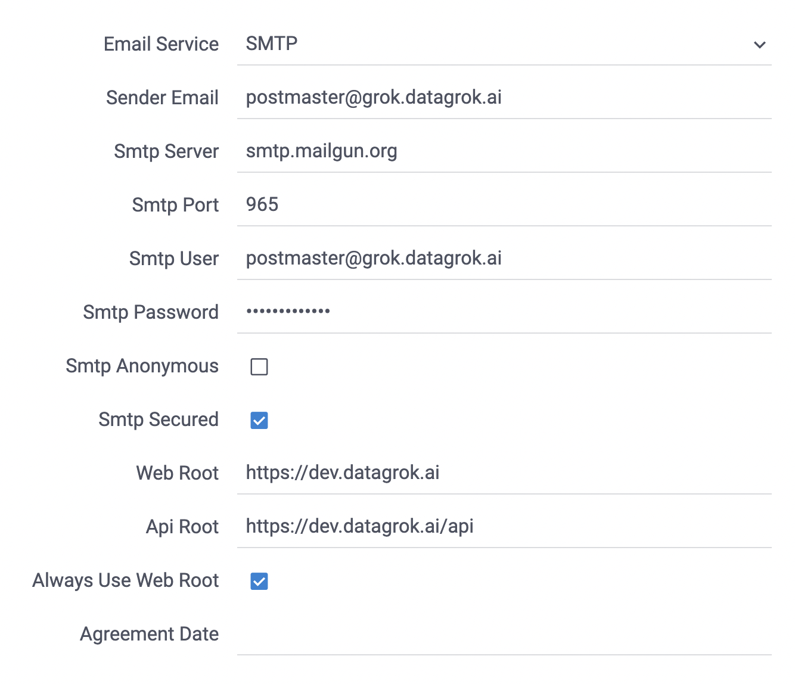

Datagrok supports [Mailgun email delivery platform](https://www.mailgun.com/) and different SMTP servers,
including [Amazon SES](https://aws.amazon.com/ses/). Configure a local SMTP server or use a cloud solution based on your
needs.

To configure email delivery for Datagrok:

1. Go to the Datagrok Settings section 'Admin'  
2. Configure Sender Email from which users will get emails  
3. Set Web Root, which is the root URL of the Datagrok instance  
4. Set Api Root, which is the same as the root URL with the `/api` suffix  
5. Email Service:  
    - Set Mailgun if you use their integration
        - Configure Mailgun Domain and Mailgun key got from the Mailgun interface
    - In all other cases, set SMTP
        - Configure SMTP server address/DNS name. If you want to use the host SMTP server with dockerized Datagrok
           set `host.docker.internal`
        - Set the SMTP server port. In most cases is 25
        - Set the SMTP user and password
        - Use SMTP anonymous mode if you want to use an anonymous SMTP server
        - Check SMTP is secured to use [SMTPS](https://en.wikipedia.org/wiki/SMTPS)

