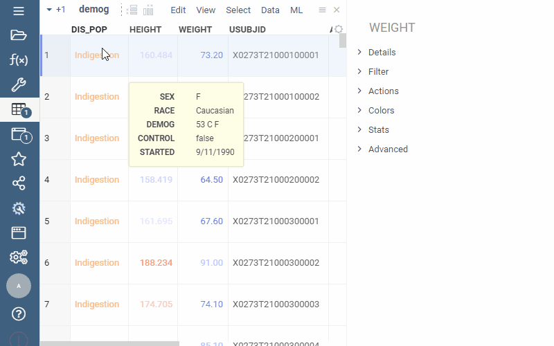
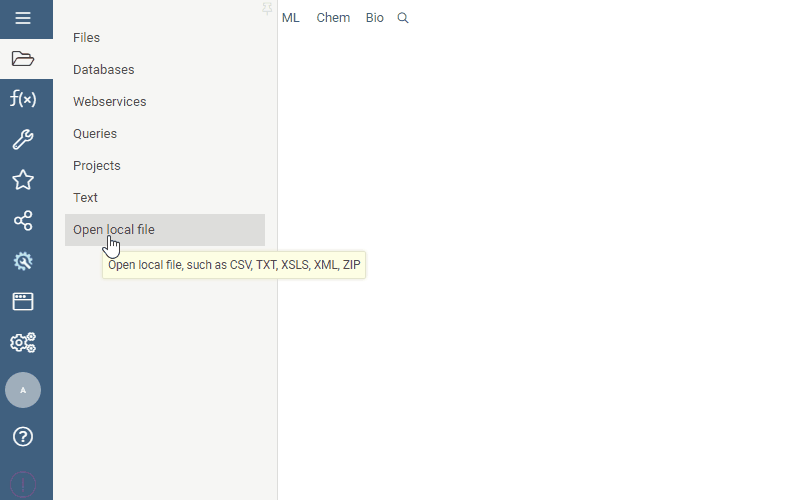
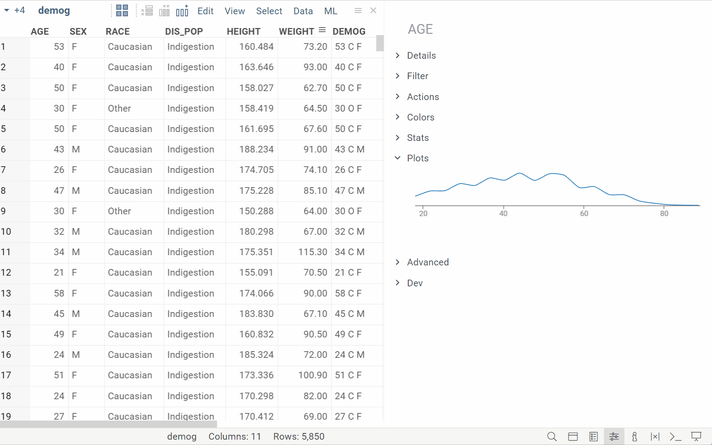
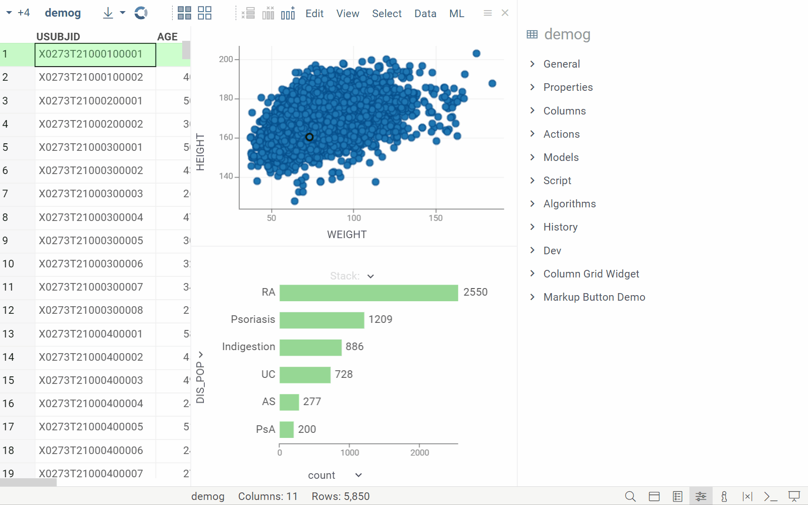

## Universal caching 

We now support client and server-side [caching for function results](../../../develop/how-to/function_results_cache.md). This feature is
particularly useful for functions that produce consistent outputs, like queries
and scripts. The client-side cache, limited to 100 MB or 100,000 records, speeds
up data access and improves network efficiency. The unrestricted server-side
cache improves response times and overall server performance. Together, these
caching mechanisms provide a smoother and more responsive platform experience.

## Grid improvements

### Pinned rows

|

|  |
|----------------- | -----------------------------------|
|Pin rows and save pinned view to the layout or project  [Learn more](../../../visualize/viewers/grid.md#pin-rows-and-columns) |  |

<!--
<table>
  <thead>
    <tr>
      <th width="30%"></th>
      <th width="70%"></th>
    </tr>
  </thead>
  <tbody>
    <tr>
      <td>Pin rows and save pinned view to the layout or project. <a href="https://datagrok.ai/help/visualize/viewers/grid#pinned-rows">Learn more</a></td>
      <td><image src="img/pinned-rows.gif" alt="image"></image></td>
    </tr>
  </tbody>
</table>
--->

### Easier column selection

|  |        

     |
|-------------------------|-------------------|
|Hold <kbd>Shift</kbd> and drag the mouse over the column headers||

### Better column navigation

|                         | 

 |
|-------------------------------------|-------------------|
|In the **Column Manager**: <li>Hover over a column to automatically scroll to it and see its details</li><li>Filter columns based on data or semantic type</li>||

## New viz options

### Summary columns

|                         |  

 |
|-------------------------|-------------------|
|<li>[Smart forms](https://community.datagrok.ai/t/powergrid-smartform/774/1) show values from multiple columns in one cell </li><li>Adaptive rendering to fit the cell size</li><li>Values inherit color-coding from source columns</li><li>Cell renderers for different data and semantic types</li> (From [PowerGrid package](https://github.com/datagrok-ai/public/blob/master/packages/PowerGrid/README.md))||

### Linked tables in cells

|                         |

|
|-------------------------|-------------------|
|Link tables and show data from one linked table in another| |

<!--
### Visualize data behind grouped rows

|                         |                   |
|-------------------------|-------------------|
|**Viewers**: [Pivot] now supports the visualization of raw data behind grouped rows| |

-->

### Split line chart by category

| 

 |             |
|-------------------------|-------------------|
|Split line charts by multiple categorical columns| |

## New info panes

### Automatic plots for selected columns

|                         |

|
|-------------------------|-------------------|
|Select columns and get automatic visualization of their content (**Context Panel** > **Plots**)  [Learn more](https://community.datagrok.ai/t/ux-updates/544/5?u=oahadzhanian.datagrok.ai)||
 
### Selected rows as a spreadsheet

|                         | 

  |
|-------------------------|-------------------|
|Select rows and view their details in a spreadsheet (**Context Panel** > **Content**)||

## Developers

### Auto-fill function parameters

|                         | 

  |
|-------------------------|-------------------|
|Auto populate function input parameters based on a chosen key, such as selecting a car model to instantly fill in details like its mileage and engine size  [Learn more](https://datagrok.ai/help/datagrok/concepts/functions/func-params-annotation#lookup-tables)| |

## Enterprise

* New installation wizard for platform configuration during deployment
* Authorization with [Okta](https://www.okta.com/)
* Amazon CloudWatch log export improvements

## Details

* [2023-11-13 1.17.3](../release-history.md#2023-11-13-1173)
* [2023-11-03 1.17.2](../release-history.md#2023-11-03-1172)
* [2023-11-02 1.17.1](../release-history.md#2023-11-02-1171)
* [2023-10-31 1.17.0](../release-history.md#2023-10-31-1170)
