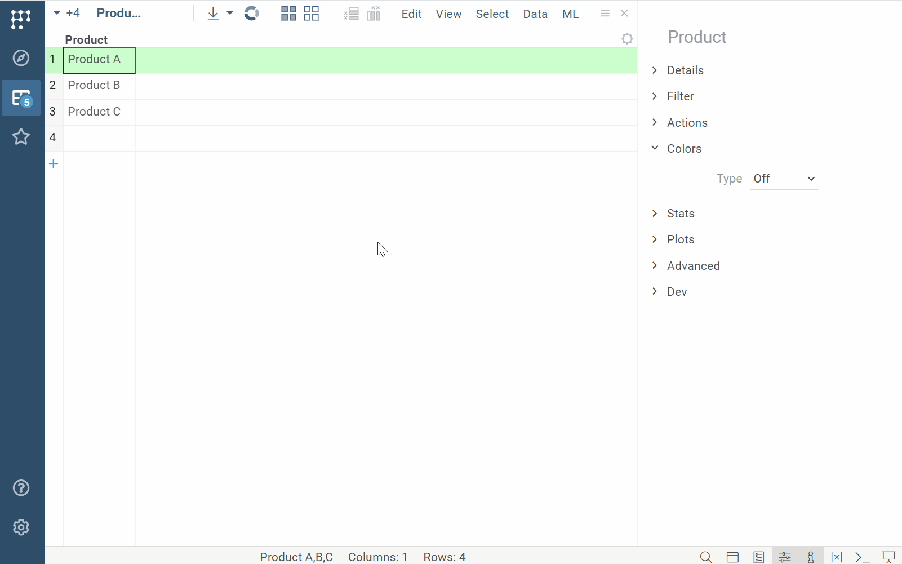

## Easier platform navigation

|

| 

 |
|----------------- | -----------------------------------|
|Introducing **Everything Browser**:  Navigate the tree to access, preview, and manage anything in Datagrok, all from one convenient location.   <!--[Learn more](../../../datagrok/navigation/views/browse.md)--> |  |

## Custom metadata

|

|  |
|----------------- | -----------------------------------|
|Add custom metadata to anything - molecules, experiments, or users   [Learn more](../../../govern/catalog/sticky-meta.md) |   |

## New viz options

### Cell renderers

|

|  |
|----------------- | -----------------------------------|
|New cell renderers:  <li>Dropdown</li><li>MultipleChoice</li><li>Tags</li>  <!--[Learn more](../../../visualize/viewers/grid.md#cell-renderers)-->|  |

### Trellis plot

|

|  |
|----------------- | -----------------------------------|
|[Trellis plot](../../../visualize/viewers/trellis-plot.md) now supports sparklines | |

<!-- //TODO after patch

## New text filter

## Ability to clone projects

|

|  |
|----------------- | -----------------------------------|
|You can now clone projects:  <li>With data sync</li><li>...</li> |[IMG] |

-->

## Developers

* Computation queue
* Harmonized inputs and properties
* Major scripting performance improvements
* CVM: CUDA support
* Push notifications
* Refactor package update mechanism
* JS API for viewer events

## Details

* [2024-03-14 1.18.1](../release-history.md#2024-03-14-1181)
* [2024-03-08 1.18.0](../release-history.md#2024-03-08-1180)
