See details: [issues](release-history.md), [plugin changelogs](plugins/plugins.mdx), [JS API compatibility](compatibility.md)

## 1.22 || 2024-Nov

### Data access and management

|

| 

 |
|----------------- | -----------------------------------|
|**Custom identifier registration**: Register custom identifiers (e.g., compound IDs) to search, link, and analyze entity data across the platform  [Video demo](https://www.youtube.com/watch?v=4_NS3q7uvjs&t=2932s) [Developers: Learn more](https://datagrok.ai/help/develop/how-to/register-identifiers)|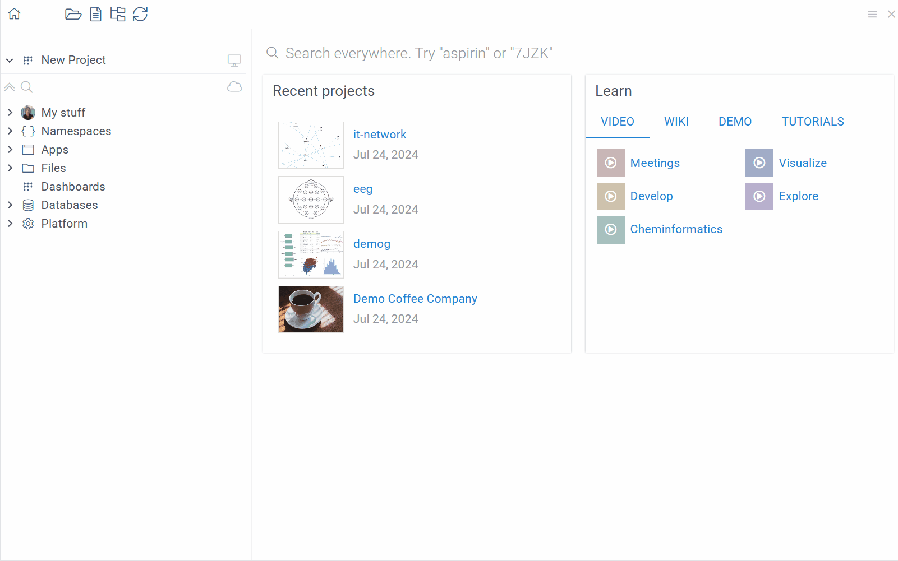|
|**Query annotation**: Annotate queries with search patterns to display query results when users search with matching terms ||
|**Plugin databases**|You can now ship a Postgres database (such as chemical registration system) with your plugin|

### Visualization and analysis

#### Scatterplot

|

| 

 |
|----------------- | -----------------------------------|
|New data series connection lines let you track datapoint relationship over time  [Learn more](../../visualize/viewers/scatter-plot.md#connecting-lines) | |
<!---|Set color coding using expressions| [img] |--->

### Platform performance

* **[Pyodide](https://pyodide.org/en/stable/) integration**: you can now run Python functions, including data transformation steps, directly in the browser
* **Improved automated data cleanup**: keeps the server lean by deleting old data and logs (could be configured)  

<!----

### Developer updates

#### JS API changes

-->

## 1.21 || 2024-Sep

:::warning

This version requires a database migration that cannot be rolled back. Once you upgrade to version 1.21.0, you cannot downgrade. If you need assistance, contact Datagrok Support.

:::

### Data transformation

We improved the calculated column feature (requires a [PowerPack](https://github.com/datagrok-ai/public/tree/master/packages/PowerPack) package):
* **Usability**: Drag-and-drop, search, and function suggestions in **Add New Column** dialog
* **Formula assistance**: Real-time validation, syntax highlighting, autocompletion hints
* **Extended functions**: Added package-specific function support

[Video walkthrough](https://www.youtube.com/watch?v=4_NS3q7uvjs&t=1655s).

### ML & modeling

We continue to improve [ML capabilities](../../learn/learn.md) within the platform. We added:

* New interactive model training dashboard
  * Binary classification support with prediction threshold control
  * AUC-ROC visualization
  * Model comparison tools
  * Automatic model selection
* New algorithms ([EDA package](link)):
  * Softmax classifier 
  * XGBoost tools
  * Partial least squares regression

### Other

* File caching is now enabled by default. It works automatically without the need for configuration.

<!--

### Developer updates

#### JS API changes

---->

## 1.20 || 2024-Jul 

### New tools and apps

|Tool / App

 | Purpose| Requirements 

|Learn more

|
|-----------|-------------|---------------|--------|
| Dimensionality reduction using WebGPU | Run dimensionality reduction on 100K molecules in less than 10 seconds | [EDA package](https://github.com/datagrok-ai/public/tree/master/packages/EDA) | [Video walkthrough](https://www.youtube.com/watch?v=RS163zKe7s8&t=2648s)  [Wiki page](../../explore/dim-reduction.md)|
| Diff Studio | App that turns differential equations into interactive visual models |[Diff Studio package](https://github.com/datagrok-ai/public/tree/master/packages/DiffStudio) |[Launch app](https://public.datagrok.ai/browse/apps/DiffStudio/Templates/basic?params:Initial=0.01&Final=15&Step=0.01&Y=0) [Wiki page](https://github.com/datagrok-ai/public/blob/master/packages/DiffStudio/README.md)|

###  ML & modeling

We continue to improve [ML capabilities](../../learn/learn.md) within the platform:

Improved in-platform model training:
* Automatic input substitution for models
* Interactive hyperparameter tuning
* New interactive visualization widgets for model performance evaluation

[MLflow](https://mlflow.org/) integration ([learn more](../../learn/mlflow.md)):
* Import and apply MLflow predictive models directly to Datagrok datasets
* Streamlined model management:
   * Automatic MLflow model fetching
   * Input annotation via MLflow tags
* MLflow models inference support

### Platform performance

We've introduced caching for [file shares](../../access/files/files.md) (including S3, Azure, and local storage):
* Faster file retrieval and display in [Browse](../../datagrok/navigation/views/browse.md)
* Entirely browser-based cache, eliminating server requests
* Configurable caching for individual files and file shares
* Automatic cache invalidation when files are modified within the platform

[Learn more](../../develop/how-to/function_results_cache.md).

## 1.19 || 2024-Jun

### Visualization and analysis

|

|  |
|----------------- | -----------------------------------|
|[Organize and filter hierarchical data](../../visualize/viewers/filters.md#expression-filter): <li>Group and navigate categories using a tree</li><li>Toggle selections with checkboxes or shortcuts</li><li>Customize hierarchy by rearranging, adding, or removing columns</li> |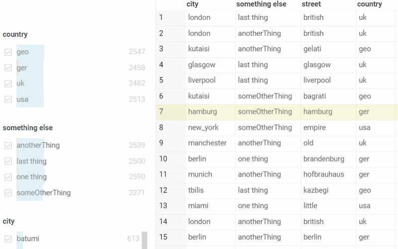 |
|[Create custom filters using expressions](../../visualize/viewers/filters.md#expression-filter): <li>Use column-specific operations like `>`, `contains`, or [regex](https://en.wikipedia.org/wiki/Regular_expression)</li><li>Combine multiple conditions with AND/OR logic</li>|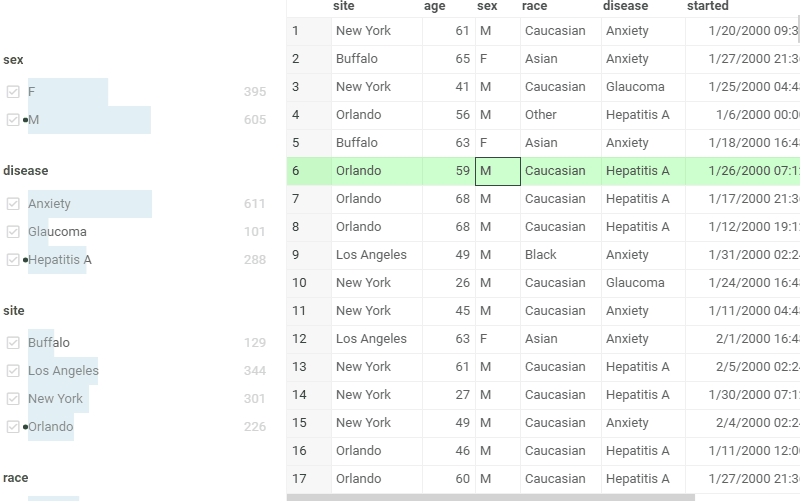 |
|Highlight text matches in cells with [free-text mode](../../visualize/viewers/filters.md#free-text-filter-mode) | |

<!-----

## Grid improvements

|

|  |
|----------------- | -----------------------------------|
|Customize cell styles:<li>content and header</li><li>color and font</li><li>alignment</li> ...and more! | |

TODO: I think the realization is buggy

----->

### Other

* Added new connectors: [Azure Blob](../../access/files/shares/azure.md), [SharePoint](../../access/files/shares/sharepoint.md)
* Enhanced CSV export options for dataframes and views:
  * Preserve row and column order when exporting
  * Export molecules as SMILES strings
  * Selectively export visible columns only
  * Configure column qualifiers for improved data formatting

### Developer updates

You can now integrate with Datagrok using Datagrok's [REST API](../../develop/packages/rest-api.md):

* Supports operations on files, tables, dashboards, and functions
* Allows for programmatic data management, dashboard creation, and function calls
* [Python client library](https://github.com/datagrok-ai/public/tree/master/python-api) available for simplified API interaction

## 1.18 || 2024-Mar

### New tools and apps

|Tool / App

 | Purpose| Requirements 

|Learn more

|
|-----------|-------------|---------------|--------|
| Matched Molecular Pairs | Tool for analyzing how structural changes affect molecular properties and activity | [Chem package](https://github.com/datagrok-ai/public/tree/master/packages/Chem) | [Interactive demo](https://public.datagrok.ai/browse/apps/Tutorials/Demo/Cheminformatics/Matched-Molecular-Pairs)  [Wiki page](../../datagrok/solutions/domains/chem/chem.md#matched-molecular-pairs)|
| Docking| Tool for screening ligand libraries against AutoDock-prepared targets | [Docking package](https://github.com/datagrok-ai/public/tree/master/packages/Docking)|[Interactive demo](https://public.datagrok.ai/browse/apps/Tutorials/Demo/Bioinformatics/Docking) [GitHub](https://github.com/datagrok-ai/public/tree/master/packages/Docking) <!--[Wiki page](link)-->|
| Hit Design|App for collaborative hit design | [HitTriage package](https://github.com/datagrok-ai/public/tree/master/packages/HitTriage) |[Launch app](https://public.datagrok.ai/apps/HitTriage/HitDesign) [GitHub](https://github.com/datagrok-ai/public/blob/master/packages/HitTriage/README_HD.md) <!--[Wiki page](link)--->|
| Hit Triage |App for collaborative hit assessment and prioritization |[HitTriage package](https://github.com/datagrok-ai/public/tree/master/packages/HitTriage) |[Launch app](https://public.datagrok.ai/apps/HitTriage/HitTriage) [GitHub](https://github.com/datagrok-ai/public/blob/master/packages/HitTriage/README_HT.md) <!--TODO[Wiki page](link)--->|

### Navigation and usability

|

| 

 |
|----------------- | -----------------------------------|
|New **Browse** view:  Navigate the tree to access, preview, and manage anything in Datagrok, all from one convenient location.   [Learn more](../../datagrok/navigation/views/browse.md) |  |

### Data access and management

|

|  |
|----------------- | -----------------------------------|
|Add custom metadata to anything - molecules, experiments, or users   [Learn more](../../govern/catalog/sticky-meta.md) | 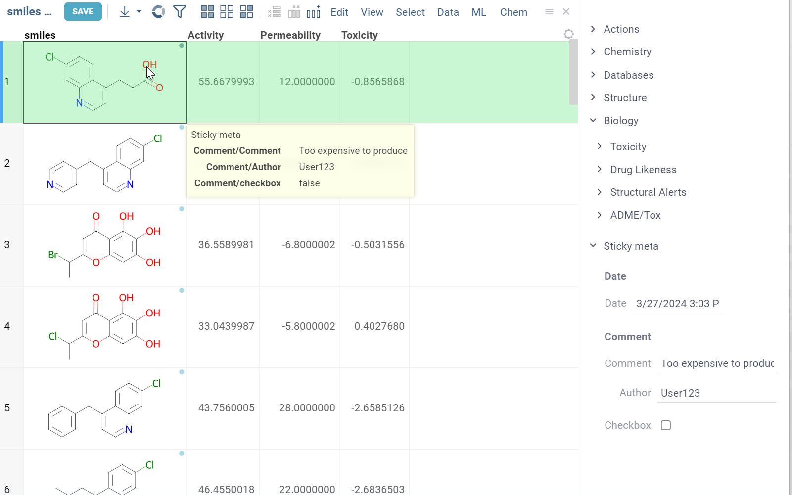  |

### Visualization and analysis

#### Cell renderers

|

|  |
|----------------- | -----------------------------------|
|New cell renderers:  <li>Dropdown</li><li>MultipleChoice</li><li>Tags</li>  <!--[Learn more](../../visualize/viewers/grid.md#cell-renderers)-->|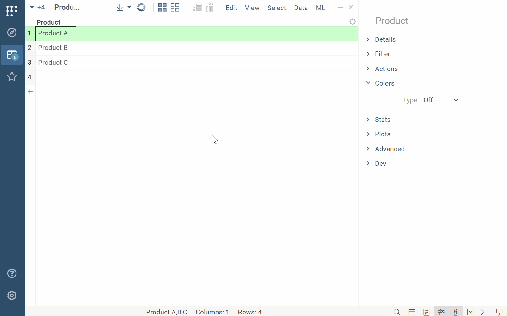  |

#### Trellis plot

|

|  |
|----------------- | -----------------------------------|
|[Trellis plot](../../visualize/viewers/trellis-plot.md) now supports sparklines |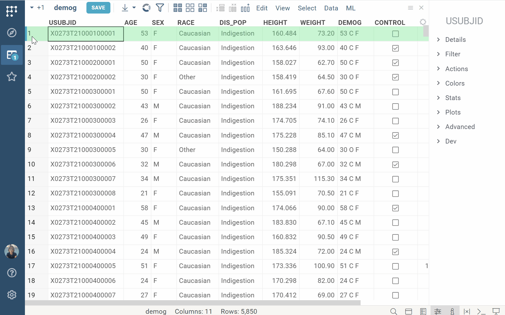 |

<!-- //TODO after patch

### New text filter

### Ability to clone projects

|

|  |
|----------------- | -----------------------------------|
|You can now clone projects:  <li>With data sync</li><li>...</li> |[IMG] |

-->

### Developer updates

* Computation queue
* Harmonized inputs and properties
* Major scripting Platform performance improvements
* CVM: CUDA support
* Push notifications
* Refactor package update mechanism
* JS API for viewer events

## 1.17 || 2023-Oct

### Visualization and analysis

#### Grid: Pinned rows

|

|  |
|----------------- | -----------------------------------|
|Pin rows and save pinned view to the layout or project  [Learn more](../../visualize/viewers/grid.md#pin-rows-and-columns) |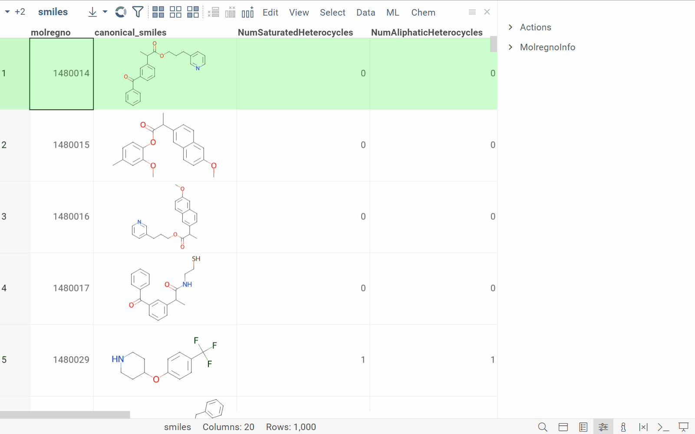  |

<!--
<table>
  <thead>
    <tr>
      <th width="30%"></th>
      <th width="70%"></th>
    </tr>
  </thead>
  <tbody>
    <tr>
      <td>Pin rows and save pinned view to the layout or project. <a href="https://datagrok.ai/help/visualize/viewers/grid#pinned-rows">Learn more</a></td>
      <td><image src="img/pinned-rows.gif" alt="image"></image></td>
    </tr>
  </tbody>
</table>
--->

#### Grid: Column selection

|  |        

     |
|-------------------------|-------------------|
|Hold <kbd>Shift</kbd> and drag the mouse over the column headers|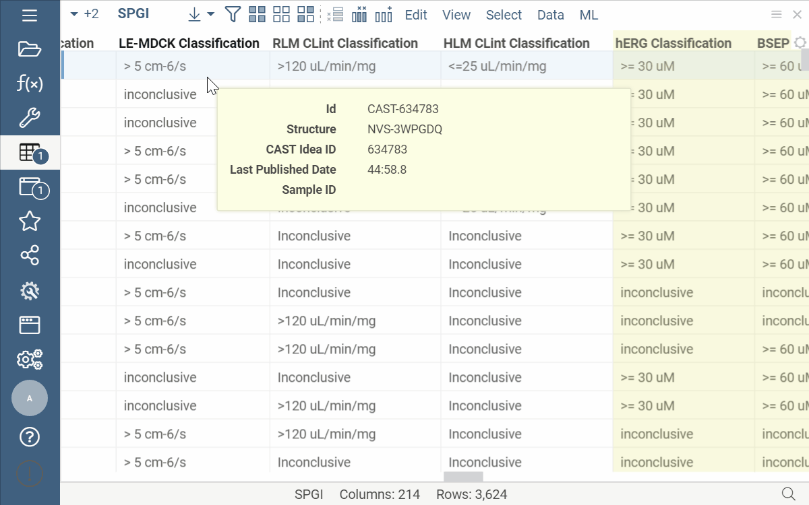|

#### Grid: Column navigation

|                         | 

 |
|-------------------------------------|-------------------|
|In the **Column Manager**: <li>Hover over a column to automatically scroll to it and see its details</li><li>Filter columns based on data or semantic type</li>||

#### Grid: Summary columns

|                         |  

 |
|-------------------------|-------------------|
|<li>[Smart forms](https://community.datagrok.ai/t/powergrid-smartform/774/1) show values from multiple columns in one cell </li><li>Adaptive rendering to fit the cell size</li><li>Values inherit color-coding from source columns</li><li>Cell renderers for different data and semantic types</li> (From [PowerGrid package](https://github.com/datagrok-ai/public/blob/master/packages/PowerGrid/README.md))|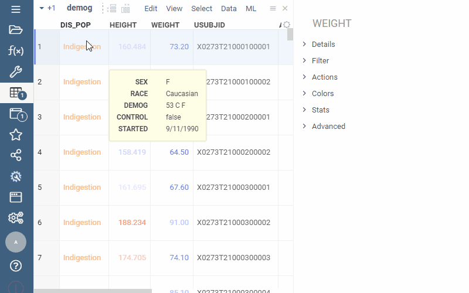|

#### Grid: Linked tables in cells

|                         |

|
|-------------------------|-------------------|
|Link tables and show data from one linked table in another|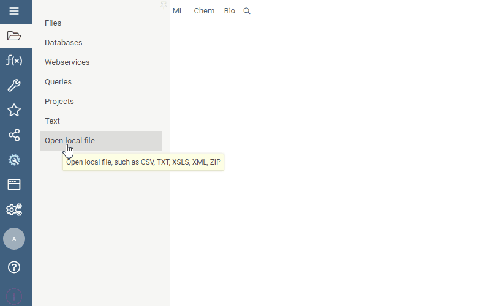 |

<!--
### Visualize data behind grouped rows

|                         |                   |
|-------------------------|-------------------|
|**Viewers**: [Pivot] now supports the visualization of raw data behind grouped rows| |

-->

#### Line chart: Split by category

| 

 |             |
|-------------------------|-------------------|
|Split line charts by multiple categorical columns| 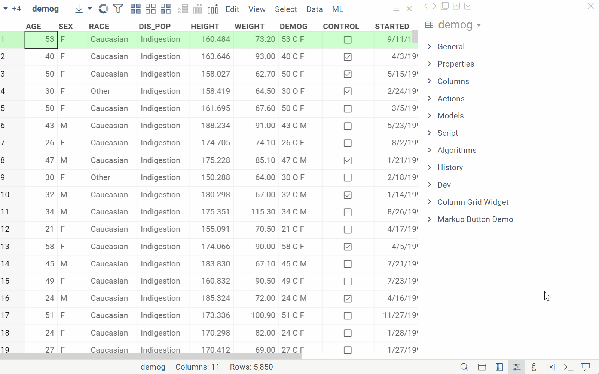|

#### New info plane: Plots

|                         |

|
|-------------------------|-------------------|
|Automatically visualizes selected columns for quick profiling (**Context Panel** > **Plots**)  [Learn more](https://community.datagrok.ai/t/ux-updates/544/5?u=oahadzhanian.datagrok.ai)|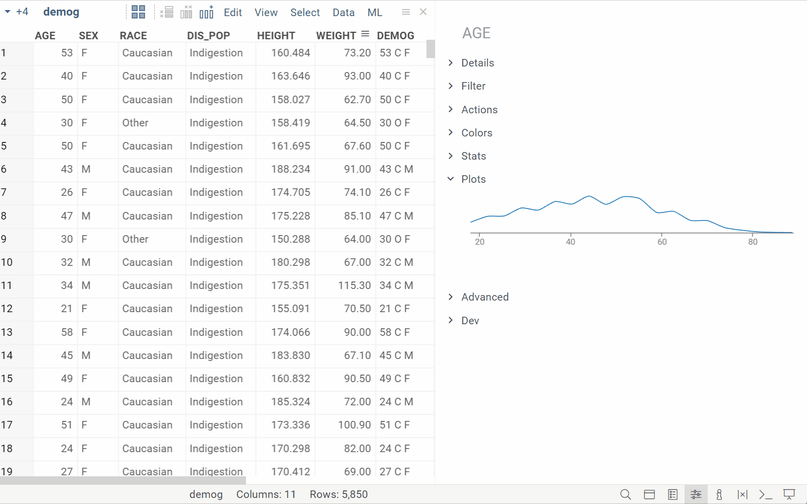|
 
#### New info pane: Content

|                         | 

  |
|-------------------------|-------------------|
|Displays details for the selected rows in a tabular format (**Context Panel** > **Content**)|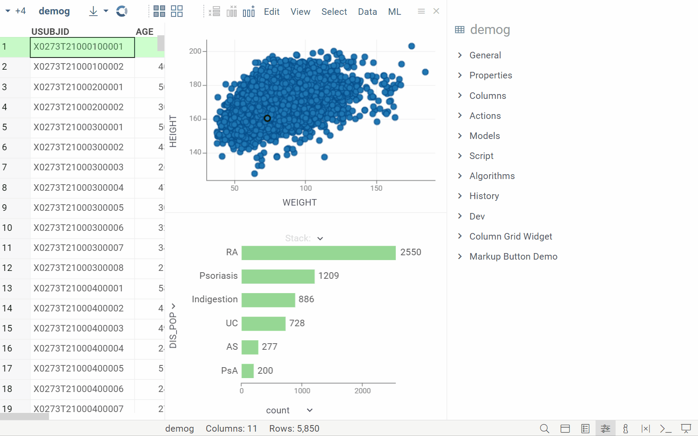|

### Platform performance

We now support client and server-side [caching for function results](../../develop/how-to/function_results_cache.md). This feature is
particularly useful for functions that produce consistent outputs, like queries
and scripts. The client-side cache, limited to 100 MB or 100,000 records, speeds
up data access and improves network efficiency. The unrestricted server-side
cache improves response times and overall server performance. Together, these
caching mechanisms provide a smoother and more responsive platform experience.

### Platform administration

* New installation wizard for platform configuration during deployment
* Authorization with [Okta](https://www.okta.com/)
* Amazon CloudWatch log export improvements

### Developer updates

#### Auto-fill function parameters

|                         | 

  |
|-------------------------|-------------------|
|Auto populate function input parameters based on a chosen key, such as selecting a car model to instantly fill in details like its mileage and engine size  [Learn more](https://datagrok.ai/help/datagrok/concepts/functions/func-params-annotation#lookup-tables)| 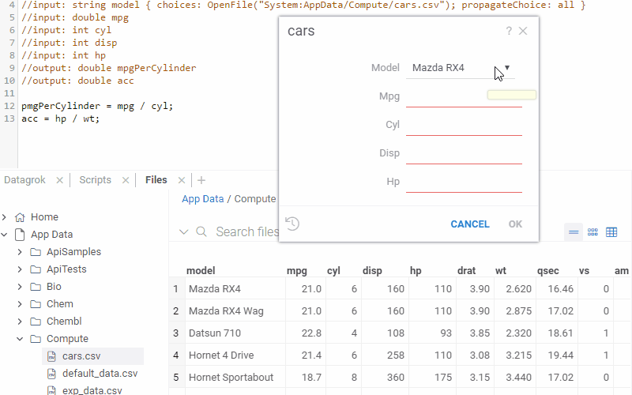|