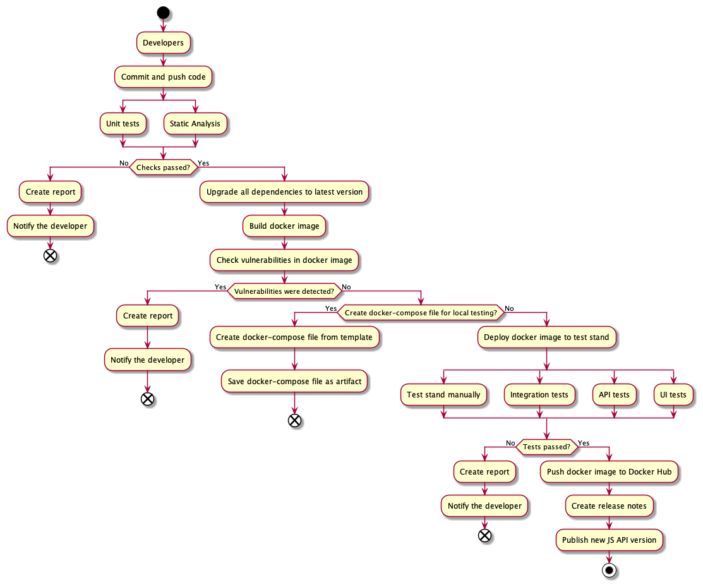
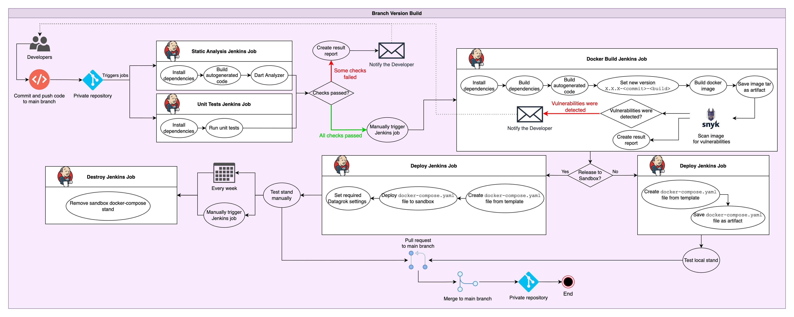
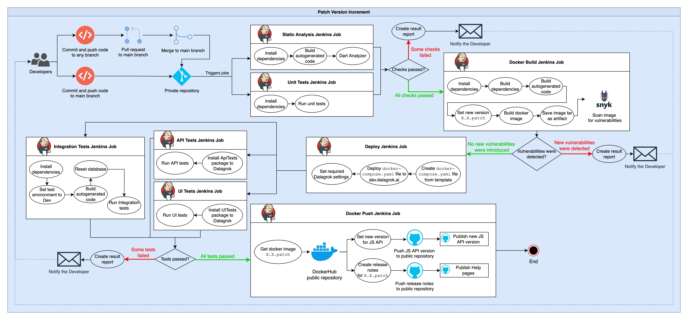
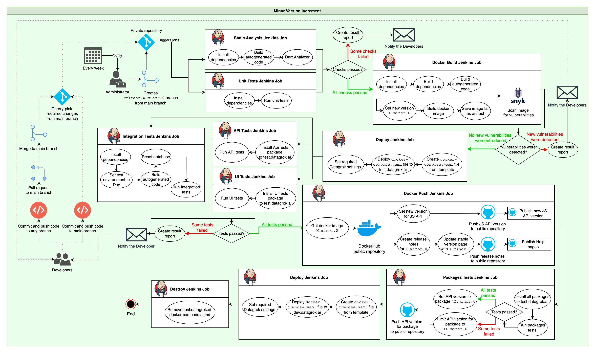
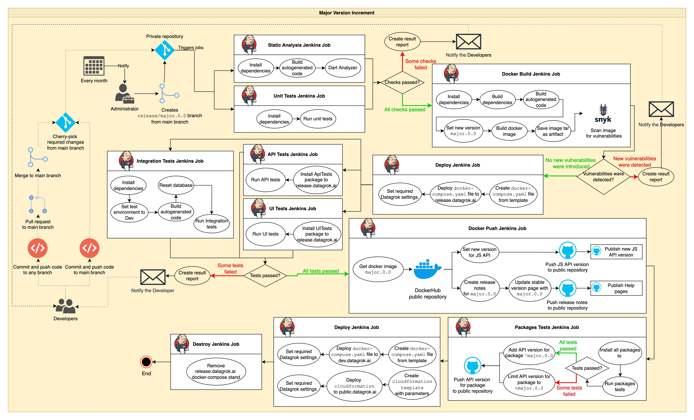

<!-- TITLE: CI/CD Flow -->
<!-- SUBTITLE: -->

# Continuous integration and delivery flow

Datagrok application is an incredibly powerful platform. With great power comes great responsibility. Which is why we
created an automated flow to build, scan, test and publish our application. This way we prevent any vulnerable or broken
code to be published.

The generalized CI/CD scheme consists of 4 steps: analyze, build, test, publish. More information can be found below in
specific topics: [public flow](#public-repository-cicd-flow), [build flow](#build-release)
, [patch flow](#patch-release), [minor flow](#minor-release), [major flow](#major-release).

## Public repository CI/CD flow

## Datagrok Docker images CI/CD flow

### Build release

### Patch release

### Minor release

### Major release

## More information

* [Versioning policy](versioning-policy.md)
